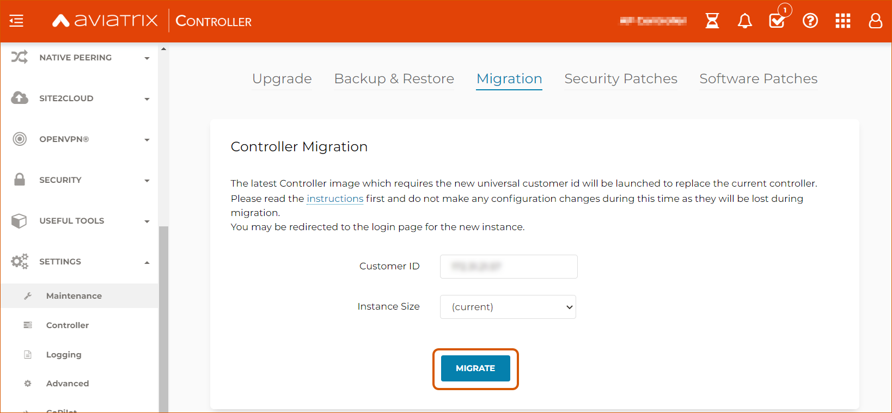
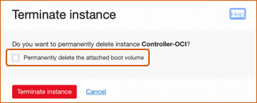

.. meta::
   :description: Migrating Your Aviatrix Controller
   :keywords: Marketplace, migration, licensing, Aviatrix, AWS, Azure, GCP, OCI, S3, object storage, cloud storage, image, AMI, machine image, migrating, update, upgrade

============================================================
Migrating Your Aviatrix Controller
============================================================

Introduction
==============

The Aviatrix multi-cloud networking platform is delivered via two images, a Controller image and a gateway image. Both should be maintained with the latest version for managing security and support for the product. Aviatrix intends to publish 2 new images per year.

You may need to migrate your Aviatrix Controller in the following situations:

  * If your Controller uses an old machine image and you are trying to upgrade to a new software version that requires the latest image. 
  * If you need to transition to a newer machine image for your Controller based on a recommendation from Aviatrix Support.

.. note::

  * If you launched an existing AWS, Azure, or GCP Controller with a BYOL license and have it updated to software version 6.7.1185 or later, you only need to subscribe to the Aviatrix Secure Networking Platform Metered 2208-Universal 24x7 Support through your Controller. Log in as an admin and go to Settings > Controller > License to subscribe. You do not need to follow the migration steps in this document.
  * A machine image is named an "AMI (Amazon Machine Image) in AWS, a "VM image" (Virtual Machine Image) in Azure, a "machine image" in GCP, and a "custom image" in OCI.

This document describes how to migrate from one type of machine image to another for each CSP, including: 

* `Prerequisites <https://docs.aviatrix.com/HowTos/Migration_From_Marketplace.html#prerequisites>`_ for all clouds.
* `Prerequisites <https://read.docs.aviatrix.com/HowTos/Migration_From_Marketplace.html#prerequisites-for-copilot-users>`_ for CoPilot users.
* `Controller Migration in AWS <https://docs.aviatrix.com/HowTos/Migration_From_Marketplace.html#migrating-an-aws-controller>`_.
* `Controller Migration in Azure <https://docs.aviatrix.com/HowTos/Migration_From_Marketplace.html#controller-migration-in-azure>`_.
* `Controller Migration in GCP <https://docs.aviatrix.com/HowTos/Migration_From_Marketplace.html#controller-migration-in-gcp>`_.
* `Controller Migration in OCI <https://docs.aviatrix.com/HowTos/Migration_From_Marketplace.html#controller-migration-in-oci>`_.
* `Setting up <https://docs.aviatrix.com/HowTos/Migration_From_Marketplace.html#post-migration-tasks>`_ your new Controller.
* Controller Migration for all clouds during `Disaster Recovery <https://docs.aviatrix.com/HowTos/Migration_From_Marketplace.html#controller-migration-during-disaster-recovery>`_.

.. tip::

  In a Disaster Recovery (DR) situation in which you cannot access the old Controller, please see the Controller Migration During Disaster Recovery section below.

Prerequisites for all Clouds
====================================

* Make sure you have the relevant CSP storage container (an AWS S3 bucket, Azure Blob Storage, Google Cloud Storage, or OCI Object storage service) linked with your Aviatrix Controller. This storage container enables you to back up your data. As a security best practice, enable versioning on the destination storage container to preserve, retrieve, and restore every version of every object stored.
* (For AWS, Azure, and GCP Controllers) Get your Customer ID either through Controller > Settings > Controller > License or from your Aviatrix Account Manager. If you are migrating a metered image, subscribe to the Aviatrix Secure Networking Platform Metered 2208-Universal 24x7 Support offer to receive your Customer ID by email. To ensure that you receive the license email, please whitelist these email addresses:

  * appalerts@aviatrix.com
  * admin@aviatrix.io

* Run an audit on the Controller’s primary access account and all the remaining secondary accounts to make sure that the IAM roles and policies are set up as suggested. In your Controller, go to Accounts > Access Accounts > select an account > click **Audit**. Repeat these steps for all access accounts for the CSP where your Controller instance is located (AWS, Azure, GCP, or OCI).
* Enable a `Controller backup <https://docs.aviatrix.com/HowTos/controller_backup.html>`_ using the access account for the CSP from which you launched the Controller (Azure, GCP, or OCI). 

.. note::

  In case of a Disaster Recovery (DR) scenario, considering keeping current backups in separate regions of each CSP.

* Back up your existing Controller. In your Controller, go to Settings  >  Maintenance  > Backup & Restore  >  Backup. Click **Backup now**. As a security best practice, when the backup completes, verify that it is the correct size and make a local copy of the backup file (object).
* Schedule the migration during a maintenance window.
* Walk through the `pre-op checklist <https://docs.aviatrix.com/Support/support_center_operations.html#pre-op-procedures>`_.
* Check the current software version of your `gateways <https://docs.aviatrix.com/documentation/latest/platform-administration/gateway-image-migration.html>`_. You cannot upgrade your Controller unless all gateways are on the same version as the Controller.

.. important::

  You cannot upgrade your Controller to software version 6.7.1185 or 6.8.1148 if you have gateway images and/or CloudN based on IKE-type Racoon. Before upgrading your Controller, make sure to `upgrade your gateway images <https://read.docs.aviatrix.com/HowTos/gateway-image-migration.html>`_ to make sure they switch to IKE-type Strongswan.

* `Upgrade <https://docs.aviatrix.com/HowTos/inline_upgrade.html>`_ to the latest build of your current release. Note that Aviatrix software version upgrade is a version-to-version upgrade. Therefore, you may need to perform multiple upgrades until you reach the latest version on your existing Controller. 
* `Disable <https://docs.aviatrix.com/HowTos/controller_ha.html#steps-to-disable-controller-ha>`_ your Controller's HA configuration if HA is set up. You can `reenable <https://docs.aviatrix.com/HowTos/controller_ha.html>`_ HA on the new Controller once migration is complete.

.. warning::

  Deleting your HA configuration is crucial. If you do not delete your HA configuration before migration, the backup configuration may become corrupted, and the migration may fail.

* If you are using SAML login for either the Controller login (Settings/Controller/SAMLLogin) and/or for Openvpn authentication (OpenVPN/Advanced/SAML), please make sure that the endpoints configured on the Controller and the SAML applications in the IdP match exactly.
* Do not add any new configurations to your old Controller before migrating, as those updates may be lost in the migration process.

Prerequisites for CoPilot Users
==================================

.. important::

  **(Aviatrix CoPilot users)** When you migrate your Controller, **your Controller's private IP address will change**. Depending on which version of controller you are migrating from, perform the following tasks before you start the migration. This is to avoid being unable to log in to your CoPilot after the migration:

  If you are migrating a Controller earlier than version 6.8.1088 or earlier than version 6.9.161:

  * In Copilot Home > Settings > Configuration, click **Reset Controller IP**. This will bring you to the CoPilot login page where you will enter your new Controller’s IP address once it’s available after the Controller migration.

  If you are migrating a Controller version 6.8.1088 or later or 6.9.161 or later:

  * In the CSP environment of your CoPilot, confirm that your old controller’s IP address (the controller you are migrating from) is set in your CoPilot’s security group inbound rule for port 443.

Migrating an AWS Controller
^^^^^^^^^^^^^^^^^^^^^^^^^^^^^^^

For Controllers launched from AWS, there are two methods you can use to migrate your Controller AMI (Amazon Machine Image):

1. **Controller-driven method** (simplest method)  - You can easily migrate your AMI directly from the Controller.
2. **Manual method** (longer method which offers more visibility)  - You can migrate your Controller by going through the AWS marketplace and stopping your Controller instance, disassociating your EIP, and so on. This method requires more steps but allows you to see the network and account changes involved in each step. You can also use this method to change licenses if needed.

.. note::
      All Controllers need to migrate to the universal license. To migrate to a universal license, subscribe to the Aviatrix Secure Networking Platform Metered 2208-Universal 24x7 Support offer on the AWS Marketplace.

AWS Method 1: Migrating your Controller AMI and Gateway Image Directly from Your Controller
------------------------------------------------------------------------------------------------------------------------------------------

To migrate to the most current AMI directly from your Controller, use the following steps. Note that this method only applies to AWS Controllers.

.. note::

  Because `HA (High Availability) <https://docs.aviatrix.com/HowTos/controller_ha.html>`_ ensures that your Controller is consistently available through any change or loss of service, HA is not compatible with image migration. If your account uses an HA configuration, `disable HA <https://docs.aviatrix.com/HowTos/controller_ha.html#steps-to-disable-controller-ha>`_ before using the following steps to do an image migration.

1. Go to your Controller > Settings > Maintenance > Software Upgrade. Make sure you are on the right software version for the migration. If not, upgrade your software version.
2. Go to Settings > Maintenance > Backup & Restore. Make sure you have a backup of your current settings.

.. tip::

  In case of a Disaster Recovery (DR) scenario in which an entire AWS region goes down, considering backing up your Controller to at least two separate regions.

.. important::

  Before you perform the migration, you must first reset the IP address of your newly launched Controller in CoPilot > Settings > Configuration > Reset Controller IP button. If you fail to do so, you may be locked out of your CoPilot after the migration.

3. Go to Settings > Maintenance > Migration. 

* Enter your Customer ID in the field provided. 
* If you want to resize your Controller in this migration, click on the **Instance Size** dropdown menu and select a new size. To use the same size, leave this field at the default, "current."
* Click **Migrate** to migrate your Controller to the latest image.

  |controller_migration|

.. note::

  Migrating your Controller does not impact your network data plane. Your existing Gateways should continue operating during migration.  

AWS: Upgrading Your Gateway Image from Your Controller
###########################################################

To implement the **latest Gateway image**: 

1. Go to your Controller > Troubleshoot > Diagnostics > Gateway > Gateway Replace. 
2. Select each Gateway and click **Replace**. (`More info on Gateway Replace operation <https://docs.aviatrix.com/HowTos/Troubleshoot_Diagnostics.html#gateway-replace>`_.)

AWS Method 2: Manually Migrating Your Controller
^^^^^^^^^^^^^^^^^^^^^^^^^^^^^^^^^^^^^^^^^^^^^^^^^^^^^^^^^^^^^^^

The steps below describe how to manually migrate your Controller. The Controller-driven and manual methods for migration are the same, but the manual method allows you to see each step of the process.

.. note::

  In a Disaster Recovery (DR) scenario in which you cannot access the old Controller at all, please see the Controller Migration during Disaster Recovery section below.  

AWS: Stop the Current Aviatrix Controller Instance
-----------------------------------------------------------------------------------------------------------------------------------

.. important::
   If the Controller has `HA enabled <controller_ha.html#enable-controller-ha>`__, you must first `disable the Controller HA <controller_ha.html#disable-controller-ha>`__.

.. note::
   To make best use of time, it is encouraged to launch the new Controller before stopping the old Controller.

In AWS, proceed to **Stop** the existing Aviatrix Controller instance.

AWS: Disassociate EIP
-----------------------------------------------------------------------------------------------------------------------------------

On the AWS console, go to EC2 > Network & Security > Elastic IPs.  Disassociate the EIP from the existing Aviatrix AWS Marketplace Controller instance.

.. note::
   Make sure your browser cache is cleared before the next step to avoid connecting to an old stale session.

AWS: Launch the New Aviatrix Controller
-----------------------------------------------------------------------------------------------------------------------------------
  
 .. attention::

      Make sure you already have subscribed to the **Aviatrix Secure Networking Platform Metered 2208-Universal 24x7 Support** license. Please refer to the `Subscribe to an Aviatrix AMI <https://docs.aviatrix.com/StartUpGuides/aws_getting_started_guide.html#subscribing-to-the-metered-aviatrix-ami-amazon-machine-image>`__  for detailed instructions.

Launch a new Aviatrix Controller.  Please see the `AWS Startup Guide <https://docs.aviatrix.com/StartUpGuides/aws_getting_started_guide.html>`__ for instructions.
  
.. note::

  A best practice is to launch the new Controller before stopping the old Controller.    
   
AWS: Associate EIP
-----------------------------------------------------------------------------------------------------------------------------------

In AWS, go to EC2 > Network & Security > Elastic IPs, and associate the same EIP from the old Controller to the new Aviatrix Controller.

If you have your old `Controller behind an ELB <https://docs.aviatrix.com/HowTos/controller_ssl_using_elb.html>`_, please note that you would have to remove the old Controller instance from the listening group and add the new Controller instance in its place.

AWS: Upgrade Controller
-----------------------------------------------------------------------------------------------------------------------------------

Log in to the new Controller and perform the initialization. Make sure your new Aviatrix Controller is upgraded to same version (latest) by validating it at Settings > Maintenance > Upgrade tab. Please note that Aviatrix only supports Controller backup and restore within the same software version. 

AWS: Check Security Groups
-----------------------------------------------------------------------------------------------------------------------------------

Make sure the Security Groups of the new Controller match those of the previous Controller. Then, back up the configuration again.

.. note::

  If you used an ELB (Elastic Load Balancer) for your old Controller, remove the old Controller instance from the ELB's target group. Then, register the new Controller instance to the target group.

See the Post-Migration Tasks section below to finish the migration steps from within your new Controller.

Controller Migration in Azure
^^^^^^^^^^^^^^^^^^^^^^^^^^^^^^^^^^^^^^^^^^^^^^^^^^^^^^^^

Before migrating your Azure Controller, note the following details so that you can replicate them in your new Controller:

* The instance's location, Subscription ID, Size, Public IP address, Virtual network (VNet)/subnet, and Private IP address. In your Azure account, go to Virtual machines > select the Controller instance.

|azure_account_details_1|

* The instance's Display name, Application (client) ID, and Directory (tenant) ID.

|azure_account_details_2|

* The instance's `secret value <https://docs.aviatrix.com/HowTos/Aviatrix_Account_Azure.html#creating-a-secret-identifier>`_, which could only be accessed directly after the instance is created.

2. Locate your `Customer ID <https://docs.aviatrix.com/HowTos/onboarding_faq.html?highlight=customer%20id#what-is-an-aviatrix-customer-id>`_.

3. Make a Controller backup in a storage container and make a note of Subscription ID, Directory ID, Application Client ID, Application Client Secret, Storage Name, Container Name, File Name.

4. Launch the new Controller Instance. Please refer to the `Azure Startup Guide <https://docs.aviatrix.com/StartUpGuides/azure-aviatrix-cloud-controller-startup-guide.html>`_. Make sure to subscribe to the Aviatrix Secure Networking Platform Metered 2208-Universal 24x7 Support offer on the Azure Marketplace, and then activate that subscription using the Aviatrix Secure Networking Platform BYOL offer.

.. note::

  Launching a new Controller, or migrating Controller images, requires two offers from the Azure Marketplace: 
 
  1) Aviatrix Secure Networking Platform Metered 2208-Universal 24x7 Support
  2) Aviatrix Secure Network Platform BYOL (Bring Your Own License)
 
  Both offers are required. Subscribe to the metered offer to receive your Customer ID, and then subscribe to the BYOL offer to deploy your Controller using that Customer ID. You will only be billed for the metered offer.

5. Shut down the old Controller instance. Go to your Azure account > Virtual machines and select the old Controller instance. Click **Stop**.

|azure_stop_old_controller|

6. Dissociate the Public IP address from the old Controller. In your Azure account, go to Network interfaces > select the Network Interface > Select the public IP > click **Dissociate**.

|azure_click_dissociate|

Click **Yes** to confirm the dissociation.

7. Associate this Public IP address to the new Controller instance. On the Public IP address page, click **Associate**.

|azure_click_associate|

* Under Resource type, select **Network interface**. 
* Under Network interface, select your new Controller instance. 

|azure_IP_details|

8. Set up your `Aviatrix Customer ID <https://docs.aviatrix.com/HowTos/onboarding_faq.html?highlight=%22customer%20id%22#what-is-an-aviatrix-customer-id>`_. Open your new Aviatrix Controller and go to Onboarding > Azure > enter your Aviatrix Customer ID.

Controller Migration in GCP
^^^^^^^^^^^^^^^^^^^^^^^^^^^^^^^^^^^^^^^^^^^^^^^^^^^^^^^^^^^^^^^^^

1. In your GCP account, make a list of the old Controller’s region, availability zone, instance size, and any specific subnets so that you can use the same parameters to launch the new Controller. To find this information, log into your GCP account > click on the menu in the top left and scroll down to Compute Engine > hover over Compute Engine and select VM instances. On the VM Instances page, find your Controller instance, click on the three dots on the right side of its row in the table, and select **View network details**.

(Optional) Find and save your old Controller's Customer ID. In your Aviatrix Controller, go to Settings > Controller > License > Setup Aviatrix Customer ID.

2. If you do not have a bucket for data storage, create a new one. In your GCP account, go to Cloud Storage > Browser.

|gcp_cloud_storage_browser|

3. Click **Create Bucket**. Add the necessary information and click **Create**.
4. If you have not reserved a static IP for the old Controller and want to do so, go to your GCP account > VPC Network > IP Addresses. Select **Reserve External Static Address**. 

|gcp_reserve_external_static_address|

5. Enter the details of the IP address and click **Reserve**.
6. Before stopping this old instance, disassociate the reserved IP address. Click **Change**. Then, click on the Attach to dropdown menu and select **None**.

|gcp_attach_to_none|

7. Shut down the old Controller instance. 

|gcp_stop_instance|

8. Launch a new Controller instance in the same region and VPC, of the same size as your old Controller. Review the details you saved from your old Controller to ensure they match. To launch the new instance, go to your GCP account > Marketplace > search for "Aviatrix" > choose your required Aviatrix platform > click **Launch**. Make sure to replicate the same region, subnet (if required), and size of the old Controller. See the `Google Startup Guide <https://docs.aviatrix.com/StartUpGuides/google-aviatrix-cloud-controller-startup-guide.html>`_ for thorough instructions.
9. Once the new Controller launches, associate the reserved static IP address to this new instance. In your GCP account, go to VPC Network > IP Addresses > select the IP address > change > select the newly launched Controller.

Controller Migration in OCI
^^^^^^^^^^^^^^^^^^^^^^^^^^^^^^^^^^^^^^^^^^^^^^^^^^^^^^^^^^^^^^^

.. note::

  The Aviatrix Secure Networking Platform Metered 2208-Universal 24x7 Support offer is not yet available for OCI Controllers. For more information about OCI Controller migration, please contact Aviatrix Support.

1. Before terminating the old Controller instance, document the following information from your OCI account:

* The instance's region, availability domain, and fault domain
* The instance's display name
* Assigned VCN details
* All private IP addresses, names, subnets, and private DNS name (if any)
* Any public IP addresses assigned from a reserved public pool
* Any tags on the instance or attached resources

|oci_account_details|

.. important::

  Make sure that the **Permanently delete the attached boot volume** checkbox is *unmarked* while terminating. This step saves the old Controller image to use for the new Controller.

  |oci_permanently_delete_unchecked|

2. Terminate the old Controller instance. In your OCI account, go to  Compute > Instances > Controller Instance > More actions > Terminate. Click **Terminate instance**.

|oci_terminate|

3. Create a new Controller instance. Go to OCI Console > Menu > Compute > Instances > click **Create instance**. Refer to `these instructions <https://docs.aviatrix.com/StartUpGuides/google-aviatrix-cloud-controller-startup-guide.html>`_.
4. The Launching instance page opens. Enter the details of the Controller as per the old Controller instance.
5. Add the appropriate ssh public key file and click **Create** to launch the instance.
6. Move the Controller's public IP address. Follow the steps below.

Move your OCI Controller's Public IP Address
-------------------------------------------------------------------------------

1. Assign the IP from reserved pool to the new Controller instance. Go to your OCI account > Compute > Instance > Controller Instance > Resources > Attached VNICs. Select **Primary VNIC**.

|oci_select_primary_vnic|

2. Under VNIC details > Resources > IPV4 Addresses > select the three dots icon > click **Edit**.

|oci_click_edit|

3. Go to Public IP type > Select reserved IP address > Select the **Reserved public IP** radio button. Under Reserved IP Address in *Compartment_Name*, click on the dropdown menu and select the Public IP address reserved for your Controller. Then, click **Update**.

|oci_click_update|

Post Migration Tasks
================================

.. important::

  Before deleting your old Controller, first reset the IP address of your newly launched controller in CoPilot > Settings > Configuration > Reset Controller IP button. If you fail to do so, you may be locked out of your CoPilot after the migration.

After testing to ensure that the Controller migration is complete and successful, you can delete the old Controller. It can be left in "Stopped" status for a while, but it should never be started. If it is started, this old Controller will reach out to the gateways and the network could have issues with two Controllers trying to monitor/modify the gateways. 

Setting up Your New Controller
^^^^^^^^^^^^^^^^^^^^^^^^^^^^^^^^^^^^^^^^^^^^^^^^^^^^^

1. Log into the newly launched Controller instance. 

* Username  - admin
* Password  - the private IP of the newly launched instance

2. Set a new password and upgrade this Controller to the same version as your old Controller instance. This might take up to 5 minutes.
3. Log into the new Controller and onboard your primary access account (the CSP account). Make sure to have your CSP credentials available, as you will need them to onboard your CSP account. In your Controller, go to Accounts > Access Accounts > *CSP* (AWS, Azure, GCP, or OCI).
4. Onboard your Aviatrix Customer ID.
5. Once everything is set up and ready, restore the backup from your storage container. In your Controller, go to > Settings > Maintenance > Backup & Restore > Restore > fill in the appropriate details > click **Restore**.

.. important::

  If you encounter an issue when you try to restore the backup, **do not attempt a rollback**. Instead, open a ticket with Aviatrix Support.  

It will take a few minutes for the backup to be restored. You can verify the dashboard to see if all the configuration from the old Controller has been restored. 

.. tip::
   Optional: After confirming everything is running correctly, delete the previous Controller instance from the CSP marketplace.

Migrating the Controller IP Address
^^^^^^^^^^^^^^^^^^^^^^^^^^^^^^^^^^^^^^^^^^^^^^^^^^^^^

After migrating to a new Controller, make sure you have migrated your public IP address as well. 

1. In AWS, Azure, GCP, or OCI, disassociate the Static Public IP or Elastic IP address from your old Controller and associate it with your new Controller.
2. In your new Controller, in the left sidebar, go to Troubleshoot > Diagnostics > scroll down to the Controller IP Address Migration section. If two IPs display under Controller Public IP, click **Migrate**.

Before Controller IP migration :

|gcp_before_migrating_ip|

After Controller IP migration :

|gcp_after_migrating_ip|

Controller Migration During Disaster Recovery
================================================

In a Disaster Recovery (DR) situation in which an entire CSP region is unavailable, you may not be able to access your old Controller to follow the steps above. In this situation, use the steps below to migrate your Controller.

1. Deploy a new Controller in a **different** region from the old Controller.
2. `Upgrade <https://docs.aviatrix.com/HowTos/selective_upgrade.html>`_ this new Controller to the current production version.
3. If possible, `restore your backup <https://docs.aviatrix.com/HowTos/controller_backup.html#how-to-restore-configuration>`_. A best practice is to keep a current backup in a separate region from the region in which you deployed the Controller. 

.. important::

  If you encounter an issue when you try to restore the backup, **do not attempt a rollback**. Instead, open a ticket with Aviatrix Support.  

4. In your new Controller, go to Settings > Maintenance > Migration and click **Migrate**. This migration changes all security group gateways to use the new Controller's EIP (Elastic IP address).
5.  Run a connectivity and performance test to ensure everything is working correctly.
6. `Deploy <https://docs.aviatrix.com/HowTos/copilot_getting_started.html#copilot-instance-launch-using-controller-ui-aws-only>`_ CoPilot from the new Controller.
7. When your old Controller becomes available again, do not restart that instance until you can ensure that all operations are working with the new Controller. Then, you can delete that instance.

.. |controller_versions| image:: Migration_From_Marketplace_media/controller_versions.png
   :scale: 60%

.. |enable_backup| image:: Migration_From_Marketplace_media/enable_backup.png
   :scale: 60%

.. |customer_id| image::Migration_From_Marketplace_media/customer_id.png
   :scale: 60%

.. |restore| image:: Migration_From_Marketplace_media/restore.png
   :scale: 60%

.. |azure_account_details_1| image:: Migration_From_Marketplace_media/azure_account_details_1.png
   :scale: 60%

.. |azure_stop_old_controller| image:: Migration_From_Marketplace_media/azure_stop_old_controller.png
   :scale: 50%

.. |azure_IP_details| image:: Migration_From_Marketplace_media/azure_IP_details.png
   :scale: 30%

.. |gcp_attach_to_none| image:: Migration_From_Marketplace_media/gcp_attach_to_none.png
   :scale: 80%

.. |gcp_stop_instance| image:: Migration_From_Marketplace_media/gcp_stop_instance.png
   :scale: 60%

.. |gcp_before_migrating_ip| image:: Migration_From_Marketplace_media/gcp_before_migrating_ip.png
   :scale: 60%

.. |gcp_after_migrating_ip| image:: Migration_From_Marketplace_media/gcp_after_migrating_ip.png
   :scale: 60%

.. |oci_terminate| image:: Migration_From_Marketplace_media/oci_terminate.png
   :scale: 80%

.. |oci_select_primary_vnic| image:: Migration_From_Marketplace_media/oci_select_primary_vnic.png
   :scale: 80%

.. |oci_click_edit| image:: Migration_From_Marketplace_media/oci_click_edit.png
   :scale: 40%

.. |oci_click_update| image:: Migration_From_Marketplace_media/oci_click_update.png
   :scale: 60%

.. disqus::
