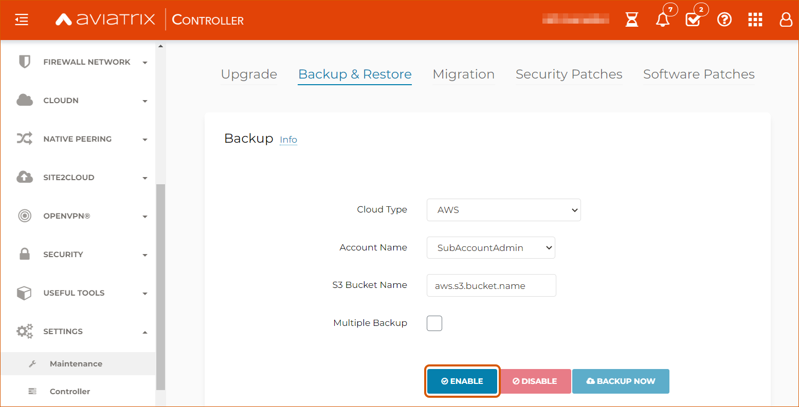

Migration Guide Update:

.. meta::
   :description: Migration from AWS Marketplace Licensing Model to BYOL Licensing Model
   :keywords: Marketplace, migration, licensing, Aviatrix, AWS

============================================================
Migrating Your Aviatrix Controller AMI (AWS)
============================================================

Introduction
==============

The Aviatrix multi-cloud networking platform is delivered via two images, a Controller image and a gateway image. Both should be maintained with the latest version for managing security and support for the product. Aviatrix intends to publish 2 new images per year.

For customers who launched a Controller through AWS, this document outlines the steps to migrate from one type of Aviatrix Controller Amazon Machine Image (AMI) to another.

.. note::
      To migrate to a BYOL license model, please contact your Aviatrix Sales Account Manager or email sales@aviatrix.com to acquire the appropriate BYOL license. Make sure you already have subscribed to the BYOL AMI. 

There are two methods you can use to migrate your Controller AMI:

1. **Controller-driven method** (simplest method)  - You can easily migrate your AMI directly from the Controller. Note that you can only migrate between AMIs with the same license (BYOL, Metered, or another license) using this method.
2. **Manual method** (longer method which offers more visibility)  - You can migrate your Controller by going through the AWS marketplace and stopping your Controller instance, disassociating your EIP, and so on. This method requires more steps but allows you to see the network and account changes involved in each step. You can also use this method to change licenses if needed.

.. note::
      The Controller-driven method can only migrate between AMIs using the same license. To change your license, use the manual method.

Prerequisites
=============

* Existing Aviatrix Controller instance deployed
* Aviatrix Controller running latest version of software

  #. Log in to your existing Aviatrix Controller.
  #. If you are using a BYOL image, please get your CustomerID either through Controller > Settings > Controller > License or from your Aviatrix Account Manager.
  #. Navigate to Settings > Maintenance > Upgrade tab.
  #. Make sure you are running the **latest** version. If it is not the latest version, please `upgrade <https://docs.aviatrix.com/HowTos/selective_upgrade.html>`__ before proceeding. Note that Aviatrix software version upgrade is a version-to-version upgrade. Therefore, you may need to perform multiple upgrades until you reach the latest version on your existing Controller. 

     |controller_versions|

* An `S3 bucket <https://docs.aws.amazon.com/AmazonS3/latest/userguide/creating-bucket.html>`_ in the AWS account linked to your Aviatrix Controller (will be used for backups).
* Your IAM policy must be updated in all your AWS accounts. Please refer the instructions `here <https://docs.aviatrix.com/HowTos/iam_policies.html#updating-iam-policies>`__ to update your IAM policies.
* Make sure you **delete the Controller HA cloud formation stack**. 

.. warning::

  Deleting your HA configuration is crucial. If you do not delete your HA configuration before migration, the backup configuration may become corrupted, and the migration may fail.

Method 1: Migrating your Controller AMI and Gateway Image Directly from Your Controller
==========================================================================

To migrate to the most current AMI directly from your Controller, use the following steps. 

.. note::

  Because `HA (High Availability) <https://docs.aviatrix.com/HowTos/controller_ha.html>`_ ensures that your Controller is consistently available through any change or loss of service, HA is not compatible with image migration. If your account uses an HA configuration, `disable HA <https://docs.aviatrix.com/HowTos/controller_ha.html#steps-to-disable-controller-ha>`_ before using the following steps to do an image migration.

1. Go to your Controller > Settings > Maintenance > Software Upgrade. Make sure you are on the right software version for the migration. If not, upgrade your software version.
2. Go to Settings > Maintenance > Backup & Restore. Make sure you have a backup of your current settings.
3. Go to Settings > Maintenance > Migration. Click **Migrate** to migrate your Controller to the latest image.

  |controller_migration|

.. note::

  Migrating your Controller does not impact your network data plane. Your existing Gateways should continue operating during migration.  

Upgrading Your Gateway Image from Your Controller
^^^^^^^^^^^^^^^^^^^^^^^^^^^^^^^^^^^^^^^^^^^^^^^^

To implement the **latest Gateway image**: 

1. Go to your Controller > Troubleshoot > Diagnostics > Gateway > Gateway Replace. 
2. Select each Gateway and click **Replace**. (`More info on Gateway Replace operation <https://docs.aviatrix.com/HowTos/Troubleshoot_Diagnostics.html#gateway-replace>`_.)

Method 2: Manually Migrating Your Controller
============================================

The steps below describe how to manually migrate your Controller. The Controller-driven and manual methods for migration are the same, but the manual method allows you to see each step of the process.

Enable Backup
^^^^^^^^^^^^^^^^^^^^^^^

.. tip::
   If you already have backup enabled, click **Backup Now** to make sure you have the latest backup.
   Once complete, confirm in your S3 bucket that the backup file has been updated with the latest timestamp.

1. Log in to your existing Aviatrix Controller.
2. Navigate to Settings > Maintenance > Backup & Restore tab. Enter the name of your S3 bucket in the S3 Bucket Name field. This name must be:

* Between 3-63 characters long.
* A series of labels separated by a single period (.)
* Start and end with a lowercase letter or number.
* Must **not** be formatted as an IP address (such as 92.168.5.4).

3. Click **Enable**.

|enable_backup|

Stop the Current Aviatrix Controller Instance
^^^^^^^^^^^^^^^^^^^^^^^^^^^^^^^^^^^^^^^^^^^^^^

.. important::
   If the Controller has `HA enabled <controller_ha.html#enable-controller-ha>`__, you must first `disable the Controller HA <controller_ha.html#disable-controller-ha>`__.

.. note::
   To make best use of time, it is encouraged to launch the new Controller before stopping the old Controller.

In AWS, proceed to **Stop** the existing Aviatrix Controller instance.

Disassociate EIP
^^^^^^^^^^^^^^^^^^^^^^^

On the AWS console, go to EC2 > Network & Security > Elastic IPs.  Disassociate the EIP from the existing Aviatrix AWS Marketplace Controller instance.

.. note::
   Make sure your browser cache is cleared before the next step to avoid connecting to an old stale session.

Launch the New Aviatrix Controller
^^^^^^^^^^^^^^^^^^^^^^^^^^^^^^^^^^^^^^^^^^^^^^
  
 .. attention::
      Make sure you already have subscribed to the AMI that you want to migrate to. Please refer to the `Subscribe to an Aviatrix AMI </StartUpGuides/aviatrix-cloud-controller-startup-guide.html#step-1-subscribe-to-an-aviatrix-ami>`__  for details.

Launch a new Aviatrix Controller.  Please see the `AWS Startup Guide </StartUpGuides/aviatrix-cloud-controller-startup-guide.html#step-1-subscribe-to-an-aviatrix-ami>`__ for instructions.
  
.. note::

  To make best use of time, it is encouraged to launch the new Controller before stopping the old Controller.    
      
Associate EIP
^^^^^^^^^^^^^^^^^^^^^^^

In AWS, go to **EC2** > **Network & Security** > **Elastic IPs**, and associate the same EIP from step 3 to the new Aviatrix Controller.

If you have your old `Controller behind an ELB <https://docs.aviatrix.com/HowTos/controller_ssl_using_elb.html>`_, please note that you would have to remove the old Controller instance from the listening group and add the new Controller instance in its place.

Upgrade Controller
^^^^^^^^^^^^^^^^^^^^^^^

Log in to the new Controller and perform the initialization. Make sure your new Aviatrix Controller is upgraded to same version (latest) by validating it at Settings > Maintenance > Upgrade tab. Please note that Aviatrix only supports Controller backup and restore within the same software version. 

Set up Aviatrix Customer ID (Not required if you are migrating to a Metered AMI Controller)
^^^^^^^^^^^^^^^^^^^^^^^^^^^^^^^^^^^^^^^^^^^^^^^^^^^^^^^^^^^^^^^^^^^^^^^^^^^^^^^^^^^^^^^^^^^^

On the new Aviatrix Controller, go to Settings > Controller and select the **License**.
Enter your Aviatrix License ID into the Customer ID field in Set up Aviatrix Customer ID.

|customer_id|

Restore
^^^^^^^^^^^^^^^^^^^^^^^

On the new Aviatrix Controller, go to Settings > Maintenance and select the Backup & Restore tab.
Insert the details about your S3 bucket name and execute a restore.

|restore|

Set up Aviatrix Customer ID (Again) and AWS Account Number
^^^^^^^^^^^^^^^^^^^^^^^^^^^^^^^^^^^^^^^^^^^^^^^^^^^^^^^^^^^^^^^^^^^^^^^^^^^^^^^^^^^^^^^^^^^^^^^^^^^^^^^^^^^^^^^^^^^

.. note::
      You do not need to set up the Aviatrix Customer ID again if you are migrating to a Metered AMI Controller.

1. On the new Aviatrix Controller, go to Settings > Controller and select the **License**.
2. Enter your Aviatrix License ID into the Customer ID field in Set up Aviatrix Customer ID.

Check Security Groups
^^^^^^^^^^^^^^^^^^^^^^^^^^^^^^^^^^^^^^^^^^^^^^^^^^^^^^^^^^^^^^^^^^^^^^^^^^^^^^^^^^^^^^^^^^^^^^^^^^^^^^^^^^^^^^^^^^^

Make sure the Security Groups of the new Controller match those of the previous Controller. Then, back up the configuration again.

.. note::

If you used an ELB (Elastic Load Balancer) for your old Controller, remove the old Controller instance from the ELB's target group. Then, register the new Controller instance to the target group.

.. tip::
   Optional: After confirming everything is running correctly, delete the previous Aviatrix AWS Marketplace Controller instance.

.. |controller_migration| image:: Migration_From_Marketplace_media/controller_migration.png
   :scale: 60%

.. disqus::
