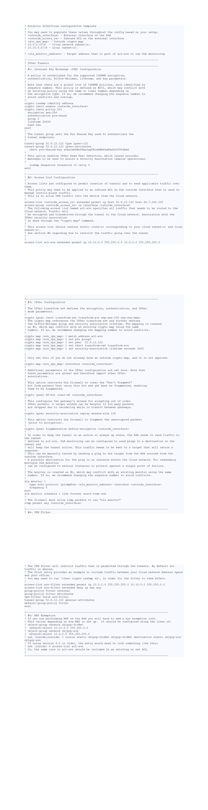

.. meta::
   :description: Site2Cloud connection between Aviatrix Gateway and Cisco ASA
   :keywords: Site2cloud, site to cloud, aviatrix, ipsec vpn, tunnel, Cisco ASA

============================================
Aviatrix Gateway to Cisco ASA
============================================

This document describes how to build an IPsec tunnel based Site2Cloud connection between an Aviatrix Gateway and Cisco ASA Firewall.

The network setup is as follows:

**VPC/VNet-AVX (with Aviatrix Gateway)**

    *VPC/VNet CIDR: 10.0.0.0/16*
    
    *VPC/VNet Public Subnet CIDR: 10.0.1.0/24*
    
    *VPC/VNet Private Subnet CIDR: 10.0.2.0/24*

**On-Prem (with Cisco ASA Firewall)**

    *On-Prem Network CIDR: 10.10.0.0/16*
    
Creating a Site2Cloud Connection at the Aviatrix Controller
======================================================

 1. Go to Gateway > New Gateway to launch an Aviatrix Gateway at the subnet (public subnet for AWS, GCP, or OCI) of VPC/VNet-AVX. Collect Gateway's public IP addresses (52.8.12.122 in this example).
 2. Go to the **Site2Cloud** page and click **Add New** to create a Site2Cloud connection.

===============================     =================================================================
  **Field**                         **Value**
===============================     =================================================================
  VPC ID/VNet Name                  Choose VPC/VNet ID of VPC-AVX
  Connection Type                   Unmapped
  Connection Name                   Arbitrary (e.g. avx-asa-s2c)
  Remote Gateway Type               Generic
  Tunnel Type                       UDP
  Algorithms                        Uncheck this box
  Encryption over Direct Connect    Uncheck this box
  Enable HA                         Uncheck this box
  Primary Cloud Gateway             Select Aviatrix Gateway created above
  Remote Gateway IP Address         Public IP of ASA WAN port (66.7.242.225 in this example)
  Pre-shared Key                    Optional (auto-generated if not entered)
  Remote Subnet                     10.10.0.0/16 (On-Prem Network CIDR)
  Local Subnet                      10.0.2.0/24 (VPC-AVX private subnet)
===============================     =================================================================
 
3. Go to the **Site2Cloud** page. From Site2Cloud connection table, select the connection created above (e.g. avx-asa-s2c). 
     - Select **Cisco** from the **Vendor** dropdown menu.
     - Select **ASA 5500 Series** from the **Platform** dropdown menu.
     - Select the proper ASA Software versin from **Software** drop down list depending on your ASA running OS.
     - Click **Download Configuration** button to download the ASA site2cloud configuration.
     - Save the configuration file as a reference for configuring your ASA.
     
     The following is an ASA sample configuration based on the Site2Cloud configuration above.

     |image0|

Configuring Cisco ASA
=======================

1. Either SSH into the ASA or connect to it directly through its console port.

2. Issue the **configure terminal** command in privileged **EXEC** mode to start global configuration mode. The prompt changes to the following :

    hostname(config)#

3. Enter the CLIs in ASA site2cloud configuration guide downloaded before. Note that you may need to modify these CLIs to fit your ASA configuration.

Troubleshooting and Verifying at Aviatrix Controller
========================================================

1. At the Aviatrix Controller, go to the Site2Cloud page. Verify that the status of the Site2Cloud connection is up.
2. At the Site2Cloud - Diagnostics page, run various diagnostics commands.

===============================     =================================================================
  **Field**                         **Value**
===============================     =================================================================
  VPC ID/VNet Name                  VPC/VNet-AVX (Aviatrix Gateway VPC/VNet) ID
  Connection                        Name of Site2Cloud connection created at Step 2
  Gateway                           Name of Aviatrix Gateway
  Action                            One of the supported diagnostics commands
===============================     =================================================================

For support, please open a support ticket at `Aviatrix Support Portal <https://support.aviatrix.com>`_

.. disqus::
