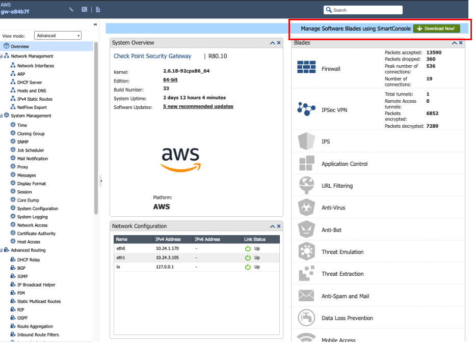

.. meta::
   :description: Site2Cloud connection between Aviatrix Gateway and Check Point
   :keywords: Site2cloud, site to cloud, aviatrix, ipsec vpn, tunnel, Check Point

============================================
Aviatrix Gateway to Check Point(R80.10)
============================================

This document describes how to build an IPSec tunnel based site2cloud connection between Aviatrix Gateway and Check Point Firewall. To simulate an on-prem Check Point Firewall, we use a Check Point CloudGuard IaaS firewall VM at AWS VPC.

Network setup is as following:

**VPC1 (with Aviatrix Gateway)**

    *VPC1 CIDR: 10.12.0.0/16*

    *VPC1 Public Subnet CIDR: 10.12.0.0/23*

    *VPC1 Private Subnet CIDR: 10.12.2.0/23*

**VPC2 (with Check Point Security Gateway)**

    *VPC2 CIDR: 10.24.0.0/16*

    *VPC2 Public Subnet CIDR: 10.24.0.0/23*

    *VPC2 Private Subnet CIDR: 10.24.2.0/23*

1. Launch Check Point Security Gateway VM
=========================================

launch a  CheckPoint VM with at least two network interfaces. One interface serves as a WAN port and is in VPC2's public subnet. The other interface serves as a LAN port and is in VPC2's private subnet. Collect the public IP address of the WAN port.

2. Create Site2Cloud Connection at Aviatrix Controller
======================================================

 2.1 Go to **Gateway->New Gateway** to launch an Aviatrix Gateway at VPC1's public subnet. Collect both public and private IP addresses of the Gateway.

 2.2 Go to **site2cloud** and click **Add New** to create a site2cloud connection:

===============================     =================================================================
  **Field**                         **Value**
===============================     =================================================================
  VPC ID/VNet Name                  Choose VPC ID of VPC1
  Connection Type                   Unmapped
  Connection Name                   Arbitrary (e.g. avx-cp-s2c)
  Remote Gateway Type               Generic
  Tunnel Type                       UDP
  Algorithms                        Uncheck this box
  Encryption over DirectConnect     Uncheck this box
  Enable HA                         Uncheck this box
  Primary Cloud Gateway             Select Aviatrix Gateway created above
  Remote Gateway IP Address         Public IP of CheckPoint-VM WAN port
  Pre-shared Key                    Optional (auto-generated if not entered)
  Remote Subnet                     10.24.2.0/23 (VPC2 private subnet)
  Local Subnet                      10.12.2.0/23 (VPC1 private subnet)
===============================     =================================================================

 2.3 Go to the **site2cloud** page. From the site2cloud connection table, select the connection created above (e.g. avx-cp-s2c). Select **Generic** from **Vendor** drop down list and click the **Download Configuration** button to download the site2cloud configuration. Save the configuration file for configuring CheckPoint-VM.

3. Download and Install SmartConsole
====================================

 3.1 Using a browser, connect to the Gaia Portal of the CheckPoint-VM at https://CheckPoint-VM_Public-IP:
 3.2 click **Download Now!** as shown below to download SmartConsole.

|image1|

 3.3 Install SmartConsole at your local machine and launch SmartDashboard.

4. Create Network Objects at SmartConsole
=========================================
 4.1. At Check Point SmartDashboard window, go to new -> network -> and create two objects.

|image2|

 4.2 Create one network for private subnet of VPC2 (Check Point VPC)

|image3|

===============================     =================================================================
  **Field**                         **Value**
===============================     =================================================================
  Name                              Arbitrary (e.g. CP-Private-Subnet)
  IPv4 Network Address              VPC2 private subnet CIDR
  IPv4 Net mask                     VPC2 private subnet mask
===============================     =================================================================

 4.3 Create one network for private subnet of VPC1 (Aviatrix Gateway VPC)

|image4|

===============================     =================================================================
  **Field**                         **Value**
===============================     =================================================================
  Name                              Arbitrary (e.g. AVX-Private-Subnet)
  IPv4 Network Address              VPC1 private subnet CIDR
  IPv4 Net mask                     VPC1 private subnet mask
===============================     =================================================================

5. Configure Check Point Security Gateway with VPN
==================================================
  5.1 At the SmartDashboard window, go to **gateways and services** -> double click on the gateway

  |image5|

  |image6|

===============================     =================================================================
  **Field**                         **Value**
===============================     =================================================================
  IPv4 Address                      Private IP of CheckPoint VM WAN port
  Network Security                  Select 'IPSec VPN'
===============================     =================================================================

  5.2 go to network management -> **vpn domain** -> click on manually defined and select network created at 4.2.

 |image7|

  5.3 Go to network management -> double click "eth0" (Check Point WAN port). Cick on modify Select **External (leads out to the Internet)**.

 |image8|

  5.4 Go to network management -> double click "eth1" (Check Point LAN port). Cick on modify. Select **Override -> this network (internal) -> specific -> select netwrok created in 4.2**.

 |image9|

  5.5 Double click on gateway as shown in step 5.1 -> **IPSec VPN** -> **link selection** ->  statically natted ip -> public IP of CheckPoint wan port
      Click on source ip settings -> select manual  -> in selected address from topology table -> select the private IP of CheckPoint wan port

 |image10|

  5.6 Double click on gateway as shown in step 5.1 ->  VPN advanced and leave it as it is to use the community settings and leave NAT traversal turned on.

 |image11|

6. Configure an Interoperable Device to Represent Aviatrix Gateway
==================================================================

 6.1 Go to gateways and services -> New network objects -> interoperable devices -> click on add new and then following the below picture to create a new interoperable device to represent Aviatrix G
 ateway.

|image12|

|image13|

 6.2 Double Click on interoporable device -> avx-gw(created in step 6.1) -> general properties -> IPv4 address will be public ip of aviatrix gateway

|image14|

 6.3 Double Click on interoporable device -> avx-gw(created in step 6.1) -> topology -> manually defined -> select the network created in step 4.3

|image15|

 6.4 Double Click on interoporable device -> avx-gw(created in step 6.1) -> IPSec VPN - Link Selection  -> select Always use this IP address -> Main Address

|image16|

 6.5 Double Click on interoporable device -> avx-gw(created in step 6.1) -> IPSec VPN – VPN advanced window, select use the community settings.

|image17|

7. Create a VPN Community
==========================

 7.1 Click on VPN communities on the smart console and then create star community as shown below.

|image18|

|image19|

 7.2 After creating the VPN commmunity, double click on created VPN community -> gateway tab and then to select gateway created in step 5

|image20|

 7.3 Double click on created VPN community -> encryption ->  Encryption window, select the options according to the site2cloud configuration downloaded at Step 2.3.

|image21|

 7.4 Double click on created VPN community -> tunnel management and then select one VPN tunnel per gateway pair.

|image22|

 7.5 Double click on created VPN community -> VPN routing -> select as shown below image.

|image23|

 7.6 Double click on created VPN community -> Shared secret -> Advanced Settings - Shared Secret window, enter Shared Secret by copying the Pre-Shared Key from the site2cloud configuration downloaded at Step 2.3.

|image24|

 7.7 Double click on created VPN community -> advanced -> enter the Phase1 and Phase2 parameters according to the site2cloud configuration downloaded at Step 2.3.

|image25|

8. Create Firewall Rule for VPN Traffic
=======================================
 Go to security and policies and then add a policy and click on install policy.

|image26|

9. Troubleshooting and Verifying at Check Point Security Gateway
================================================================
9.1 Go to **logs and monitor** -> **add new tab** and then click on tunnel and user monitoring.

|image27|

9.2. After above step click on IPsec VPN to see the tunnel status

|image28|

|image29|

10. Troubleshooting and Verifying at Aviatrix Controller
========================================================

 10.1 At the Aviatrix Controller, go to the **Site2Cloud** page. Verify that the status of the site2cloud connection is up.

|image30|

 10.2 At the **Site2Cloud - Diagnostics** page, run various diagnostics commands.

|image31|

===============================     =================================================================
  **Field**                         **Value**
===============================     =================================================================
  VPC ID/VNet Name                  VPC1 (Aviatrix Gateway VPC) ID
  Connection                        Name of site2cloud connection created at Step 2
  Gateway                           Name of Aviatrix Gateway
  Action                            One of the supported diagnostics commands
===============================     =================================================================

 10.3. Below is the sample output for ping from an instance in Aviatrix private subnet to an instance in CheckPoint private subnet.

|image32|

.. |image2| image:: ./s2c_checkpoint_r88_media/image2.png
    :width: 100%
.. |image3| image:: ./s2c_checkpoint_r88_media/image3.png
    :width: 100%
.. |image4| image:: ./s2c_checkpoint_r88_media/image4.png
    :width: 100%
.. |image5| image:: ./s2c_checkpoint_r88_media/image5.png
    :width: 100%
.. |image6| image:: ./s2c_checkpoint_r88_media/image6.png
    :width: 100%

.. |image9| image:: ./s2c_checkpoint_r88_media/image9.png
    :width: 100%

.. |image13| image:: ./s2c_checkpoint_r88_media/image13.png
    :width: 100%

.. |image19| image:: ./s2c_checkpoint_r88_media/image19.png
    :width: 100%

.. |image22| image:: ./s2c_checkpoint_r88_media/image22.png
    :width: 100%

.. |image25| image:: ./s2c_checkpoint_r88_media/image25.png
    :width: 100%
.. |image26| image:: ./s2c_checkpoint_r88_media/image26.png
    :width: 100%

.. |image28| image:: ./s2c_checkpoint_r88_media/image28.png
    :width: 100%

.. |image30| image:: ./s2c_checkpoint_r88_media/image30.png
    :width: 100%

