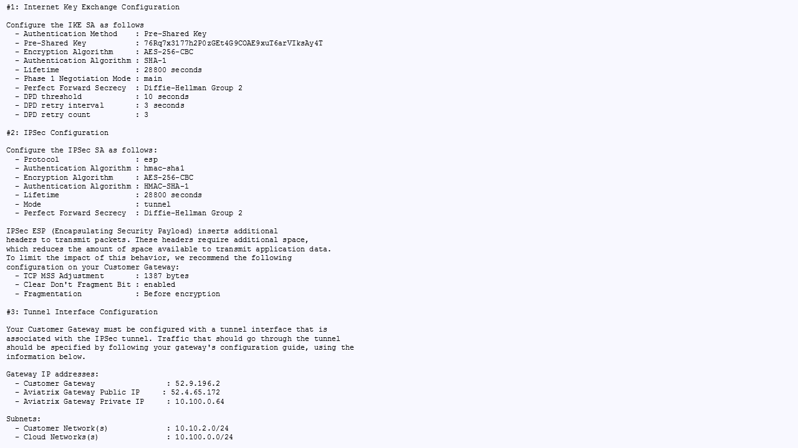
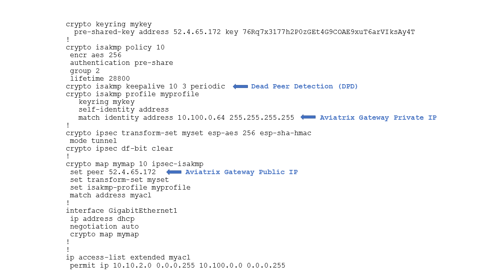
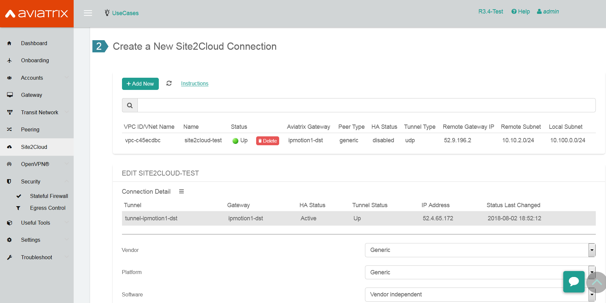

.. meta::
   :description: Site2Cloud connection between Aviatrix Gateway and Cisco IOS devices
   :keywords: Site2Cloud, site to cloud, aviatrix, ipsec vpn, tunnel, Cisco ASR, Cisco ISR, IOS

=================================================
Aviatrix Gateway to Cisco IOS Router
=================================================

This document describes how to build an IPsec tunnel based Site2Cloud connection between an Aviatrix Gateway and a Cisco IOS router.

The network setup is as follows:

**VPC/VNet-AVX (with Aviatrix Gateway)**

    *VPC/VNet CIDR: 10.100.0.0/24*
    
**On-Prem (with Cisco IOS Router)**

    *On-Prem Network CIDR: 10.10.2.0/24*
    
Creating a Site2Cloud Connection at the Aviatrix Controller
======================================================

1. Go to Gateway > New Gateway to launch an Aviatrix Gateway at the subnet (public subnet for AWS, GCP, or OCI) of VPC/VNet-AVX. Collect the Gateway's public IP addresses (52.4.65.172 in this example).

 2. Go to the Site2Cloud page and click **Add New** to create a Site2Cloud connection.

===============================     =================================================================
  **Field**                         **Value**
===============================     =================================================================
  VPC ID/VNet Name                  Choose VPC/VNet ID of VPC/VNet-AVX
  Connection Type                   Unmapped
  Connection Name                   Arbitrary (e.g. avx-ios-s2c)
  Remote Gateway Type               Generic
  Tunnel Type                       UDP
  Algorithms                        Unmark this checkbox
  Encryption over Direct Connect    Unmark this checkbox
  Enable HA                         Unmark this checkbox
  Primary Cloud Gateway             Select the Aviatrix Gateway created above
  Remote Gateway IP Address         Public IP of IOS Router WAN port (52.9.196.2 in this example)
  Pre-shared Key                    Optional (auto-generated if not entered)
  Remote Subnet                     10.10.2.0/24 (On-Prem Network CIDR)
  Local Subnet                      10.100.0.0/24 (VPC/VNet-AVX CIDR)
===============================     =================================================================
 
 3. Go to the Site2Cloud page. From the Site2Cloud connection table, select the connection created above (e.g. avx-ios-s2c). 
     - Select **Generic** from the **Vendor** dropdown menu.
     - Click **Download Configuration** to download the **Generic** Site2Cloud configuration.
     - Save the configuration file as a reference for configuring your Cisco IOS router.
     
     The following is a sample configuration based on the Site2Cloud configuration above.

     |image0|

Configuring Cisco IOS Router
===============================

1. Either ssh into the Cisco router or connect to it directly through its console port.

2. Apply the following IOS configuration to your router:
     Please note that from version 5.0, we use the gateway's public IP address as the identifier, so the "match identity address" should use the public ip instead of the private ip as pointed in the picture below.

     |image1| 

Troubleshooting and Verifying at the Aviatrix Controller
========================================================

1. At the Aviatrix Controller, go to the Site2Cloud page. Verify that the status of the Site2Cloud connection is up.

     |image2|

2. At the **Site2Cloud - Diagnostics** page, run various diagnostics commands.

===============================     =================================================================
  **Field**                         **Value**
===============================     =================================================================
  VPC ID/VNet Name                  VPC/VNet-AVX (Aviatrix Gateway VPC/VNet) ID
  Connection                        Name of the Site2Cloud connection created above
  Gateway                           Name of the Aviatrix Gateway
  Action                            One of the supported diagnostics commands
===============================     =================================================================

For support, please open a support ticket at `Aviatrix Support Portal <https://support.aviatrix.com>`_

.. disqus::
