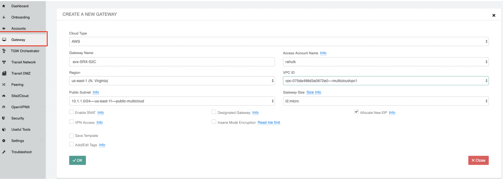
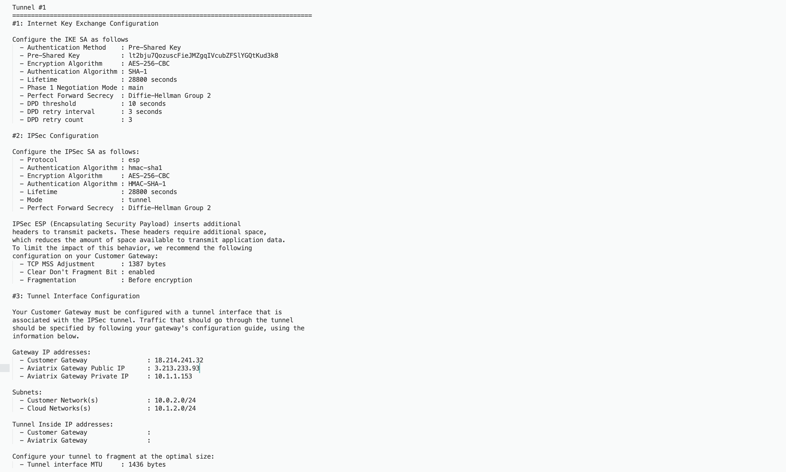
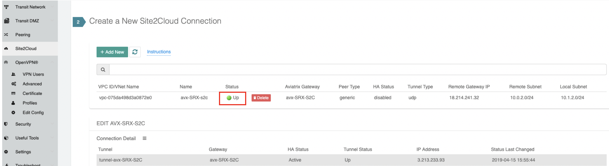

============================================
Aviatrix Gateway to Juniper SRX
============================================

This document describes how to build an IPsec tunnel-based Site2Cloud connection between an Aviatrix Gateway and a JuniperSRX Firewall.

The network setup is as follows:

**VPC/VNet-multicloudvpc1 (with Aviatrix Gateway)**

    *VPC/VNet CIDR: 10.1.1.0/16*

    *VPC/VNet Subnet CIDR (public in AWS, GCP, or OCI): 10.1.1.0/24*

    *VPC/VNet Private Subnet CIDR: 10.1.2.0/24*

**On-Prem (with Juniper SRX Firewall)**

    *On-Prem Network CIDR: 10.0.0.0/16*

    *On-prem Public Network CIDR: 10.0.3.0/24*

    *On-prem Private Network CIDR: 10.0.2.0/24*

Creating a Site2Cloud Connection at the Aviatrix Controller
======================================================

1. Go to **Gateway > New Gateway** to launch an Aviatrix Gateway at the subnet of VPC/VNet-multicloudvpc1 (public subnet for AWS, GCP, or OCI). Collect Gateway's public IP addresses (3.213.233.93 in this example).
   |image1|
2. Go to the **Site2Cloud** page and click **Add New** to create a Site2Cloud connection.

===============================     =================================================================
  **Field**                         **Value**
===============================     =================================================================
  VPC ID/VNet Name                  Choose VPC ID/VNet of VPC/VNet- multicloudvpc1
  Connection Type                   Unmapped
  Connection Name                   Arbitrary (e.g. avx-SRX-S2C)
  Remote Gateway Type               Generic
  Tunnel Type                       UDP
  Algorithms                        Unmark this checkbox
  Encryption over Direct Connect    Unmark this checkbox
  Enable HA                         Unmark this checkbox
  Primary Cloud Gateway             Select Aviatrix Gateway created above
  Remote Gateway IP Address         Public IP of Juniper SRX WAN port (18.214.241.32 in this example)
  Pre-shared Key                    Optional (auto-generated if not entered)
  Remote Subnet                     10.0.2.0/16 (On-Prem Private Network CIDR)
  Local Subnet                      10.1.2.0/24 (VPC-multicloudvpc1 private subnet)
===============================     =================================================================

3. Go to the **Site2Cloud** page. From the Site2Cloud connection table, select the connection created above (e.g. avx-SRX-S2C).
     - Select **Generic** from the **Vendor** dropdown menu.
     - Click the **Download Configuration** button to download the SRX Site2Cloud configuration.
     - Save the configuration file as a reference for configuring your Juniper SRX.
     |image2|

     The following is an SRX sample configuration based on the Site2Cloud configuration above.

     |image3|

Configuring JuniperSRX
=======================
     Apply the following configuration to your SRX:
  .. raw:: html

    <iframe src="https://s3-us-west-2.amazonaws.com/aviatrix-download/docs/srx_site2cloud.txt" height="300px" width="100%"></iframe>

Troubleshooting and Verifying at the Aviatrix Controller
========================================================

1. At the Aviatrix Controller, select **Site2Cloud** from the left sidebar. Verify that the status of the Site2Cloud connection is up.
     |image4|

2. At the Site2Cloud - Diagnostics page, run various diagnostics commands.

===============================     =================================================================
  **Field**                         **Value**
===============================     =================================================================
  VPC ID/VNet Name                  VPC/VNet- multicloudvpc1 (Aviatrix Gateway VPC/VNet) ID
  Connection                        Name of the Site2Cloud connection created above
  Gateway                           Name of the Aviatrix Gateway
  Action                            One of the supported diagnostics commands
===============================     =================================================================

.. |image2| image:: ./site2cloud_JuniperSRX_media/JuniperS2C2.png
    :width: 100%

