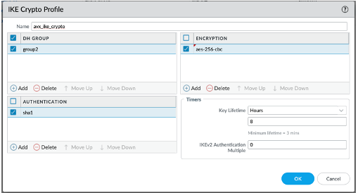
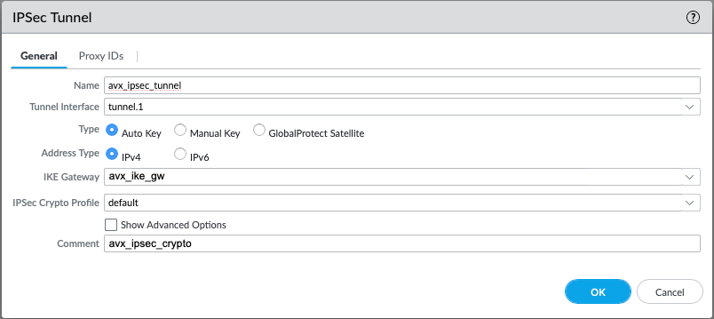
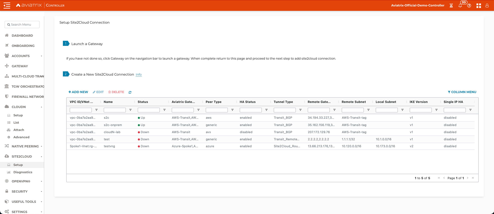

.. meta::
   :description: Site2Cloud connection between Aviatrix Gateway and PAN
   :keywords: Site2cloud, site to cloud, aviatrix, ipsec vpn, tunnel, PAN

=============================================
Aviatrix Gateway to Palo Alto Firewall
=============================================

This document describes how to build an IPSec tunnel based site2cloud connection between Aviatrix Gateway and Palo Alto Netowrks (PAN) Firewall. To simulate an on-prem PAN Firewall, we use a PAN VM at AWS VPC.

Network setup is as following:

**VPC1 (with Aviatrix Gateway)**

    *VPC1 CIDR: 10.0.0.0/16*

    *VPC1 Public Subnet CIDR: 10.0.1.0/24*

    *VPC1 Private Subnet CIDR: 10.0.2.0/24*

**VPC2 (with PAN-VM)**

    *VPC2 CIDR: 10.13.0.0/16*

    *VPC2 Public Subnet CIDR: 10.13.0.0/24*

    *VPC2 Private Subnet CIDR: 10.13.1.0/24*

Configuration Workflow
======================

#. Launch PAN-VM with at least two network interfaces - One interface serves as WAN port and is in VPC2 public subnet. The other interface serves as LAN port and is in VPC2 private subnet. Collect the public IP address of the WAN port.

#. At Aviatrix Controller, go to **Gateway > New Gateway** to launch an Aviatrix Gateway at VPC1 public subnet. Collect both public and private IP address of the Gateway.

#. At Aviatrix Controller, go to **site2cloud** and click **Add New** to create a site2cloud connection:

   ===============================     =========================================
     **Field**                         **Value**
   ===============================     =========================================
     VPC ID/VNet Name                  Choose VPC ID of VPC1
     Connection Type                   Unmapped
     Connection Name                   Arbitrary (e.g. avx-pan-s2c)
     Remote Gateway Type               Generic
     Tunnel Type                       UDP
     Algorithms                        Uncheck this box
     Encryption over DirectConnect     Uncheck this box
     Enable HA                         Uncheck this box
     Primary Cloud Gateway             Select Aviatrix Gateway created above
     Remote Gateway IP Address         Public IP of PAN-VM WAN port
     Pre-shared Key                    Optional (auto-generated if not entered)
     Remote Subnet                     10.13.1.0/24 (VPC2 private subnet)
     Local Subnet                      10.0.2.0/24 (VPC1 private subnet)
   ===============================     =========================================

#. At Aviatrix Controller, go to **site2cloud** page. From site2cloud connection table, select the connection created above (e.g. avx-pan-s2c). Select **Generic** from **Vendor** drop down list and click **Download Configuration** button to download the site2cloud configuration. Save the configuration file for configuring PAN-VM.

#. Log into PAN-VM and configure it as following:

   #. Go to **Network > Interface > Tunnel**, click **Add** to create a new tunnel interface and assign the following parameters.

      |image0|

      ===============================     ======================================
      **Field**                           **Value**
      ===============================     ======================================
      Interface Name                      tunnel.1
      Virtual Router                      Select the existing **default** virtual router
      Security Zone                       Select the layer 3 internal zone from
                                          which traffic originates
      ===============================     ======================================

      .. note::

         If the tunnel interface is in a zone different from the one where the traffic will originate, a policy needs to be created to allow the traffic to flow from the source zone to the zone containing the tunnel interface.

   #. Go to **Network > Network Profiles > IKE Crypto**, click **Add** and define the IKE Crypto profile (IKEv1 Phase-1) parameters.

      |image1|

   #. Go to **Network > Network Profiles > IKE Gateways** to configure the IKE Phase-1 Gateway. These parameters should match on the site2cloud configuration downloaded at Step 4.

      |image2|

      ===============================     =========================================
        **Field**                         **Value**
      ===============================     =========================================
        Interface                         PAN WAN port
        Peer IP Address                   Aviatrix Gateway public IP
        Pre-shared Key                    Key from site2cloud configuration downloaded at Step 4
        Peer Identification               IP Address & Aviatrix Gateway private IP
      ===============================     =========================================

      |image3|

      ===============================     =========================================
        **Field**                         **Value**
      ===============================     =========================================
        IKE Crypto Profile                Select the profile created at Step 5.2
      ===============================     =========================================

   #. Under **Network > Network Profiles > IPSec Crypto**, click **Add** to create a new profile. Define the IPSec crypto profile (IKEv1 Phase-2). These parameters should match on the site2cloud configuration downloaded at Step 4.

      |image4|

   #. Under **Network > IPSec Tunnels**, click **Add** to create a new IPSec Tunnel. At **General** window:

      |image5|

      ===============================     =========================================
        **Field**                         **Value**
      ===============================     =========================================
        Tunnel Interface                  Tunnel interface created at Step 5.1
        IKE Gateway                       IKE gateway created at Step 5.3
        IPSec Crypto Profile              IPSec crypto profile created at Step 5.4
      ===============================     =========================================

   #. At **Proxy IDs** window:

      |image6|

      ===============================     =================================================================
        **Field**                         **Value**
      ===============================     =================================================================
        Local                             VPC2 private subnet CIDR
        Remote                            VPC1 private subnet CIDR
        Protocol                          Any
      ===============================     =================================================================

   #. Under **Network > Virtual Routers**, click on virtual router profile, then click **Static Routes**, add a new route destinating to VPC1 private subnet.

      |image7|

      ===============================     =================================================================
        **Field**                         **Value**
      ===============================     =================================================================
        Destination                       VPC1 private subnet CIDR
        Interface                         Tunnel interface created at Step 5.1
      ===============================     =================================================================

   #. Commit the configuration.

#. At AWS portal, configure the VPC Route Table associated with the private subnet of VPC2. Add a route destinating to VPC1 private subnet with PAN-VM LAN port as the gateway.

#. Send traffic between VPC1 and VPC2 private subnets. At Aviatrix Controller, go to **Site2Cloud** page to verify the site2cloud connection status.

|image8|

For troubleshooting, go to **Site2Cloud > Diagnostics** and select various commands from **Action** drop down list.

|image9|

.. |image0| image:: s2c_gw_pan_media/Create_Tunnel_Interface.PNG
   :width: 5.55625in
   :height: 3.26548in

.. |image1| image:: s2c_gw_pan_media/IKE_Crypto_Profile.PNG
   :width: 5.55625in
   :height: 3.26548in

.. |image2| image:: s2c_gw_pan_media/IKE_Gateway_1.PNG
   :width: 5.55625in
   :height: 3.26548in

.. |image3| image:: s2c_gw_pan_media/IKE_Gateway_2.PNG
   :width: 5.55625in
   :height: 3.26548in

.. |image6| image:: s2c_gw_pan_media/IPSec_Tunnel_2.PNG
   :width: 5.55625in
   :height: 3.26548in

.. |image7| image:: s2c_gw_pan_media/Static_Route.PNG
   :width: 5.55625in
   :height: 3.26548in

.. |image9| image:: s2c_gw_pan_media/Troubleshoot_S2C.PNG
   :width: 5.55625in
   :height: 3.26548in

.. disqus::
