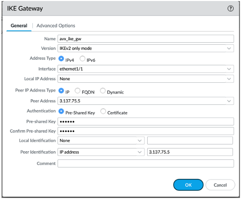
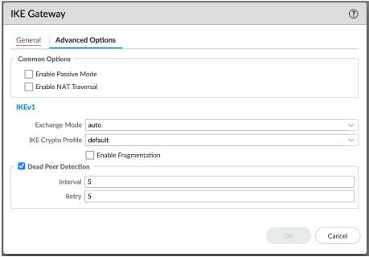
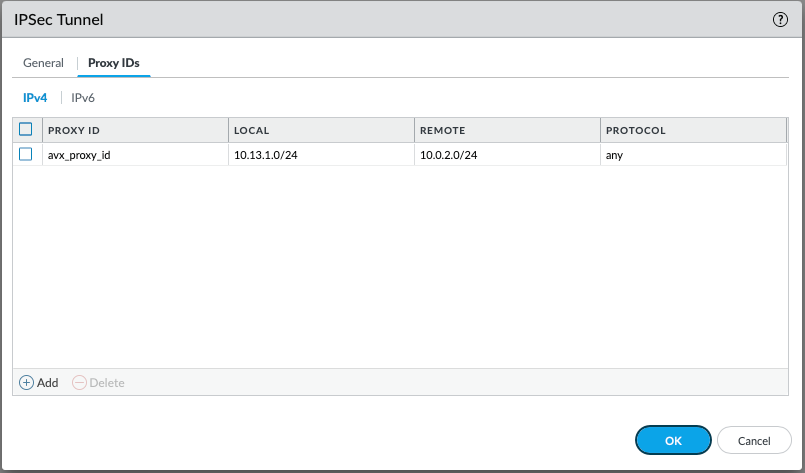
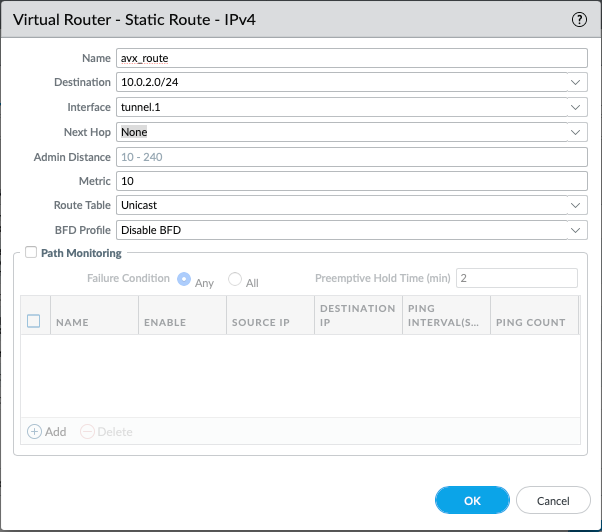

.. meta::
   :description: Site2Cloud connection between Aviatrix Gateway and Palo Alto Networks
   :keywords: Site2cloud, site to cloud, aviatrix, ipsec vpn, tunnel, PAN, Palo Alto Networks

=============================================
Aviatrix Gateway to Palo Alto Firewall
=============================================

This document describes how to build an IPsec tunnel based Site2Cloud connection between an Aviatrix Gateway and a Palo Alto Networks Firewall. To simulate an on-prem Firewall, we use a VM-Series in an AWS VPC.

Network setup is as following:

**VPC1 (with Aviatrix Gateway)**

    *VPC1 CIDR: 10.0.0.0/16*

    *VPC1 Public Subnet CIDR: 10.0.1.0/24*

    *VPC1 Private Subnet CIDR: 10.0.2.0/24*

**VPC2 (with Palo Alto Networks VM-series)**

    *VPC2 CIDR: 10.13.0.0/16*

    *VPC2 Public Subnet CIDR: 10.13.0.0/24*

    *VPC2 Private Subnet CIDR: 10.13.1.0/24*

Configuration Workflow
======================

#. Launch a Palo Alto Networks VM-series with at least two network interfaces - One interface serves as a WAN port and is in VPC2's public subnet. The other interface serves as a LAN port and is in VPC2's private subnet. Collect the public IP address of the WAN port.

#. At the Aviatrix Controller, go to Gateway > New Gateway to launch an Aviatrix Gateway at VPC1's public subnet. Collect both the public and private IP address of the Gateway.

#. At the Aviatrix Controller, go to Site2Cloud and click **Add New** to create a Site2Cloud connection:

   ===============================     =========================================
     **Field**                         **Value**
   ===============================     =========================================
     VPC ID/VNet Name                  Choose VPC ID of VPC1
     Connection Type                   Unmapped
     Connection Name                   Arbitrary (e.g. avx-pan-s2c)
     Remote Gateway Type               Generic
     Tunnel Type                       UDP
     Algorithms                        Uncheck this box
     Encryption over DirectConnect     Uncheck this box
     Enable HA                         Uncheck this box
     Primary Cloud Gateway             Select Aviatrix Gateway created above
     Remote Gateway IP Address         Public IP of Palo Alto Networks VM Series WAN port
     Pre-shared Key                    Optional (auto-generated if not entered)
     Remote Subnet                     10.13.1.0/24 (VPC2 private subnet)
     Local Subnet                      10.0.2.0/24 (VPC1 private subnet)
   ===============================     =========================================

#. At the Aviatrix Controller, go to the Site2Cloud page. From the Site2Cloud connection table, select the connection created above (e.g. avx-pan-s2c). Select **Generic** from the **Vendor** dropdown list and click the **Download Configuration** button to download the Site2Cloud configuration. Save the configuration file for configuring a Palo Alto Network VM.

#. Log into the Palo Alto Networks VM Series and configure it as following:

   a. Go to Network > Interface > Tunnel and click **Add** to create a new tunnel interface and assign the following parameters.

      |image0|

      ===============================     ======================================
      **Field**                           **Value**
      ===============================     ======================================
      Interface Name                      tunnel.1
      Virtual Router                      Select the existing **default** virtual router
      Security Zone                       Select the layer 3 internal zone from
                                          which traffic originates
      ===============================     ======================================

      .. note::

         If the tunnel interface is in a zone different from the one where the traffic will originate, a policy needs to be created to allow the traffic to flow from the source zone to the zone containing the tunnel interface.

   b. Go to Network > Network Profiles > IKE Crypto, click **Add** and define the IKE Crypto profile (IKEv1 Phase-1) parameters.

      |image1|

   c. Go to Network > Network Profiles > IKE Gateways to configure the IKE Phase-1 Gateway. These parameters should match on the Site2Cloud configuration downloaded at Step 4.

      |image2|

      ===============================     =========================================
        **Field**                         **Value**
      ===============================     =========================================
        Interface                         Palo Alto Networks WAN port
        Peer IP Address                   Aviatrix Gateway public IP
        Pre-shared Key                    Key from Site2Cloud configuration downloaded at Step 4
        Peer Identification               Peer public IP Address (if the controller version is below 5.0,
						it should be peer private IP) 
      ===============================     =========================================
	Note: In Palo Alto Networks official documents, it is not necessary to add the Peer Identification.  However, to make sure the tunnel working, we recommend to add it. In the event that IPsec tunnel is up but traffic is not passing between cloud and on-premises, you may want to enable NAT-T in Palo Alto Networks Firewall.

      |image3|

      ===============================     =========================================
        **Field**                         **Value**
      ===============================     =========================================
        IKE Crypto Profile                Select the profile created at Step 5.2
      ===============================     =========================================

   d. Under Network > Network Profiles > IPSec Crypto, click **Add** to create a new profile. Define the IPsec crypto profile (IKEv1 Phase-2). These parameters should match on the Site2Cloud configuration downloaded at Step 4.

      |image4|

   e. Under Network > IPSec Tunnels, click **Add** to create a new IPsec Tunnel. At the **General** window:

      |image5|

      ===============================     =========================================
        **Field**                         **Value**
      ===============================     =========================================
        Tunnel Interface                  Tunnel interface created at Step 5.1
        IKE Gateway                       IKE gateway created at Step 5.3
        IPsec Crypto Profile              IPsec crypto profile created at Step 5.4
      ===============================     =========================================

   f. At **Proxy IDs** window:

      |image6|

      ===============================     =================================================================
        **Field**                         **Value**
      ===============================     =================================================================
        Local                             VPC2 private subnet CIDR
        Remote                            VPC1 private subnet CIDR
        Protocol                          Any
      ===============================     =================================================================

   g. Under Network > Virtual Routers, click on the virtual router profile, then click Static Routes > default, add a new route destinating to VPC1 private subnet.

      |image7|

      ===============================     =================================================================
        **Field**                         **Value**
      ===============================     =================================================================
        Destination                       VPC1 private subnet CIDR
        Interface                         Tunnel interface created at Step 5.1
      ===============================     =================================================================

   h. Commit the configuration.  And, you will see the IPsec tunnel status become green.
   
      |image10|
	  
#. At the AWS portal, configure the VPC Route Table associated with the private subnet of VPC2. Add a route destinating to VPC1's private subnet with the Palo Alto Networks VM LAN port as the gateway.

#. Send traffic between VPC1's and VPC2's private subnets. At the Aviatrix Controller, go to the Site2Cloud page to verify the Site2Cloud connection status.

|image8|

For troubleshooting, go to Site2Cloud > Diagnostics and select various commands from **Action** drop down list.

|image9|

.. |image0| image:: s2c_gw_pan_media/Create_Tunnel_Interface.PNG
    :width: 5.55625in
    :height: 3.26548in

.. |image1| image:: s2c_gw_pan_media/IKE_Crypto_Profile.PNG
    :width: 5.55625in
    :height: 3.26548in

.. |image4| image:: s2c_gw_pan_media/IPSec_Crypto_Profile.PNG
    :width: 5.55625in
    :height: 3.26548in

.. |image5| image:: s2c_gw_pan_media/IPSec_Tunnel_1.PNG
    :width: 5.55625in
    :height: 3.26548in

.. |image8| image:: s2c_gw_pan_media/Verify_S2C.PNG
    :width: 5.55625in
    :height: 2.96548in

.. |image9| image:: s2c_gw_pan_media/Troubleshoot_S2C.PNG
    :width: 7.00000 in
    :height: 4.50000 in
   
.. |image10| image:: s2c_gw_pan_media/IPSecTunnelStatus.png
    :width: 7.00000 in
    :height: 0.60000 in
   
.. disqus::
