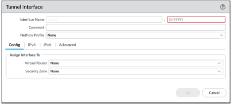
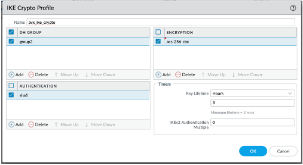
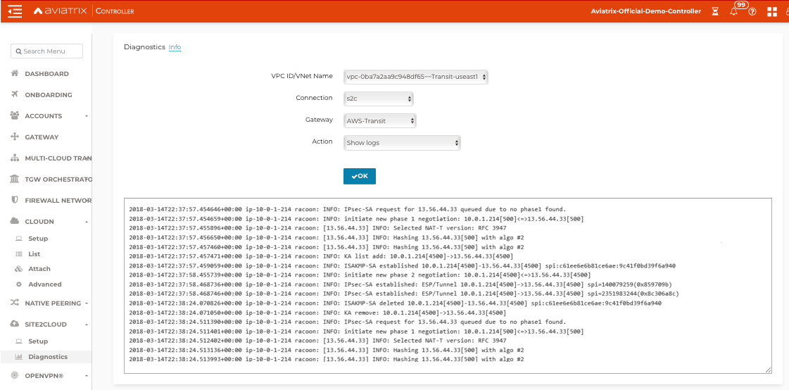

.. meta::
   :description: Site2Cloud connection between Aviatrix Gateway and Palo Alto Networks
   :keywords: Site2cloud, site to cloud, aviatrix, ipsec vpn, tunnel, PAN, Palo Alto Networks

=============================================
Aviatrix Gateway to Palo Alto Firewall
=============================================

This document describes how to build an IPsec tunnel based Site2Cloud connection between an Aviatrix Gateway and a Palo Alto Networks Firewall. To simulate an on-prem Firewall, we use a VM-Series in an AWS VPC.

.. note::

  If you do not have access to AWS, you can simulate an on-prem Firewall by deploying the Palo Alto Firewall in any other cloud (such as Microsoft Azure, Google Cloud Platform, or Oracle Cloud Infrastructure).

The network setup is as follows:

**VPC1 (with Aviatrix Gateway)**

    *VPC1 CIDR: 10.0.0.0/16*

    *VPC1 Public Subnet CIDR: 10.0.1.0/24*

    *VPC1 Private Subnet CIDR: 10.0.2.0/24*

**VPC2 (with Palo Alto Networks VM-series)**

    *VPC2 CIDR: 10.13.0.0/16*

    *VPC2 Public Subnet CIDR: 10.13.0.0/24*

    *VPC2 Private Subnet CIDR: 10.13.1.0/24*

Certificate-Based Authentication
================================

If you want to use certificate-based authentication when establishing a Site2Cloud connection with your Palo Alto VM-Series firewall, you must do the following:

1. Generate a certificate from your Palo Alto VM-Series firewall. See steps `here <#creating-and-generating-a-self-signed-root-certificate>`_. 
#. Export your certificate in PEM format. See steps `here <#creating-and-generating-a-self-signed-root-certificate>`_.
#. In the Aviatrix Controller, upload the CA certificate generated from your Palo Alto VM-Series firewall under Site2Cloud > Certificate > CA Certificate. See `here <https://docs.aviatrix.com/HowTos/site2cloud_cacert.html>`_ for details.
#. Create your Site2Cloud connection as described `here <#setting-up-site2cloud-connection>`_.	
#. After creating the Site2Cloud connection, `download the resulting configuration <https://docs.aviatrix.com/HowTos/site2cloud.html#download-configuration>`_.
#. Download the Aviatrix CA certificate from Site2Cloud > CA Certificate.
#. Upload the Aviatrix CA certificate to your on-prem Palo Alto VM-Series firewall. See steps `here <#importing-the-aviatrix-ca-certificate>`_.
#. In the Palo Alto VM-Series UI, use the information from the downloaded configuration file to configure your tunnels/interfaces. See steps `here <#adding-a-tunnel-interface>`_.
#. In the Palo Alto VM-Series UI, configure the `IKE Gateway <#setting-up-ike-crypto-profile-and-ike-gateways>`_ depending on if you are using PSK or certificate-based authentication.
 

Configuration Workflow
======================

If you are not using certificate-based authentication in your Site2Cloud connection with your Palo Alto firewall, you can skip these sections:

- Creating and Generating a Self-Signed Root Certificate
- Importing the Aviatrix CA Certificate 

Also, in the "Setting up IKE Crypto Profile and Gateways" section, you follow the PSK configuration steps instead of the certificate-based authentication steps. 

Creating and Generating a Self-Signed Root Certificate 
------------------------------------------------------

If you are creating a Site2Cloud connection between your Palo Alto VM-Series firewall and your Aviatrix gateway in the cloud and want to use cert-based authentication, you must generate a CA certificate in the firewall UI that you will upload to the Aviatrix Controller under Site2Cloud > CA Certificate.

See `this URL <https://docs.paloaltonetworks.com/pan-os/9-1/pan-os-admin/certificate-management/obtain-certificates/create-a-self-signed-root-ca-certificate>`_ for more information on certificates in Palo Alto.

1. In the Palo Alto VM-Series firewall UI, navigate to Device > Certificate Management > Certificates > Device Certificates.
#. Click Generate at the bottom of the window. The Generate Certificate dialog displays.
#. Fill out the following information: 

- Certificate Name: a name that makes sense to you, such as PAN-CA
- Common Name: a descriptor that makes sense to you, such as pan-to-avx.com
- Signed By: select ‘Certificate Authority’
- Cryptographic Settings: 

  - Select Elliptic Curve DSA (ECDSA); this is currently the only algorithm supported by Site2Cloud cert-based authentication.
  - Select 256 bits
  - Select sha256 digest

|image11|

4. Click Generate. This creates the root CA certificate that will be used to sign the PAN to Aviatrix certificate you will create in the next step.
#. Under Device > Certificate Management > Certificates > Device Certificates, generate another certificate (signed by the PAN-CA root you created) and populate as follows:

- Certificate Name: a name that makes sense to you, such as pan-to-avx-cert
- Common Name: a name that makes sense to you, such as pan-device.com
- Signed by: PAN-CA (created in above steps)
- Cryptographic Settings: Elliptic Curve DSA algorithm; 256 bits; sha256 digest
- Certificate Attributes: refer to the aforementioned Palo Alto Networks URL for information on attributes to use for device certificate creation

6. Click Generate.
#. Export the PAN-CA certificate for uploading to the Site2Cloud > CA Certificate page in the Aviatrix Controller.
#. See the `CA Certificate page <https://docs.aviatrix.com/HowTos/site2cloud_cert.html>`_ for details on uploading this certificate.

Setting up Site2Cloud Connection
--------------------------------

1. Launch a Palo Alto Networks VM-series with at least two network interfaces. One interface serves as a WAN port and is in VPC2's public subnet. The other interface serves as a LAN port and is in VPC2's private subnet. Collect the public IP address of the WAN port.

#. In the Aviatrix Controller, navigate to Gateway > New Gateway to launch an Aviatrix Gateway at VPC1's public subnet. Collect both the public and private IP address of the Gateway.

#. In the Aviatrix Controller, navigate to Site2Cloud and click **Add New** to create a Site2Cloud connection using the following values (selecting either PSK or certificate-based authentication):

   ===============================     =========================================
     **Field**                         **Value**
   ===============================     =========================================
     VPC ID/VNet Name                  Choose VPC ID of VPC1
     Connection Type                   Unmapped
     Connection Name                   Arbitrary (e.g. avx-pan-s2c)
     Remote Gateway Type               Generic
     Tunnel Type                       UDP
     Algorithms                        Uncheck this box
     Encryption over Direct Connect    Uncheck this box
     Enable HA                         Uncheck this box
     Primary Cloud Gateway             Select Aviatrix Gateway created above
     Remote Gateway IP Address         Public IP of Palo Alto Networks VM Series WAN port
     Pre-shared Key                    Optional (auto-generated if not entered)
     Remote Subnet                     10.13.1.0/24 (VPC2 private subnet)
     Local Subnet                      10.0.2.0/24 (VPC1 private subnet)
   ===============================     =========================================

#. After the connection is created, select the connection you just created in the table on the Site2Cloud page (for example, avx-pan-s2c).

#. Select **Generic** from the **Vendor** dropdown list and click the **Download Configuration** button to download the Site2Cloud configuration. Use this configuration file to configure the tunnels and interfaces in your Palo Alto Network VM-Series firewall.

Importing the Aviatrix CA Certificate
-------------------------------------

If you are creating a Site2Cloud connection between your Palo Alto VM-Series firewall and your Aviatrix gateway, you must download the Aviatrix CA certificate as per the instructions on the `CA Certificate <https://docs.aviatrix.com/HowTos/site2cloud_cacert.html>`_ page, and then upload it to your Palo Alto VM-Series UI as follows:

1. In the Palo Alto VM-Series UI, navigate to Device > Certificate Management > Certificates > Device Certificates.
#. At the bottom of the window, click Import.
#. In the Import Certificate dialog, enter the following information:

- Certificate Name: a name that makes sense to you
- Certificate File: click Browse to navigate to the location of the Aviatrix CA certificate
- File Format: select Base64 Encoded Certificate (PEM). 

4. Click OK.
#. Navigate to Device > Certificate Management > Certificate Profile. In the Certificate Profile dialog enter the following:

- Name: enter a name for the profile (such as AVX-CA).
- CA Certificates: click Add and select AVX-CERT (or whatever name you gave to the imported Aviatrix CA certificate) from the CA Certificate list. 

6. Click OK.
#. Click OK again on the main Certificate Profile dialog.

Adding a Tunnel Interface
-------------------------

#. Log into the Palo Alto Networks VM Series UI.

#. Navigate to Network > Interface > Tunnel and click **Add** to create a new tunnel interface and assign the following parameters.

      |image0|

      ===============================     ======================================
      **Field**                           **Value**
      ===============================     ======================================
      Interface Name                      tunnel.1
      Virtual Router                      Select the existing **default** virtual router
      Security Zone                       Select the layer 3 internal zone from
                                          which traffic originates
      ===============================     ======================================

      .. note::

         If the tunnel interface is in a zone different from the one where the traffic will originate, a policy needs to be created to allow the traffic to flow from the source zone to the zone containing the tunnel interface.

Setting up IKE Crypto Profile and IKE Gateways 
----------------------------------------------

1. In the Palo Alto VM-Series UI, navigate to to Network > Network Profiles > IKE Crypto, click **Add** and define the IKE Crypto profile (IKEv1 Phase-1) parameters.

      |image1|

#. If using PSK (Pre-shared Key) for authentication with Site2Cloud:

   a. Navigate to Network > Network Profiles > IKE Gateways to configure the IKE Phase-1 Gateway. These parameters should match the Site2Cloud configuration downloaded under "Setting up Site2Cloud Connection".

      |image2|

      ===============================     =========================================
        **Field**                         **Value**
      ===============================     =========================================
        Interface                         Palo Alto Networks WAN port
        Peer IP Address                   Aviatrix Gateway public IP
        Pre-shared Key                    Key from Site2Cloud configuration downloaded at Step 4
        Peer Identification               Peer public IP Address (if the controller version is below 5.0,
						it should be peer private IP) 
      ===============================     =========================================

According to the Palo Alto Networks official documents, it is not necessary to add Peer Identification. However, Aviatrix recommends adding it, to make sure the tunnel is working. In the event that IPsec tunnel is up but traffic is not passing between cloud and on-prem, you may want to enable NAT-T in the Palo Alto Networks Firewall.

      |image3|

      ===============================     =========================================
        **Field**                         **Value**
      ===============================     =========================================
        IKE Crypto Profile                Select the profile created at Step 5.2
      ===============================     =========================================

   b. Under Network > Network Profiles > IPsec Crypto, click **Add** to create a new profile. Define the IPsec crypto profile (IKEv1 Phase-2). These parameters should match on the Site2Cloud configuration downloaded at Step 4.

      |image4|

   c. Under Network > IPsec Tunnels, click **Add** to create a new IPsec Tunnel. At the **General** window:

      |image5|

      ===============================     =========================================
        **Field**                         **Value**
      ===============================     =========================================
        Tunnel Interface                  Tunnel interface created at Step 5.1
        IKE Gateway                       IKE gateway created at Step 5.3
        IPsec Crypto Profile              IPsec crypto profile created at Step 5.4
      ===============================     =========================================

   d. At **Proxy IDs** window:

      |image6|

      ===============================     =================================================================
        **Field**                         **Value**
      ===============================     =================================================================
        Local                             VPC2 private subnet CIDR
        Remote                            VPC1 private subnet CIDR
        Protocol                          Any
      ===============================     =================================================================

   e. Under Network > Virtual Routers, click on the virtual router profile, then click Static Routes > default, add a new route destinating to VPC1 private subnet.

      |image7|

      ===============================     =================================================================
        **Field**                         **Value**
      ===============================     =================================================================
        Destination                       VPC1 private subnet CIDR
        Interface                         Tunnel interface created at Step 5.1
      ===============================     =================================================================

   f. Commit the configuration.  And, you will see the IPsec tunnel status become green.
   
      |image10|
	  
3. If using certificate-based authentication with Site2Cloud:

   a. Go to Network > Network Profiles > IKE Gateways. These parameters should match the Site2Cloud configuration downloaded at Step 5 under "Setting up Site2Cloud Connection". 
   b. In the IKE Gateway dialog enter the following:

	+----------------------+-------------------------------------------------------+
	| **Field**            | **Value**                                             |
	+----------------------+-------------------------------------------------------+
	| Name                 | A name that makes sense to you                        |
	+----------------------+-------------------------------------------------------+
	| Version              | IKEv2 only mode                                       |
	+----------------------+-------------------------------------------------------+
        | Interface            | ethernet 1/1                                          |
	+----------------------+-------------------------------------------------------+
        | Local IP Address     | IP address of on-prem                                 |
        +----------------------+-------------------------------------------------------+
        | Peer IP Address Type | IP                                                    |
        +----------------------+-------------------------------------------------------+
        | Peer Address         | IP address of cloud gateway                           |
        +----------------------+-------------------------------------------------------+
        | Authentication       | Certificate                                           |
        +----------------------+-------------------------------------------------------+
        | Local Certificate    | the device certificate you created earlier            |
        +----------------------+-------------------------------------------------------+
        | Local Identification | FQDN (hostname) such as pan-device.com                |
        +----------------------+-------------------------------------------------------+
        | Peer Identification  | FQDN (hostname) such as gw-spoke.aviatrix.network.com | 
        +----------------------+-------------------------------------------------------+
        | Peer ID Check        | Exact                                                 |
        +----------------------+-------------------------------------------------------+
        | Certificate Profile  | select the certificate profile you created in the     |
        |                      | previous section                                      |
        +----------------------+-------------------------------------------------------+

   c. Click OK.
   d. Navigate to Device > Certificate Management > Device Certificates > PAN-CA and export this certificate as a PEM file.
   e. You must now import this certificate in on the CA Certificate page in the Aviatrix Controller, to use when setting up the Site2Cloud connection between the Aviatrix Controller and the Palo Alto VM-Series firewall. 

Finishing the Configuration
---------------------------

1. In the AWS portal, configure the VPC Route Table associated with the private subnet of VPC2. Add a route that has a destination of the VPC1 private subnet with the Palo Alto Networks VM LAN port as the gateway.

#. Send traffic between VPC1's and VPC2's private subnets. In the Aviatrix Controller, go to the Site2Cloud page to verify the Site2Cloud connection status.

|image8|

To troubleshoot, navigate to Site2Cloud > Diagnostics and select commands from **Action** drop down list.

|image9|

.. |image2| image:: s2c_gw_pan_media/ike-gw-1.png
    :width: 5.55625in
    :height: 3.26548in

.. |image3| image:: s2c_gw_pan_media/ike-gw-2.png
    :width: 5.55625in
    :height: 3.26548in

.. |image4| image:: s2c_gw_pan_media/IPSec_Crypto_Profile.PNG
    :width: 5.55625in
    :height: 3.26548in

.. |image5| image:: s2c_gw_pan_media/IPSec_Tunnel_1.PNG
    :width: 5.55625in
    :height: 3.26548in

.. |image6| image:: s2c_gw_pan_media/IPSec_Tunnel_2.PNG
    :width: 5.55625in
    :height: 3.26548in

.. |image7| image:: s2c_gw_pan_media/Static_Route.PNG
    :width: 5.00000in
    :height: 3.26548in

.. |image8| image:: s2c_gw_pan_media/Verify_S2C.PNG
    :width: 5.55625in
    :height: 2.96548in

   
.. |image10| image:: s2c_gw_pan_media/IPSecTunnelStatus.png
    :width: 7.00000 in
    :height: 0.60000 in

   
   
.. disqus::