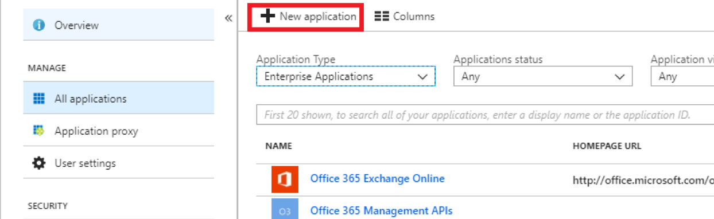
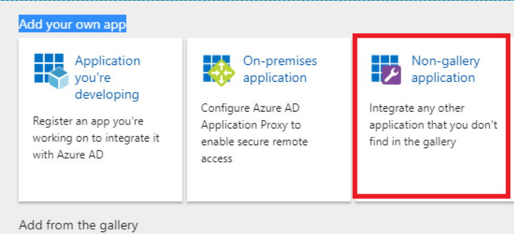
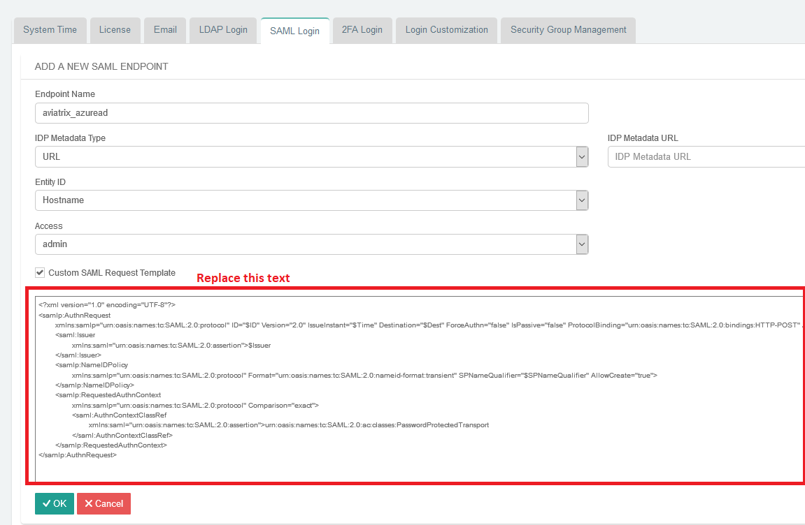
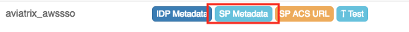
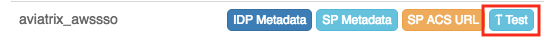
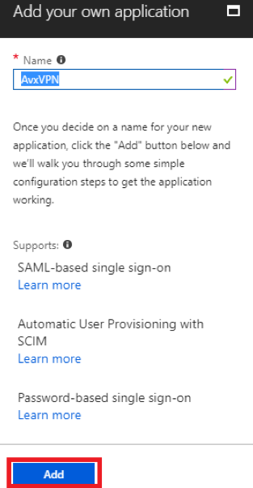
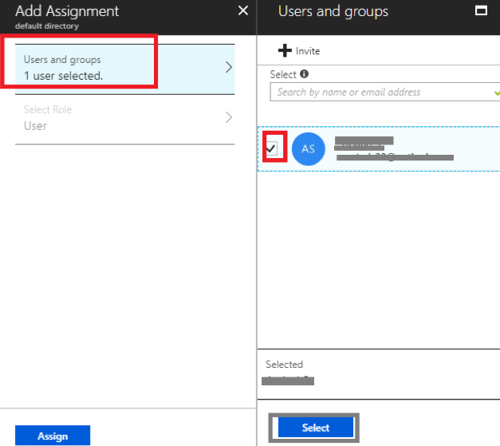
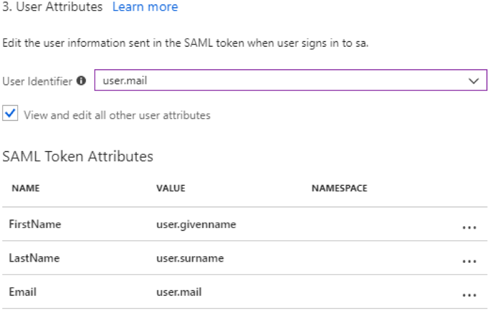
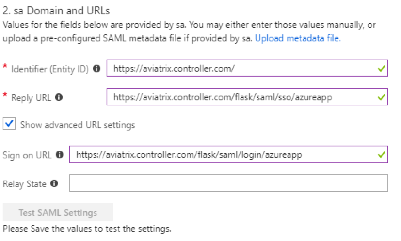
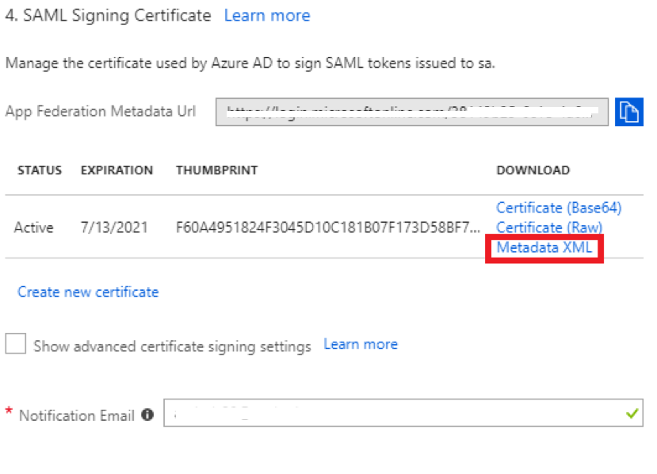

.. raw:: html

   

==============================================================================
Azure AD IdP for SAML Integration
==============================================================================

Overview
------------

This guide provides an example on how to configure Aviatrix to authenticate against Azure AD IdP.  When SAML client is used, your Aviatrix controller acts as the Identity Service Provider (ISP) that redirects browser traffic from client to IdP (e.g., Azure AD) for authentication.

Before configuring SAML integration between Aviatrix and Azure AD, make sure you have a valid Azure AD Premium subscription account with administrator access.

Configuration Steps
-------------------

Follow these steps to configure Aviatrix to authenticate against your Azure AD IdP:

Step 1. Create a `temporary Aviatrix SP Endpoint <#aviatrix-endpoint>`__ in the Aviatrix Controller

Step 2. Create an `Azure AD SAML Application <#azuread-saml-app>`__ for Aviatrix in the Azure Portal's Premium Subscription Account

Step 3. Retrieve the `Azure AD IdP metadata <#azuread-idp-metadata>`__

Step 4. Update the `Aviatrix SP Endpoint <#azuread-update-saml-endpoint>`__ in the Aviatrix Controller

Step 5. `Test the Integration <#azuread-test-integration>`__ is Set Up Correctly

.. _aviatrix_endpoint:

Step 1. Create an Aviatrix SP Endpoint
########################################

Visit one of the following links based on your use case and follow step1 (Create temporary Aviatrix SP Endpoint for Aviatrix) from the link's Configuration section:

  If integrating Azure AD IdP with `Controller Login SAML Config <https://docs.aviatrix.com/HowTos/Controller_Login_SAML_Config.html#config-31>`_

  If integrating Azure AD IdP with `OpenVPN with SAML Authentication <https://docs.aviatrix.com/HowTos/VPN_SAML.html#config-31>`_

This step will ask you to pick a short name to be used for the SAML application name ``[Endpoint Name]``.  In the notes below we will refer to this as **aviatrix_azuread**.  It can be any string that will identify the SAML application you create in the IdP.

We will use the string you select for the SAML application name to generate a URL for Azure AD to connect with Aviatrix.  This URL is defined below as **SP_ACS_URL**.  This URL should be constructed as:

``https://<<<your controller ip or host name>>>/flask/saml/sso/<<<aviatrix_azuread>>>``

.. tip::

  Replace **<<<your controller ip or host name>>>** with the actual host name or IP address of your controller and **<<<aviatrix_azuread>>>** with the ``[Endpoint Name]`` you chose to refer to the SAML application.

.. _azuread_saml_app:

Step 2. Create an Azure AD SAML App for Aviatrix
################################################

**Connect to Azure**

Login to your Azure portal

**Create Custom SAML Application**

#. Go to the Azure Active Directory service
#. Select **Enterprise Applications** under **Manage** navigation menu item
#. Click **+ New application**

   |imageAddAppsMenu|

   .. note::
      You must be an administrator to add new Enterprise Applications.

#. Click **Non-gallery application**

   |imageAddAppNonGallery|

#. Enter a Display Name

   .. note::
      Custom applications requires an Azure AD Premium subscription.

   |imageAddAppSetName|

#. Click **Add**

**Assign Users to this Application**

#. Click **Users and groups** below **Manage**
#. Click **+ Add user**
#. Select a User and Role
#. Click **Assign**

   |imageAssignUser|

**Single Sign-on Configuration**

Click **Single sign-on** below **Manage**

**Application Domain and URLs**

#. Select **SAML-based Sign-on** from the **Single Sign-on Mode** drop down
#. Fill out the fields

   +----------------------------+-----------------------------------------+
   | Field                      | Value                                   |
   +============================+=========================================+
   | Identifier (Entity ID)     | ``https://<<<your controller>>>``       |
   +----------------------------+-----------------------------------------+
   | Reply URL                  | **SP_ACS_URL**                          |
   +----------------------------+-----------------------------------------+
   | Show Advanced URL settings | checked                                 |
   +----------------------------+-----------------------------------------+
   | Sign on URL                | **SP_ACS_URL**                          |
   +----------------------------+-----------------------------------------+
   | Relay State                | (leave blank)                           |
   +----------------------------+-----------------------------------------+

 The links for the SAML Identifier, Reply URL, and Sign on URL should point to the Application Gateway domain instead of the Aviatrix controller.

**User Attributes**

#. Enter **user.mail** for **User Identifier**
#. Click **View and edit all other user attributes**
#. Add the following **SAML Token Attributes** (please find the right values from your Azure user details to match firstname, lastname and email). You can also add "Profile" and send the profile name of a VPN profile - at this time,we only support attaching one profile per user via SAML

   +------------------+-----------------------------------------+------------+
   | NAME             | VALUE                                   | NAMESPACE  |
   +==================+=========================================+============+
   | FirstName        | user.givenname                          | (blank)    |
   +------------------+-----------------------------------------+------------+
   | LastName         | user.surname                            | (blank)    |
   +------------------+-----------------------------------------+------------+
   | Email            | user.mail                               | (blank)    |
   +------------------+-----------------------------------------+------------+

   |imageUserAttrs|
#. Verify that the Namespace URI is blank like so for each claim.

   |imageAttributeURI|

.. _azuread_idp_metadata:

Step 3. Retrieve the Azure AD IdP metadata
##########################################

**SAML Signing Certificate**

#. Find the **Metadata XML** link
#. Click the link to download the file

   |imageSAMLMetadata|

   The XML file contents will be provided to the Aviatrix SP endpoint later on.

**Save Application**

Click **Save**

.. _azuread_update_saml_endpoint:

Step 4. Update the Aviatrix SP Endpoint
#######################################

.. note::

   This step is usually completed by the Aviatrix admin.
   Azure AD IdP provides IdP Metadata through text obtained in `Retrieve Azure AD IdP metadata (Step 3) <#azuread-idp-metadata>`_.
   Azure AD IdP requires a custom SAML request template.

Continue with updating Aviatrix SAML Endpoint by visiting one of the following links based on your use case:

#. If integrating Azure IdP with `Controller Login SAML Config <https://docs.aviatrix.com/HowTos/Controller_Login_SAML_Config.html#config-34>`_

#. If integrating Azure IdP with `OpenVPN with SAML Authentication <https://docs.aviatrix.com/HowTos/VPN_SAML.html#config-34>`_

   +----------------------------+-----------------------------------------+
   | Field                      | Description                             |
   +============================+=========================================+
   | Endpoint Name              | ``[Endpoint Name]``                     |
   +----------------------------+-----------------------------------------+
   | IPD Metadata Type          | Text                                    |
   +----------------------------+-----------------------------------------+
   | IdP Metadata Text/URL      | Paste in the metadata XML file contents |
   |                            | `downloaded earlier <#azuread-idp-metadata>`_.                     |
   +----------------------------+-----------------------------------------+
   | Entity ID                  | Select `Hostname`                       |
   +----------------------------+-----------------------------------------+
   | Access                     | Select admin or read-only access        |
   +----------------------------+-----------------------------------------+
   | Custom SAML Request        | Checked                                 |
   | Template                   |                                         |
   +----------------------------+-----------------------------------------+

.. note::
   Each endpoint only supports one type of access. If you need admin and read-only access, create two separate SAML apps.
   `Hostname` is the default for Entity ID, but if you have other apps using the same hostname, use a custom Entity ID.

   |imageAvtxUpdateSAMLEndpoint|

#. Copy the following into the **Custom SAML Request Template** field:

   .. code-block:: xml

      <?xml version="1.0" encoding="UTF-8"?>
      <samlp:AuthnRequest xmlns:samlp="urn:oasis:names:tc:SAML:2.0:protocol" ID="$ID" Version="2.0" IssueInstant="$Time" Destination="$Dest" ForceAuthn="false" IsPassive="false" ProtocolBinding="urn:oasis:names:tc:SAML:2.0:bindings:HTTP-POST" AssertionConsumerServiceURL="$ACS">
      <saml:Issuer xmlns:saml="urn:oasis:names:tc:SAML:2.0:assertion">$Issuer</saml:Issuer>
      </samlp:AuthnRequest>

   .. note::
      This is required to connect with Azure AD.  If you don't do this, you will receive an error message when testing.

#. Click **OK**

.. _azuread_test_integration:

Step 5. Test the Integration
############################

.. tip::
  Be sure to assign users to the new application in Azure AD prior to validating.  If you do not assign your test user to the Aviatrix SAML application, you will receive an error.

Continue with testing the integration by visiting one of the following links based on your use case:

1. If integrating Azure AD IdP with `Controller Login SAML Config <https://docs.aviatrix.com/HowTos/Controller_Login_SAML_Config.html#config-35>`__
  #. Click `Settings` in the left navigation menu
  #. Select `Controller`
  #. Click on the `SAML Login` tab
2. If integrating Azure AD IdP with `OpenVPN with SAML Authentication <https://docs.aviatrix.com/HowTos/VPN_SAML.html#config-35>`__
  #. Expand `OpenVPN®` in the navigation menu and click `Advanced`
  #. Stay on the `SAML` tab

You can quickly validate that the configuration is complete by clicking on the **Test** button next to the SAML endpoint.

|imageAvtxTestButton|

.. |imageAvtxSAMLEndpoint| image:: azuread_saml_media/avx_controller_saml.png

.. |imageAttributeURI| image:: azuread_saml_media/azure_ad_claim_edit.png
