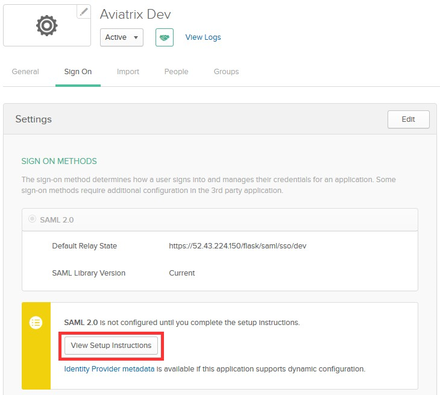

.. meta::
   :description: Aviatrix User SSL VPN Okta SAML Configuration
   :keywords: Okta, SAML, user vpn, okta saml, Aviatrix, OpenVPN

.. toctree::
   :numbered:

==============================================================================
Okta IdP for SAML Integration
==============================================================================

Overview
------------

This guide provides an example on how to configure Okta as an IdP for an Aviatrix SAML SP (endpoint). When SAML client is used, your Aviatrix controller acts as the Identity Service Provider (ISP) that redirects browser traffic from client to IdP (e.g., Okta) for authentication.

Visit one of the following links based on your use case:

  If integrating Okta IdP with `Controller Login SAML Config <https://docs.aviatrix.com/HowTos/Controller_Login_SAML_Config.html>`_
  If integrating Okta IdP with `OpenVPN with SAML Authentication <https://docs.aviatrix.com/HowTos/VPN_SAML.html>`_

Before configuring SAML integration between Aviatrix and Okta, make sure you have a valid Okta account with administrator access.

Configuration Steps
-------------------

Follow these steps to configure Aviatrix to authenticate against your Okta IdP:

Step 1. Create an `Okta SAML App <#okta-saml-app>`__ for Aviatrix

Step 2. Retrieve `Okta IdP metadata <#okta-idp-metadata>`__

Step 3. Update `Aviatrix SP Endpoint <#okta-update-saml-endpoint>`__ in the Aviatrix Controller

Step 4. `Test the Integration <#okta-test-integration>`__ is Set Up Correctly

.. _okta_saml_app:

Create an Okta SAML App for Aviatrix
####################################

.. note::

   This step is usually done by the Okta Admin.

#. Login to the Okta Admin portal
#. Follow `Okta documentation <https://developer.okta.com/standards/SAML/setting_up_a_saml_application_in_okta>`__ to create a new application.

   +----------------+----------------+
   | Field          | Value          |
   +================+================+
   | Platform       | Web            |
   +----------------+----------------+
   | Sign on method | SAML 2.0       |
   +----------------+----------------+

      |image0|

#. General Settings

   +----------------+-----------------+----------------------------------------+
   | Field          | Value           | Description                            |
   +================+=================+========================================+
   | App name       | Aviatrix        | This can be any value.  It will be     |
   |                |                 | displayed in Okta only.                |
   +----------------+-----------------+----------------------------------------+
   |                | Aviatrix logo:  | Aviatrix logo (optional)               |
   |                |                 |                                        |
   | App logo       | | |logoAlias1|_ |                                        |
   |                | | |logoAlias2|_ |                                        |
   +----------------+-----------------+----------------------------------------+
   | App visibility | N/A             | Leave both options unchecked           |
   +----------------+-----------------+----------------------------------------+

      |image1|

#. SAML Settings

   * General

   +----------------------+----------------------------------------------------+
   | Field                | Value                                              |
   +======================+====================================================+
   | Single sign on URL   | ``https://[host]/flask/saml/sso/[Endpoint Name]``  |
   +----------------------+----------------------------------------------------+
   | Audience URI         | ``https://[host]/``                                |
   | (SP Entity ID)       |                                                    |
   +----------------------+----------------------------------------------------+
   | Default RelayState   |                                                    |
   +----------------------+----------------------------------------------------+
   | Name ID format       | Unspecified                                        |
   +----------------------+----------------------------------------------------+
   | Application username | Okta username                                      |
   +----------------------+----------------------------------------------------+

   ``[host]`` is the hostname or IP of your Aviatrix controller.  For example, ``https://controller.demo.aviatrix.live``

   ``[Endpoint Name]`` is an arbitrary identifier.  This same value should be used when configuring SAML in the Aviatrix controller. The example uses ``dev`` for ``[Endpoint Name]``

   |image2|

   * Attribute Statements

     +----------------+-----------------+--------------------------------------+
     | Name           | Name format     | Value                                |
     +================+=================+======================================+
     | FirstName      | Unspecified     | user.firstName                       |
     +----------------+-----------------+--------------------------------------+
     | LastName       | Unspecified     | user.lastName                        |
     +----------------+-----------------+--------------------------------------+
     | Email          | Unspecified     | user.email                           |
     +----------------+-----------------+--------------------------------------+

     |image3|

#. You need to assign the application to your account. Please follow steps 11 through 14 at `Okta documentation <https://developer.okta.com/standards/SAML/setting_up_a_saml_application_in_okta>`__

.. _okta_idp_metadata:

Retrieve Okta IdP metadata
##########################

.. note::

   This step is usually completed by the Okta admin.

#. After the application is created in Okta, go to the `Sign On` tab for the application.  Then, click on the `View Setup Instructions` button.

    |image4|

#. Look for the section titled `Provide the following IdP metadata to your SP provider`.

    |image5|

.. important::

   Copy the *IdP metadata text* displayed.  This value will be used to configure the Aviatrix SP Endpoint.

.. _okta_update_saml_endpoint:

Update Aviatrix SP Endpoint
###########################

.. note::

   This step is usually completed by the Aviatrix admin.
   Okta IdP provides IdP Metadata through text obtained in `Retrieve Okta IdP metadata (Step 2) <#okta-idp-metadata>`_.

Continue with updating Aviatrix SAML Endpoint by visiting one of the following links based on your use case:

#. If integrating Okta IdP with `Controller Login SAML Config <https://docs.aviatrix.com/HowTos/Controller_Login_SAML_Config.html#config-34>`_
#. If integrating Okta IdP with `OpenVPN with SAML Authentication <https://docs.aviatrix.com/HowTos/VPN_SAML.html#config-34>`_

   +-------------------------+-------------------------------------------------+
   | Field                   | Value                                           |
   +=========================+=================================================+
   | Endpoint Name           | ``[Endpoint Name]`` (Use the same name you entered    |
   |                         | in the Okta Application previously)             |
   +-------------------------+-------------------------------------------------+
   | IdP Metadata Type       | Text                                            |
   +-------------------------+-------------------------------------------------+
   | IdP Metadata Text       | ``Value Copied from Okta`` (Paste the value     |
   |                         | copied from `Okta SAML configuration <#okta-idp-metadata>`_)            |
   +-------------------------+-------------------------------------------------+
   | Entity ID               | Select `Hostname`                               |
   +-------------------------+-------------------------------------------------+
   | Access                  | Select admin or read_only access                |
   +-------------------------+-------------------------------------------------+
   | Custom SAML Request     | Unchecked                                       |
   | Template                |                                                 |
   +-------------------------+-------------------------------------------------+

.. _okta_test_integration:

Test the Integration
####################

.. tip::
  Be sure to assign users to the new application in Okta prior to validating.  If you do not assign your test user to the Aviatrix SAML application, you will receive an error.

Continue with testing the integration by visiting one of the following links based on your use case:

1. If integrating Okta IdP with `Controller Login SAML Config <https://docs.aviatrix.com/HowTos/Controller_Login_SAML_Config.html#config-35>`_
  #. Click `Settings` in the left navigation menu
  #. Select `Controller`
  #. Click on the `SAML Login` tab
2. If integrating Okta IdP with `OpenVPN with SAML Authentication <https://docs.aviatrix.com/HowTos/VPN_SAML.html#config-35>`_
  #. Expand `OpenVPN®` in the navigation menu and click `Advanced`
  #. Stay on the `SAML` tab

You can quickly validate that the configuration is complete by clicking on the **Test** button next to the SAML endpoint.

Configure Okta for Multifactor Authentication (OPTIONAL)
########################################################

Once you have successfully configured Okta IdP with Aviatrix SP, you can configure Okta for Multifactor Authentication.

Please read this `article <https://support.okta.com/help/Documentation/Knowledge_Article/Multifactor-Authentication-1320134400>`__ from Okta on Multifactor setup.

See this `article <https://support.okta.com/help/Documentation/Knowledge_Article/Configuring-Duo-Security-734413457>`__ if you're interested in using DUO in particular.

OpenVPN is a registered trademark of OpenVPN Inc.

.. |logoAlias1| replace::  Aviatrix logo with red background
.. _logoAlias1: https://www.aviatrix.com/news/press-kit/logo-aviatrix.png

.. |logoAlias2| replace:: Aviatrix logo with transparent background
.. _logoAlias2: https://www.aviatrix.com/images/logo-reverse.png

.. |image0| image:: SSL_VPN_Okta_SAML_media/image0.png

.. |image1| image:: SSL_VPN_Okta_SAML_media/image1.png

.. |image2| image:: SSL_VPN_Okta_SAML_media/image2.png

.. |image3| image:: SSL_VPN_Okta_SAML_media/image3.png

.. |image4| image:: SSL_VPN_Okta_SAML_media/image4.png

.. |image6| image:: SSL_VPN_Okta_SAML_media/image6.png

.. |image7| image:: SSL_VPN_Okta_SAML_media/image7.png

.. |imageControllerNavOpenVPNAdvanced| image:: SSL_VPN_Okta_SAML_media/OpenVPN_Advanced_SAML_AddNew.png
   :scale: 50%

.. disqus::
