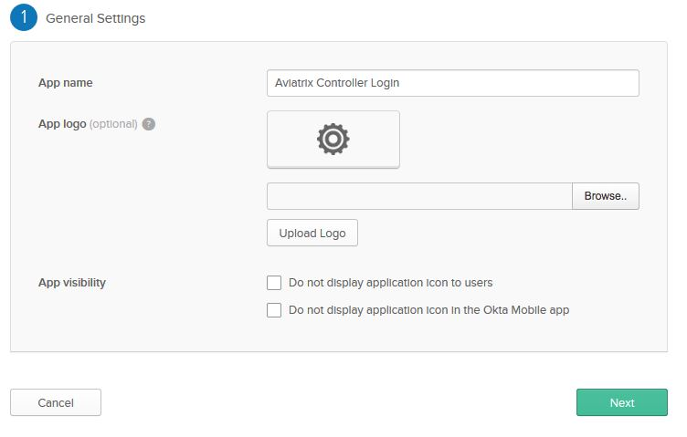
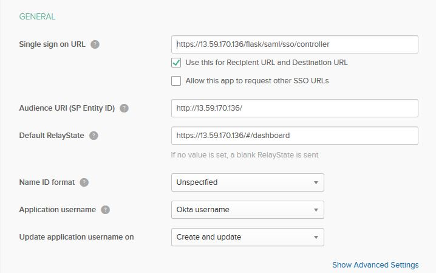
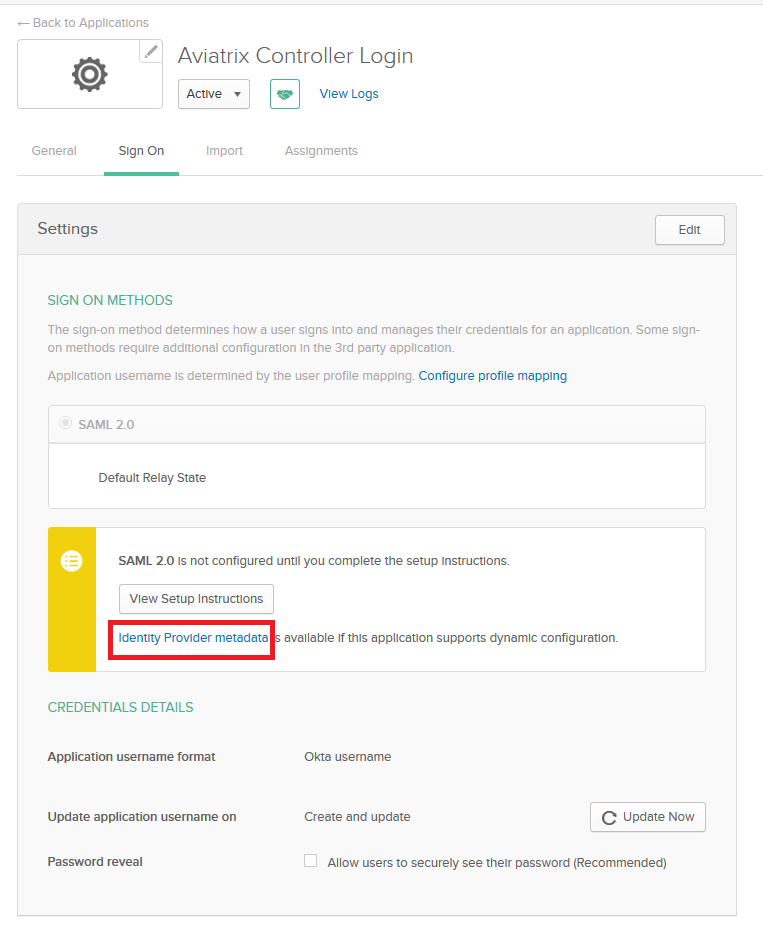
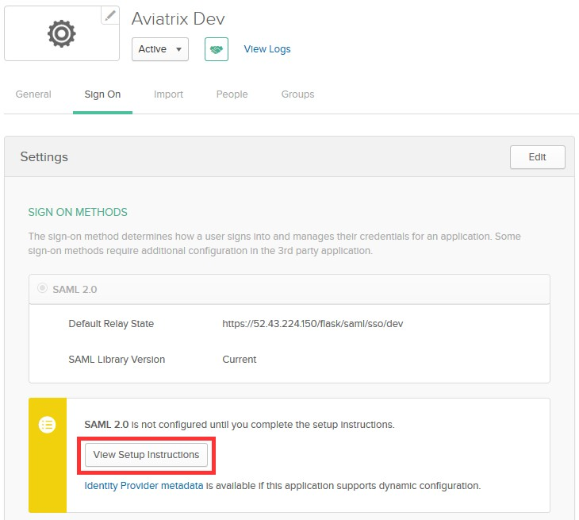
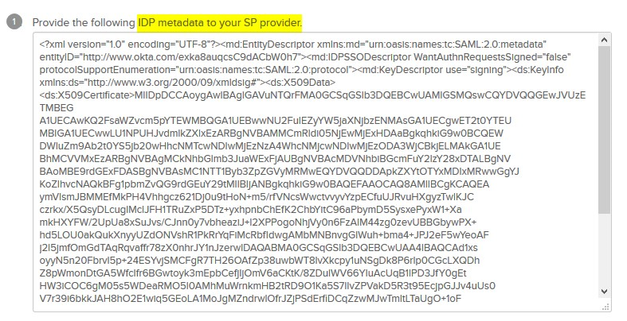
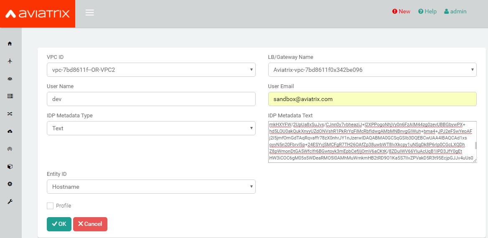
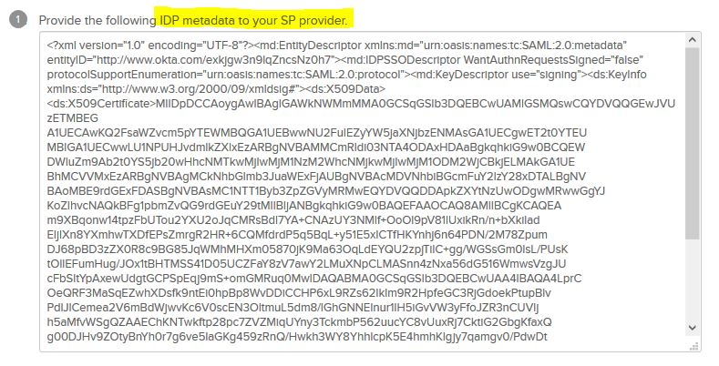

.. meta::
   :description: Aviatrix User SSL VPN Okta SAML Configuration
   :keywords: Okta, SAML, user vpn, okta saml, Aviatrix, OpenVPN

.. toctree::
   :numbered:

==============================================================================
Okta IdP for SAML Integration
==============================================================================

Overview
------------

This guide provides an example on how to configure Okta as an IdP for an Aviatrix SAML SP (endpoint). When SAML client is used, your Aviatrix controller acts as the Identity Service Provider (ISP) that redirects browser traffic from client to IdP (e.g., Okta) for authentication.

Before configuring SAML integration between Aviatrix and Okta, make sure you have a valid Okta account with administrator access.

Configuration Steps
-------------------

Follow these steps to configure Aviatrix to authenticate against your Okta IdP:

Step 1. Create a `temporary Aviatrix SP Endpoint <#aviatrix-endpoint>`__ in the Aviatrix Controller

Step 2. Create an `Okta SAML App <#okta-saml-app>`__ for Aviatrix in the Okta Portal

Step 3. Retrieve `Okta IdP metadata <#okta-idp-metadata>`__

Step 4. Update `Aviatrix SP Endpoint <#okta-update-saml-endpoint>`__ in the Aviatrix Controller

Step 5. `Test the Integration <#okta-test-integration>`__ is Set Up Correctly

.. _aviatrix_endpoint:

Step 1. Create an Aviatrix SP Endpoint
########################################

Visit one of the following links based on your use case and follow step1 (Create temporary Aviatrix SP Endpoint for Aviatrix) from the link's Configuration section:

  If integrating Okta IdP with `Controller Login SAML Config <https://docs.aviatrix.com/HowTos/Controller_Login_SAML_Config.html#config-31>`_

  If integrating Okta IdP with `OpenVPN with SAML Authentication <https://docs.aviatrix.com/HowTos/VPN_SAML.html#config-31>`_

.. _okta_saml_app:

Step 2. Create an Okta SAML App for Aviatrix
############################################

.. note::

   This step is usually done by the Okta Admin.

#. Login to the Okta Admin portal
#. Follow `Okta documentation <https://developer.okta.com/standards/SAML/setting_up_a_saml_application_in_okta>`__ to create a new application.

   +----------------+----------------+
   | Field          | Value          |
   +================+================+
   | Platform       | Web            |
   +----------------+----------------+
   | Sign on method | SAML 2.0       |
   +----------------+----------------+

   |image0|

#. General Settings

   +----------------+-----------------+----------------------------------------+
   | Field          | Value           | Description                            |
   +================+=================+========================================+
   | App name       | Aviatrix        | This can be any value.  It will be     |
   |                |                 | displayed in Okta only.                |
   +----------------+-----------------+----------------------------------------+
   |                | Aviatrix logo:  | Aviatrix logo (optional)               |
   |                |                 |                                        |
   | App logo       | | |logoAlias1|_ |                                        |
   |                | | |logoAlias2|_ |                                        |
   +----------------+-----------------+----------------------------------------+
   | App visibility | N/A             | Leave both options unchecked           |
   +----------------+-----------------+----------------------------------------+

   |image1|

#. SAML Settings

   * General

   +----------------------+----------------------------------------------------+
   | Field                | Value                                              |
   +======================+====================================================+
   | Single sign on URL   | ``https://[host]/flask/saml/sso/[Endpoint Name]``  |
   +----------------------+----------------------------------------------------+
   | Audience URI         | ``https://[host]/``                                |
   | (SP Entity ID)       |                                                    |
   +----------------------+----------------------------------------------------+
   | Default RelayState   | ``https://[host]/#/dashboard``                     |
   +----------------------+----------------------------------------------------+
   | Name ID format       | Unspecified                                        |
   +----------------------+----------------------------------------------------+
   | Application username | Okta username                                      |
   +----------------------+----------------------------------------------------+

   ``[host]`` is the hostname or IP of your Aviatrix controller.

   ``[Endpoint Name]`` is an arbitrary identifier.  This same value should be used when configuring SAML in the Aviatrix controller.
   The example uses ``aviatrix_saml_controller`` for ``[Endpoint Name]``
   
   ``https://[host]/#/dashboard`` must be set as the Default RelayState so that after SAML authenticates, user will be redirected to dashboard.

   * Attribute Statements

   +----------------+-----------------+--------------------------------------+
   | Name           | Name format     | Value                                |
   +================+=================+======================================+
   | FirstName      | Unspecified     | user.firstName                       |
   +----------------+-----------------+--------------------------------------+
   | LastName       | Unspecified     | user.lastName                        |
   +----------------+-----------------+--------------------------------------+
   | Email          | Unspecified     | user.email                           |
   +----------------+-----------------+--------------------------------------+

   |image2|

.. _okta_idp_metadata:

Step 3. Retrieve Okta IdP metadata
##################################

.. note::
   This step is usually completed by the Okta admin.

#. After the application is created in Okta, go to the `Sign On` tab for the application.

#. Copy the URL from the *Identity Provider metadata* link. This value will be used to configure the Aviatrix SP Endpoint.

|image4|

3. Assign the application to your account

|image8|

.. _okta_update_saml_endpoint:

Step 4. Update Aviatrix SP Endpoint
###################################

.. note::

   This step is usually completed by the Aviatrix admin.
   Okta IdP provides IdP Metadata through text or URL obtained in `Retrieve Okta IdP metadata (Step 3) <#okta-idp-metadata>`_.

Continue with updating Aviatrix SAML Endpoint by visiting one of the following links based on your use case:

#. If integrating Okta IdP with `Controller Login SAML Config <https://docs.aviatrix.com/HowTos/Controller_Login_SAML_Config.html#config-34>`_
#. If integrating Okta IdP with `OpenVPN with SAML Authentication <https://docs.aviatrix.com/HowTos/VPN_SAML.html#config-34>`_

   +-------------------------+-------------------------------------------------+
   | Field                   | Value                                           |
   +=========================+=================================================+
   | Endpoint Name           | ``[Endpoint Name]`` (Use the same name you entered    |
   |                         | in the Okta Application previously)             |
   +-------------------------+-------------------------------------------------+
   | IdP Metadata Type       | Text                                            |
   +-------------------------+-------------------------------------------------+
   | IdP Metadata Text/URL   | ``URL copied from Okta`` (IdP metadata URL)     |
   +-------------------------+-------------------------------------------------+
   | Entity ID               | Select `Hostname`                               |
   +-------------------------+-------------------------------------------------+
   | Access                  | Select admin or read-only access                |
   +-------------------------+-------------------------------------------------+
   | Custom SAML Request     | Unchecked                                       |
   | Template                |                                                 |
   +-------------------------+-------------------------------------------------+

.. note::
   Each endpoint only supports one type of access. If you need admin and read-only access, create two separate SAML apps.
   `Hostname` is the default for Entity ID, but if you have other apps using the same hostname, use a custom Entity ID.

.. _okta_test_integration:

Step 5. Test the Integration
#############################

.. tip::
  Be sure to assign users to the new application in Okta prior to validating.  If you do not assign your test user to the Aviatrix SAML application, you will receive an error.

Continue with testing the integration by visiting one of the following links based on your use case:

1. If integrating Okta IdP with `Controller Login SAML Config <https://docs.aviatrix.com/HowTos/Controller_Login_SAML_Config.html#config-35>`_
  #. Click `Settings` in the left navigation menu
  #. Select `Controller`
  #. Click on the `SAML Login` tab
2. If integrating Okta IdP with `OpenVPN with SAML Authentication <https://docs.aviatrix.com/HowTos/VPN_SAML.html#config-35>`_
  #. Expand `OpenVPN®` in the navigation menu and click `Advanced`
  #. Stay on the `SAML` tab

You can quickly validate that the configuration is complete by clicking on the **Test** button next to the SAML endpoint.

Configure Okta for Multifactor Authentication (OPTIONAL)
########################################################

Once you have successfully configured Okta IdP with Aviatrix SP, you can configure Okta for Multifactor Authentication.

Please read this `article <https://support.okta.com/help/Documentation/Knowledge_Article/Multifactor-Authentication-1320134400>`__ from Okta on Multifactor setup.

See this `article <https://support.okta.com/help/Documentation/Knowledge_Article/Configuring-Duo-Security-734413457>`__ if you're interested in using DUO in particular.

OpenVPN is a registered trademark of OpenVPN Inc.

.. |logoAlias1| replace::  Aviatrix logo with red background
.. _logoAlias1: https://a.aviatrix.com/news/press-kit/logo-aviatrix-reverse.zip

.. |logoAlias2| replace:: Aviatrix logo with transparent background
.. _logoAlias2: https://a.aviatrix.com/news/press-kit/logo-aviatrix.zip

.. |image0| image:: SSL_VPN_Okta_SAML_media/image0.png

.. |image3| image:: SSL_VPN_Okta_SAML_media/image3.png

.. |imageControllerNavOpenVPNAdvanced| image:: SSL_VPN_Okta_SAML_media/OpenVPN_Advanced_SAML_AddNew.png
   :scale: 50%

.. disqus::
