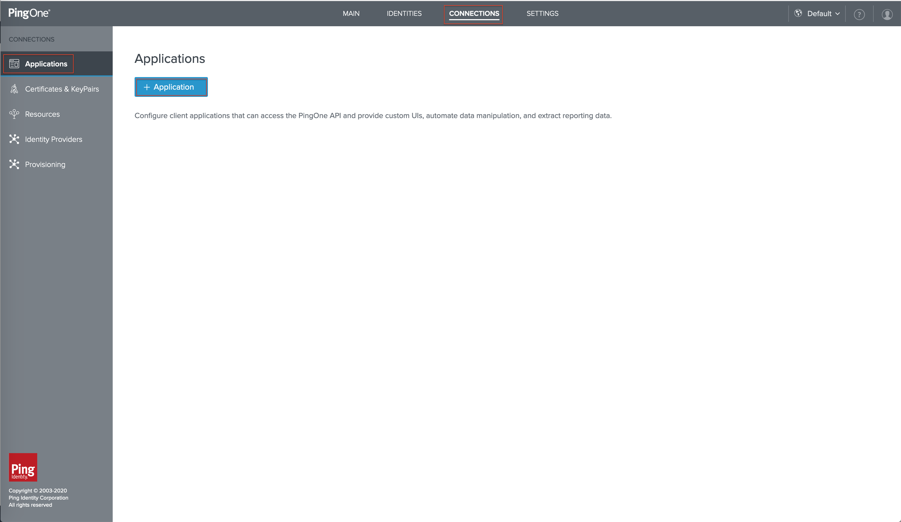
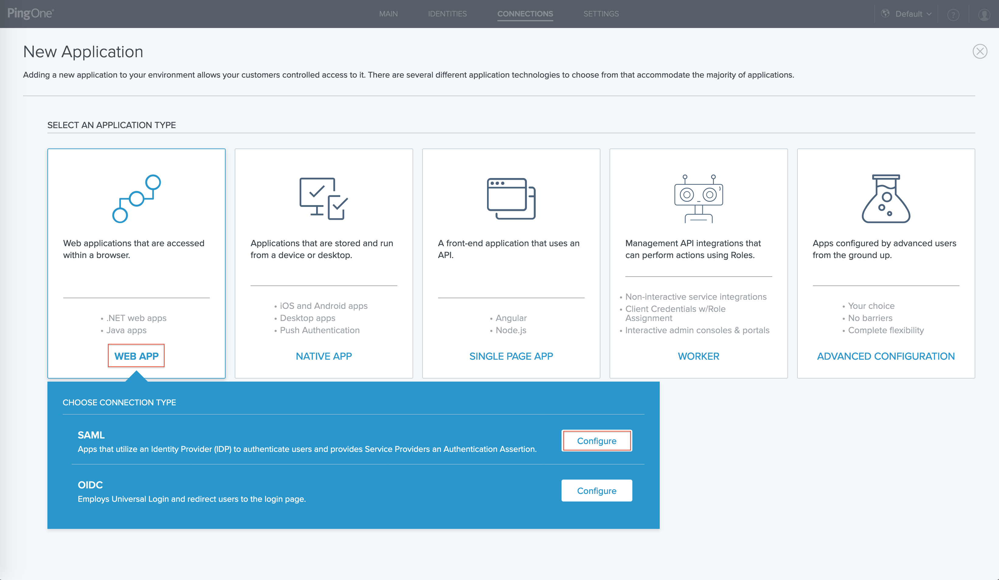
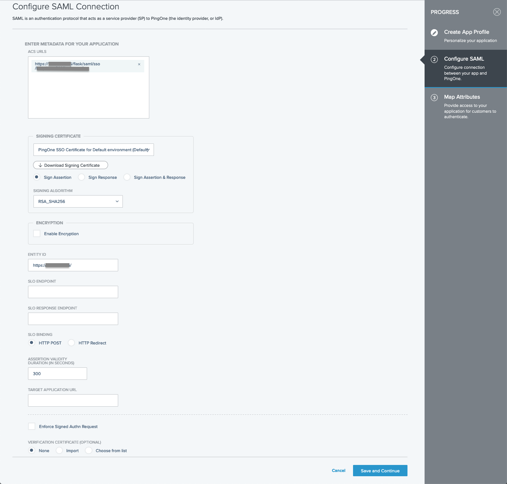
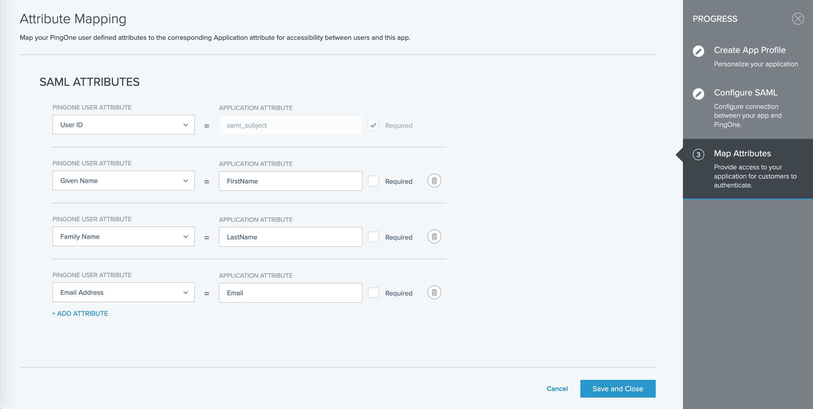
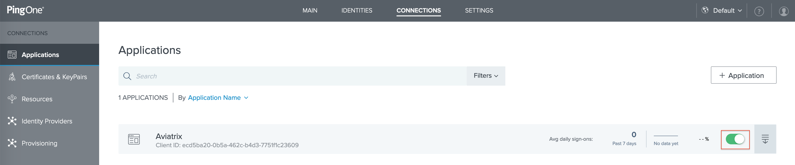
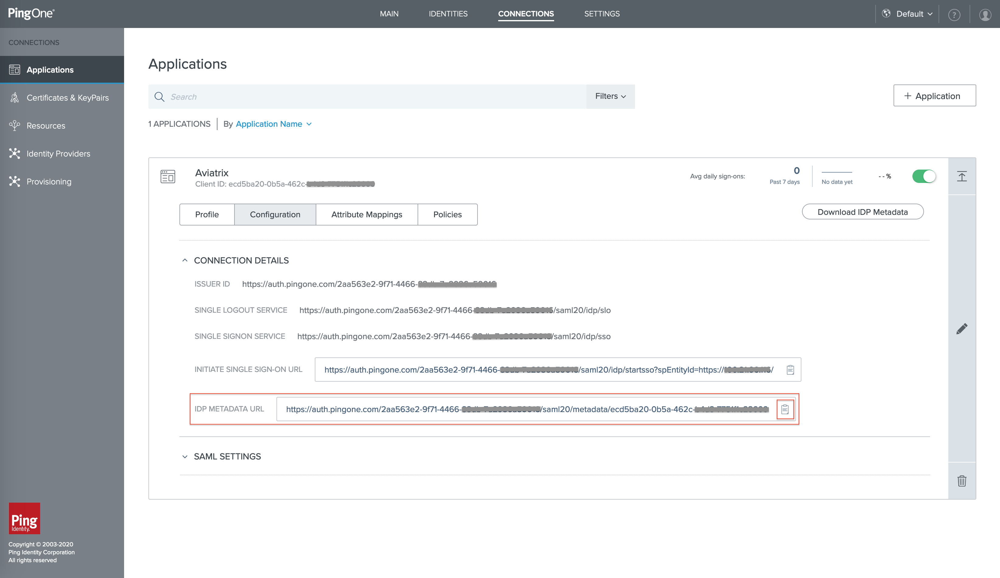
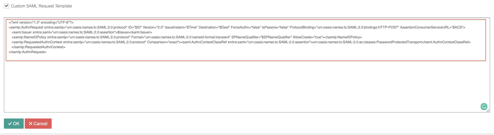

.. meta::
   :description: PingOne for Customers for SAML Integration 
   :keywords: PingOne, SAML, user vpn, PingOne saml, Aviatrix, OpenVPN, Controller

.. toctree::
   :numbered:

==============================================================================
PingOne for Customers IdP for SAML Integration
==============================================================================

Overview
------------

This guide provides an example on how to configure PingOne for Customers as an IdP for an Aviatrix SAML SP (endpoint). When SAML client is used, your Aviatrix controller acts as the Identity Service Provider (ISP) that redirects browser traffic from client to IdP (e.g., PingOne for Customers) for authentication.

Before configuring SAML integration between Aviatrix and PingOne for Customers, make sure you have a valid PingOne for Customers account with administrator access.

Configuration Steps
-------------------

Follow these steps to configure Aviatrix to authenticate against your PingOne for Customers IdP:

Step 1. Create a `temporary Aviatrix SP Endpoint <#aviatrix-endpoint>`__ in the Aviatrix Controller

Step 2. Create a `PingOne Web SAML App <#pingone-web-saml-app>`__ for Aviatrix in the PingOne for Customers Portal

Step 3. Retrieve `PingOne IdP metadata URL <#pingone-idp-metadata>`__

Step 4. Update `Aviatrix SP Endpoint <#pingone-update-saml-endpoint>`__ in the Aviatrix Controller

Step 5. `Test the Integration <#pingone-test-integration>`__ is Set Up Correctly

.. _aviatrix_endpoint:

Step 1. Create an Aviatrix SP Endpoint
########################################

Visit one of the following links based on your use case and follow step1 (Create temporary Aviatrix SP Endpoint for Aviatrix) from the link's Configuration section:

  If integrating PingOne IdP with `Controller Login SAML Config <https://docs.aviatrix.com/HowTos/Controller_Login_SAML_Config.html#config-31>`_

  If integrating PingOne IdP with `OpenVPN with SAML Authentication <https://docs.aviatrix.com/HowTos/VPN_SAML.html#config-31>`_

.. _pingone-web-saml-app:

Step 2. Create a PingOne Web SAML App for Aviatrix
###############################################

.. note::

   This step is usually done by the PingOne for Customers Admin.

#. Login to the PingOne Admin portal

#. Follow `PingOne documentation <https://docs.pingidentity.com/bundle/p14c/page/lyd1583255784891.html>`__ to add a Web SAML application

#. On the top of the page, click Connections.
   
#. On the left, click Applications and then + Application.

   |pingone_idp_adding_web_saml_app_01|
      
#. Click WEB APP, and then for SAML, click Configure.
   
   |pingone_idp_adding_web_saml_app_02|
   
#. Create the application profile by entering the following information:

   +----------------------+---------------------------------------------------------+
   | Field                | Value                                                   |
   +======================+=========================================================+
   | Application name     | A unique identifier for the application.                |
   +----------------------+---------------------------------------------------------+
   | Description          | (optional)A brief characterization of the application.  |
   +----------------------+---------------------------------------------------------+
   | Icon                 | (optional)A pictorial representation of the application.|
   |                      | Use a file up to 1MB in JPG, JPEG, GIF, or PNG format.  |
   +----------------------+---------------------------------------------------------+

#. For Configure SAML Connection, enter the following: 

   +------------------------------+---------------------------------------------------+
   | Field                        | Value                                             |
   +------------------------------+---------------------------------------------------+
   | ACS URLs                     | ``https://[host]/flask/saml/sso/[Endpoint Name]`` |
   +------------------------------+---------------------------------------------------+
   | Signing certificate          | PingOne SSO Certificate for Default environment   |
   +------------------------------+---------------------------------------------------+
   | Signing                      | Sign Assertion                                    |
   +------------------------------+---------------------------------------------------+
   | Signing Algorithm            | RSA_SHA256                                        |
   +------------------------------+---------------------------------------------------+
   | Encryption                   | DISABLED                                          |
   +------------------------------+---------------------------------------------------+
   | Entity ID                    | ``https://[host]/``                               |
   +------------------------------+---------------------------------------------------+
   | SLO endpoint                 | Not Specified                                     |
   +------------------------------+---------------------------------------------------+
   | SLO response endpoint        | Not Specified                                     |
   +------------------------------+---------------------------------------------------+
   | SLO binding                  | HTTP POST                                         |
   +------------------------------+---------------------------------------------------+
   | Assertion validity duration  | 300                                               |
   +------------------------------+---------------------------------------------------+
   | Target Application URL       | Not Specified                                     |
   +------------------------------+---------------------------------------------------+
   | Enforce signed Authn request | Disabled                                          |
   +------------------------------+---------------------------------------------------+
   | Verification certificate     | No Verification Certificates Selected             |
   +------------------------------+---------------------------------------------------+

   .. note::
   
      ``[host]`` is the hostname or IP of your Aviatrix controller.  For example, ``https://controller.demo.aviatrix.live``

      ``[Endpoint Name]`` is an arbitrary identifier.  This same value should be used when configuring SAML in the Aviatrix controller.
      
      ``[Entity ID]`` is using ``https://[host]/`` as default if you select `Hostname` option when configuring SAML in the Aviatrix controller.
      
   |pingone_idp_configuring_saml_connection|
      
#. Click Save and Continue.

#. For attribute mapping, click the button "+ADD ATTRIBUTE" and then select "PingOne Attribute" to map PingOne user attribute to an attribute in this application as below.

   +------------------------+-----------------------+
   | PINGONE USER ATTRIBUTE | APPLICATION ATTRIBUTE |
   +------------------------+-----------------------+
   | User ID                | saml_subject          |
   +------------------------+-----------------------+
   | Given Name             | FirstName             |
   +------------------------+-----------------------+
   | Family Name            | LastName              |
   +------------------------+-----------------------+
   | Email Address          | Email                 |
   +------------------------+-----------------------+
   
   .. note::
   
      Notes: User ID is a default required in PingOne

   |pingone_idp_configuring_attribute_mapping|

#. Click Save and Close.

#. Enable the WEB SAML APP

   |pingone_idp_enable|
   
.. _pingone_idp_metadata:

Step 3. Retrieve PingOne IdP metadata
#####################################

.. note::

   This step is usually completed by the PingOne for Customers admin.

#. After the application is created in PingOne, click Connections on the top of the page and then click Applications on the left.

#. Locate the Web SAML application that we just created.

#. Click the details icon to expand the Web SAML application and then click the button "Configuration". 

#. Copy the URL from the IDP Metadata URL from the CONNECTION DETAILS. This value will be used to configure the Aviatrix SP Endpoint.

  |pingone_idp_retrieve_idp_metadata_url|

.. _pingone_update_saml_endpoint:

Step 4. Update Aviatrix SP Endpoint
###################################

.. note::   
   This step is usually completed by the Aviatrix admin. PineOne IdP provides IdP Metadata through URL obtained in Retrieve `PingOne IdP metadata URL <#pingone-idp-metadata>`__ step. PingOne for Customers IdP requires a custom SAML request template.

Continue with updating Aviatrix SAML Endpoint by visiting one of the following links based on your use case:

#. If integrating PineOne IdP with `Controller Login SAML Config <https://docs.aviatrix.com/HowTos/Controller_Login_SAML_Config.html#config-34>`_

#. If integrating PineOne IdP with `OpenVPN with SAML Authentication <https://docs.aviatrix.com/HowTos/VPN_SAML.html#config-34>`_

   +-------------------------+-------------------------------------------------+
   | Field                   | Value                                           |
   +=========================+=================================================+
   | Endpoint Name           | ``[Endpoint Name]`` (Use the same name you      |
   |                         | entered in the PingONe Application previously)  |
   +-------------------------+-------------------------------------------------+
   | IdP Metadata Type       | URL                                             |
   +-------------------------+-------------------------------------------------+
   | IdP Metadata URL        | ``URL copied from PingOne`` (IdP metadata URL)  |
   +-------------------------+-------------------------------------------------+
   | Entity ID               | Select `Hostname`                               |
   +-------------------------+-------------------------------------------------+
   | Custom SAML Request     | Check the box and either copy the below format  |
   | Template                | into the prompt text box or modify it           |
   +-------------------------+-------------------------------------------------+

   |pingone_idp_reformat_custom_saml_request_template|
   
.. code-block:: xml

   <?xml version="1.0" encoding="UTF-8"?>
   <samlp:AuthnRequest xmlns:samlp="urn:oasis:names:tc:SAML:2.0:protocol" ID="$ID" Version="2.0" IssueInstant="$Time" Destination="$Dest" ForceAuthn="false" IsPassive="false" ProtocolBinding="urn:oasis:names:tc:SAML:2.0:bindings:HTTP-POST" AssertionConsumerServiceURL="$ACS">
      <saml:Issuer xmlns:saml="urn:oasis:names:tc:SAML:2.0:assertion">$Issuer</saml:Issuer>
      <samlp:NameIDPolicy xmlns:samlp="urn:oasis:names:tc:SAML:2.0:protocol" Format="urn:oasis:names:tc:SAML:2.0:nameid-format:transient" SPNameQualifier="$SPNameQualifier" AllowCreate="true"></samlp:NameIDPolicy>
      <samlp:RequestedAuthnContext xmlns:samlp="urn:oasis:names:tc:SAML:2.0:protocol" Comparison="exact"><saml:AuthnContextClassRef xmlns:saml="urn:oasis:names:tc:SAML:2.0:assertion">urn:oasis:names:tc:SAML:2.0:ac:classes:PasswordProtectedTransport</saml:AuthnContextClassRef>
      </samlp:RequestedAuthnContext>
   </samlp:AuthnRequest>
   
.. _pingone_test_integration:

Step 5. Test the Integration
#############################

Continue with testing the integration by visiting one of the following links based on your use case:

1. If integrating PingOne IdP with `Controller Login SAML Config <https://docs.aviatrix.com/HowTos/Controller_Login_SAML_Config.html#config-35>`_

   #. Click `Settings` in the left navigation menu
   
   #. Select `Controller`

   #. Click on the `SAML Login` tab

2. If integrating PingOne IdP with `OpenVPN with SAML Authentication <https://docs.aviatrix.com/HowTos/VPN_SAML.html#config-35>`_
  
   #. Expand `OpenVPN®` in the navigation menu and click `Advanced`
  
   #. Stay on the `SAML` tab

You can quickly validate that the configuration is complete by clicking on the **Test** button next to the SAML endpoint.

OpenVPN is a registered trademark of OpenVPN Inc.

.. |logoAlias1| replace::  Aviatrix logo with red background
.. _logoAlias1: https://www.aviatrix.com/news/press-kit/logo-aviatrix.png

.. |logoAlias2| replace:: Aviatrix logo with transparent background
.. _logoAlias2: https://www.aviatrix.com/images/logo-reverse.png

.. |imageControllerNavOpenVPNAdvanced| image:: SAML_Integration_PingOne_IdP_media/OpenVPN_Advanced_SAML_AddNew.png
   :scale: 50%

.. disqus::
