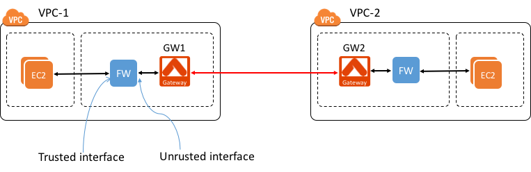

================
Service Chaining
================

Service Chaining is the capability to combine multiple services in
tandem in a VPC. For example, if EC2-initiated traffic needs to be
inspected before being sent to another VPC, you can do so by deploying a
third-party firewall function along with Aviatrix peering gateway, as
shown in the diagram below.

|image0|

In the diagram, the firewall (FW) has trusted interface and untrusted
interface (WAN). User EC2 instances are on private subnets. These
private subnets have default gateway points to the firewall’s trusted
interface (so that all egress traffic are sent through the firewall). To
accomplish this, you need to go to AWS console, under VPC route tables
create an route entry 0.0.0.0/0 to point firewall’s untrusted interface.
Note this untrusted interface should be on the same subnet as Aviatrix
peering gateway.

Configuration Workflow
======================

Before you start, make sure you have the latest software by checking the
Dashboard. If an alert message (!New) appears, click !New to download
the latest software.

We assume you already know how to deploy Aviatrix solution, if you need
help, check out this `reference
design <https://s3-us-west-2.amazonaws.com/aviatrix-download/Cloud-Controller/Cloud+Networking+Reference+Design.pdf>`__.

Firewall function configuration is outside the scope of the reference
design.

The Service Chaining configuration workflow is as follows, with major
steps highlighted.

1. Create a gateway in VPC-1

   Go to Gateway -> New Gateway to create a gateway in VPC-1. Note the
   gateway must be launched on the same subnet as the firewall untrusted
   interface.

2. Enable Service Chaining in VPC-1

   Go to Advanced Config -> Service Chaining -> Add New.

-  For Route Table ID field, select the route table that associates the
   subnet where firewall untrusted interface and gateway are deployed
   on.

-  For Downstream IP field, type the private IP address of the firewall
   untrusted interface.

1. Repeat step 1 for VPC-2.

2. Repeat step 2 if VPC-2 also needs firewall function.

3. Create VPC Peering

    Go to Peering -> Encrypted Peering +New Peering, enter the two
    gateways to create the peering.

1. All EC2 initiated traffic from VPC-1 that is destined to VPC-2 will
   go through firewall function for inspection before they are sent to
   VPC-2.

2. Note: You can create more peering connections from VPC-1, all traffic
   will be inspected.

3. For support, please open a support ticket at `Aviatrix Support Portal <https://support.aviatrix.com>`_

4. Enjoy!

.. add in the disqus tag

.. disqus::
