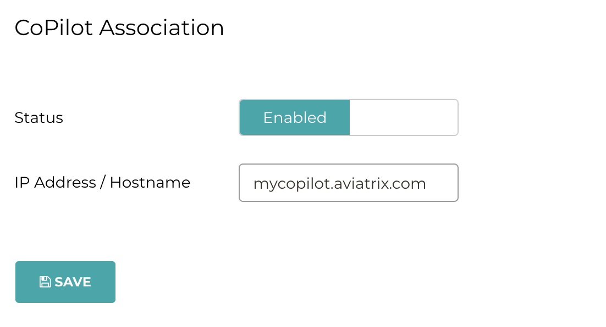

.. meta::
   :description: Documentation for associating CoPilot with controller
   :keywords: CoPilot, association

###################################
CoPilot
###################################
This document describes the **CoPilot** configurations under Settings in Aviatrix Controller.

CoPilot Association
===========================
When “Status” is enabled, the CoPilot with the "IP Address/Hostname" you specify is associated with the Controller. 

**IP Address/Hostname**

Enter the public or private IP address of your CoPilot instance.

The IP address specified here is used for connectivity between the controller and CoPilot for intra-platform communication (such as API message exchanges). 

If Copilot is located in the same VPC/VNet as your controller, specifying a private IP can increase bandwidth and potentially save on cost. 

 
**Public IP (Optional)**

If you specified the private IP address of your CoPilot instance in "IP Address/Hostname", you can optionally enter the public IP address of your CoPilot instance here. The public IP address is used for external administration access to CoPilot, used for switching between Controller and CoPilot (for your browser to open a new tab when opening CoPilot from the Controller app icon). If this field is blank, the IP address specified in “IP Address/Hostname” is used for administration access to CoPilot.

|image0|

CoPilot Security Group Management
===================================
CoPilot Security Group Management is available starting from Controller release 6.8. The feature is available for AWS and Azure CSPs.

When “Status” is enabled (default), the Controller creates a security group for the specified CoPilot virtual machine to manage its inbound security-group rules. 

The Controller adds rules to the security group for each gateway IP for the following: 

- UDP port 5000 (default) — Enable Syslog for CoPilot Egress FQDN & Audit Data (from each gateway). Gateways send remote syslog to CoPilot.

- TCP port 5000 (default) — (**If using private mode**) Enable Syslog for CoPilot Egress FQDN & Audit Data (from each gateway). Gateways send remote syslog to CoPilot.

- UDP port 31283 (default, port is configurable) — Enable Netflow for CoPilot FlowIQ Data (from each gateway). Gateways send Netflow to CoPilot.

The Controller adds the above rules for:

- New gateways launched from the Controller *after* the feature is enabled.

- Existing gateways launched from the Controller *before* the feature was enabled.

When “Status” is disabled, the Controller removes all gateway-specific inbound rules that it previously added to the CoPilot security group.  

**Attention:** The CoPilot Security Group Management feature is automatically disabled if the AWS security group quota or Azure Network Security Group (NSG) rule limit is reached. In this case, you must request an increase for the security group quota/limit from AWS/Azure and then re-enable the CoPilot Security Group Management feature. **It is recommended that you monitor and increase the AWS/Azure security group quota before the rule limit is reached**. Please refer to the AWS/Azure product documentation for information about viewing security group quotas/limits.   

The CoPilot Security Group Management feature adds gateway IP rules to customer-attached CoPilot security groups as well as CoPilot-created security groups. CoPilot comes with a base security group when it is first launched; the feature does not remove rules that were manually added to the base security group.

To enable the CoPilot Security Group Management feature:

1.  In your Controller, go to Settings > CoPilot > CoPilot Association and set the slider to **Enabled**. Enter the CoPilot private IP address in the IP Address/Hostname field, its public IP address in the Public IP (Optional) field, and click **Save**.

2.  On the same page, for CoPilot Security Group Management, verify the slider is set to **Enabled**.

3.  In **Cloud Type**, select the CSP in which your CoPilot is deployed (AWS or Azure).

4.  In **Access Account Name**, select the Controller account.

5.  In **Region**, select the region in which your CoPilot is deployed.

6.  In **VPC ID**, select the ID of the VPC/VNet in which your CoPilot is located.

7.  In **CoPilot Instance**, select the ID of the CoPilot instance for which you want the controller to manage security groups. 

    For a clustered CoPilot deployment, this is the ID of the Main Server CoPilot instance. 

    You can log in to the CSP portal to obtain the instance ID of the CoPilot instance. After you select the VPC in the previous step, all the instances (virtual machines) in that VPC are shown in the drop down menu. From that list, you can identify the CoPilot instance (VM) that was created on the CSP environment.

8.  Click **Submit**. 

.. disqus::
