.. meta::
   :description: Setup PingOne for Customers web SAML app with Profile Attribute
   :keywords: Profile, PingOne, PingOne for Customers, SAML, user vpn, PingOne saml, Aviatrix, OpenVPN, Controller

===============================================================
Setup PingOne for Customers web SAML app with Profile Attribute
===============================================================

This guide demonstrates the use of the **Profile** attribute in **PingOne for Customers** so each SAML user can be assigned a different VPN profile.

How VPN profile works
---------------------

The VPN profiles defined at the **Controller/OpenVPN/Profiles** contain egress control policy.  They are attached to the VPN users defined at **Controller/OpenVPN/VPN Users** for controlling their VPN egress traffic. Users without a profile is the same as having a profile with an **allow-all** policy, i.e., their egress traffic are unrestricted.

For SAML VPN, the SAML user definition at the IDP has a **Profile** attribute for specifying a VPN profile, overriding the corresponding user's VPN profile assigned at the controller. If unspecified, the corresponding VPN profile assigned at the controller will be used.

.. _pingone_for_customers_setup:

Setup PingOne for Customers Profile attribute
---------------------------------------------

#. `Define a new User attribute <#pingone_for_customers_new_user_attribute>`__ in the PingOne for customers portal for storing the VPN profile name.

#. `Define an attribute mapping <#pingone_for_customers_map_attribute>`__ for the new attribute using the name **Profile** so that the web SAML application knows how to compose the **Profile** information in the SAML response.
   
#. `Assign VPN profile <#pingone_for_customers_user_fill_attribute>`__ to each SAML user.

#. `Validate <#pingone_for_customers_validation>`__ the setup.

.. _pingone_for_customers_new_user_attribute:

Define a new User attribute
----------------------------

.. note::

   This step is usually completed by the PingOne for Customers Admin.
   
#. Login to the PingOne Admin portal

#. Follow `PingOne documentation <https://docs.pingidentity.com/bundle/p14c/page/zhb1564020491029.html>`__ to add an User attribute. 

#. On the top of the page, click Settings.

#. On the left, under Directory, click Attributes.

#. Click + Add Attribute.

   |image0|

#. Click DECLARED

#. Click button "Next"

   |image0|
   
#. Enter the following information to create custom user attribute:

+-----------------------+---------------+---------------------------------------------------------------------------+
| Field                 | Value         | Description                                                               |
+-----------------------+---------------+---------------------------------------------------------------------------+
| Name                  | accessprofile | A unique identifier for the attribute.                                    |
+-----------------------+---------------+---------------------------------------------------------------------------+
| Display name          | accessprofile | The name of the attribute as you want it to appear in the,user interface. |
+-----------------------+---------------+---------------------------------------------------------------------------+
| Description           | (optional)    | A brief characterization of the application.                              |
+-----------------------+---------------+---------------------------------------------------------------------------+
| Enforce unique values | Uncheck       | Option to require the attribute,values be unique across the environment   |
+-----------------------+---------------+---------------------------------------------------------------------------+

.. note::

   In this example, the new user attribute is named **accessprofile**.

#. Click Save and Close.

   |image0|

.. _pingone_for_customers_map_attribute:

Define an attribute mapping
---------------------------

.. note::

   This step is usually completed by the PingOne for Customers Admin.

#. On the top of the page, click Connections.

#. Click Applications on the left.

#. Locate the Web SAML application to add this custom User attribute.

#. Click the details icon to expand the Web SAML application, and then click the pencil icon.

#. Click the "Attribute Mappings"

#. For updating attribute mapping, click the button "+ADD ATTRIBUTE" and then select "PingOne Attribute" to map PingOne user attribute to an application attribute as below.

   +------------------------+-----------------------+
   | PINGONE USER ATTRIBUTE | APPLICATION ATTRIBUTE |
   +------------------------+-----------------------+
   | accessprofile          | Profile               |
   +------------------------+-----------------------+
   
.. note::

   The application attribute **Profile** is required to be an exact match so that Aviatrix Controller can process in the SAML response.
   
|image0|

.. _pingone_for_customers_user_fill_attribute:

Assign VPN profile to each SAML user
-------------------------------------

.. note::

   This step is usually completed by the PingOne for Customers Admin.

For each SAML application user, edit the user profile for assigning the VPN profile 

#. On the top of the page, click Identities.

#. Locate the user you want to edit. You can browse or search for users.

#. Click the details icon to expand the user you want to edit, and then click the pencil icon.

#. On the Profile tab, scroll down to the "OTHER" section

#. Find the new User attribute "accessprofile" and assign the VPN profile

.. note::

   In this example, the VPN profile defined at the controller is named **access-profile**.

|image0|

.. _pingone_for_customers_validation:

Validation
----------

Please refer to this `doc <https://docs.aviatrix.com/HowTos/Setup_Okta_SAML_Profile_Attribute.html#validation>`__ for more validation detail.

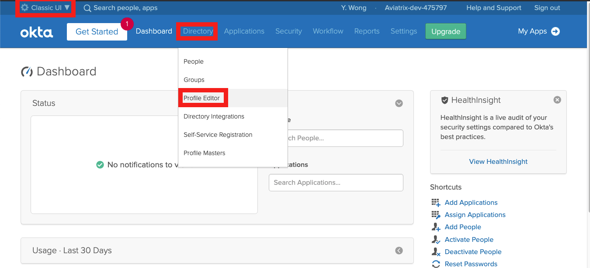

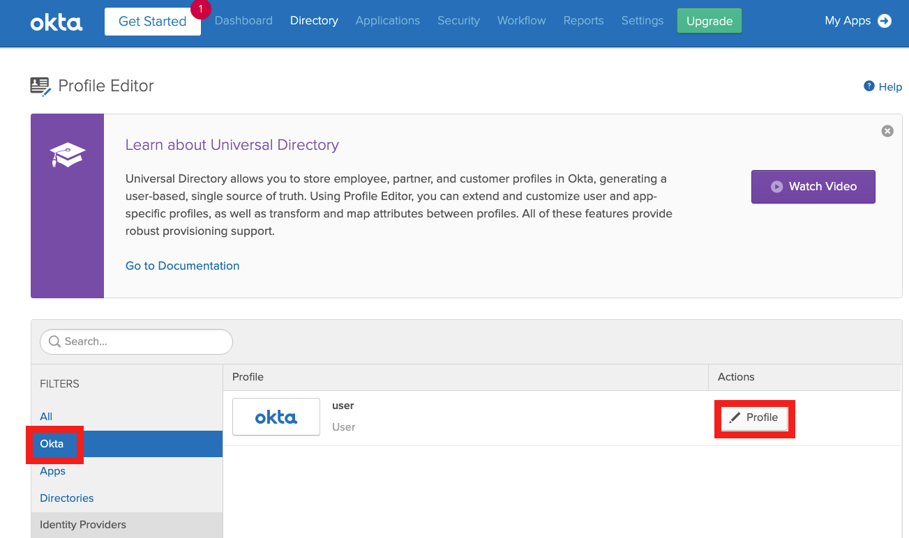

.. |profile_editor_add| image:: Setup_Okta_SAML_Profile_Attribute_media/profile_editor_add.png
   :scale: 70%

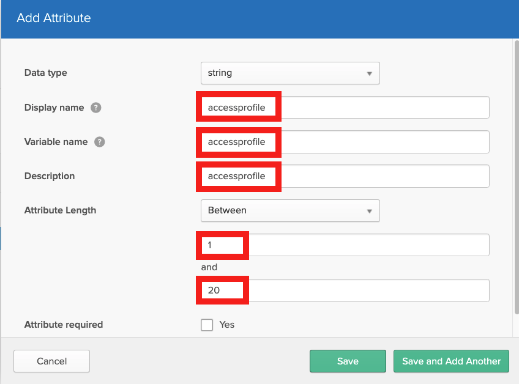

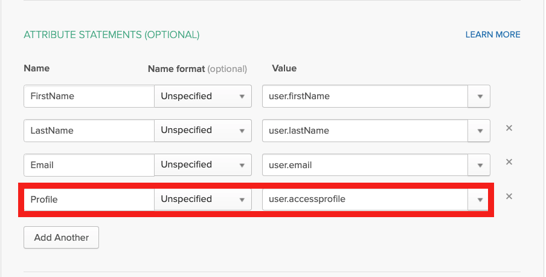

.. |add_profile_attribute_to_user| image:: Setup_Okta_SAML_Profile_Attribute_media/add_profile_attribute_to_user.png
   :scale: 70%

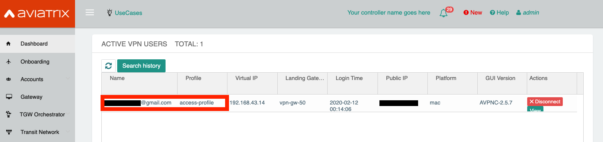

.. |browser_user_with_profile| image:: Setup_Okta_SAML_Profile_Attribute_media/browser_user_with_profile.png
   :scale: 70%

.. |dashboard_user_without_profile| image:: Setup_Okta_SAML_Profile_Attribute_media/dashboard_user_without_profile.png
   :scale: 70%

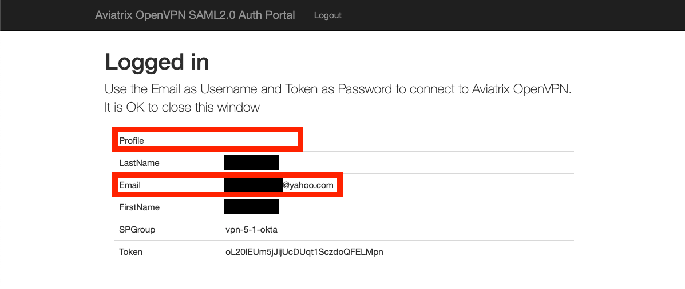

.. |vpn-5-1-okta| image:: Setup_Okta_SAML_Profile_Attribute_media/vpn-5-1-okta.png
   :scale: 70%

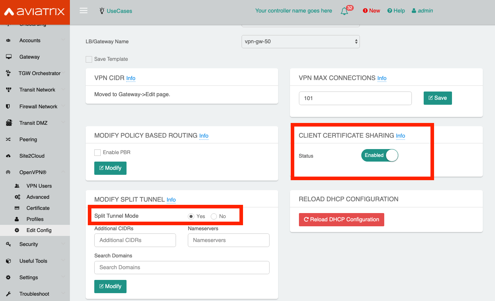

.. |default-profile| image:: Setup_Okta_SAML_Profile_Attribute_media/default-profile.png
   :scale: 70%

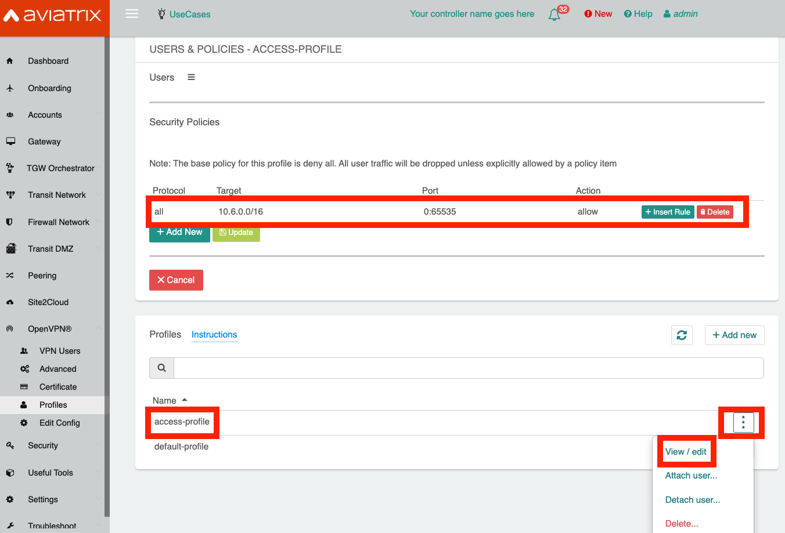

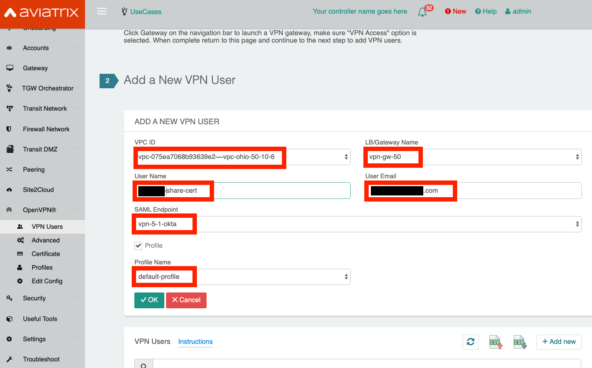

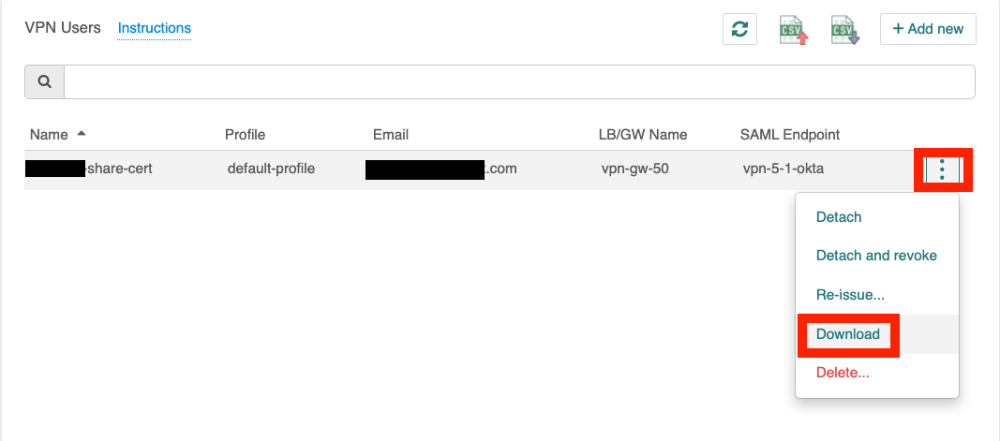

.. |add-person| image:: Setup_Okta_SAML_Profile_Attribute_media/add-person.png
   :scale: 70%

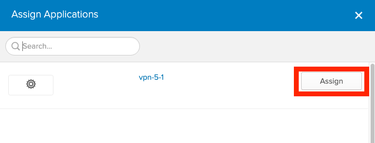

.. disqus::
