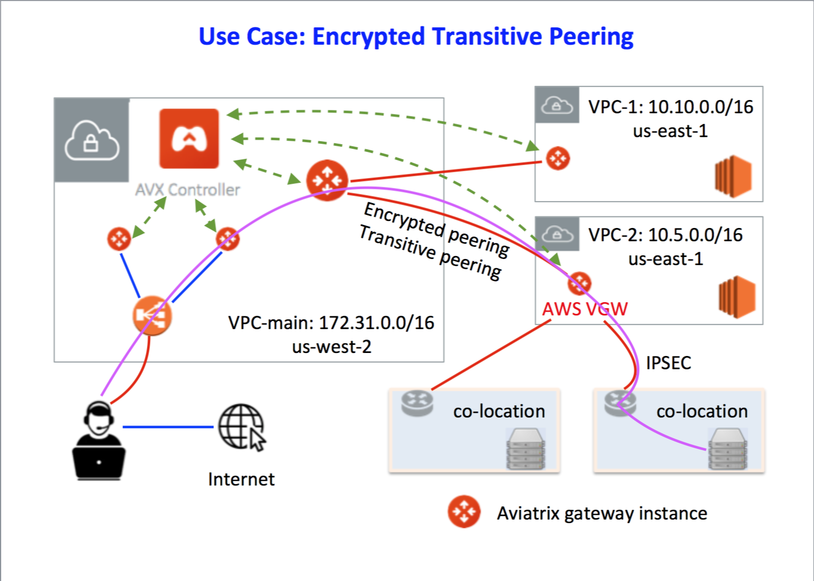

.. meta::
   :description: Encrypted Transitive Peering Ref Design
   :keywords: peering, encrypted peering, transitive peering, encrypted transitive, aviatrix

====================================
Encrypted Transitive Peering
====================================

As DevOps and applications can now run in Cloud Service Providers (CSPs) such as AWS, Azure, GCP, and OCI, it makes sense to have
your employees access the cloud directly with the following highlighted
benefits:

-  Lower latency. Rather than having your employees connect via VPN to
   your corporate office first and then access the cloud, you can provide a
   cloud VPN where they can access the CSP account directly.
-  Better Security. Traditional VPN servers do not support modern multi-factor authentication methods such as a combination of DUO Security, LDAP, and OKTA.
-  Few hardware gears to manage.

However, your business may require hosting some critical applications in
widespread co-locations. As a cloud infrastructure engineer, you need
to access these sites to check on the health of your servers and
applications. The challenge is to set up a system to enable secure
accessing abilities to both the cloud and co-locations.

Solution
========

Our solution is to leverage Aviatrix’s encrypted peering and encrypted
transitive peering capabilities to set up an end-to-end secure network.

In this example, a data center or co-location hosts some critical
customer facing applications. It connects to an AWS or GCP VPC/Azure VNet/OCI VCN for additional
processing, such as data analytics. The data center connects to a VPN Gateway, such as an AWS
VGW, with an IPsec tunnel. Employees and developers access VPC/VNet-1 and VPC/VNet-2
directly via Aviatrix CloudVPN and encrypted peering configuration. The
cloud infrastructure engineers need to access the servers in the
datacenter or co-location for maintenance and monitoring purposes. They
do so via an Aviatrix encrypted tunnel and Aviatrix encrypted transitive
tunnel configuration. The solution diagram is shown below.

|image0|

Configuration Workflow
======================

Before you start, make sure you have the latest software by checking the
Dashboard. If an alert message displays, click Upgrade to download the
latest software.

We assume here that you have created a management VPC/VNet-main
172.31.0.0/16, its corresponding VPN gateways with a load balancer (ELB/ALB/CLB) enabled. For more
information for this part of configuration, check out this `reference
design <https://s3-us-west-2.amazonaws.com/aviatrix-download/Cloud-Controller/Cloud+Networking+Reference+Design.pdf>`__.
If you configure split tunnel mode for VPN gateways, make sure to
include the co-location CIDRs in the additional CIDR field.

The encrypted transitive peering configuration workflow is as follows,
with major steps highlighted.

1. Create a gateway in VPC/VNet-2. Verify the gateway at Gateway > New Gateway. Make sure it has NAT enabled and VPN disabled (as you don’t need to
      enable VPN capability).
2. Create an encrypted peering between VPC/VNet-main and VPC/VNet-2.

Go to Peering > Encrypted Peering > New Peering. Make sure:

* At VPC/VNet Name 1's dropdown menu, select the peering gateway launched in VPC/VNet-main (note, this peering gateway is different from the VPN gateway).
* At VPC/VNet Name 2's dropdown menu, select the gateway launched in VPC/VNet-2.
* Click **Add**.

2. Create an encrypted transitive peering.

Go to Peering > Transitive Peering > New Peering. Make sure:

* At the Source VPC/VNet drop down menu, select the peering gateway launched in VPC/VNet-main (the same VPC/VNet gateway selected in the previous step).
* At Next Hop VPC/VNet drop down menu, select the gateway launched in VPC/VNet-2 (the same gateway for VPC/VNet-2 selected in the previous step).
* At Destination CIDR, fill in the destination CIDR of the co-location. For example, 10.12.0.0/24. Note this address should be unique across your network.

3. Repeat step 3 above for more co-locations.

For support, please open a support ticket at `Aviatrix Support Portal <https://support.aviatrix.com>`_.

For feature requests and feedback, click **Make a wish** at the bottom of each page.

.. disqus::
