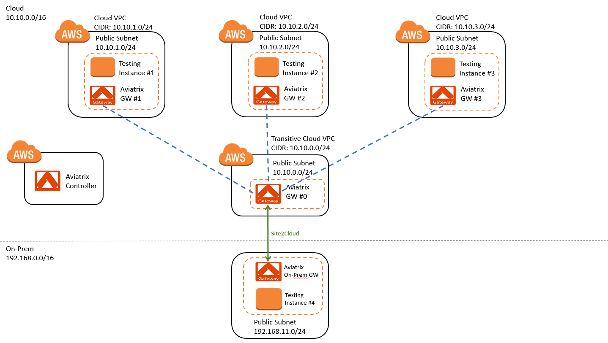

.. meta::
   :description: [TODO]
   :keywords: Site2cloud, site to cloud, aviatrix, ipsec vpn, tunnel, peering, encrypted peering, transitive peering, encrypted transitive, aviatrix

=====================================================
How to Build Scalable Transit VPC Architecture in AWS
=====================================================

1. Solution Overview
======================

Aviatrix provides a Transit VPC solution that is centrally managed and simple to deploy, as documented in `this link. <http://docs.aviatrix.com/Solutions/aviatrix_aws_transitvpc.html>`_. The solution requires no CCIE and crypto skills for maintenance and troubleshooting the network connectivity. 

One friction in this Transit VPC solution is that each time when a spoke VPC is stood up, the IPSEC tunnel between the transit VPC and on-prem needs to be modified 
to include the new spoke VPC CIDR. This modification of IPSEC tunnel invovles 
on-prem network team and can take up a few weeks of time. 

This document guides you to build a large and scalable Transit VPC network that 
requires minimum modification to the on-prem edge router or firewall devices. 

The idea of this scalable Transit VPC is to configure the IPSEC tunnel once between 
the transit VPC and on-prem  
edge router or firewall. Subsequent spoke VPC connectivity to on-prem requires 
no change to this edge router or firewall. This solution enables CloudOps team to be self sufficient 
in building and operating the hybrid cloud network.  

2. Cloud Address Planning
==========================

The first step is to obtain from your network admin the on-prem address 
space in the most summerized form. For example, the on-prem network 
network consists of 172.16.0.0/16 and 10.11.0.0/16. 

The next step is to work with your on-prem network admin to carve out 
one or a set of
consective network address 
space that is not used anywhere by your company and reserve 
that as your cloud address space. For example, 
the address space could be 10.220.0.0/16, 10.221.0.0/16, etc. All spoke VPC CIDRs 
will be subset of the reserved cloud address space. 

3. Transit VPC to on-prem IPSEC Tunnel
========================================

The second step is to use this carved out cloud address space to build just one IPSEC tunnel between your on-prem network and the transit VPC. 
What you need to do is to specify the local network as the carved out and non-used address space. The remote network addresses should be your on-prem network address. 

4. Spoke VPC to on-prem IPSEC Tunnel
=================================

Once you have built the Transit VPC to on-prem IPSEC tunnel, you no 
longer need to modify edge routers or firewalls for any spoke VPC to 
on-prem IPSEC tunnels. Aviatrix transitive routing feature 
takes care of each new spoke VPC when it needs to connect to on-prem. You simply configure a encrypted peering between the spoke VPC to the transit VPC and 
then configure transitive peering from the spoke VPC to the transit VPC.

5. Configuration Workflow
======================
 
|image0| 

Before you start make sure you have the latest software by checking the
Dashboard. If an alert message displays, click Upgrade to download the
latest software.

The [TODO NAME] configuration workflow is as follows, with major steps
highlighted.

1. Establish a site2cloud connection between Transitive Cloud VPC and On-Prem.

   a. Create a gateway in a Cloud VPC [i.e. 10.10.0.0/24] where you like to connect to sites.
   
      Go to Gateway -> New Gateway. The gateway may have VPN Access disabled.
   
   b. (Optional) Create a secondary gateway in the same VPC for HA.
      
      Go to Gateway -> New Gateway. The gateway may have VPN access disabled.

   c. Create a connection to a remote site

      Go to site2Cloud -> Add New, make sure,

      Select the VPC/VNet Name where Aviatrix gateway for encryption is launched.

      I. If HA is not enabled:

         - At Gateway field, select a gateway launched in the earlier step.

      #. Else if HA is enabled:

         - At Primary Gateway field, select a gateway launched earlier as primary gateway.

         - At Backup Gateway field, select a gateway launched earlier as backup gateway.

   #. Input the connection with a unique name, for example, NewYork-site.

   #. At Remote Gateway Type, 

      I. select "AWS VGW" if the remote site is a VPC with AWS VGW VPN gateway; 
      #. select "Aviatrix" if the remote site is on-prem Aviatrix gateway; 
      #. select "Generic" if the remote site gateway is a third party router or firewall. 

   #. At Remote Gateway IP Address, enter the public IP address of the edge router for the remote site. 
      Note if the Remote Gateway Type is Aviatrix, the Remote Gateway IP address is the public IP address of the site. 

   #. At Remote Subnet, enter network CIDR of the remote/customer site. 
      For example, you may enter “192.168.0.0/16".

   #. Pre-shared Key is an optional field. If you leave it blank, Aviatrix will auto generate a pre-shared key. You can paste your own pre-shared key if you prefer. 

   #. Do not select Private Route Encryption. (This feature is for
      overlay encryption on an AWS Direct Connect or Azure Express Route)

   #. The Local Subnets are advertised to Remote Subnets that the site2cloud connection can reach.
      For example, you may enter “10.10.0.0/16".

   #. Algorithms field is pre-populated with default values. Click the field if you need to customize the algorithms. 

   #. Click OK to create a connection. 

   #. Generate remote site configuration template

      Go to site2Cloud

      I. Select the connection you just created, an EDIT panel will appear.

      #. Click Download Configuration.

      #. If your remote site device is not listed in the dropdown menu, simply select an available one on the menu.

      #. Click “Yes, Download” to download a template file that contains the gateway public IP address, VPC CIDR, pre-shared 
         secret and encryption algorithm. Incorporate the information to your remote router/firewall configuration. If the 
         remote gateway is a Aviatrix CloudN, go to site2cloud and simply import the downloaded configuration file and click 
         OK. 

2. Establish an Encrypted Peering between Cloud VPC and Transitive Cloud VPC.
   
   a. At Gateway menu, create a gateway in an existing Cloud VPC/VNet. 
      For example, 10.10.1.0/24.

   #. Repeat the step i for a different Cloud VPC/VNet. 
      For example, 10.10.2.0/24, 10.10.3.0/24.

   #. Select "Enable HA" if you wish to build a backup encrypted tunnel for HA. Note that you must first create two respective backup gateways prior to this step. To launch backup gateways, go to Gateway page, select the gateway, click Edit, At "Gateway for High Availability Peering" field, select one public subnet and click Create. 

   #. At Peering -> Encrypted Peering, click New Peering to peer the gateway on Cloud VPC and the one on Transitive Cloud VPC.
      For example:
 
      I. Aviatrix GW #1 and Aviatrix GW #0
      #. Aviatrix GW #2 and Aviatrix GW #0
      #. Aviatrix GW #3 and Aviatrix GW #0

   #. Note "Over AWS Peering" field currently only works when used in conjunction to transitive peering. When this field is selected, the controller does not program the AWS routing table to points peer VPC CIDR routes to the gateway. 

3. Establish an Encrypted Transitive Peering through Cloud VPC, Transitive Cloud VPC and On-Prem.

   a. Create an encrypted transitive peering

      Go to Peering -> Transitive Peering -> New Peering, make sure:
      
      I. At Source VPC drop down menu, select the peering gateway launched in Cloud VPC.
         For example, Aviatrix GW #1, Aviatrix GW #2 or Aviatrix GW #3
      
      #. At Next Hop VPC drop down menu, select the gateway launched in Transitive Cloud VPC.
         For example, Aviatrix GW #0
      
      #. At Destination CIDR, fill in the destination CIDR of the co-location.
         For example, 192.168.0.0/16. Note this address should be unique across your network.

   b. Repeat the above step for more co-locations.

Troubleshooting
===============

To check a tunnel state, go to Site2Cloud, the tunnel status will be
displayed in a pop up window.

To troubleshoot a tunnel state, go to Site2Cloud -> Diagnostics.

.. disqus::
