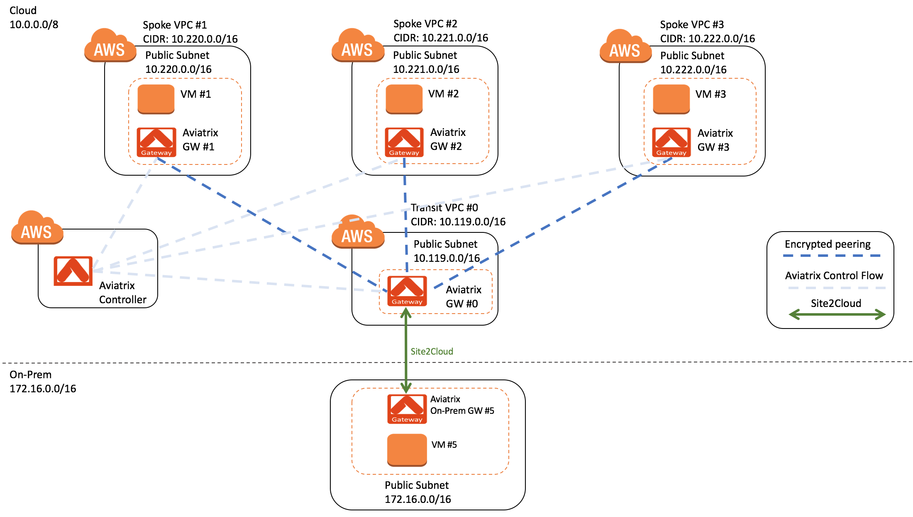

========================================================
How to Build Simple and Scalable Transit VPC Solution
========================================================

1. Solution Overview
======================

Aviatrix provides a Transit VPC solution that is centrally managed and simple to deploy, as documented in `this link. <http://docs.aviatrix.com/Solutions/aviatrix_aws_transitvpc.html>`_. The solution requires no CCIE and crypto skills for maintenance and troubleshooting the network connectivity. 

The document below is obsolete. Refer to `this doc for the next gen transit solution <https://docs.aviatrix.com/HowTos/transitvpc_workflow.html>`_.

One friction in this Transit VPC solution is that each time when a spoke VPC is stood up, the IPSEC tunnel between the transit VPC and on-prem needs to be modified 
to include the new spoke VPC CIDR. This modification of IPSEC tunnel involves 
on-prem network team and can take up a few weeks of time. 

This document guides you to build a large and scalable Transit VPC network over Internet that 
requires minimum modification to the on-prem edge router or firewall devices. The idea can also be applied to the case where the connectivity between transit VPC and on-prem is over AWS Direct Connect. 

The idea of this scalable Transit VPC solution is to configure the IPSEC tunnel once between 
the transit VPC and on-prem  
edge router or firewall. Subsequent spoke VPC connectivity to on-prem requires 
no change to this edge router or firewall. This solution enables CloudOps team to be self sufficient 
in building and operating the hybrid cloud network.  

2. Cloud Address Planning
==========================

The first step is to obtain from your network admin the on-prem address 
space in the most summarized form. For example, the on-prem network consists of 172.16.0.0/16. 

The next step is to work with your on-prem network admin to carve out 
one or a set of
consecutive network address 
space that is not used anywhere by your company and reserve 
that as your cloud address space. For example, 
the address space could be 10.0.0.0/8. All spoke VPC CIDRs and Transit VPC
will be subset of the reserved cloud address space (e.g. 10.220.0.0/16, 10.221.0.0/16 and etc). 

3. Transit VPC to on-prem IPSEC Tunnel
========================================

The second step is to use this carved out cloud address space to build just one IPSEC tunnel between your on-prem network and the transit VPC. 
What you need to do is to specify the local network as the carved out and non-used address space. The remote network addresses should be your on-prem network address. 

4. Spoke VPC to on-prem IPSEC Tunnel
=====================================

Once you have built the Transit VPC to on-prem IPSEC tunnel, you no 
longer need to modify edge routers or firewalls for any spoke VPC to 
on-prem IPSEC tunnels. Aviatrix transitive routing feature 
takes care of each new spoke VPC when it needs to connect to on-prem. You simply configure an encrypted peering between the spoke VPC to the transit VPC and 
then configure transitive peering from the spoke VPC to your On-Prem network through the Transit VPC.

5. Configuration Workflow
==========================
 
5.1 Pre Configuration Checklist
-------------------------------

Before configuring VPC peering, make sure the following prerequisites are completed.

**Pre Configuration Check List**

1.  Deploy the Aviatrix Controller

2.  Check VPC Settings

These prerequisites are explained in detail below.

5.1.1  Deploy the Aviatrix Controller
-------------------------------------

The Aviatrix Controller must be deployed and setup prior to configuring
VPC and site peering. Please refer to "Aviatrix Controller Getting
Started Guide for AWS" on how to deploy the Aviatrix Controller.

`Aviatrix Controller Getting Started
Guide <https://s3-us-west-2.amazonaws.com/aviatrix-download/docs/aviatrix_aws_controller_gsg.pdf>`_

Check and make sure you can access the Aviatrix Controller dashboard and
login with an administrator account. The default URL for the Aviatrix
Controller is:

https://<public ip of Aviatrix Controller>

5.1.2  Check VPC Settings
-------------------------

-   The VPC must have at least one public subnet to deploy the gateway.
    This means one subnet must be associated with a route table that has
    an IGW as its default route.

-   If your Transit VPC and Spoke VPCs are in the same region and you like to
    route the traffic over AWS peering, go to AWS console and configure
    the necessary AWS peering between the two VPCs.

5.2 Configuration Steps
-----------------------

Make sure the pre-configuration steps in the previous section are
completed before proceeding.

The instructions in this section will use the following architecture.
The CIDR and subnets may vary depending on your VPC setup; however, the
general principals will be the same.

|image0|

In this example we have four Cloud VPCs: 1 Transit VPC, 3 Spoke VPCs
and a corporate data center. The network will be configured such that all spoke nodes and
on-prem will be able to communicate with each other via the Transit VPC.

5.2.1 Step a – Deploy Gateways
------------------------------

The first step is to deploy Aviatrix gateways in each VPC.

**Instructions:**

a.1.  Login to the Aviatrix Controller Console

a.2.  Click on Gateway -> "New Gateway"

==============     ====================
**Setting**        **Value**
==============     ====================
Cloud Type         Choose AWS
Account Name       Choose the account name
Region             Choose the region where your VPC is located
VPC ID             Choose the VPC
Gateway Name       This name is arbitrary (ex. gw01)
Public Subnet      Select a public subnet where the gateway will be deployed
Gateway Size       t2.micro is fine for testing.
Enable NAT         Uncheck this box
VPN Access         Uncheck this box
==============     ====================

a.3.  Click “OK”. It will take a few minutes for the gateway to deploy.                                           Do not proceed until the gateway is deployed.

a.4.  Repeat steps a.2 and a.3 for the additional 3 VPCs in this example.

a.5.  Done

5.2.2  Step b – Connect Spoke VPC to Transit VPC
---------------------------------------------------

This step explains how to connect a Spoke VPC to the transit VPC.

**Instructions:**

b.1.  From the Aviatrix Controller Console

b.2.  Click Peering -> Encrypted Peering

b.3.  Click "New Peering"

b.4.  Select the Transit VPC #0 gateway (Aviatrix GW #0) and Spoke VPC #1 gateway (Aviatrix GW #1) for the peering.

      Note: If the two VPCs are in the same region, you can check the box 
      “over AWS Peering”. This would allow the encrypted peering to route 
      traffic over native AWS peering, resulting in 10 times bandwidth saving.

b.5.  Click "OK"

b.6  Repeat steps b.4 and b.5 for more scalable Spoke VPCs as Spoke VPC #2 gateway (Aviatrix GW #2) and Spoke VPC #3 gateway (Aviatrix GW #3) in this example.

b.7  Done

5.2.3  Step c – Connect Corporate Data Center to Transit VPC
------------------------------------------------------------

This step explains how to connect the corporate data center to the Transit VPC.

**Instructions:**

c.1.  From the Aviatrix Controller Console

c.2.  Click Site2Cloud -> Add New

===============================     ===================================================
  **Setting**                       **Value**
===============================     ===================================================
  VPC ID/VNet Name                  Choose Transit VPC ID
  Connection Type                   Unmapped
  Connection Name                   This name is arbitrary (ex. corpdatacenter)
  Remote Gateway Type               Aviatrix (in this example)
  Tunnel Type                       UDP
  Algorithms                        Uncheck
  Encryption over DirectConnect     Uncheck
  Enable HA                         Uncheck
  Primary Cloud Gateway             Choose Transit VPC gateway
  Remote Gateway IP Address         Public IP address of On-Prem gateway
  Pre-shared Key                    Optional
  Remote Subnet                     172.16.0.0/16 (in this example)
  Local Subnet                      10.0.0.0/8 (in this example)
===============================     ===================================================

c.3.  Click button "OK" 

c.4.  View List, click the row of Transit VPC ID and Connection Name (ex. corpdatacenter) from above.

c.5.  Check Vendor, Platform and Software of On-Prem gateway on Corporate Data Center. 

      Note: If your On-Prem gateway is:
         I.    a On-Prem Aviatrix gateway          -> select "Aviatrix" (in this example)
         II.   a Cisco ASA                         -> select "Cisco" 
         III.  a third party router or firewall    -> select "Generic" 

c.6.  Click button "Download Configuration"

c.7. If the On-Prem gateway is a Aviatrix CloudN as in this example, go to site2cloud page of CloudN website        and simply import the downloaded configuration file and click OK. 

c.8.  This template file contains the necessary information to configure the On-Prem gateway. Once the On-Prem gateway is configured, the tunnel will automatically come up.

c.9.  Done

5.2.4  Step d – Configure Transitive Routing
--------------------------------------------

This step explains how to configure transitive routing so that every
spoke and on-prem node can communicate with each other via the transit VPC.

**Instructions:**

d.1.  From the Aviatrix Controller Console

d.2.  Click Peering -> Transitive Peering

d.2.1.  For Spoke VPC #1:

        i.  Click "+ New Peering"

        ii. Source Gateway: Aviatrix GW #1, Next Hop VPC: Aviatrix GW #0 (Transit VPC), Destination CIDR:  172.16.0.0/16
              
        iii. Click "OK"

d.2.2.  For Spoke VPC #2:

        i.  Click "+ New Peering"

        ii. Source VPC: Aviatrix GW #2, Next Hop VPC: Aviatrix GW #0 (Transit VPC), Destination CIDR: 172.16.0.0/16

        iii. Click "OK"

d.2.3.  Repeat steps d.2.1 for more scalable Spoke VPCs as Spoke VPC #3 gateway (Aviatrix GW #3) in this example.

d.3.  Done

Troubleshooting
===============

To check a tunnel state, go to Site2Cloud, the tunnel status will be
displayed at "status" column.

To troubleshoot a tunnel state, go to Site2Cloud -> Diagnostics.

.. disqus::
