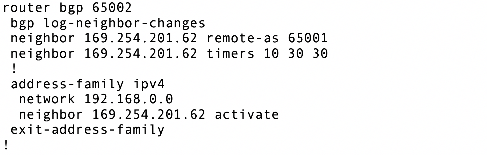

=========================================================
Transit Connection to Cisco Router over the internet.
=========================================================

1. From the Controller go to Transit Network -> Setup -> Launch a Transit VPC GW.

   |image1|

2. Connect the transit VPC GW to the Cisco Router. Go to Transit Network -> Setup -> Connect to VGW/External Device.
   select External Device and input the following parameters.
      a. BGP Local AS number:   ASN of the transit VPC GW
      b. BGP Remote AS number: ASN of the Cisco CSR
      c. Remote Gateway IP Address: Cisco WAN Public ip.

   |image2|
3. Download the configuration by going to Site2Cloud -> Click on the Connection.
   select generic and Download Configuration and configure on the router accordingly.

   |image3|
   The following is a sample configuration based on the site2cloud configuration above.
   |image4|

4. configure the Cisco router as follows:
    a. ISAKMP configuration and IPSEC configuration

   |image5|
   |image6|

    b. Interface and Tunnel Configuration
   |image7|
   |image8|
    c. BGP configuration.
   |image9|
    Note: The tunnel IP addresses are configured accordingly with the configuration file downloaded from above.
5. After configuring the router the tunnel should change the status from down to up.
   |image10|
6. Go to Transit Network -> Advanced Config on the Controller and Click on Diagnostics and enter the Transit GW name
   and select any Command from the predefined Show list to verify the BGP Routes.
   |image11|
   |image12|

.. |image1| image:: ./S2C_TGW_CiscoRouter_media/cisco1.png
   :width: 7.00000 in
   :height: 5.00000 in
.. |image2| image:: ./S2C_TGW_CiscoRouter_media/cisco2.png
   :width: 7.00000 in
   :height: 5.00000 in
.. |image3| image:: ./S2C_TGW_CiscoRouter_media/cisco3.png
   :width: 12.00000 in
   :height: 5.00000 in
.. |image4| image:: ./S2C_TGW_CiscoRouter_media/cisco4.png
   :width: 7.00000 in
   :height: 5.00000 in
.. |image5| image:: ./S2C_TGW_CiscoRouter_media/cisco5.png
   :width: 12.00000 in
   :height: 5.00000 in
.. |image6| image:: ./S2C_TGW_CiscoRouter_media/cisco6.png
   :width: 100%
.. |image7| image:: ./S2C_TGW_CiscoRouter_media/cisco7.png
    :width: 7.00000 in
    :height: 5.50000 in
.. |image8| image:: ./S2C_TGW_CiscoRouter_media/cisco8.png
    :width: 7.00000 in
    :height: 5.50000 in

.. |image10| image:: ./S2C_TGW_CiscoRouter_media/cisco10.png
   :width: 12.00000 in
   :height: 5.00000 in
.. |image11| image:: ./S2C_TGW_CiscoRouter_media/cisco11.png
   :width: 12.00000 in
   :height: 5.00000 in
.. |image12| image:: ./S2C_TGW_CiscoRouter_media/cisco12.png
   :width: 12.00000 in
   :height: 5.00000 in

