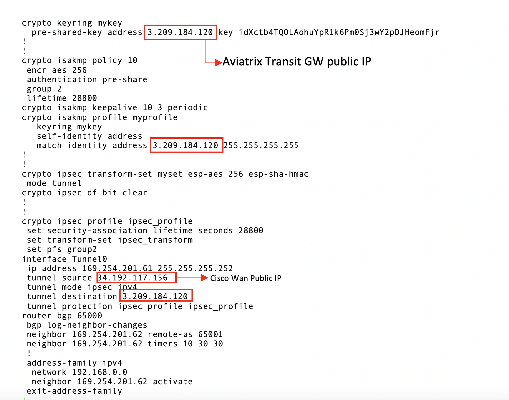
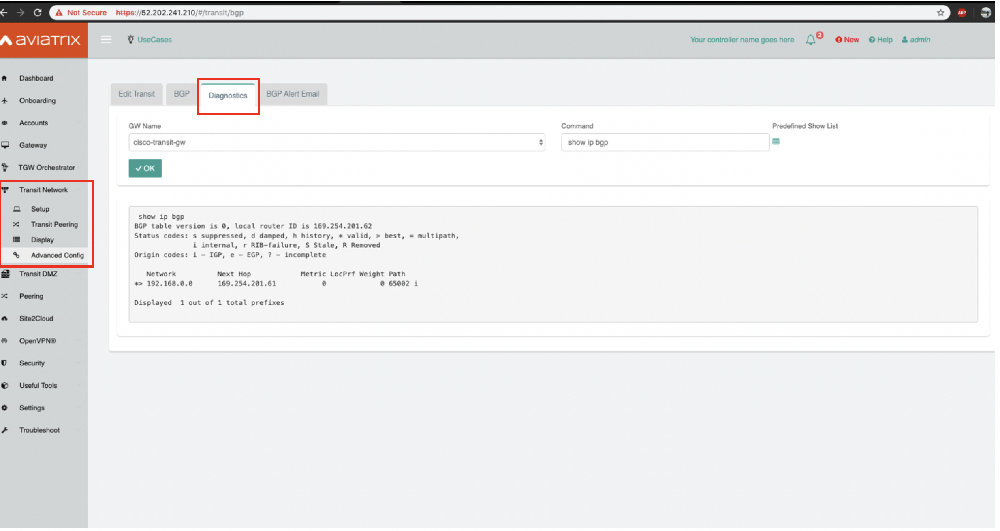
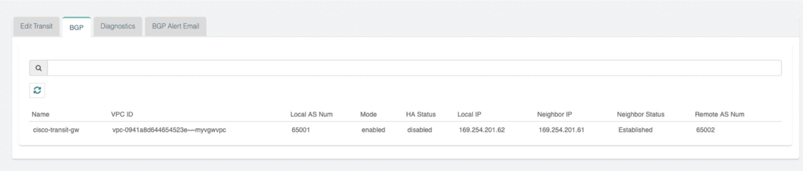

=========================================================
Transit Connection to Cisco Router over the internet.
=========================================================

1. From the Controller go to Transit Network -> Setup -> Launch a Transit VPC GW.

   |image1|

2. Connect the transit VPC GW to the Cisco Router. Go to Transit Network -> Setup -> Connect to VGW/External Device.
   select External Device and input the following parameters.
      a. BGP Local AS number: ASN of the transit VPC GW
      b. BGP Remote AS number: ASN of the Cisco CSR
      c. Remote Gateway IP Address: Cisco WAN Public ip.

   |image2|
3. Download the configuration by going to Site2Cloud -> Click on the Connection.
   select generic and Download Configuration and configure on the router accordingly.

   |image3|
   The following is a sample configuration based on the site2cloud configuration above.
   |image4|

4. Apply the following IOS configuration to your router:

   |image5|
    Note: The tunnel IP addresses are configured accordingly with the configuration file downloaded from above.
5. After configuring the router the tunnel should change the status from down to up.
   |image6|
6. Go to Transit Network -> Advanced Config on the Controller and Click on Diagnostics and select the GW name from the
   dropdown list and select Show Ip bgp Command from the predefined Show list to verify the BGP Routes.

   |image7|
   |image8|

.. |image1| image:: ./S2C_TGW_CiscoRouter_media/cisco1.png
   :scale: 30%

.. |image4| image:: ./S2C_TGW_CiscoRouter_media/cisco4.png
   :scale: 30%

.. |image6| image:: ./S2C_TGW_CiscoRouter_media/cisco6.png
   :scale: 30%

.. disqus::
