.. raw:: html

    <meta name="robots" content="noindex, nofollow, noarchive, nosnippet, notranslate, noimageindex">
=========================================================
Transit Connection to FortiGate over the internet.
=========================================================
1.From the Controller go to Transit Network -> Setup -> Launch a Transit VPC GW.

   |image1|

2.Connect the transit VPC GW to FortiGate. Go to Transit Network -> Setup -> Connect to VGW/External Device. Select External Device and input the following parameters.
      a. BGP Local AS number: ASN of the transit VPC GW
      b. BGP Remote AS number: ASN of the Fortinet Fortigate
      c. Remote Gateway IP Address: Fortinet Fortigate external interface's public IP
   |image2|

3.Download the configuration by going to Site2Cloud -> Click on the Connection.
   Select generic. Download Configuration and configure on the remote firewall accordingly.

   |image3|

   The following is a sample configuration based on the site2cloud configuration above.
   |image4|

4.Login into FortiGate and configure it as the following.

   4.a In the VPN menu, select IPsec Tunnels

   4.b click + Create New, select custom

    Populate the fields according to your preferences.
   **VPN Setup**

   +-------------------------------+------------------------------------------+
   | Field                         | Expected Value                           |
   +===============================+==========================================+
   | Name                          | Any name                                 |
   +-------------------------------+------------------------------------------+
   | Template Type                 | Custom                                   |
   +-------------------------------+------------------------------------------+
   
   |image5|

   **Network**

   +-------------------------------+------------------------------------------+
   | Field                         | Expected Value                           |
   +===============================+==========================================+
   | IP Version                    | IPv4                                     |
   +-------------------------------+------------------------------------------+
   | Remote Gateway                | Static IP Address                        |
   +-------------------------------+------------------------------------------+
   | IP Address                    | Public IP address of Aviatrix Gateway    |
   +-------------------------------+------------------------------------------+
   | Interface                     | Select the external port/interface       |
   +-------------------------------+------------------------------------------+
   | Local Gateway                 | Disabled                                 |
   +-------------------------------+------------------------------------------+
   | Mode Config                   | Unchecked                                |
   +-------------------------------+------------------------------------------+
   | NAT Traversal                 | Recommended: Enable                      |
   +-------------------------------+------------------------------------------+
   | Keepalive Frequency           | Any value                                |
   +-------------------------------+------------------------------------------+
   | Dead Peer Detection           | On Demand                                |
   +-------------------------------+------------------------------------------+
   
   |image6|
   
   **Authentication**

   +-------------------------------+------------------------------------------+
   | Field                         | Expected Value                           |
   +===============================+==========================================+
   | Method                        | Pre-shared Key                           |
   +-------------------------------+------------------------------------------+
   | Pre-shared Key                | Enter the value from the downloaded      |
   |                               | configuration in step3                   |
   +-------------------------------+------------------------------------------+
   | IKE Version                   | 1                                        |
   +-------------------------------+------------------------------------------+
   | IKE Mode                      | Main (ID protection)                     |
   +-------------------------------+------------------------------------------+

   |image7|
   
   **Phase 1 Proposal**

   .. important::
      The following values from the Aviatrix Site2Cloud configuration are needed below:

      #. In the Aviatrix Controller, click on site2cloud connection.
      #. Click on the 3 dashed lines next to `Connect Detail`

      |image8|

   +-------------------------------+------------------------------------------+
   | Field                         | Expected Value                           |
   +===============================+==========================================+
   | Encryption                    | Match value from the config file         |
   |                               | downloaded at step3                      |
   +-------------------------------+------------------------------------------+
   | Authentication                | Match value from the config file         |
   |                               | downloaded at step3                      |
   +-------------------------------+------------------------------------------+
   | Diffie-Hellman Group          | Match value from the config file         |
   |                               | downloaded at step3                      |
   +-------------------------------+------------------------------------------+
   | Key Lifetime (seconds)        | 28800                                    |
   +-------------------------------+------------------------------------------+
   | Local ID                      |                                          |
   +-------------------------------+------------------------------------------+

   |image9|
   
   **XAUTH**

   +-------------------------------+------------------------------------------+
   | Field                         | Expected Value                           |
   +===============================+==========================================+
   | Type                          | Disabled                                 |
   +-------------------------------+------------------------------------------+

   |image10|

   **Phase 2 Selectors**

   *New Phase 2*

   +-------------------------------+------------------------------------------+
   | Field                         | Expected Value                           |
   +===============================+==========================================+
   | Name                          | Any string value                         |
   +-------------------------------+------------------------------------------+
   | Comments                      | Any string value                         |
   +-------------------------------+------------------------------------------+
   | Local Address                 | 0.0.0.0/0                                |
   +-------------------------------+------------------------------------------+
   | Remote Address                | 0.0.0.0/0                                |
   +-------------------------------+------------------------------------------+

   |image11|

   *Advanced*

   .. important::
      The following values from the Aviatrix Site2Cloud configuration are needed below:

      #. In the Aviatrix Controller, select the Site2Cloud configuration.
      #. Click on the 3 dashed lines  next to `Connect Detail`

      |image12|

   +-------------------------------+------------------------------------------+
   | Field                         | Expected Value                           |
   +===============================+==========================================+
   | Encryption                    | Match value from the config file         |
   |                               | downloaded at step3                      |
   +-------------------------------+------------------------------------------+
   | Authentication                | Match value from the config file         |
   |                               | downloaded at step3                      |
   +-------------------------------+------------------------------------------+
   | Diffie-Hellman Group          | Match value from the config file         |
   |                               | downloaded at step3                      |
   +-------------------------------+------------------------------------------+
   | Key Lifetime                  | Seconds                                  |
   +-------------------------------+------------------------------------------+
   | Seconds                       | 28800                                    |
   +-------------------------------+------------------------------------------+

   |image13|

   #. Click `OK`

  4.d Click -> Network -> Interfaces. Click on the Tunnel created above (e.g. aviatrix-gatew)-> assign the IP address from the configuration file downloaded at step 3
      
      |image14|

  4.e Configure IPv4 Policy

    In **Policy & Objects**, select **IPv4 Policy**.
    Create 2 new IPv4 policies:

    * Outbound traffic

      |image15|

    * Inbound traffic

      |image16|

    .. note::
       The reference to `port2` in the screenshots should be replaced with your own interface name that represents the internal facing interface.

    .. note::

       Be sure to select **accept** for `action` and select **all** for `service`

  4.f  Bring Up IPSec Monitor

     In **Monitor** > **IPSec Monitor**, select the Aviatrix tunnel, and click **Bring Up**.
     
     The tunnel status should change to up as shown below
     
     |image18|

5.Configure BGP:

    Click -> Network -> BGP
    Configure as below:
    
    RouterID : Tunnel IP address taken from the configuration file downloaded at step3
    
    Neighbors: Remote tunnel IP address and ASN
    
    Networks: All the networks needs to be advertised via BGP (here 10.0.3.0 is the local network of FortiGate)
 
    |image21|

6.Go to Transit Network -> Advanced Config on the Controller and Click on Diagnostics and select the GW name from the dropdown list and select Show Ip bgp Command from the predefined Show list to verify the BGP Routes.

 |image19|

 |image20|

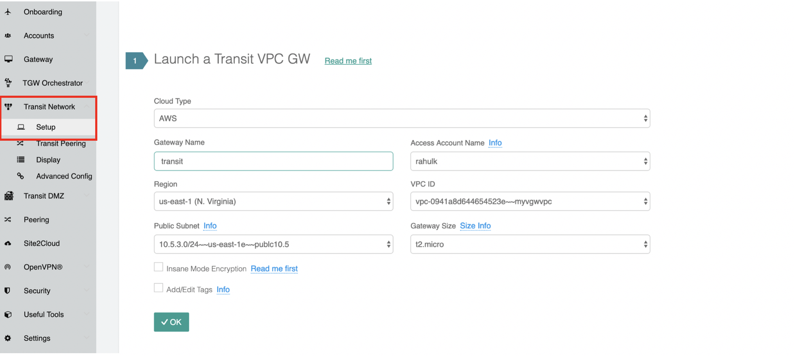
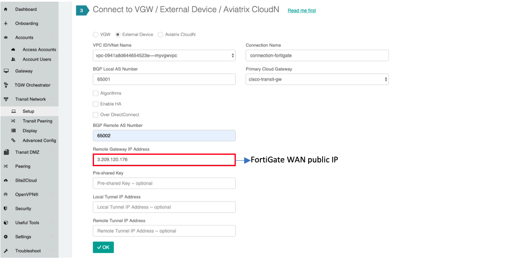
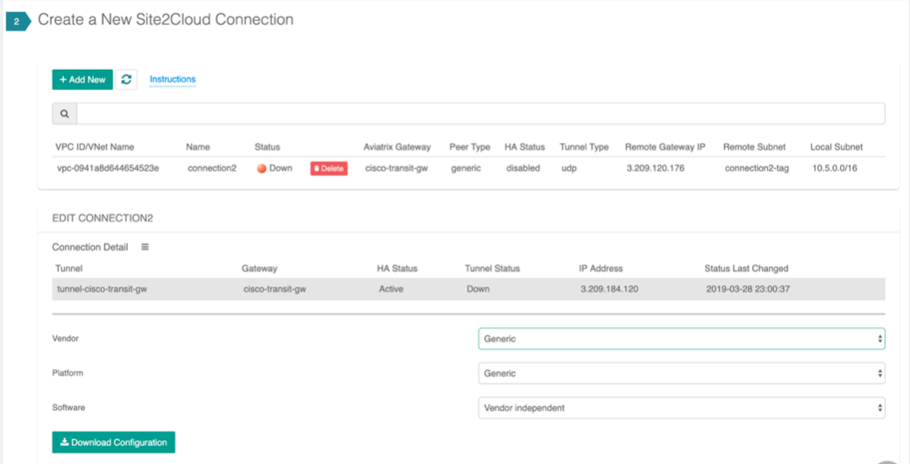
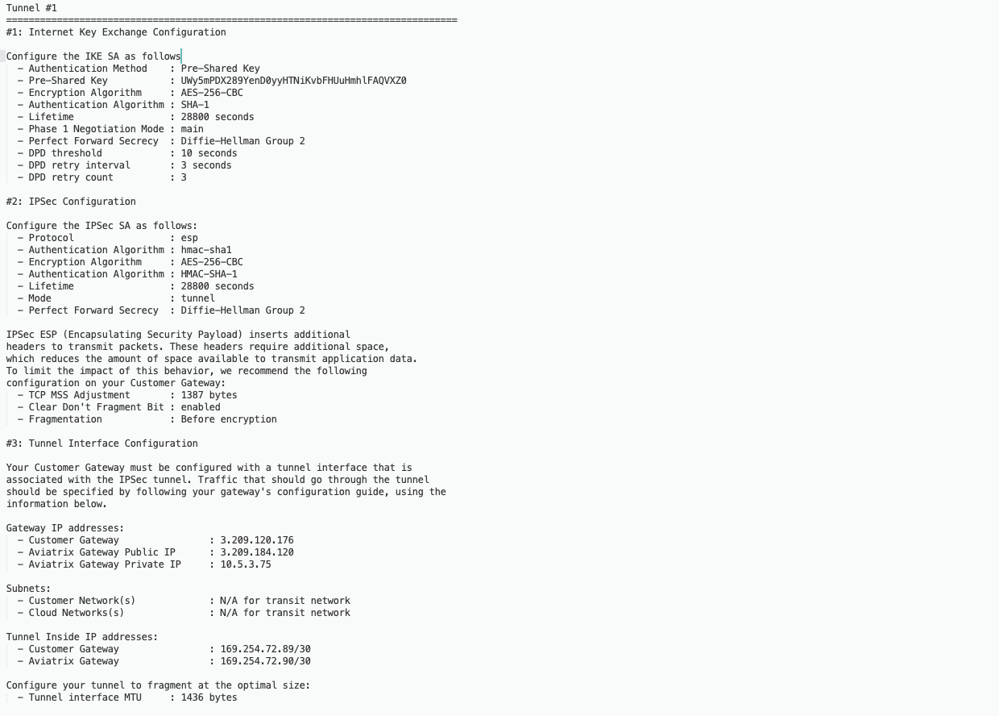
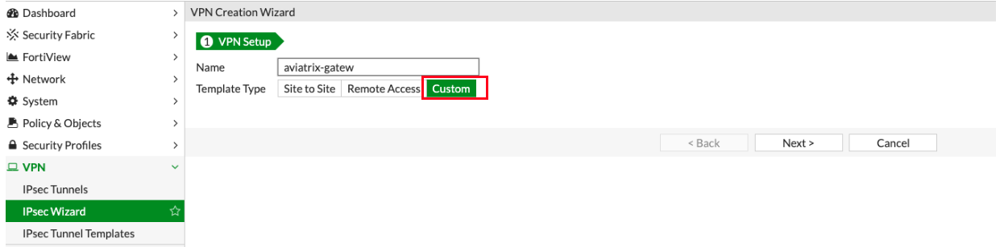
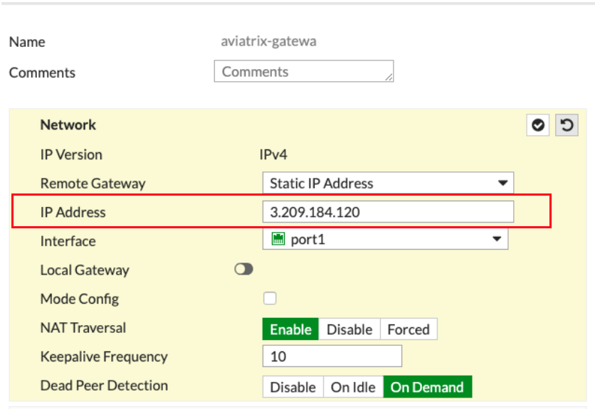
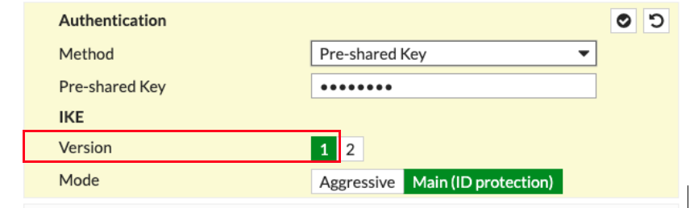
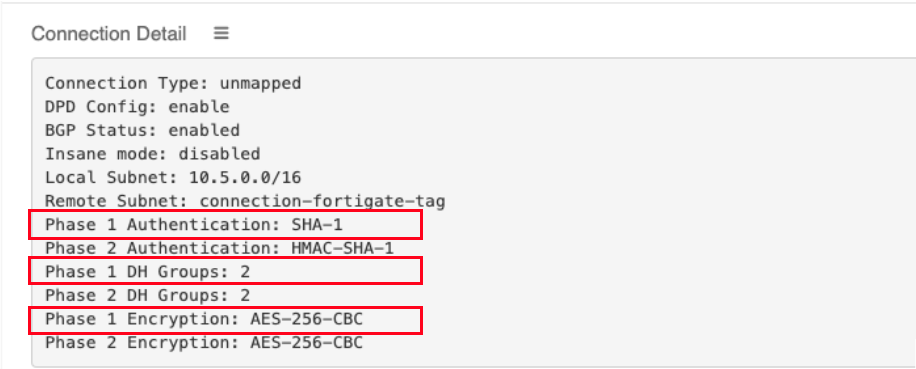
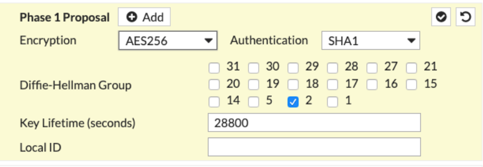
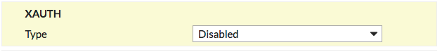
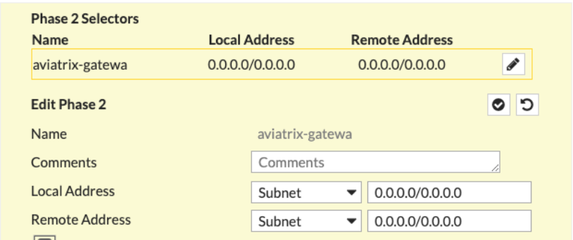
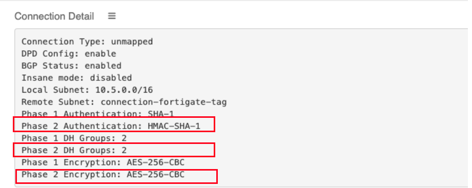
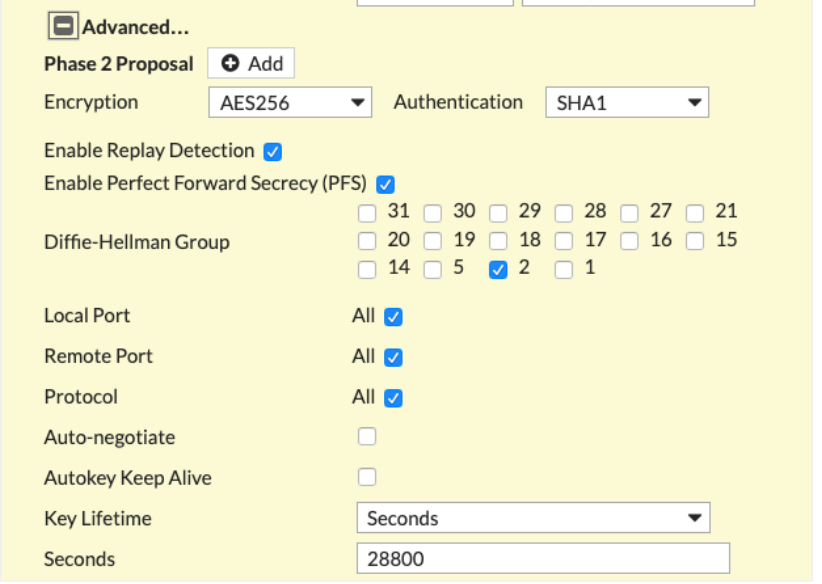
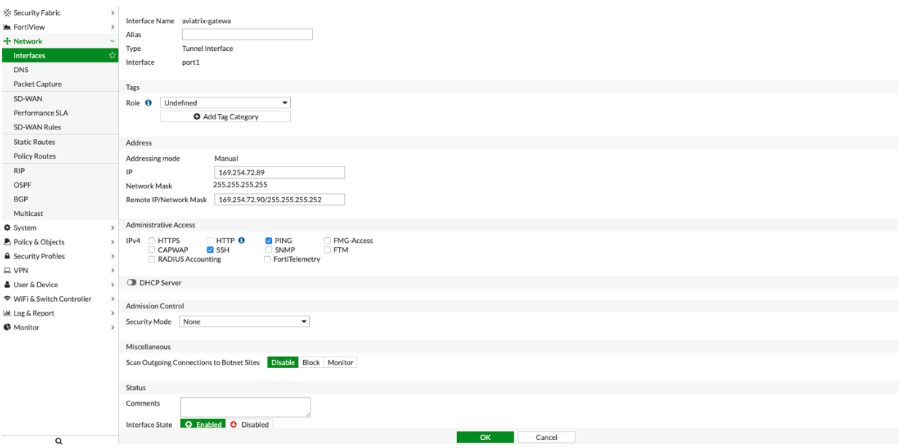
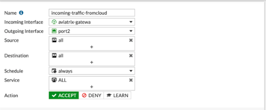
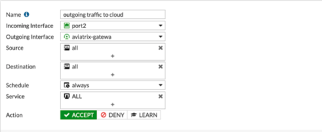
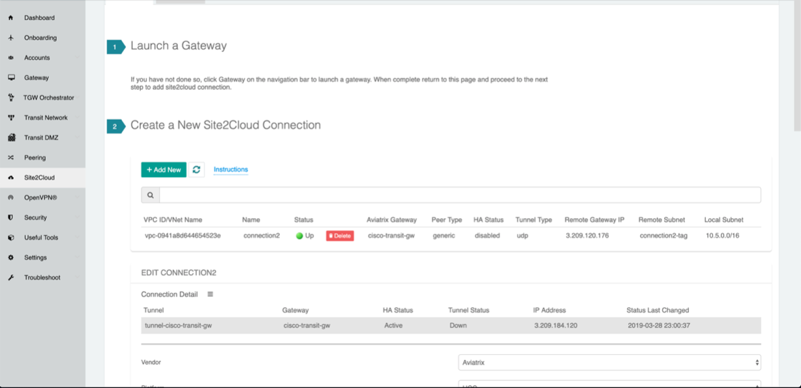
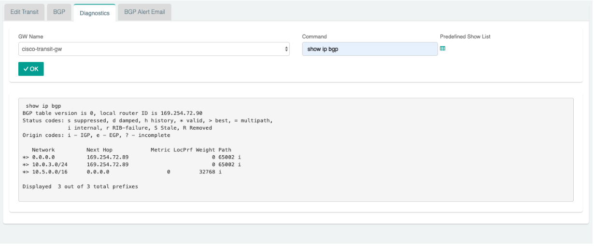
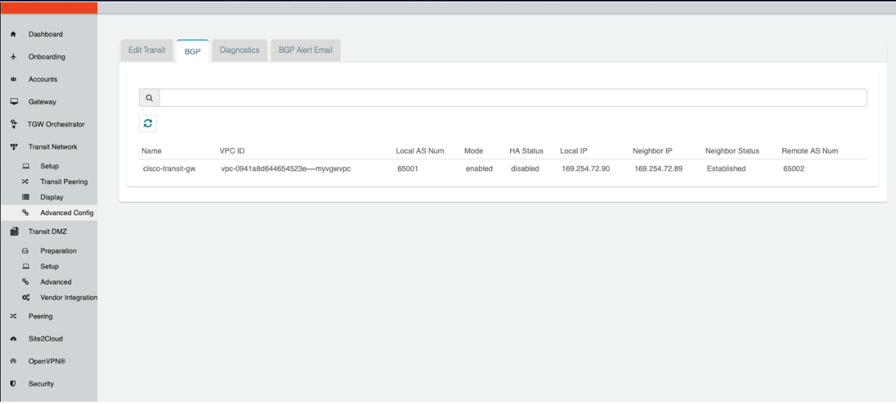
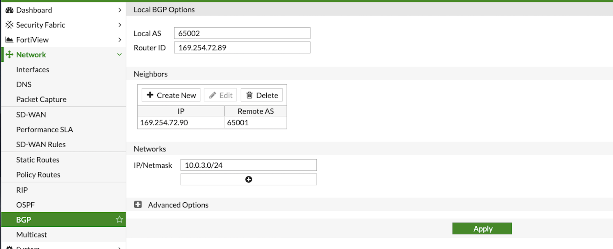
