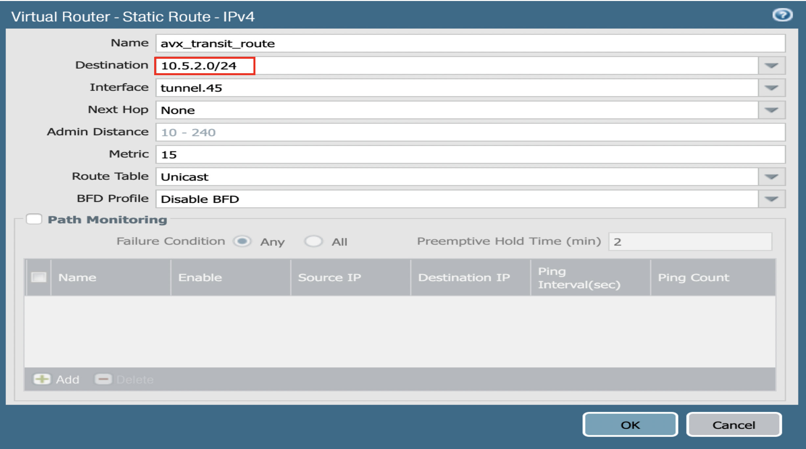
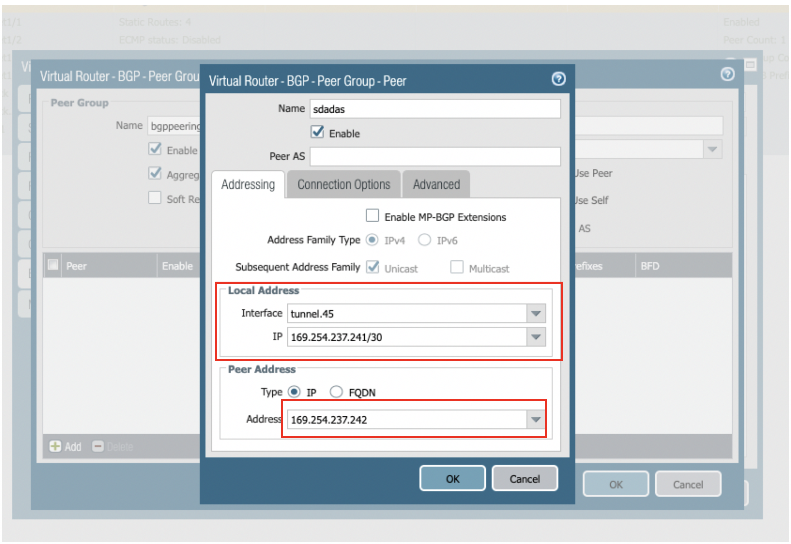
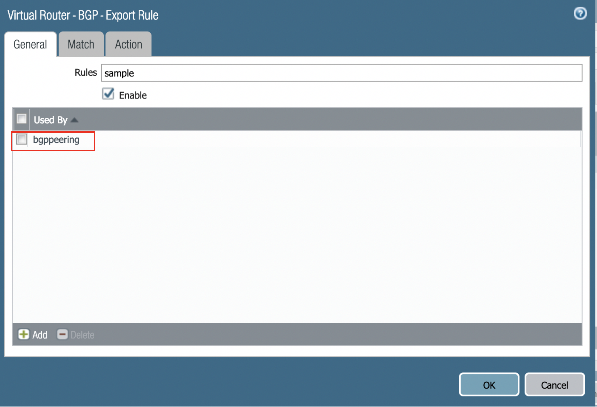
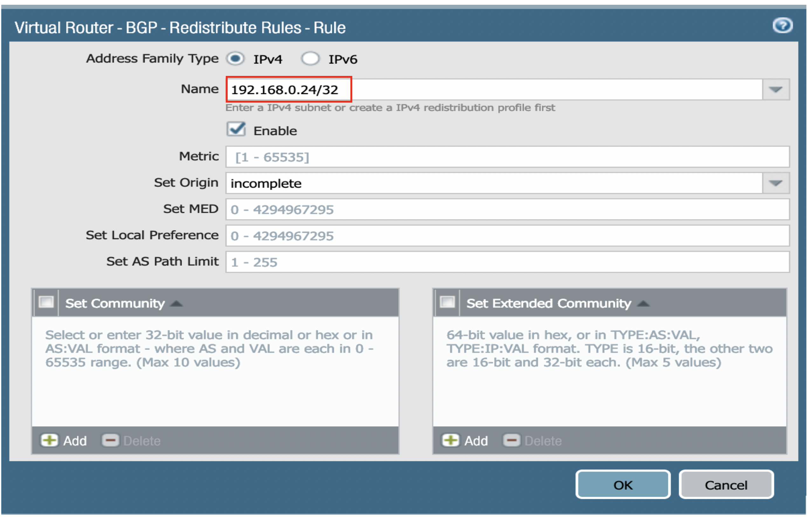

=========================================================
Transit Connection to Palo Alto over the internet.
=========================================================

1. From the Controller go to Transit Network -> Setup -> Launch a Transit VPC GW.

   |image1|

2.Connect the transit VPC GW to Palo Alto. Go to Transit Network -> Setup -> Connect to VGW/External Device.
   select External Device and input the following parameters.
      a. BGP Local AS number: ASN of the transit VPC GW
      b. BGP Remote AS number: ASN of the Palo Alto
      c. Remote Gateway IP Address: Palo Alto WAN interface public IP.
   |image2|

3. Download the configuration by going to Site2Cloud -> Click on the Connection.
   Select generic and Download Configuration and configure on the router accordingly.

   |image3|

   The following is a sample configuration based on the site2cloud configuration above.
   |image4|

4. Log into Palo Alto Networks VM Series and configure it as following:
   a.Go to **Network > Interface > Tunnel**, click **Add** to create a new tunnel interface and assign the following
     parameters.
   a.Go to **Network > Interface

      |image5|
> Tunnel**, click **Add** to create a new tunnel interface and assign the following parameters.
      ===============================     ======================================
      **Field**                           **Value**
      ===============================     ======================================
      Interface Name                      tunnel.45(any name)
      Virtual Router                      Select the existing **default** virtual router
      Security Zone                       Select the layer 3 internal zone from
                                          which traffic originates
      ===============================     ======================================

      .. note::

         If the tunnel interface is in a zone different from the one where the traffic will originate,
         a policy needs to be created to allow the traffic to flow from the source zone to the zone containing the
         tunnel interface.

     For the tunnel created above assign the IP address by going to Network > Interface > IPv4 > assign the tunnel IP
     address from the configuration downloaded above.

      |image6|

   b. Go to **Network > Network Profiles > IKE Crypto**, click **Add** and define the IKE Crypto profile (IKEv1 Phase-1)
      parameters.

      |image7|

   c. Go to **Network > Network Profiles > IKE Gateways** to configure the IKE Phase-1 Gateway. These parameters
      should match on the site2cloud configuration downloaded at Step 4.

      |image8|

      ===============================     =========================================
        **Field**                         **Value**
      ===============================     =========================================
        Interface                         Palo Alto Networks WAN port
        Peer IP Address                   Aviatrix Gateway public IP
        Pre-shared Key                    Key from site2cloud configuration downloaded at Step 3
        Peer Identification               IP Address & Aviatrix Gateway private IP
      ===============================     =========================================

      |image9|
      ===============================     =========================================
        **Field**                         **Value**
      ===============================     =========================================
        IKE Crypto Profile                Select the profile created at Step 4.b
      ===============================     =========================================
   d.Under **Network > Network Profiles > IPSec Crypto**, click **Add** to create a new profile. Define the IPSec
     crypto profile (IKEv1 Phase-2). These parameters should match on the site2cloud configuration downloaded at Step 4.

      |image10|

   e. Under **Network > IPSec Tunnels**, click **Add** to create a new IPSec Tunnel. At **General** window:

      |image11|

      ===============================     =========================================
        **Field**                         **Value**
      ===============================     =========================================
        Tunnel Interface                  Tunnel interface created at Step 4.a
        IKE Gateway                       IKE gateway created at Step 4.c
        IPSec Crypto Profile              IPSec crypto profile created at Step 4.d
      ===============================     =========================================
   f. Under **Network > Virtual Routers**, click on virtual router profile, then click **Static Routes**, add a new
      route destinating to VPC1 private subnet.

      |image12|

      ===============================     =================================================================
        **Field**                         **Value**
      ===============================     =================================================================
        Destination                       private subnet CIDR of the remote network.
        Interface                         Tunnel interface created at Step 4.a
      ===============================     =================================================================

   g. Commit the configuration.

5. Steps to configure BGP:
 1. Go to Network > Virtual Routers Default > BGP > peer group
    click add give any name(e.g bgppeering) and then click on the left bottom to add BGP peer
    |image13|
 2.Peer is created as follows by giving sample name dummy:
    Created name: Name of the BGP peer (e.g.dummy)
    Local address:
           Interface -> tunnel interface
           IP -> Tunnel interface Ip address.
    Peer address:
           Address -> remote tunnel address
    |image14|
 3.Click on the peer created  and click OK
    |image15|
 4.After everything is created the output looks like below:
   Router ID is taken from the config file downloaded.(it should be the IP address of the tunnel created )
    |image16|

 5.Next click on redistribution rules and do the following:
   Click on export rule -> general -> add -> select bgppeering(sample bgp peer group ) created above.
    |image17|
    Before selecting match create a rule as follows:
    Network -> default -> BGP -> Redistribution Rules -> Click on Add
    Select ipv4 and give the subnet which you want to redistribute(e.g., here Loopback interface is redistributed)like
    below image
    |image18|
    Click on Match->Address prefix box  -> add -> (previously added ipv4 subnet) -> click on OK
    |image19|
 6.After the BGP route has been advertised it shows like the following image.
   Go to Network -> More runtime stats -> BGP -> RIB out.
    |image20|
 7.Make sure the Interface is in the profile that allows ping and also in the Zone which is capable of sending traffic out.
   Steps to create the Management profile and attach it to the interface:

  Steps to create the Management profile and attach it to the interface:
     Click on Network profiles->. Interface management -> create the interface as below by giving a name and selecting
     ping and attach it to the tunnel.
    |image21|

 8.Go to Transit Network -> Advanced Config on the Controller and Click on Diagnostics and select the GW name from the
   dropdown list and select Show Ip bgp Command from the predefined Show list to verify the BGP Routes.

    |image22|

.. |image1| image:: ./Transit_ExternalDevice_PaloAlto_media/1.png
    :width: 7.00000 in
    :height: 5.00000 in
.. |image2| image:: ./Transit_ExternalDevice_PaloAlto_media/2.png
    :width: 7.00000 in
    :height: 5.00000 in
.. |image3| image:: ./Transit_ExternalDevice_PaloAlto_media/3.png
    :width: 7.00000 in
    :height: 5.00000 in
.. |image4| image:: ./Transit_ExternalDevice_PaloAlto_media/4.png
    :width: 7.00000 in
    :height: 5.00000 in
.. |image5| image:: ./Transit_ExternalDevice_PaloAlto_media/5.png
    :width: 5.55625in
    :height: 3.26548in
.. |image6| image:: ./Transit_ExternalDevice_PaloAlto_media/6.png
    :width: 5.55625in
    :height: 3.26548in
.. |image7| image:: ./Transit_ExternalDevice_PaloAlto_media/7.png
    :width: 5.55625in
    :height: 3.26548in
.. |image8| image:: ./Transit_ExternalDevice_PaloAlto_media/8.png
    :width: 5.55625in
    :height: 3.26548in
.. |image9| image:: ./Transit_ExternalDevice_PaloAlto_media/9.png
    :width: 5.55625in
    :height: 3.26548in
.. |image10| image:: ./Transit_ExternalDevice_PaloAlto_media/10.png
    :width: 5.55625in
    :height: 3.26548in
.. |image11| image:: ./Transit_ExternalDevice_PaloAlto_media/11.png
    :width: 5.55625in
    :height: 3.26548in

.. |image13| image:: ./Transit_ExternalDevice_PaloAlto_media/bgp1.png
    :width: 7.00000 in
    :height: 5.00000 in

.. |image15| image:: ./Transit_ExternalDevice_PaloAlto_media/bgp3.png
    :width: 7.00000 in
    :height: 5.00000 in
.. |image16| image:: ./Transit_ExternalDevice_PaloAlto_media/bgp4.png
    :width: 7.00000 in
    :height: 5.00000 in

.. |image19| image:: ./Transit_ExternalDevice_PaloAlto_media/bgp7.png
    :width: 7.00000 in
    :height: 5.00000 in
.. |image20| image:: ./Transit_ExternalDevice_PaloAlto_media/bgp8.png
    :width: 7.00000 in
    :height: 5.00000 in
.. |image21| image:: ./Transit_ExternalDevice_PaloAlto_media/bgp9.png
    :width: 7.00000 in
    :height: 5.00000 in
.. |image22| image:: ./Transit_ExternalDevice_PaloAlto_media/bgp10.png
    :width: 7.00000 in
    :height: 5.00000 in

