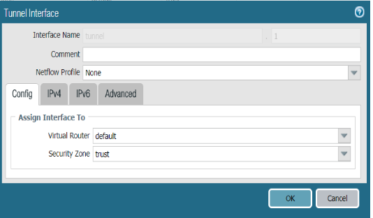
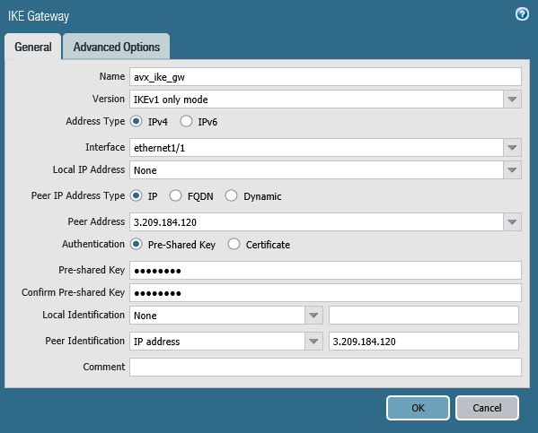
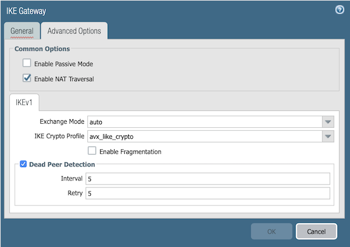
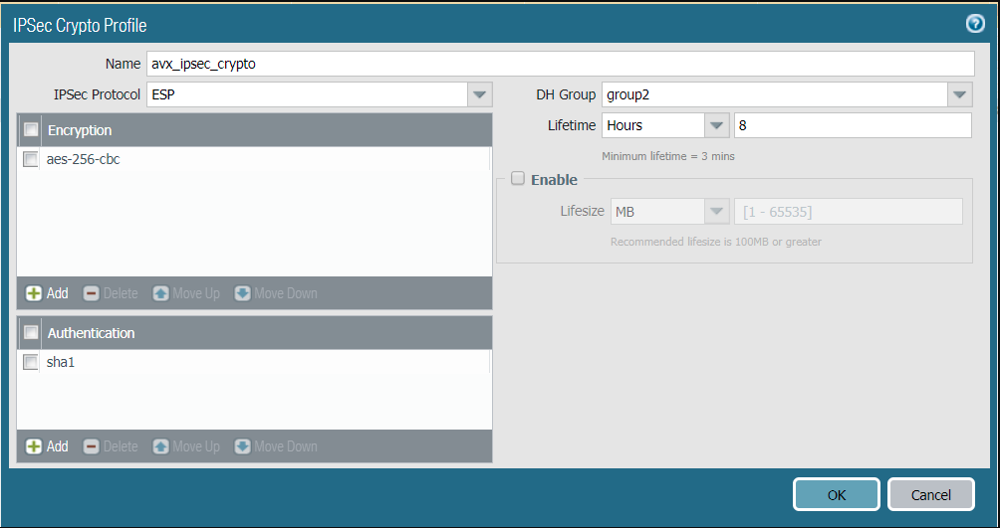
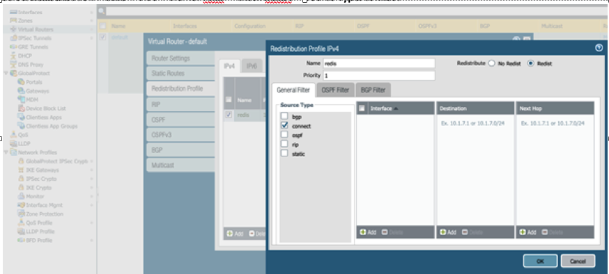

.. raw:: html

    <meta name="robots" content="noindex, nofollow, noarchive, nosnippet, notranslate, noimageindex">
=========================================================
External Device to Palo Alto VM-Series 
=========================================================

This document describes how to build Transit connection between Aviatrix Transit Gateway and Palo Alto Networks Firewall. To simulate an on-prem Firewall, we use a VM-Series in an AWS VPC.

Network setup is as following:

VPC1 (with Aviatrix Transit Gateway)

        VPC1 CIDR: 10.5.0.0/16

        VPC1 Public Subnet CIDR: 10.5.3.0/24

        VPC1 Private Subnet CIDR: 10.5.2.0/24

VPC2 (with Palo Alto Networks VM-series)

        VPC2 CIDR: 10.0.0.0/16

        VPC2 Public Subnet CIDR: 10.0.0.0/24

        VPC2 Private Subnet CIDR: 10.0.1.0/24

Sample subnet advertised with the help of BGP - 192.168.0.24/32(loopback interface on PaloAlto)

Configuration WorkFlow:

1. From the Controller go to Transit Network -> Setup -> Launch a Transit VPC GW.

   |image1|

2. Connect the transit VPC GW to Palo Alto. Go to Transit Network -> Setup -> Connect to VGW/External Device. Select External Device and input the following parameters.
      a. BGP Local AS number: ASN of the transit VPC GW
      b. BGP Remote AS number: ASN of the Palo Alto
      c. Remote Gateway IP Address: Palo Alto WAN interface public IP.

   |image2|

      .. note::

         If using private IP as remote gateway IP, please make sure to check "Over DirectConnect".
		 
3. Download the configuration by going to Site2Cloud -> Click on the Connection.
   Select generic and Download Configuration and configure on the router accordingly.

   |image3|

   The following is a sample configuration based on the site2cloud configuration above.
   |image4|

4. Log into Palo Alto Networks VM Series and configure it as following:

   a. Go to **Network > Interface > Tunnel**, click **Add** to create a new tunnel interface and assign the following parameters.
 
      |image5|

      ===============================     ======================================
      **Field**                           **Value**
      ===============================     ======================================
      Interface Name                      tunnel.45(any name)
      Virtual Router                      Select the existing **default** virtual router
      Security Zone                       Select the layer 3 internal zone from
                                          which traffic originates
      ===============================     ======================================

      .. note::

         If the tunnel interface is in a zone different from the one where the traffic will originate,
         a policy needs to be created to allow the traffic to flow from the source zone to the zone containing the
         tunnel interface.

     For the tunnel created above assign the IP address by going to Network > Interface > IPv4 > assign the tunnel IP
     address from the configuration downloaded above.

      |image6|

   b. Go to **Network > Network Profiles > IKE Crypto**, click **Add** and define the IKE Crypto profile (IKEv1 Phase-1)
      parameters.

      |image7|

   c. Go to **Network > Network Profiles > IKE Gateways** to configure the IKE Phase-1 Gateway. These parameters
      should match on the site2cloud configuration downloaded at Step 4.

      |image8|

      ===============================     =========================================
        **Field**                         **Value**
      ===============================     =========================================
        Interface                         Palo Alto Networks WAN port
        Peer IP Address                   Aviatrix Gateway public IP
        Pre-shared Key                    Key from site2cloud configuration downloaded at Step 3
        Peer Identification               IP Address & Aviatrix Gateway public IP
      ===============================     =========================================
      .. note::

         If using remote private IP on Step 2, Peer IP Address should be the remote private IP while Peer Identification should be remote public IP.
		 
      |image9|

      ===============================     =========================================
        **Field**                         **Value**
      ===============================     =========================================
        IKE Crypto Profile                Select the profile created at Step 4.b
      ===============================     =========================================
      
   d. Under **Network > Network Profiles > IPSec Crypto**, click **Add** to create a new profile. Define the IPSec crypto profile (IKEv1 Phase-2). These parameters should match on the site2cloud configuration downloaded at Step 4.

      |image10|

   e. Under **Network > IPSec Tunnels**, click **Add** to create a new IPSec Tunnel. At **General** window:

      |image11|

      ===============================     =========================================
        **Field**                         **Value**
      ===============================     =========================================
        Tunnel Interface                  Tunnel interface created at Step 4.a
        IKE Gateway                       IKE gateway created at Step 4.c
        IPSec Crypto Profile              IPSec crypto profile created at Step 4.d
      ===============================     =========================================

      Note: There is no need to configure proxy-id
      
      
   f. Commit the configuration.  We should see the IPSec tunnel is up in green.

      |image23|

5. Steps to configure BGP:

   a. Go to Network > Virtual Routers Default > BGP > peer group
      click add give any name(e.g bgppeering) and then click on the left bottom to add BGP peer
      
      |image13|

   b. Add Peer > Created name > Enter the Peer AS > Local address: tunnel interface and Tunnel interface IP address > Peer address: remote tunnel address
           
      |image14|
   
      |image15|
      

   c. After everything is created, the output looks like below, and Commit the configuration.

      Router ID is taken from the config file downloaded.(it should be the IP address of the tunnel created )
      
      |image16|
      
   d. Create a redistribution profile:
      Network -> default -> Redistribution Profile -> Add -> Name: redis -> check Redist -> Source Type: connect
      
      |image12|
      
   e. Next click on redistribution rules and do the following:
      Network -> default -> BGP -> Redistribution Rules -> Click on Add -> select "redis"
      
      |image18|
      
   f. Configure Export: Select Export, Add a name in the Rules field, and Enable the Export rule.  Add the Peer Group from which the routes will be imported.  Select Match and define the options used to filter routing information.
      
      |image19|
      
   g. After the BGP route has been advertised it shows like the following image.
      Go to Network -> More runtime stats -> BGP -> RIB out.
      
      |image20|

6. At AWS portal, configure the VPC Route Table associated with the private subnet of VPC2. Add a route destinating to VPC1 private subnet with Palo Alto Networks VM LAN port as the gateway.

7. Go to Transit Network -> Advanced Config on the Controller and Click on Diagnostics and select the GW name from the dropdown list and select Show Ip bgp Command from the predefined Show list to verify the BGP Routes.

    |image22|

.. |image2| image:: ./Transit_ExternalDevice_PaloAlto_media/2.png
    :width: 7.00000 in
    :height: 5.00000 in
.. |image3| image:: ./Transit_ExternalDevice_PaloAlto_media/3.png
    :width: 5.55625in
    :height: 3.26548in

.. |image6| image:: ./Transit_ExternalDevice_PaloAlto_media/6.png
    :width: 5.55625in
    :height: 3.26548in
.. |image7| image:: ./Transit_ExternalDevice_PaloAlto_media/7.png
    :width: 5.55625in
    :height: 3.26548in

.. |image11| image:: ./Transit_ExternalDevice_PaloAlto_media/11.png
    :width: 5.55625in
    :height: 3.26548in

.. |image15| image:: ./Transit_ExternalDevice_PaloAlto_media/bgp3.png
    :width: 7.00000 in
    :height: 5.00000 in

.. |image23| image:: ./Transit_ExternalDevice_PaloAlto_media/14.png
    :width: 5.55625 in
    :height: 1.50000 in
