.. raw:: html

    <meta name="robots" content="noindex, nofollow, noarchive, nosnippet, notranslate, noimageindex">
=========================================================
Transit Connection to pfSense over the internet.
=========================================================

1. From the Controller go to Transit Network -> Setup -> Launch a Transit VPC GW.

   |image1|

2. Connect the transit VPC GW to the pfSense. Go to Transit Network -> Setup -> Connect to VGW/External Device.
   select External Device and input the following parameters.
      a. BGP Local AS number: ASN of the transit VPC GW
      b. BGP Remote AS number: ASN of the pfSense
      c. Remote Gateway IP Address: pfSense WAN Public IP.

   |image2|
3. Download the configuration by going to Site2Cloud -> Click on the Connection.
   select generic and Download Configuration and configure on pfSense accordingly.

   |image3|
   The following is a sample configuration based on the site2cloud configuration above.

   |image4|

4. Create an IPsec tunnel in pfSense
---------------------------------

4.a Login to your pfSense dashboard.
4.b In the `VPN` menu, select `IPsec`.
4.c Click `+ Add P1`
4.d Populate the fields according to your preferences.  The important fields are (with :orange:`extra emphasis` on a few key fields):

   *General Information*

   +-------------------------------+------------------------------------------+
   | Field                         | Expected Value                           |
   +===============================+==========================================+
   | Key exchange version          | IKEv1                                    |
   +-------------------------------+------------------------------------------+
   | Remote Gateway                | Enter the public IP address of the       |
   |                               | Aviatrix Transit gateway here.           |
   +-------------------------------+------------------------------------------+

   *Phase 1 Proposal*

   +-------------------------------+------------------------------------------+
   | Field                         | Expected Value                           |
   +===============================+==========================================+
   | Authentication Method         | Mutual PSK                               |
   +-------------------------------+------------------------------------------+
   | My identifier                 | WAN port Public IP                       |
   +-------------------------------+------------------------------------------+
   | :orange:`Peer identifier`     | :orange:`IP address. Enter the private`  |
   |                               | :orange:`IP address of the remote`       |
   |                               | :orange:`Aviatrix Gateway`               |
   +-------------------------------+------------------------------------------+
   | Pre-Shared Key                | Enter the PSK from the Site2Cloud        |
   |                               | configuration downloaded at step 3.      |
   +-------------------------------+------------------------------------------+

   *Phase 1 Proposal (Algorithms)*

   +-------------------------------+------------------------------------------+
   | Field                         | Expected Value                           |
   +===============================+==========================================+
   | Encryption Algorithm          | AES - 256 bits                           |
   +-------------------------------+------------------------------------------+
   | Hash Algorithm                | SHA1                                     |
   +-------------------------------+------------------------------------------+
   | DH Group                      | 2 (1024 bit)                             |
   +-------------------------------+------------------------------------------+

   *Advanced Options*

   +-------------------------------+------------------------------------------+
   | Field                         | Expected Value                           |
   +===============================+==========================================+
   | Disable rekey                 | :orange:`Unchecked`                      |
   +-------------------------------+------------------------------------------+

   |image5|
   |image6|

4.e Click `Save`
4.d Add a Phase 2 entry and click on save.
   |image7|
   |image8|

4.f Click on Firewall -> Virtual IPs -> add.
   |image9|
4.g Click on status -> IPsec
      Status is shown as Established.
   |image10|

5. BGP Configuration on pfSense:
---------------------------------
5.a Click on System -> Package Manager
    Check whether *FRR* package which is used for BGP configuration is avialable in installed packages
    or else install it by clicking on available packages and search for *FRR*
   |image11|

5.b Click on Services -> FRR BGP.
   |image12|

   |image13|

   Click on Status -> FRR -> BGP  to see the BGP routes.

6. After configuration pfSense the tunnel should change the status from down to up.
   |image14|

7. Go to Transit Network -> Advanced Config on the Controller and Click on Diagnostics and select the GW name from the
   dropdown list and select Show Ip bgp Command from the predefined Show list to verify the BGP Routes.

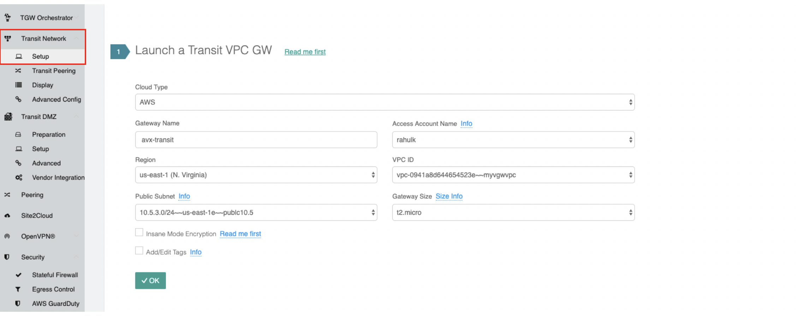
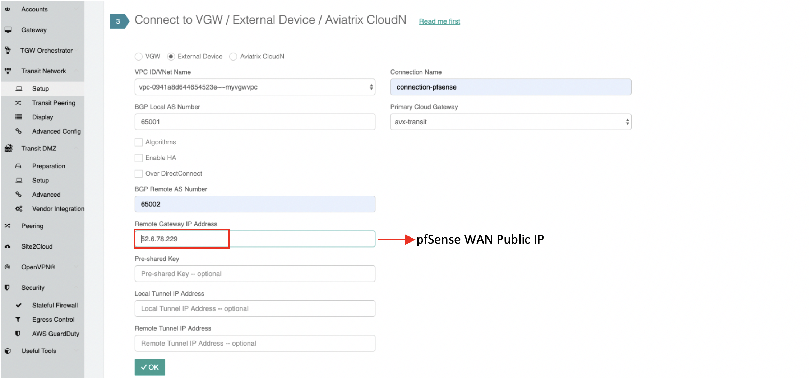
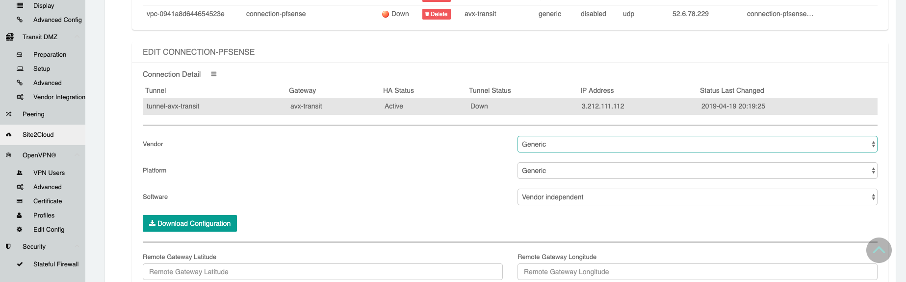
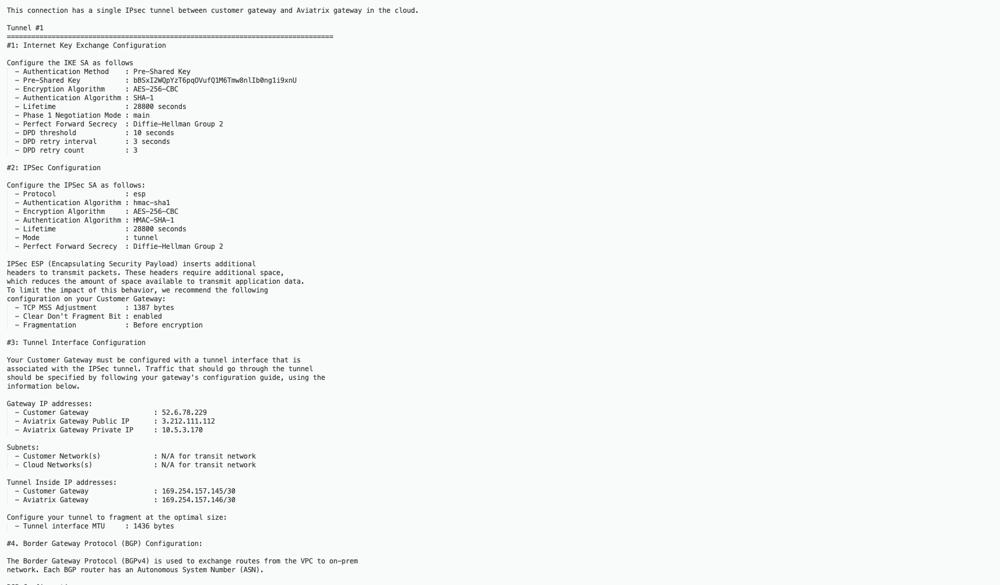
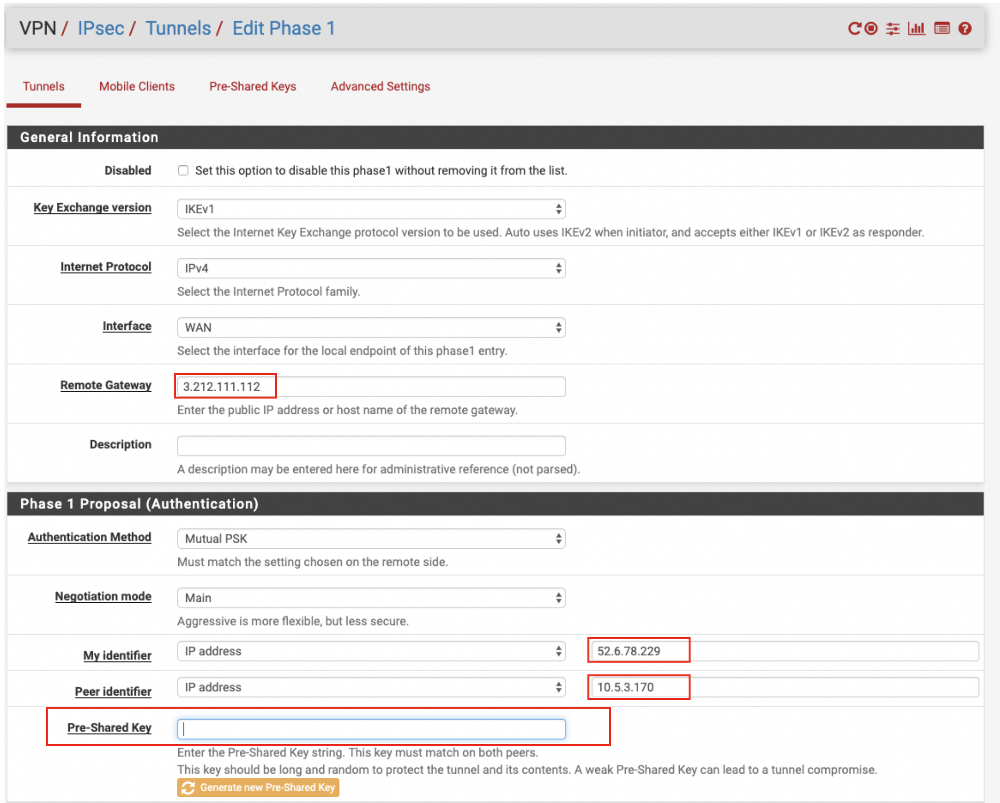
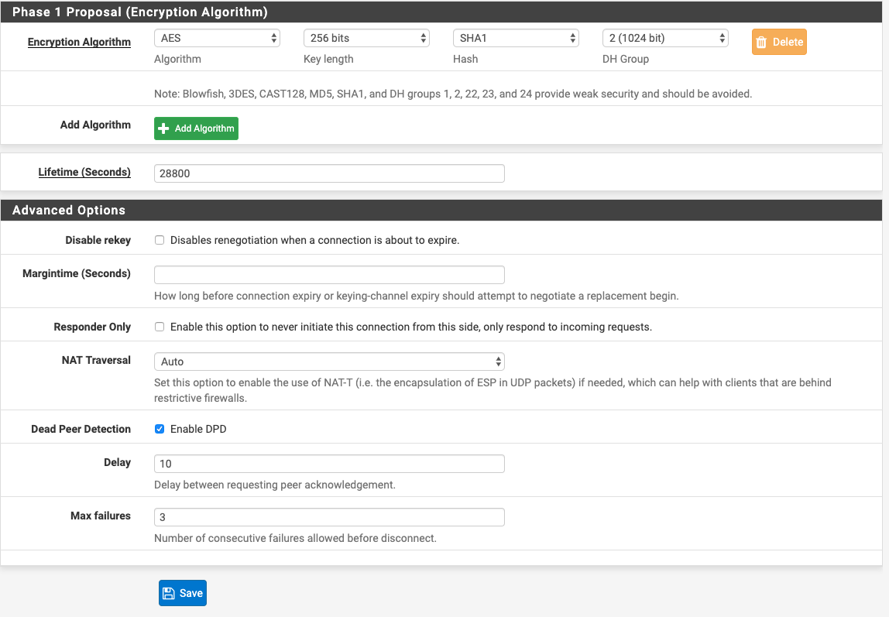
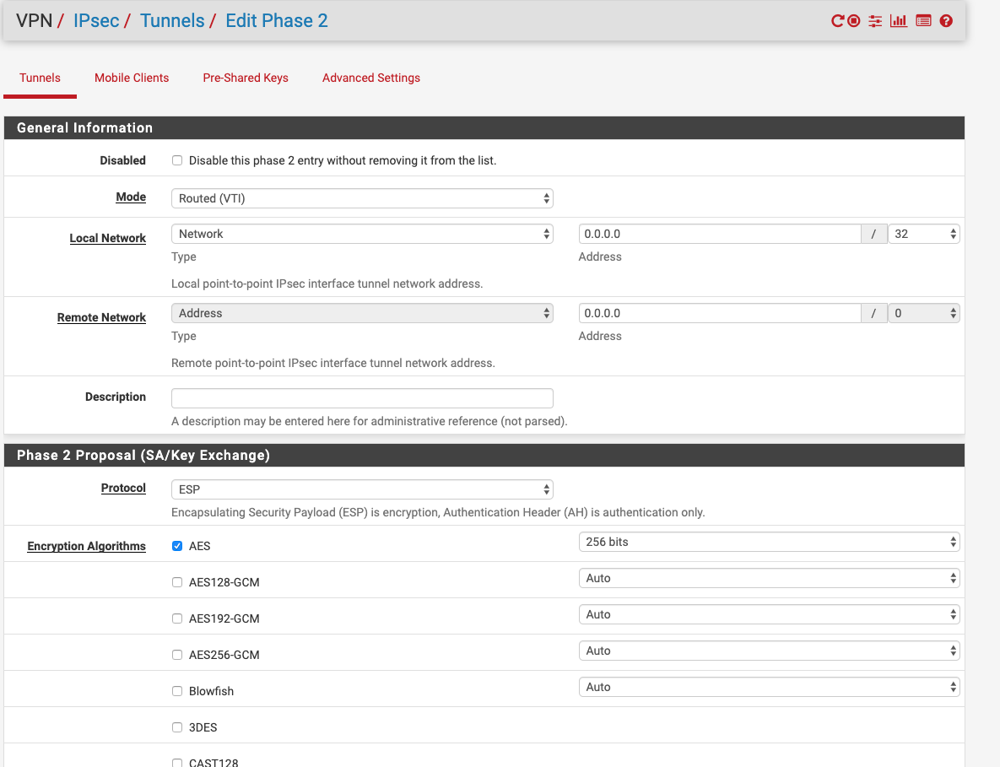
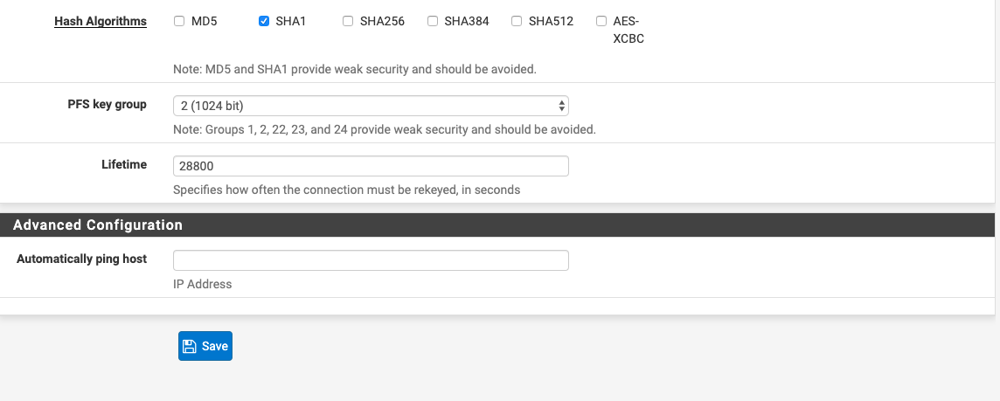
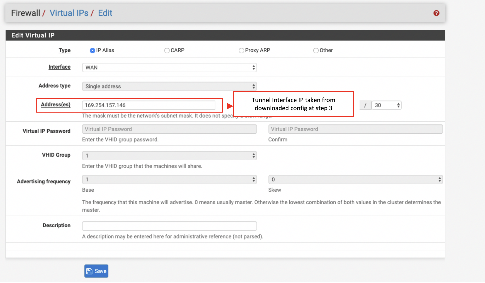
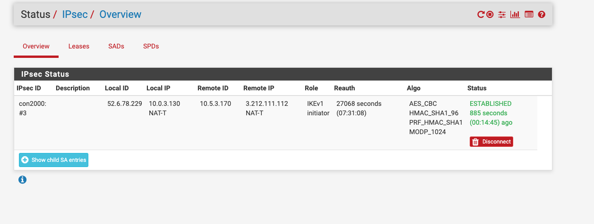
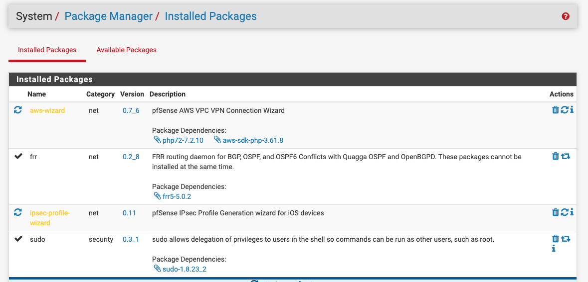
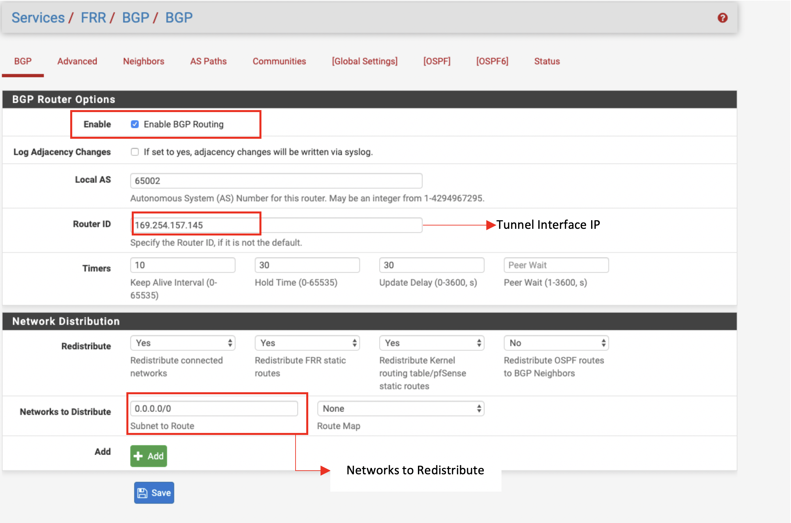
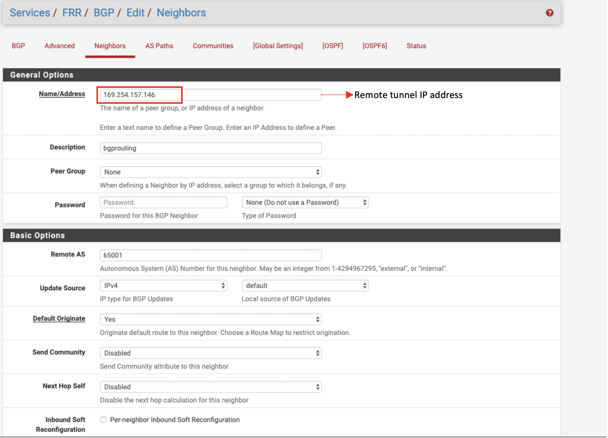
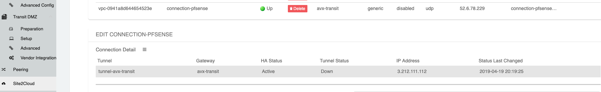
