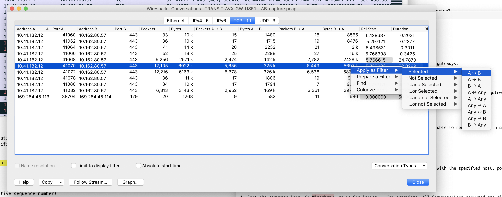

.. meta::
   :description: Documentation for Network/Gateway/VPN User/CLoud/Database
   :keywords: network, gateway, controller, connectivity, ping, traceroute, tracepath, packet capture, ip, diagnostic, force upgrade, service, keep gateway, migration, gateway replace, vpn user, cloud, account diagnostic, vpc diagnostic, vnet diagnostic, database, perfmon, cloudxd, rsyslog, bgp diagnostic, threshold

###################################
Diagnostics
###################################

Network
---------

This section provides tools to test the network connectivity of the controller and gateways.

Gateway Utility
~~~~~~~~~~~~~~~~~

This section provides 3 tools (traceroute, ping and tracepath) to test network connectivity for Aviatrix gateways.    

Network Connectivity Utility
~~~~~~~~~~~~~~~~~~~~~~~~~~~~~~

The Network Connectivity (nc) tool allows you to test if the controller/gateway is able to reach a host with a specified protocol and port number.

Packet Capture
~~~~~~~~~~~~~~~~

This tool enables a gateway to capture the forwarding packets for a period of time with the specified host, port, network interface, and packet length.

Here are some Wireshark tips:

 1. **Sort the conversations** On Wireshark, go to Statistics -> Conversations. All Conversations captured are displayed in the pop up window. For each conversations, it shows how many bytes are transferred in which direction. 

 2. **Filter on conversation** From the above pop up window, select one conversation. Right click on the conversation, select Apply as Filter -> A <-> B. The Wireshark capture window will automatically filter the other conversation out. 

 3. **View Throughput** On Wireshsark, go to Statistics -> TCP Stream Graphs -> Throughput. The Throughput for this TCP session will be displayed in a pop up window. 

An example screenshot on conversation filtering is shown as below. 

|wireshark_filter|

Controller Utility
~~~~~~~~~~~~~~~~~~~~

This tool allows the controller to perform a ping test to a specific host in order to run a network connectivity test.

Controller IP Migration
~~~~~~~~~~~~~~~~~~~~~~~~~

.. important:: The user MUST execute this feature after re-associating a new public IP for the controller through AWS/Azure/GCloud GUI console or API. This feature updates the configurations for the controller and gateways.
..

Remote Support 
~~~~~~~~~~~~~~~~~

By enable Remote Support, you grant permission for Aviatrix support team to access the Controller for debugging 
purpose. 

Make sure you disable the option when the debugging session is complete. 

Controller Public IP
~~~~~~~~~~~~~~~~~~~~~~

This section displays the current public IP of the controller.

.. raw:: html

   

Gateway
---------

Diagnostics
~~~~~~~~~~~~~~

Please refer to `Run diagnostics on a gateway. <http://docs.aviatrix.com/HowTos/troubleshooting.html>`__

Force Upgrade
~~~~~~~~~~~~~~~

This feature allows you to upgrade one particular gateway. A common use case is that during controller upgrade, if an unpredicted network connectivity issue occurs that causes one specific gateway to fail to upgrade, you can simply solve the problem by using this feature.

Service Actions
~~~~~~~~~~~~~~~~~

This section allows you to view the status of the services running on a gateway, such as rsyslog, supervisor BGP service, etc... Furthermore, the user can restart a service if there is an indication showing that the service might not be working properly.

Keep Gateway on Error
~~~~~~~~~~~~~~~~~~~~~~~

By default, the controller will roll back all the operations (gateway, EIP, security-group creations, etc...) if an error occurs during a gateway creation. However, this function allows you to keep the gateway instance for debugging purposes. In another word, this feature disables the roll back operation if the Status is set to True.

Gateway IP Migration
~~~~~~~~~~~~~~~~~~~~~~

.. important:: The user MUST execute this feature after re-associating a new public IP for the gateway through AWS/Azure/GCloud GUI console or API. This feature updates the configurations for controller and gateways.
..

Gateway Replace
~~~~~~~~~~~~~~~~~

This feature allows you to replace a gateway by launching a new gateway and restoring the configuration and operation in the event that a gateway becomes inoperational and you have exhausted all other ways to recover. Contact support@aviatrix.com 
before you use this feature. 

Select a gateway in the drop down menu and click Replace.

    Please refer to `Run diagnostics on a gateway. <http://docs.aviatrix.com/HowTos/troubleshooting.html>`__
    
    Please refer to `Service Description of Diagnostic Result <http://docs.aviatrix.com/HowTos/Troubleshooting_Diagnostics_Result.html>`__

.. raw:: html

   

VPN User
----------

VPN User Diagnostics
~~~~~~~~~~~~~~~~~~~~~~

This feature provides the status diagnostic information of a VPN user.

VPN User History Search
~~~~~~~~~~~~~~~~~~~~~~~~~

This tool allows you to search the VPN connection log on a particular VPN gateway with the filtering feature.

.. raw:: html

   

Cloud
-------

Account Diagnostics
~~~~~~~~~~~~~~~~~~~~~~~~~~~~

This feature checks if the access accounts have the correct configuration to meet the controller's requirements.

.. note:: This operation might take a couple minutes to be finished if you have multiple access accounts. Currently, this feature only supports AWS based access accounts.
..

VPC Diagnostics with Resources Information
~~~~~~~~~~~~~~~~~~~~~~~~~~~~~~~~~~~~~~~~~~~~

The diagnostic result of this feature provides the information of a specified VPC/VNet, such as DHCP options, Subnets, ACLs, route tables, security groups and VM instances configurations.

VNet Route Diagnostics
~~~~~~~~~~~~~~~~~~~~~~~~

This feature provides the following operations that can be applied to a VNet:
    1. Display all route tables
    2. Display route table details
    3. Add a route table
    4. Delete a route table
    5. List route table and subnet tables
    6. List effective route of an instance
    7. Add a route in a route table
    8. Delete a route
    9. Turn IP fwd ON
    10. Turn IP fwd OFF
    11. Get IP fwd
    12. Associate a subnet to a route table
    13. Dissociate a subnet from a route table

.. raw:: html

   

Database
----------

DB Diagnostics
~~~~~~~~~~~~~~~~

This section allows you to view database tables and restart a server for functionality recovering purposes.

.. warning:: We strongly advise the users to contact Aviatrix Support before performing the operations to "Drop Database" or to "Delete Collection".
..

.. raw:: html

   

Services
----------

This feature allows you to view the services status of the controller and gateways. Moreover, it provides the ability to restart the services if there is an indication showing that a particular service is not working properly.

.. raw:: html

   

BGP
-----

This section provides the ability to view BGP configurations for diagnostics or any purposes.

.. raw:: html

   

System Resources
------------------

This feature allows you to set the threshold for notifications when the disk/memory of a controller/gateway has reached certain percentage of the total usage. The default behavior is to alert administrators when the disk usage crosses 90% or if memory usage crosses 80%.

Network Validation: Connectivity Test
---------------------------------------

When you select the Source Network and Destination Network, the Aviatrix Controller will spin up two instances 
and run a connectivity test. After the test completes, you can re-run the test. There is only one pair of test endpoints that is valid at any given time. If you want to test a different endpoint, delete the current pair and launch a new pair. These instances are visible in Gateway page, under "View Instances"

.. disqus::
