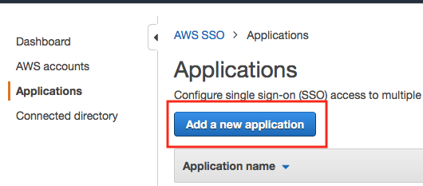
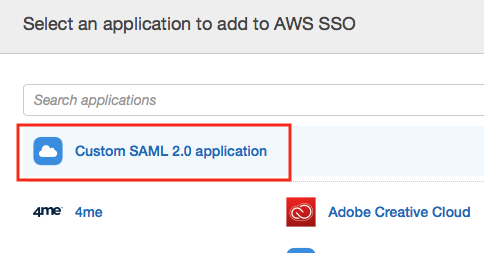
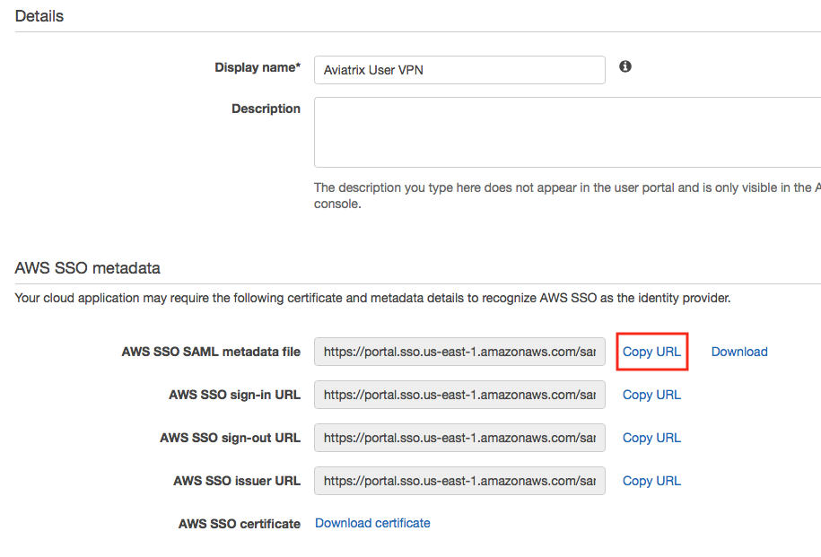
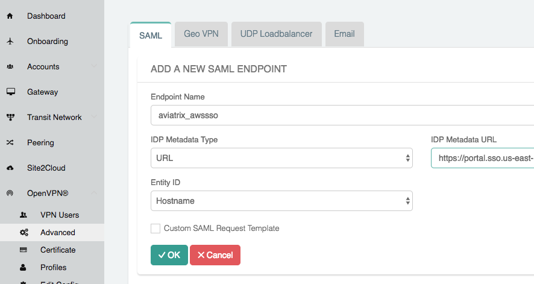
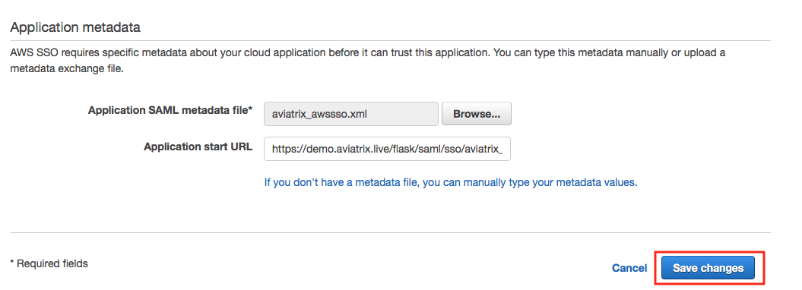
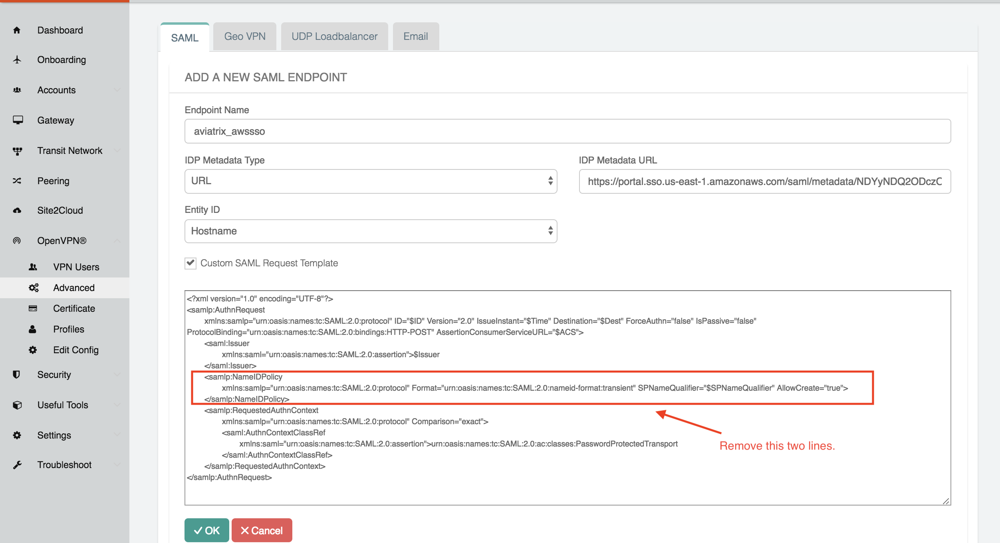
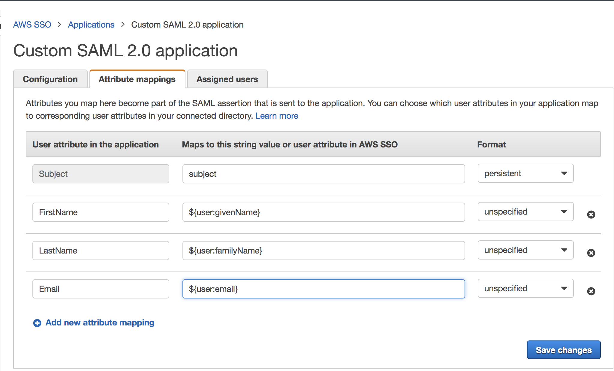

.. meta::

.. toctree::
   :numbered:

==============================================================================
OpenVPN® with SAML Authentication on AWS SSO IdP
==============================================================================

Overview
------------

This guide provides an example on how to configure Aviatrix to authenticate against AWS SSO IdP. When SAML client is used, your Aviatrix Controller acts as the Identity Service Provider (ISP) that redirects browser traffic from client to IdP (e.g., AWS SSO) for authentication.

Pre-Deployment Checklist
-----------------------------------

Before configuring SAML integration between Aviatrix and AWS SSO, make sure the following is completed:

#. The `Aviatrix Controller <#awsssosaml-aviatrix-controller>`__ is set up and running.
#. You have a valid `AWS account <#awsssosaml-aws-account>`__ with `AWS SSO <https://aws.amazon.com/single-sign-on/>`_ enabled.
#. You have downloaded and installed the `Aviatrix SAML VPN client <#awsssosaml-aviatrix-client>`__.

.. _awsssosaml_aviatrix_controller:

Aviatrix Controller
####################

If you haven’t already deployed the Aviatrix Controller, follow `the Controller Startup Guide <https://docs.aviatrix.com/StartUpGuides/aviatrix-cloud-controller-startup-guide.html>`_ and start with a Metered AMI.

.. _awsssosaml_aws_account:

AWS Account with AWS SSO Enabled
################################

Enable AWS SSO on your AWS account before continuing with the configuration. 

  .. tip::

    If your AWS account is a consolidated account, you cannot set up SSO. SSO can only be enabled with a master account. 

.. _awsssosaml_aviatrix_client:

Aviatrix VPN Client
###################

All users must use the Aviatrix VPN client to connect to the system. Download the client for your OS `here <../Downloads/samlclient.html>`__.

Configuration Steps
-----------------------------

Follow these steps to configure Aviatrix to authenticate against your AWS SSO IDP:

#. Create a `AWS SSO SAML Application <#awssso-saml-app>`__ for Aviatrix in the AWS Console.
#. Create a `SAML Endpoint <#awssso-saml-endpoint>`__ in the Aviatrix Controller.

.. _awssso_saml_app:

AWS SSO Custom SAML Application (Part 1)
########################################

Before you start, pick a short name to be used for the SAML application name. In the notes below we will refer to this as **aviatrix_awssso**, but it can be any string.

We will use the string you select for the SAML application name to generate a URL for AWS SSO to connect with Aviatrix. This URL is defined below as **SP_ACS_URL**. This URL should be constructed as:

   "https://<<<your Controller IP or host name>>>/flask/saml/sso/<<<aviatrix_awssso>>>"

   .. tip::

      Replace **<<<your Controller IP or host name>>>** with the actual host name or IP address of your Controller and **<<<aviatrix_awssso>>>** with the string you chose to refer to the SAML application.
   
#. Log in to your AWS console.
#. Go to the AWS Single Sign-On service.
#. Add a new Application (Applications > Add a new application).

   |imageAddAppsMenu|

#. Click **Custom SAML 2.0 application**.

   |imageSelectCustom|

#. Enter a Display Name.
#. Copy the **AWS SSO SAML metadata file** URL.

   |imageCopyURL|

   
.. _awssso_saml_endpoint:

Aviatrix Controller SAML Endpoint
#################################

#. Log in to your Aviatrix Controller.
#. Enable SAML. Go to OpenVPN® > Edit Config > Modify Authentication. Select SAML. Skip this step if you have already done so. 
#. Select OpenVPN > Advanced on the left sidebar.
#. Select the **SAML** tab.
#. Click **+ Add New**.
#. Follow the table below for details on the fields in the table:

   +----------------------------+-----------------------------------------+
   | Field                      | Description                             |
   +----------------------------+-----------------------------------------+
   | Endpoint Name              | aviatrix_awssso                         |
   +----------------------------+-----------------------------------------+
   | IPD Metadata Type          | URL                                     |
   +----------------------------+-----------------------------------------+
   | IDP Metadata Text/URL      | Paste in the                            |
   |                            | **AWS SSO SAML metadata file URL**      |
   |                            | copied earlier from AWS SSO dashboard.  |
   +----------------------------+-----------------------------------------+
   | Entity ID                  | Select `Hostname`                       |
   +----------------------------+-----------------------------------------+
   | Custom SAML Request        | Mark this checkbox                      |
   | Template                   |                                         |
   +----------------------------+-----------------------------------------+

   |add_saml_endpoint|

#. Remove the XML element "<samlp:NameIDPolicy>..</samlp:NameIDPolicy>."

   .. note::
      This is required to connect with AWS SSO.  If you don't do this, you will receive an error message when testing.

#. Click **OK**.
#. Right-click **SP Metadata** next to the SAML endpoint just created and save the file to your local machine.

   |imageSPMetadataURL|
   
   .. tip::
      Save this XML file to your local machine.  It will be used in the next step.

AWS SSO Custom SAML Application (Part 2)
########################################

Return to the AWS SSO console.

#. Scroll to **Application metadata**.
#. **Browse...** to the **SP Metadata** file saved in the previous step.
#. Leave the **Application start URL** blank.
#. Click **Save changes**.

   |imageAppMetadata|

Adding Attribute Mappings
+++++++++++++++++++++++++

#. Select the **Attribute mappings** tab.
#. Add the following attributes:

   +----------------------------+-----------------------------------------+
   | User attribute in the      | Maps to this string value or user       |
   | application                | attribute in the AWS SSO                |
   +============================+=========================================+
   | FirstName                  | ${user:givenName}                       |
   +----------------------------+-----------------------------------------+
   | LastName                   | ${user:familyName}                      |
   +----------------------------+-----------------------------------------+
   | Email                      | ${user:email}                           |
   +----------------------------+-----------------------------------------+

As shown below:

  |attribute_mapping|

#. Click **Save changes**.

Validating
----------------

.. tip::
   Be sure to assign users to the new application in AWS Single Sign-on service prior to validating. You can use AWS SSO Directory service under AWS SSO page to assign users. If you do not assign your test user to the Aviatrix User VPN application, you will receive an error.

You can quickly validate that the configuration is complete by clicking **Test** next to the SAML endpoint.

|imageAvtxTestButton|

.. |imageSPMetadataURL| image:: awssso_saml_media/sp_metadata_button.png
.. |imageAvtxTestButton| image:: awssso_saml_media/avtx_test_button.png

