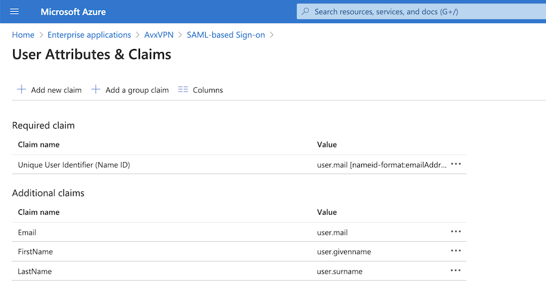

.. meta::

.. raw:: html

   

==============================================================================
OpenVPN® with SAML Authentication on Azure AD IdP
==============================================================================

Overview
-----------------

This guide provides an example on how to configure Aviatrix to authenticate against Azure AD IdP. When SAML client is used, your Aviatrix Controller acts as the Identity Service Provider (ISP) that redirects browser traffic from client to IdP (e.g., Azure AD) for authentication.

Pre-Deployment Checklist
------------------------------------

Before configuring SAML integration between Aviatrix and Azure AD, make sure the following is completed:

#. An `Aviatrix Controller <#azureadsaml-aviatrix-controller>`__ is set up and running.
#. You have an `Azure account <#azureadsaml-azure-account>`__.
#. You have downloaded and installed the `Aviatrix SAML VPN client <#azureadsaml-aviatrix-client>`__.

.. _azureadsaml_aviatrix_controller:

Aviatrix Controller
####################

If you haven’t already deployed the Aviatrix Controller, follow `the Controller Startup Guide <https://docs.aviatrix.com/StartUpGuides/aviatrix-cloud-controller-startup-guide.html>`_.

.. _azureadsaml_azure_account:

Azure Account
#################################

Configure Azure AD on your Azure account before continuing with the configuration.

.. _azureadsaml_aviatrix_client:

Aviatrix VPN Client
###################

All users must use the Aviatrix VPN client to connect to the system. Download the client for your OS `here <../Downloads/samlclient.html>`__.

Configuration Steps
-----------------------------

Follow these steps to configure Aviatrix to authenticate against your Azure AD IDP:

#. Create a `Azure AD SAML Application <#azuread-saml-app>`__ for Aviatrix in the AWS Console.
#. Create a `SAML Endpoint <#azuread-saml-endpoint>`__ in the Aviatrix Controller.

.. _azuread_saml_app:

Azure AD Custom SAML Application
################################

Before you start, pick a short name to be used for the SAML application name. In the notes below we will refer to this as **aviatrix_azuread**, but, it can be any string.

We will use the string you select for the SAML application name to generate a URL for Azure AD to connect with Aviatrix. This URL is defined below as **SP_ACS_URL**. This URL should be constructed as:

   "https://<<<your Controller IP or host name>>>/flask/saml/sso/<<<aviatrix_azuread>>>"

   .. tip::

      Replace **<<<your Controller IP or host name>>>** with the actual host name or IP address of your Controller and **<<<aviatrix_azuread>>>** with the string you chose to refer to the SAML application.

**Connect to Azure**

Log in to your Azure portal.

**Create Custom SAML Application**

#. Go to the Azure Active Directory service.
#. Select **Enterprise Applications** under the **Manage** navigation menu item.
#. Click **+ New application**.

   |imageAddAppsMenu|

   .. note::
      You must be an administrator to add new Enterprise Applications.

#. Click **Non-gallery application**.

   |imageAddAppNonGallery|

#. Enter a Display Name.

   .. note::
      Custom applications require an Azure AD Premium subscription.

   |imageAddAppSetName|

#. Click **Add**.

**Assign Users to this Application**

#. Click **Users and groups** below **Manage**.
#. Click **+ Add user**.
#. Select a User and Role.
#. Click **Assign**.
   
   |imageAssignUser|

**Single Sign-on Configuration**

Click **Single sign-on** below **Manage**.

**Application Domain and URLs**

#. Select **SAML-based Sign-on** from the **Single Sign-on Mode** dropdown menu.
#. Fill out the fields below.

   +----------------------------+-----------------------------------------+
   | Field                      | Value                                   |
   +============================+=========================================+
   | Identifier (Entity ID)     | ``https://<<<your controller>>>``       |
   +----------------------------+-----------------------------------------+
   | Reply URL                  | **SP_ACS_URL**                          |
   +----------------------------+-----------------------------------------+
   | Show Advanced URL settings | checked                                 |
   +----------------------------+-----------------------------------------+
   | Sign on URL                | **SP_ACS_URL**                          |
   +----------------------------+-----------------------------------------+
   | Relay State                | (leave blank)                           |
   +----------------------------+-----------------------------------------+

   |imageSAMLSettings|

**User Attributes**

#. Enter **user.mail** for **User Identifier**.
#. Click **View and edit all other user attributes**.
#. Add the following **SAML Token Attributes** (please find the right values from your Azure user details to match firstname, lastname and email). You can also add "Profile" and send the profile name of a VPN profile  - at this time,we only support attaching one profile per user via SAML.

   +------------------+-----------------------------------------+------------+
   | NAME             | VALUE                                   | NAMESPACE  |
   +==================+=========================================+============+
   | FirstName        | user.givenname                          | (blank)    |
   +------------------+-----------------------------------------+------------+
   | LastName         | user.surname                            | (blank)    |
   +------------------+-----------------------------------------+------------+
   | Email            | user.mail                               | (blank)    |
   +------------------+-----------------------------------------+------------+
 

   |imageUserAttrs|
   
Note: Recently, Azure changed to a New UI "attributes & claims". The following picture is the new reference setting example.

   |imageUserClaims|
   
**SAML Signing Certificate**

#. Find the **Metadata XML** link.
#. Click the link to download the file.

   |imageSAMLMetadata|

**Save Application**

Click **Save**.

.. _azuread_saml_endpoint:

Aviatrix Controller SAML Endpoint
#################################

#. Log in to your Aviatrix Controller.
#. Select OpenVPN > Advanced from the left sidebar.
#. Select the **SAML** tab.
#. Click **+ Add New**.
#. Follow the table below for details on the fields in the table:

   +----------------------------+-----------------------------------------+
   | Field                      | Description                             |
   +============================+=========================================+
   | Endpoint Name              | Pick                                    |
   +----------------------------+-----------------------------------------+
   | IPD Metadata Type          | Text                                    |
   +----------------------------+-----------------------------------------+
   | IDP Metadata Text/URL      | Paste in the metadata XML file contents |
   |                            | downloaded earlier.                     |
   +----------------------------+-----------------------------------------+
   | Entity ID                  | Select **Hostname**                     |
   +----------------------------+-----------------------------------------+
   | Custom SAML Request        | Mark this checkbox                      |
   | Template                   |                                         |
   +----------------------------+-----------------------------------------+

   |imageAvtxSAMLEndpoint|

#. Copy the following into the **Custom SAML Request Template** field:

   .. code-block:: xml
   
      <?xml version="1.0" encoding="UTF-8"?>
      <samlp:AuthnRequest xmlns:samlp="urn:oasis:names:tc:SAML:2.0:protocol" ID="$ID" Version="2.0" IssueInstant="$Time" Destination="$Dest" ForceAuthn="false" IsPassive="false" ProtocolBinding="urn:oasis:names:tc:SAML:2.0:bindings:HTTP-POST" AssertionConsumerServiceURL="$ACS">
      <saml:Issuer xmlns:saml="urn:oasis:names:tc:SAML:2.0:assertion">$Issuer</saml:Issuer>
      </samlp:AuthnRequest>

   .. note::
      This is required to connect with Azure AD. If you don't do this, you will receive an error message when testing.

#. Click **OK*.

Validating
-----------------

.. tip::
   Be sure to assign users to the new application in Azure AD prior to validating.  If you do not assign your test user to the Aviatrix User VPN application, you will receive an error.

You can quickly validate that the configuration is complete by clicking **Test** next to the SAML endpoint.

|imageAvtxTestButton|

.. |imageAddAppsMenu| image:: azuread_saml_media/azure_ad_new_app.png
.. |imageAddAppNonGallery| image:: azuread_saml_media/azure_ad_new_app_non_gallery.png
.. |imageAvtxSAMLEndpoint| image:: azuread_saml_media/avx_controller_saml.png
.. |imageSPMetadataURL| image:: azuread_saml_media/sp_metadata_button.png
.. |imageAvtxTestButton| image:: azuread_saml_media/avtx_test_button.png
.. |imageAddAppSetName| image:: azuread_saml_media/azure_ad_add_new_step_1.png
.. |imageAssignUser| image:: azuread_saml_media/azure_ad_assign_user.png
.. |imageUserAttrs| image:: azuread_saml_media/azure_ad_saml_user_attrs.png

.. |imageSAMLSettings| image:: azuread_saml_media/azure_ad_saml_settings.png
.. |imageSAMLMetadata| image:: azuread_saml_media/azure_ad_saml_metadata.png

