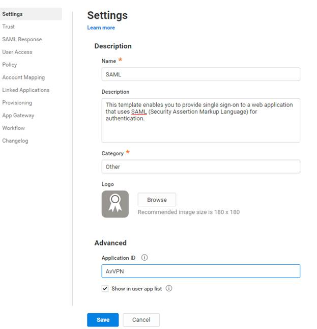
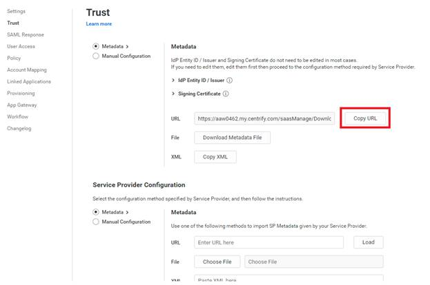
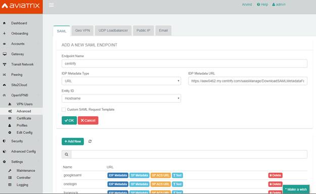
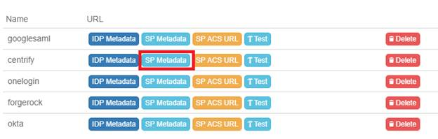
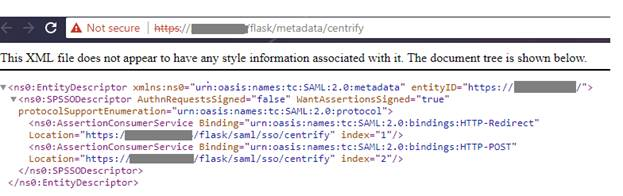
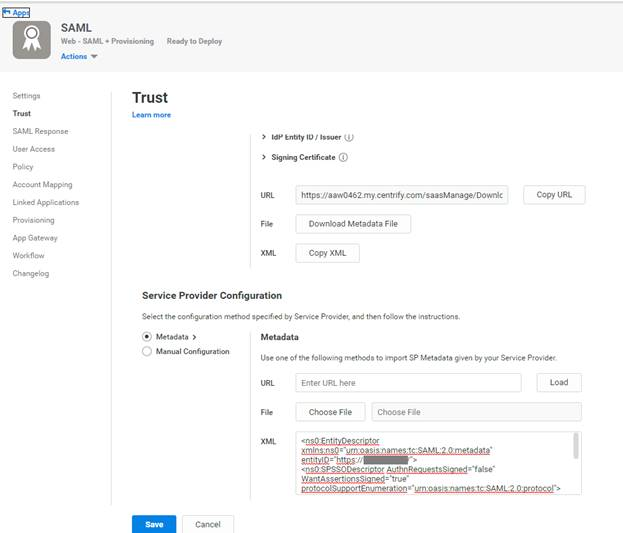
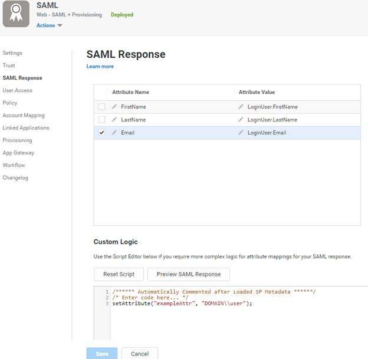
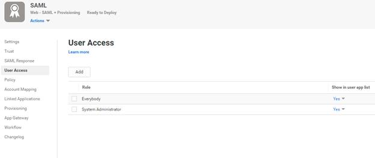
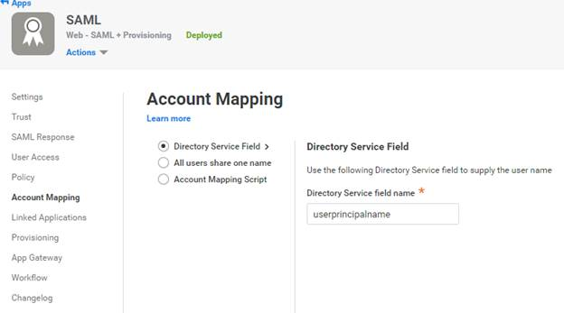
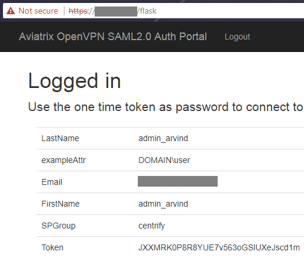



.. toctree::
   :numbered:

==============================================================================
OpenVPN® with SAML Authentication on Centrify IDP
==============================================================================

Overview
------------

This guide provides an example on how to configure Aviatrix to authenticate against Centrify IDP. When SAML client is used, your Aviatrix Controller acts as the Identity Service Provider (SP) that redirects browser traffic from the client to IDP for authentication.

Pre-Deployment Checklist
------------------------------------

Before configuring SAML integration between Aviatrix and AWS SSO, make sure the following is completed:

#. The Aviatrix Controller is set up and running. Follow `the Controller Startup Guide <https://docs.aviatrix.com/StartUpGuides/aviatrix-cloud-controller-startup-guide.html>`__ to launch the Controller.
#. You have Centrify up and running with administrator access.
#. You have downloaded and installed the `Aviatrix VPN client <#awsssosaml-aviatrix-client>`__.

Configuration Steps:
####################

#. From the Centrify App > Add New App > Custom, select SAML and click **Add**. Click **yes** and close the prompt. This lets you configure the application.

#. | Configure app settings\ |image0|
   | Enter a name for your application, click **Save**, and go to the next
     page.

#. Copy the metadata URL from the Trust page.
	
	|image1|
	
	Now go to your Aviatrix Controller. Create a new SAML endpoint from
	OpenVPN as paste the URL into the Metadata URL field. Give an endpoint
	name and click **OK**.
	
	|image2|

#. This creates a SAML endpoint at the Aviatrix Controller.

	|image3|
	Here you can retrieve the SP metadata by clicking on the SP metadata.
	
	|image4|
	
	Copy the above metadata as text.

#. Go back to the Centrify app and paste the information into the Metadata XML section. Click **Save** and go to the next section.

	|image5|
	
   .. note::
      You can also use the URL method if you have configured signed certificates for the Aviatrix Controller, but not for the initial self-signed certificate.

#. Configure the following SAML attributes (Email is the unique identifier)

   +----------------+---------------------+
   | FirstName      | LoginUser.FirstName |
   +----------------+---------------------+
   | LastName       | LoginUser.LastName  |
   +----------------+---------------------+
   | Email          | LoginUser.Email     |
   +----------------+---------------------+

	
	Also, the custom logic needs to be set for the attributes to work
	
		setAttribute("exampleAttr", "DOMAIN\\user");
	
	|image6|
	
	You can preview the SAML response and this step and select the user.
	Make sure that there are no errors.
	
	Click **Save** and go to the next tab.

#. Add users.

	|image7|
	
	Click **Save** and go the next tab.
	
#. Add any policies if you require them. Click **Save** and go to the next tab.

#.	Use the default “Directory service field” mapping. Click **Save** and go to the next tab.
	
	|image8|
	.
#. Configure the next pages if you require them: Linked applications, Provisioning, and App Gateway if you require them. Click **Save**. The SAML configuration at the IDP is now complete.

#. Test the SAML integration. Go back to your Aviatrix Controller and go to OpenVPN > Advanced > SAML tab. Click **test** for the SAML endpoint.

	|image9|
	
	You should get redirected to the Centrify and it may ask for credentials. If you are already logged, it redirects you back to the Controller page.
	
	|image10|
	
	Ignore the warning since you may not have a VPN client already running.
	
#. To test the VPN integration, you need to perform 3 steps at the Aviatrix Controller.

	a. Configure cloud account at Accounts > access account.
	
	b. Create a VPN Gateway in the Gateway page. Mark the **VPN Enabled** and **SAML Enabled** checkboxes.
	
	c. Add a VPN user in the OpenVPN > VPN users page to the SAML VPN gateway with the respective endpoint. The certificate is emailed or can be downloaded here.

#. Test VPN connectivity by installing the Aviatrix VPN client. Load the VPN certificate and click **connect**. The browser should open up. Log in at Centrify. The client then automatically connects to the VPN Gateway. Test connectivity by doing a ping to the private IP of the gateway.

.. |image9| image:: centrify_media/image10.jpg

