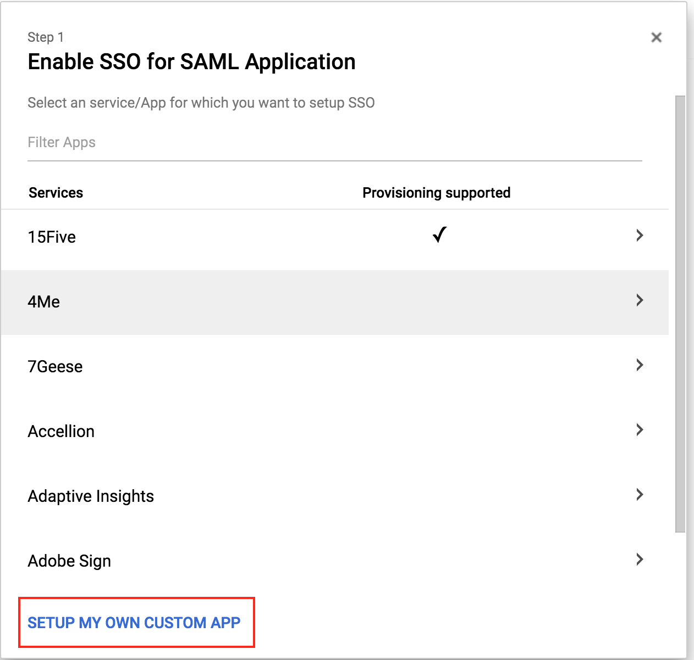
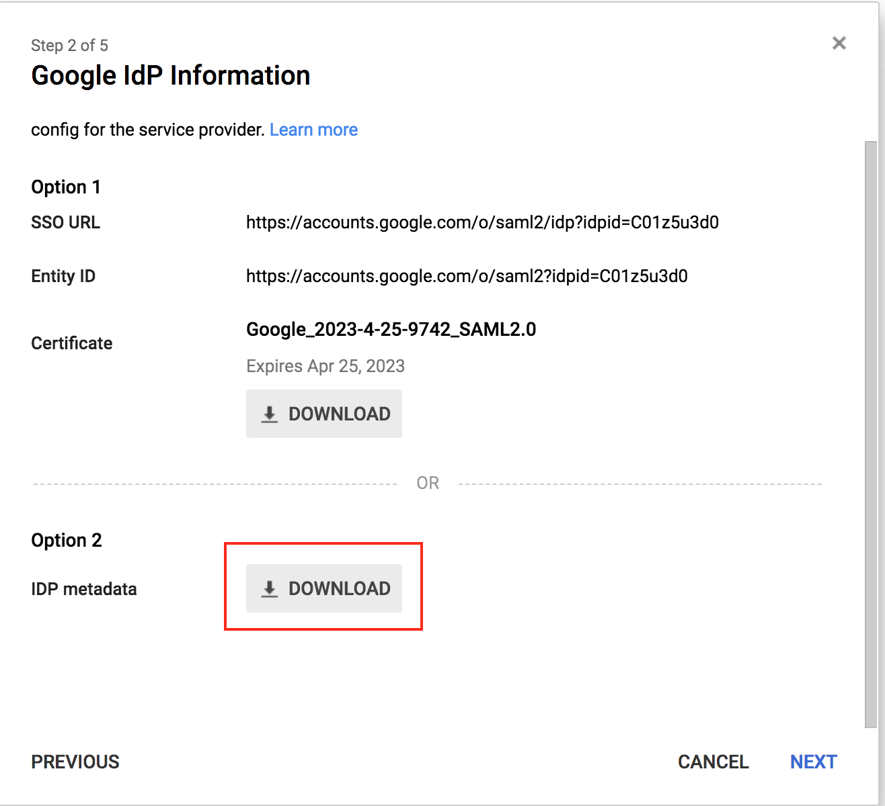
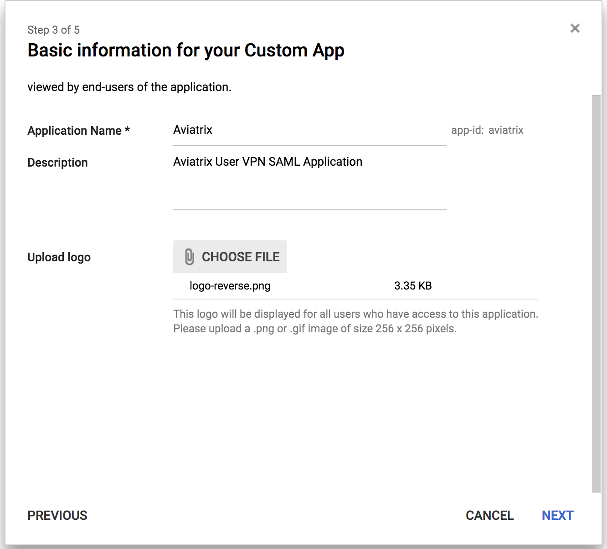
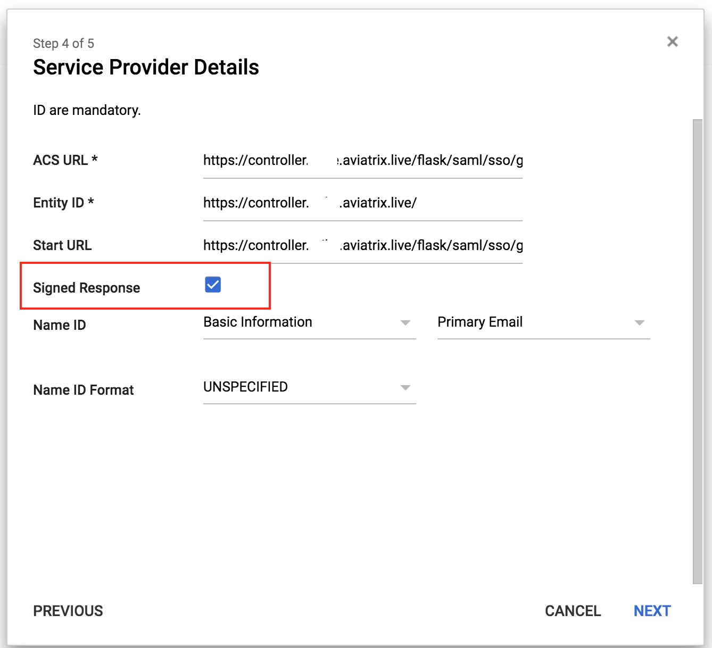
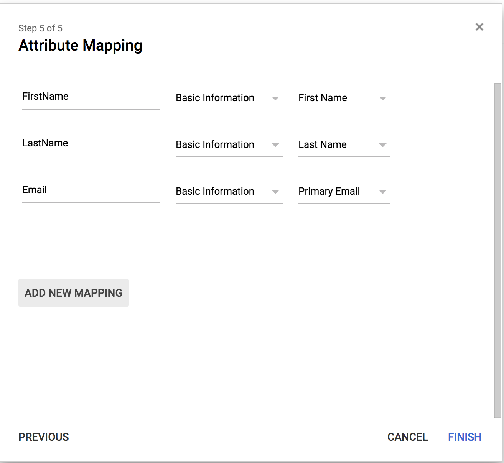
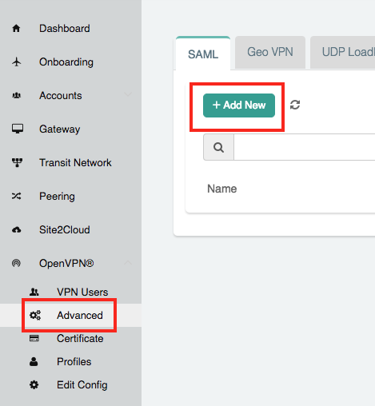

.. meta::
   :description: Aviatrix User SSL VPN Google SAML Configuration
   :keywords: Google, SAML, user vpn, google saml, Aviatrix, OpenVPN

.. toctree::
   :numbered:

==============================================================================
OpenVPN® with SAML Authentication on Google IDP
==============================================================================

Overview
-------------------

This guide provides an example on how to configure Aviatrix to authenticate against a Google IDP. When SAML client is used, your Aviatrix Controller acts as the Identity Service Provider (ISP) that redirects browser traffic from client to IDP (e.g., Google) for authentication.

Pre-Deployment Checklist
-----------------------------------
Before configuring SAML integration between Aviatrix and Google, make sure the following is completed:

#. `Aviatrix Controller <#gsaml_aviatrix-controller>`__ is set up and running.
#. Have a valid `Google account <#gsaml_google-account>`__ with admin access.
#. Download and install the `Aviatrix SAML VPN client <#gsaml_aviatrix-client>`__.

.. _gsaml_aviatrix_controller:

Aviatrix Controller
####################

If you haven’t already deployed the Aviatrix Controller, follow `the Controller Startup Guide <https://docs.aviatrix.com/StartUpGuides/aviatrix-cloud-controller-startup-guide.html>`_.

.. _gsaml_google_account:

Google Account
##############

A Google account with admin access is required to configure the integration.

.. _gsaml_aviatrix_client:

Aviatrix VPN Client
###################

All users must use the Aviatrix VPN client to connect to the system. Download the client for your OS `here <http://docs.aviatrix.com/Downloads/samlclient.html>`__.

Configuration Steps
-----------------------------

Follow these steps to configure Aviatrix to authenticate against your Google IDP:

#. Create a custom `Google SAML App <#gsaml_google-saml-app>`__ for Aviatrix.
#. Launch an `Aviatrix Gateway <#gsaml_aviatrix-gateway>`__.
#. Create Aviatrix `SAML SP Endpoint <#gsaml_aviatrix-saml-endpoint>`__.
#. `Test the Integration <#gsaml_test-integration>`__ is Set Up Correctly.
#. Create `Aviatrix VPN User <#gsaml_aviatrix-vpn-user>`__.
#. `Validate <#gsaml_validate-entire-process>`__.

.. _gsaml_google_saml_app:

Create a Google SAML App for Aviatrix
######################################

.. note::

   This step is usually done by the Google Admin.

#. Log in to the Google Admin portal.
#. Follow `Google documentation <https://support.google.com/a/answer/6087519?hl=en>`__ to create a new **custom** application.

   Click **Setup My Own Custom App**.

   |imageStep1|

   Scroll down to Option 2.  Click **Download** next to the "IDP metadata" label.

   |imageStep2|

#. Basic Information

   +-------------------+-----------------+-------------------------------------+
   | Field             | Value           | Description                         |
   +===================+=================+=====================================+
   | Application Name  | Aviatrix        | This can be any value.  It will be  |
   |                   |                 | displayed in Google only.           |
   +-------------------+-----------------+-------------------------------------+
   | Description       |                 | This can be any value.              |
   +-------------------+-----------------+-------------------------------------+
   |                   | Aviatrix logo:  | Aviatrix logo (optional)            |
   |                   |                 |                                     |
   | Upload logo       | | |logoAlias1|_ |                                     |
   |                   | | |logoAlias2|_ |                                     |
   +-------------------+-----------------+-------------------------------------+

      |imageStep3|

#. Service Provider Details

   +----------------------+----------------------------------------------------+
   | Field                | Value                                              |
   +======================+====================================================+
   | ACS URL              | ``https://[host]/flask/saml/sso/[SP Name]``        |
   +----------------------+----------------------------------------------------+
   | Entity ID            | ``https://[host]/``                                |
   +----------------------+----------------------------------------------------+
   | Start URL            | ``https://[host]/flask/saml/sso/[SP Name]``        |
   +----------------------+----------------------------------------------------+
   | Signed Response      | Mark this checkbox                                 |
   +----------------------+----------------------------------------------------+
   | Name ID              | Basic Information / Primary Email (Default)        |
   +----------------------+----------------------------------------------------+
   | Name ID Format       | Unspecified                                        |

   "[host]" is the hostname or IP of your Aviatrix Controller.  For example, "https://controller.demo.aviatrix.live."

   "[SP Name]" is an arbitrary identifier.  This same value should be used when configuring SAML in the Aviatrix Controller.

   |imageStep4|

#. Attribute Mapping

     +----------------+-----------------+--------------------------------------+
     | Attribute      | Category        | User field                           |
     +================+=================+======================================+
     | FirstName      | Basic           | First Name                           |
     +----------------+-----------------+--------------------------------------+
     | LastName       | Basic           | Last Name                            |
     +----------------+-----------------+--------------------------------------+
     | Email          | Basic           | Primary Email                        |
     +----------------+-----------------+--------------------------------------+

     |imageStep5|

#. Disable **Signed Response**.

   #. Open the Service Provider Details for the SAML application just created. Unmark the **Signed Response** checkbox.
   #. Click **Save**.

.. _gsaml_aviatrix_gateway:

Launching an Aviatrix VPN Gateway
##############################

.. note::

   This step is usually completed by the Aviatrix admin.

.. note::

   This step can be skipped if you already have created a SAML VPN Gateway.

1. Log in to the Aviatrix Controller.
2. Select **Gateway** on the left sidebar.
3. Click the **+ New Gateway**.
4. Enter a Gateway Name.
5. Select the appropriate Account Name, Region, VPC ID, Public Subnet, and Gateway Size.
6. Mark the **VPN Access**.
7. Check **Enable SAML**.

	|imageGwVPNSAML|

8. For information on the other settings, please refer to `this <./uservpn.html>`__ document.
9. Click **OK** to create the Gateway.

.. _gsaml_aviatrix_saml_endpoint:

Creating an Aviatrix SAML Endpoint
#############################

.. note::

   This step is usually completed by the Aviatrix admin.

1. Log in to the Aviatrix Controller.
2. Select OpenVPN® > Advanced on the left sidebar.
3. Select the **SAML** tab.
4. Click **+ Add New**.

   |imageControllerNavOpenVPNAdvanced|

   +-------------------------+-------------------------------------------------+
   | Field                   | Value                                           |
   +=========================+=================================================+
   | Endpoint Name           | ``SP Name`` (Use the same name you entered      |
   |                         | in the Google Application previously)           |
   +-------------------------+-------------------------------------------------+
   | IDP Metadata Type       | Text                                            |
   +-------------------------+-------------------------------------------------+
   | IDP Metadata Text       | ``Value Copied from Google`` (Paste the value   |
   |                         | from Google SAML configuration downloaded       |
   |                         | in a previous step.)                            |
   +-------------------------+-------------------------------------------------+
   | Entity ID               | Hostname                                        |
   +-------------------------+-------------------------------------------------+

5. Click **OK**.

.. _gsaml_test_integration:

Testing the Integration
####################

#. Start the Aviatrix VPN Client.

   .. note::
      If you don't start the client, you will receive a warning from the browser in the last step of this process.

1. Log in to the Aviatrix Controller.
2. Select OpenVPN® > Advanced in the left navigation menu.
3. Select the **SAML** tab.
4. Click **Test** next to the "SP Name" created in the previous step.

   .. tip::

      You will need to assign the new Google application to a test user's Google account before clicking **Test**.

5. You should be redirected to Google. Log in with your test user credentials.

   .. important::

      If everything is configured correctly, once you have authenticated you will be redirected back to the controller and the window will close.

.. _gsaml_create_aviatrix_vpn_user:

Creating a VPN User
#################

1. Log in to the Aviatrix Controller.
2. Select OpenVPN® > VPN Users in the left navigation menu.
3. Click **+ Add New**.
4. Select the **VPC ID** and **LB/Gateway Name** for your SAML Gateway.
5. Enter the Google username in the User Name field.
6. Enter any valid email address in the User Email field (this is where the cert file will be sent). Alternatively, you can download the cert if you do not enter an email address.
7. Select the **SAML Endpoint**.
8. Click **OK**.

.. _gsaml_validate_entire_process:

Validating
########

#. Log in to the Aviatrix Controller.
#. Select OpenVPN® > VPN Users in the left navigation menu.
#. Download the configuration for your test user created in the previous step.
#. Open the Aviatrix VPN Client application.
#. Click **Load Conf** and select the file downloaded.
#. Click **Connect**.

.. note::

   SAML VPN only supports shared certificates. You can share the certificate among VPN users or create more VPN users.

OpenVPN is a registered trademark of OpenVPN Inc.

.. |logoAlias1| replace::  Aviatrix logo with red background
.. _logoAlias1: https://www.aviatrix.com/news/press-kit/logo-aviatrix.png

.. |logoAlias2| replace:: Aviatrix logo with transparent background
.. _logoAlias2: https://www.aviatrix.com/images/logo-reverse.png

.. |imageGwVPNSAML| image:: SSL_VPN_Google_SAML_media/gw_vpn_saml.png

.. disqus::
