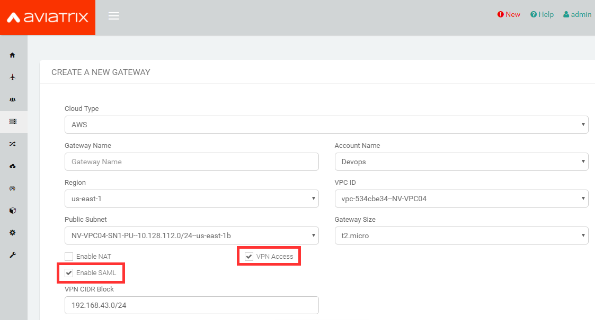

.. toctree::
   :numbered:

==============================================================================
OpenVPN® with SAML Authentication on Okta IDP
==============================================================================

Overview
------------

This guide provides an example on how to configure Aviatrix to authenticate against an Okta IDP. When SAML client is used, your Aviatrix Controller acts as the Identity Service Provider (ISP) that redirects browser traffic from client to IDP (e.g., Okta) for authentication.

Pre-Deployment Checklist
-----------------------------
Before configuring SAML integration between Aviatrix and Okta, make sure the following is completed:

#. The `Aviatrix Controller <#aviatrix-controller>`__ is set up and running.
#. You have a valid `Okta account <#okta-account>`__ with admin access.
#. You have downloaded and installed the `Aviatrix SAML VPN client <#aviatrix-client>`__.

.. _aviatrix_controller:

Aviatrix Controller
####################

If you haven’t already deployed the Aviatrix Controller, follow `the Controller Startup Guide <https://docs.aviatrix.com/StartUpGuides/aviatrix-cloud-controller-startup-guide.html>`_.

.. _okta_account:

Okta Account
############

A valid Okta account with admin access is required to configure the integration.

.. _aviatrix_client:

Aviatrix VPN Client
###################

All users must use the Aviatrix VPN client to connect to the system.  Download the client for your OS `here <http://docs.aviatrix.com/Downloads/samlclient.html>`__.

Configuration Steps
-------------------------

Follow these steps to configure Aviatrix to authenticate against your Okta IDP:

#. Create an `Okta SAML App <#okta-saml-app>`__ for Aviatrix.
#. Retrieve `Okta IDP metadata <#okta-idp-metadata>`__.
#. Launch an `Aviatrix Gateway <#aviatrix-gateway>`__.
#. Create Aviatrix `SAML SP Endpoint <#aviatrix-saml-endpoint>`__.
#. `Test the Integration <#test-integration>`__ is Set Up Correctly.
#. Create `Aviatrix VPN User <#aviatrix-vpn-user>`__.
#. `Validate <#validate-entire-process>`__.

.. _okta_saml_app:

Creating an Okta SAML App for Aviatrix
#####################################

.. note::

   This step is usually done by the Okta Admin.

#. Log in to the Okta Admin portal.
#. Follow `Okta documentation <https://developer.okta.com/standards/SAML/setting_up_a_saml_application_in_okta>`__ to create a new application.

   +----------------+----------------+
   | Field          | Value          |
   +================+================+
   | Platform       | Web            |
   +----------------+----------------+
   | Sign on method | SAML 2.0       |
   +----------------+----------------+

      |image0|

#. General Settings

   +----------------+-----------------+----------------------------------------+
   | Field          | Value           | Description                            |
   +================+=================+========================================+
   | App name       | Aviatrix        | This can be any value.  It will be     |
   |                |                 | displayed in Okta only.                |
   +----------------+-----------------+----------------------------------------+
   |                | Aviatrix logo:  | Aviatrix logo (optional)               |
   |                |                 |                                        |
   | App logo       | | |logoAlias1|_ |                                        |
   |                | | |logoAlias2|_ |                                        |
   +----------------+-----------------+----------------------------------------+
   | App visibility | N/A             | Leave both options unchecked           |
   +----------------+-----------------+----------------------------------------+

      |image1|

#. SAML Settings

   * General

   +----------------------+----------------------------------------------------+
   | Field                | Value                                              |
   +======================+====================================================+
   | Single sign on URL   | ``https://[host]/flask/saml/sso/[SP Name]``        |
   +----------------------+----------------------------------------------------+
   | Audience URI         | ``https://[host]/``                                |
   | (SP Entity ID)       |                                                    |
   +----------------------+----------------------------------------------------+
   | Default RelayState   |                                                    |
   +----------------------+----------------------------------------------------+
   | Name ID format       | Unspecified                                        |
   +----------------------+----------------------------------------------------+
   | Application username | Okta username                                      |
   +----------------------+----------------------------------------------------+

   ``[host]`` is the hostname or IP of your Aviatrix Controller.  For example, "https://controller.demo.aviatrix.live."

   ``[SP Name]`` is an arbitrary identifier.  This same value should be used when configuring SAML in the Aviatrix Controller.

   |image2|

   * Attribute Statements

     +----------------+-----------------+--------------------------------------+
     | Name           | Name format     | Value                                |
     +================+=================+======================================+
     | FirstName      | Unspecified     | user.firstName                       |
     +----------------+-----------------+--------------------------------------+
     | LastName       | Unspecified     | user.lastName                        |
     +----------------+-----------------+--------------------------------------+
     | Email          | Unspecified     | user.email                           |
     +----------------+-----------------+--------------------------------------+

     |image3|

.. _okta_idp_metadata:

Retrieving Okta IDP Metadata
#####################################

.. note::

   This step is usually completed by the Okta admin.

After the application is created in Okta, go to the Sign On tab for the application. Then, click **View Setup Instructions**.

    |image5|

Look for the section titled "Provide the following IDP metadata to your SP provider."

    |idp_metadata|

.. important::

   Copy the text displayed. This value will be used to configure the SAML "IDP Metadata URL" field on the Aviatrix Controller.

You need to assign the application to your account. Please follow steps 11 through 14 at `Okta documentation <https://developer.okta.com/standards/SAML/setting_up_a_saml_application_in_okta>`__.

.. _aviatrix_gateway:

Launching an Aviatrix VPN Gateway
#############################

.. note::

   This step is usually completed by the Aviatrix admin.

#. Log in to the Aviatrix Controller.
#. Click **Gateway** on the left sidebar.
#. Click **+ New Gateway**.
#. Enter a Gateway Name.
#. Select the appropriate Account Name, Region, VPC ID, Public Subnet, and Gateway Size.
#. Mark the **VPN Access**.
#. Mark the **Enable SAML**.
#. For information on the other settings, please refer to `this <./uservpn.html>`__ document.
#. Click **OK** to create the Gateway.

.. _aviatrix_saml_endpoint:

Creating Aviatrix SAML Endpoint
#############################

.. note::

   This step is usually completed by the Aviatrix admin.

#. Login to the Aviatrix Controller.
#. Click **OpenVPN®** on the left sidebar.
#. Select **Advanced**.
#. Select the **SAML** tab.
#. Click **+ Add New**.

   |imageControllerNavOpenVPNAdvanced|

   +-------------------------+-------------------------------------------------+
   | Field                   | Value                                           |
   +=========================+=================================================+
   | Endpoint Name           | ``SP Name`` (Use the same name you entered      |
   |                         | in the Okta Application previously)             |
   +-------------------------+-------------------------------------------------+
   | IDP Metadata Type       | Text                                            |
   +-------------------------+-------------------------------------------------+
   | IDP Metadata Text       | ``Value Copied from Okta`` (Paste the value     |
   |                         | copied from Okta SAML configuration)            |
   +-------------------------+-------------------------------------------------+
   | Entity ID               | Hostname                                        |
   +-------------------------+-------------------------------------------------+

#. Click **OK**.

.. _test_integration:

Testing the Integration
####################

#. Start the Aviatrix VPN Client.

   .. note::
      If you don't start the client, you will receive a warning from the browser in the last step of this process

#. Log in to the Aviatrix Controller.
#. Click **OpenVPN®** on the left sidebar.
#. Select **Advanced**.
#. Select the **SAML** tab.
#. Click **Test** next to the "SP Name" created in the previous step.

   .. tip::

      You will need to assign the new Okta application to a test user's Okta account before clicking **Test**.

#. You should be redirected to Okta. Log in with your test user credentials.

   .. important::

      If everything is configured correctly, once you have authenticated you will be redirected back to the Controller and the window will close.

.. _create_aviatrix_vpn_user:

Create a VPN User
#################

#. Log in to the Aviatrix Controller.
#. Select OpenVPN® > VPN Users on the left sidebar.
#. Click **+ Add New**.
#. Select the **VPC ID** and **LB/Gateway Name** for your SAML Gateway.
#. Enter a name in the User Name field.
#. Enter any valid email address in the User Email field (this is where the cert file will be sent). Alternatively, you can download the cert if you do not enter an email address.
#. Select the **SAML Endpoint**.
#. Click **OK**.

.. _validate_entire_process:

Validate
########

#. Log in to the Aviatrix Controller.
#. Click OpenVPN® > VPN Users on the left sidebar.
#. Download the configuration for your test user created in the previous step.
#. Open the Aviatrix VPN Client application.
#. Click **Load Conf** and select the file downloaded.
#. Click **Connect**.

.. note::

   SAML VPN supports shared certificates. You can share the certificate among VPN users or create more VPN users.

Configuring Okta for Multi Factor Authentication (Optional)
########################################################

Once you have successfully configured Okta IDP with Aviatrix SP, you can configure Okta for Multi Factor Authentication.

Please read this `article <https://support.okta.com/help/Documentation/Knowledge_Article/Multifactor-Authentication-1320134400>`__ from Okta on Multifactor setup.

See this `article <https://support.okta.com/help/Documentation/Knowledge_Article/Configuring-Duo-Security-734413457>`__ if you're interested in using Duo in particular.

OpenVPN is a registered trademark of OpenVPN Inc.

.. |logoAlias1| replace::  Aviatrix logo with red background
.. _logoAlias1: https://aviatrix.com/wp-content/uploads/2020/09/Aviatrix_logo_reverse.png

.. |logoAlias2| replace:: Aviatrix logo with transparent background
.. _logoAlias2: https://aviatrix.com/wp-content/uploads/2020/09/Aviatrix_logo.png

.. |image0| image:: SSL_VPN_Okta_SAML_media/image0.png

.. |image1| image:: SSL_VPN_Okta_SAML_media/image1.png

.. |image2| image:: SSL_VPN_Okta_SAML_media/image2.png

.. |image3| image:: SSL_VPN_Okta_SAML_media/image3.png

.. |image4| image:: SSL_VPN_Okta_SAML_media/image4.png

.. |image5| image:: SSL_VPN_Okta_SAML_media/image5.png

.. |idp_metadata| image:: SSL_VPN_Okta_SAML_media/idp_metadata.png
   :scale: 30%

.. |image6| image:: SSL_VPN_Okta_SAML_media/image6.png

.. |imageControllerNavOpenVPNAdvanced| image:: SSL_VPN_Okta_SAML_media/OpenVPN_Advanced_SAML_AddNew.png
   :scale: 50%

.. disqus::
