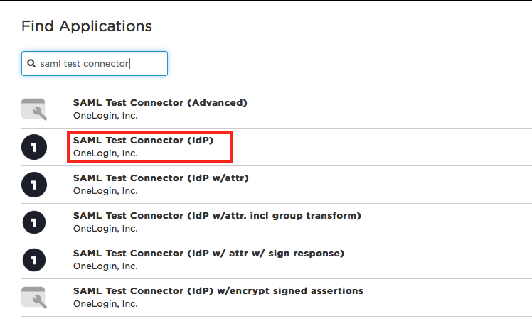
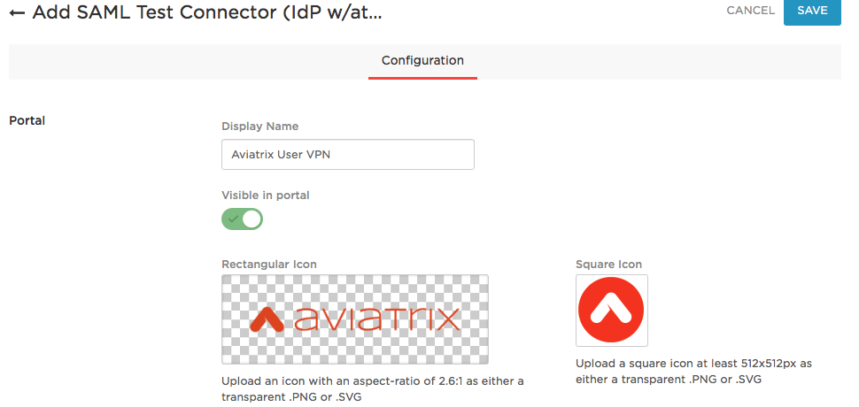
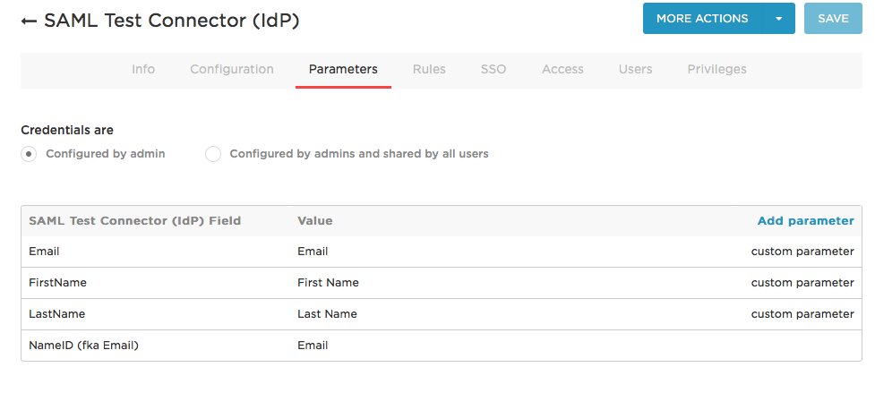
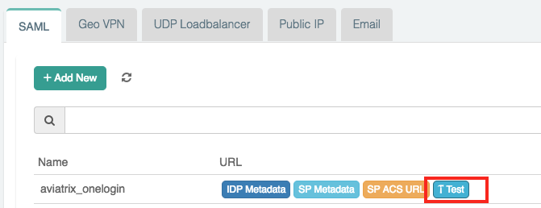
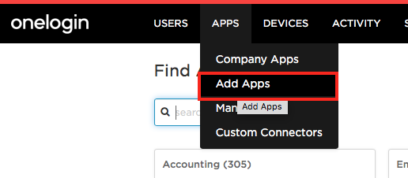
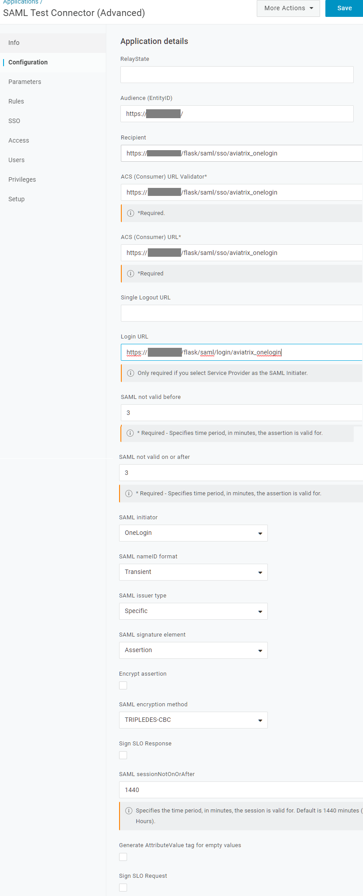

.. meta::

.. toctree::
   :numbered:

==============================================================================
OpenVPN® with SAML Authentication on OneLogin IdP
==============================================================================

Overview
-----------------

This guide provides an example on how to configure Aviatrix to authenticate against a OneLogin IdP. When SAML client is used, your Aviatrix Controller acts as the Identity Service Provider (ISP) that redirects browser traffic from client to IdP (e.g., OneLogin) for authentication.

Pre-Deployment Checklist
-----------------------------------

Before configuring SAML integration between Aviatrix and OneLogin, make sure the following is completed:

#. `Aviatrix Controller <#aviatrix-controller>`__ is set up and running.
#. Have a valid `OneLogin account <#onelogin-account>`__ with admin access.
#. Download and install the `Aviatrix SAML VPN client <#aviatrix-client>`__.

.. _aviatrix_controller:

Aviatrix Controller
####################

If you haven’t already deployed the Aviatrix Controller, follow `the Controller Startup Guide <https://docs.aviatrix.com/StartUpGuides/aviatrix-cloud-controller-startup-guide.html>`_.

.. _onelogin_account:

OneLogin Account
################

A valid OneLogin account with admin access is required to configure the integration.

.. _aviatrix_client:

Aviatrix VPN Client
###################

All users must use the Aviatrix VPN client to connect to the system. Download the client for your OS `here <../Downloads/samlclient.html>`__.

Configuration Steps
------------------------------

Follow these steps to configure Aviatrix to authenticate against your OneLogin IDP:

#. Create a `OneLogin SAML App <#onelogin-saml-app>`__ for Aviatrix.
#. Create a `SAML Endpoint <#onelogin-saml-endpoint>`__ in the Aviatrix Controller.

.. _onelogin_saml_app:

OneLogin SAML App
#################

Before you start, pick a short name to be used for the SAML application name. In the notes below, we will refer to this as **aviatrix_onelogin**, but it can be any string.

We will use the string you select for the SAML application name to generate a URL for OneLogin to connect with Aviatrix. This URL is defined below as **SP_ACS_URL**.  This URL should be constructed as:

   "https://<your controller ip or host name>/flask/saml/sso/<aviatrix_onelogin>"

   .. tip::

      Replace **<your Controller IP or host name>** with the actual host name or IP address of your controller and **<aviatrix_onelogin>** with the string you chose to refer to the SAML application.
   
#. Log in to OneLogin as an administrator.
#. Add a new App (Apps > Add Apps).

   |imageOLAddAppsMenu|
   
#. Search for "SAML Test Connector."

   |imageOLNewAppSearch|

#. Select **SAML Test Connector (Advanced)**.
#. Enter the Configuration values and click **Save**.

   |imageOLNewAppStep1|

   You can download the rectangular image from `here <./onelogin_saml_media/aviatrix-logo-rect.png>`__ and the square image from `here <./onelogin_saml_media/aviatrix-logo-square.png>`__.

#. Click on **Configuration** tab.
#. Enter the values.

   +--------------------+------------------------------------------------------+
   | Field              | Value                                                |
   +====================+======================================================+
   | RelayState         | Blank                                                |
   +--------------------+------------------------------------------------------+
   | Audience(Entity ID)| **SP Entity ID**                                     |
   +--------------------+------------------------------------------------------+
   | Recipient          | **SP_ACS_URL**                                       |
   +--------------------+------------------------------------------------------+
   | ACS (Consumer)     | **SP_ACS_URL**                                       |
   | URL Validator      |                                                      |
   +--------------------+------------------------------------------------------+
   | ACS (Consumer) URL | **SP_ACS_URL**                                       |
   +--------------------+------------------------------------------------------+
   | Single Logout URL  | Blank                                                |
   +--------------------+------------------------------------------------------+
   | Login URL          | **SP Login(Test) URL**                               |
   +--------------------+------------------------------------------------------+
   | SAML not valid     | 3 (default)                                          |
   | before             |                                                      |
   +--------------------+------------------------------------------------------+
   | SAML not valid     | 3 (default)                                          |
   | on or after        |                                                      |
   +--------------------+------------------------------------------------------+
   | SAML initiator     | Service Provider                                     |
   +--------------------+------------------------------------------------------+
   | SAML nameID format | Transient                                            |
   +--------------------+------------------------------------------------------+
   | SAML issuer type   | Specific (default)                                   |
   +--------------------+------------------------------------------------------+
   | SAML signature     | Assertion                                            |
   | element            |                                                      |
   +--------------------+------------------------------------------------------+
   | Encrypt assertion  | Unmarked checkbox (default)                          |
   +--------------------+------------------------------------------------------+
   | SAML encryption    | TRIPLEDES-CBC (default)                              |
   | method             |                                                      |
   +--------------------+------------------------------------------------------+
   | Sign SLO Response  | Unmarked checkbox (default)                          |
   +--------------------+------------------------------------------------------+
   | SAML               | 1440 (default)                                       |
   | sessionNotOnOrAfter|                                                      |
   +--------------------+------------------------------------------------------+
   | Generate           | Unmarked checkbox (default)                          |
   | AttributeValue tag |                                                      |
   | for empty values   |                                                      |
   +--------------------+------------------------------------------------------+
   | Sign SLO Request   | Unmarked checkbox (default)                          |
   +--------------------+------------------------------------------------------+
   
   |imageConfiguration|

#. Click **Save**.
#. Select the **Parameters** tab.
#. Add the following custom parameters (case sensitive).

   +--------------------+------------+-----------------------------------------+
   | Field              | Value      | Flags                                   |
   +====================+============+=========================================+
   | Email              | Email      | Include in SAML assertion               |
   +--------------------+------------+-----------------------------------------+
   | FirstName          | First Name | Include in SAML assertion               |
   +--------------------+------------+-----------------------------------------+
   | LastName           | Last Name  | Include in SAML assertion               |
   +--------------------+------------+-----------------------------------------+

   |imageOLNewAppParams|

#. Optionally, add a field to map to the profile in Aviatrix.

   +--------------------+----------------+-------------------------------------+
   | Field              | Value          | Flags                               |
   +====================+================+=====================================+
   | Profile            | (User Defined) | Include in SAML assertion           |
   +--------------------+----------------+-------------------------------------+
 

#. Click **Save**.
#. Click on **More actions** dropdown menu.
#. Copy the **Metadata URL**.
   
   |imageOLSSOTab| 
   
.. _onelogin_saml_endpoint:

Aviatrix Controller SAML Endpoint
#################################

#. Log in to your Aviatrix Controller.
#. Select OpenVPN > Advanced on the left sidebar.
#. select the **SAML** tab.
#. Click **+ Add New**.
#. Follow the table below for details on the fields in the table:

   +----------------------------+-----------------------------------------+
   | Field                      | Description                             |
   +----------------------------+-----------------------------------------+
   | Endpoint Name              | Pick                                    |
   +----------------------------+-----------------------------------------+
   | IPD Metadata Type          | URL                                     |
   +----------------------------+-----------------------------------------+
   | IDP Metadata Text/URL      | Paste in the **Metadata URL** obtained  |
   |                            | from the OneLogin app.                  |
   +----------------------------+-----------------------------------------+
   | Entity ID                  | Select `Hostname`                       |
   +----------------------------+-----------------------------------------+
   | Custom SAML Request        | Unmarked checkbox                       |
   | Template                   |                                         |
   +----------------------------+-----------------------------------------+

   |imageAvtxSAMLEndpoint|

Testing the Integration
-----------------------------

You can quickly validate that the configuration is complete by clicking **Test** next to the SAML endpoint.

|imageAvtxTestSAML|

.. _create_aviatrix_vpn_user:

Creating a VPN User
#################

#. Log in to the Aviatrix Controller.
#. Select OpenVPN® > VPN Users on the left sidebar.
#. Click **+ Add New**.
#. Select the **VPC ID** and **LB/Gateway Name** for your SAML Gateway.
#. Enter a name in the User Name field.
#. Enter any valid email address in the User Email field (this is where the cert file will be sent). Alternatively, you can download the cert if you do not enter an email address.
#. Select the **SAML Endpoint**.
#. Click **OK**.

.. _validate_entire_process:

Validating
##########

#. Log in to the Aviatrix Controller.
#. Select OpenVPN® > VPN Users on the left sidebar.
#. Download the configuration for your test user created in the previous step.
#. Open the Aviatrix VPN Client application.
#. Click **Load Conf** and select the file downloaded.
#. Click **Connect**.

.. |imageAvtxSAMLEndpoint| image:: onelogin_saml_media/avtx_saml_endpoint.png

.. |imageOLSSOTab| image:: onelogin_saml_media/onelogin_issuer_url.png\
