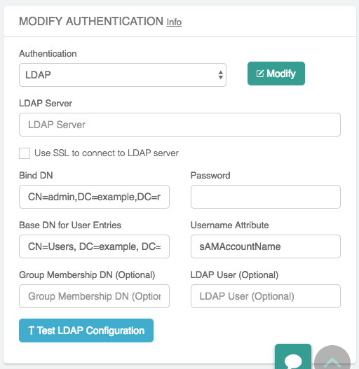

.. meta::
   :description: Configure LDAP authentication for VPN Users
   :keywords: user vpn, ldap, authentication, ad, active directory, u2c

.. raw:: html

   

===============================================================
LDAP Configuration for Authenticating VPN Users
===============================================================

Overview
--------------------

Aviatrix provides integration with an LDAP/AD server for the authentication of users logging into the VPN services.  This guide walks you through the configuration steps.

Configuration Details
--------------------------------

.. note::
   This step must be done by an existing Aviatrix Controller admin user.

.. tip::
   This configuration before or after a gateway is created. These steps assume it is done after creation.

#. Log in to your Controller.
#. Select **OpenVPN** on the left sidebar.
#. Select **Edit Config**.
#. In the **Modify Authentication** section, click on the **LDAP** below the Authentication label.

   |imageLDAPForm|

#. Enter the values as described in the table below.

   +-------------------------+-------------------------------------------------+
   | Field                   | Description                                     |
   +=========================+=================================================+
   | LDAP Server             | Enter the public IP or hostname for the LDAP    |
   |                         | / AD server.                                    |
   +-------------------------+-------------------------------------------------+
   | Use TLS to connect to   | When this checkbox is marked, STARTTLS is used  |
   | LDAP server             | to connect with the LDAP server. NOTE: LDAP Over|
   |                         | SSL is not supported (port 636).                |
   +-------------------------+-------------------------------------------------+
   | Client Certificate      | Only visible if the **Use TLS to connect ...**  |
   |                         | checkbox is marked.                             |
   |                         | This file must be in PEM format and contain a   |
   |                         | public and private key pair.                    |
   +-------------------------+-------------------------------------------------+
   | CA Certificate          | Only visible if the **Use TLS to connect ...**  |
   |                         | checkbox is marked.                             |
   +-------------------------+-------------------------------------------------+
   | Bind DN                 | DN of the user that the Gateway will use to     |
   |                         | authenticate with the LDAP server to handle     |
   |                         | user authentication.                            |
   +-------------------------+-------------------------------------------------+
   | Password                | The password of the Bind DN user.               |
   +-------------------------+-------------------------------------------------+
   | Base DN for User Entries| Starting point in the directory for searching   |
   |                         | for matching usernames.                         |
   +-------------------------+-------------------------------------------------+
   | Username Attribute      | User attribute name for username to match.      |
   +-------------------------+-------------------------------------------------+
   | Group Membership DN     | LDAP                                            |
   | (Optional)              | `search <https://ldap.com/ldap-filters/>`__     |
   |                         | filter.  This value must be entered in the      |
   |                         | form of a query.  For example:\                 |
   |                         |                                                 |
   |                         | *for Linux OpenLDAP:\                           |
   |                         | ``memberOf=cn=vpn_users,DC=example,DC=com``\    |
   |                         |                                                 |
   |                         | *for Windows Active Directory:\                 |
   |                         | ``cn=vpn_users,DC=example,DC=com``\             |
   +-------------------------+-------------------------------------------------+
   | LDAP User (Optional)    | This field is only used when you click          |
   |                         | **Test LDAP Configuration**.  It will use       |
   |                         | this value to search and respond if it was      |
   |                         | able to connect and find the user.              |
   +-------------------------+-------------------------------------------------+
   | LDAP User (Optional)    | This field is only used when you click    |
   |                         | **Test LDAP Configuration**.  It will use  |
   |                         | this value to search and respond if it was      |
   |                         | able to connect and find the user.              |
   +-------------------------+-------------------------------------------------+

#. Enter a value for **LDAP User** and click **Test LDAP Configuration** to test the configuration.
#. Click **Modify** to save this configuration.

