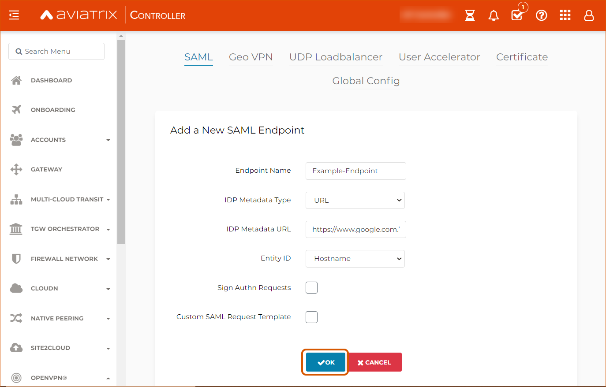
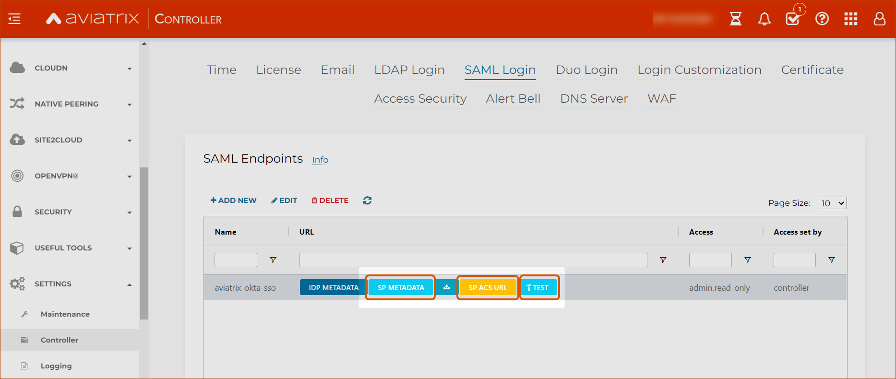
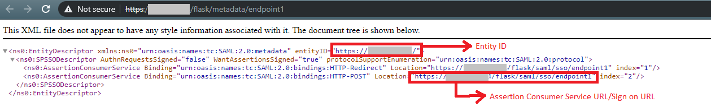

.. meta::
   :description: Aviatrix User SSL VPN Okta SAML Configuration
   :keywords: SAML, user vpn, saml, Aviatrix, OpenVPN, IdP, sp

=================================
OpenVPN® with SAML Authentication
=================================

Overview
-----------------------

There are two methods to authenticate a VPN client: `Okta API Token <https://docs.aviatrix.com/HowTos/HowTo_Setup_Okta_for_Aviatrix.html>`_ or an Aviatrix SAML client.

This document shows you how to setup VPN authentication using an Aviatrix SAML client.

The Aviatrix user VPN is one of the OpenVPN® based remote VPN solutions that provides a VPN client with SAML authentication capability.

This step-by-step guide shows you how to use an Aviatrix SAML client to authenticate an IdP. When a SAML client is used, the Aviatrix Controller acts as the service provider (SP) that redirects browser traffic from the client to the IdP for authentication.

For different IdPs, there will be links to each individual IdP integration.

Pre-Deployment Checklist
---------------------------------------
Before configuring the SAML integration between Aviatrix and your IdP, make sure the following is completed:

	#. The `Aviatrix Controller <#pdc-21>`__ is setup and running.
	#. You have a valid `IdP account <#pdc-22>`__ with admin access.
	#. You have `Downloaded and installed <#pdc-23>`__ the Aviatrix SAML client.

.. _PDC_21:

Aviatrix Controller
#######################

If you haven’t already deployed the Aviatrix Controller, follow `these instructions <../StartUpGuides/aviatrix-cloud-controller-startup-guide.html>`__ to deploy the Aviatrix Controller.

.. _PDC_22:

IdP Account
###############

An identity provider (IdP) is any provider that supports a SAML endpoint like `Okta <./SAML_Integration_Okta_IdP.html>`__,
`OneLogin <./SAML_Integration_OneLogin_IdP.html>`__, `Google <./SAML_Integration_Google_IdP.html>`__,
`AWS SSO <./SAML_Integration_AWS_SSO_IdP.html>`__, `Azure AD <./SAML_Integration_Azure_AD_IdP.html>`__, and `PingOne <./SAML_Integration_PingOne_IdP.html>`__.
Administrator access is required to create IdP endpoints for SAML. For a list of supported IdPs, see `IdP-specific SAML App Integration <https://docs.aviatrix.com/HowTos/Controller_Login_SAML_Config.html#IdP-specific>`_.

.. _PDC_23:

Aviatrix VPN Client
#######################

All users must use the Aviatrix VPN client to connect to the system.  Download the client for your OS `here <http://docs.aviatrix.com/Downloads/samlclient.html>`__.

Configuration
--------------------

The configuration consists of 8 parts:

  1. Create a `temporary Aviatrix SP Endpoint <#config-31>`__ for Aviatrix.
  2. Create a `SAML IdP App <#config-32>`__ with specific IdP.
  3. Retrieve `IdP Metadata <#config-33>`__ from IdP.
  4. Update the `Aviatrix SP Endpoint <#config-34>`__ with IdP metadata.
  5. `Test the SAML Integration <#config-35>`__.
  6. Launch an `Aviatrix Gateway <#config-36>`__.
  7. Create `Aviatrix VPN user(s) <#config-37>`__.
  8. `Test VPN Connectivity <#config-38>`__.

.. _Config_31:

Creating a Temporary Aviatrix SP Endpoint
###########################################

.. note::

   This step is usually completed by the Aviatrix admin.
   This endpoint will be updated later on in the guide; at this step, we will be using placeholder values.
   Choose an endpoint name for your Aviatrix SAML endpoint which will be used throughout the guide.
   This guide will use ``aviatrix_saml_controller`` as an example for the endpoint name.

#. Log in to the Aviatrix Controller and go to OpenVPN > Advanced > SAML > click **+ Add New**.
      
   +-------------------------+--------------------------------------------------------+
   | Field                   | Value                                                  |
   +=========================+========================================================+
   | Endpoint Name           | Enter a unique identifier for the service provider.    |
   +-------------------------+--------------------------------------------------------+
   | IPD Metadata Type       | Text or URL (depending on what was                     |
   |                         | provided by the SAML provider).                        |
   |                         | For now, choose URL.                                   |
   +-------------------------+--------------------------------------------------------+
   | IdP Metadata Text/URL   | IdP metadata URL/Text copied from the SAML             |
   |                         | provider configuration                                 |
   |                         | For now, put in a placeholder URL,                     |
   |                         | such as "https://www.google.com."                      |
   +-------------------------+--------------------------------------------------------+
   | Entity ID               | Select `Hostname` for now.                             |
   +-------------------------+--------------------------------------------------------+
   | Sign Authn Requests     | Sign the cert when requesting to IDP from client.      |
   +-------------------------+--------------------------------------------------------+
   | Access                  | (Removed from 6.0 and later) Select admin or read-only |
   |                         | access.                                                |
   +-------------------------+--------------------------------------------------------+
   | Custom SAML Request     | For now leave blank, depending on your specific        |
   | Template                | IdP, you may have to mark this checkbox.               |
   +-------------------------+--------------------------------------------------------+
   
   |create-endpoint|
   
   SP Metadata looks like:

   |imagespmetadata| 

.. note::
   Each endpoint only supports one type of access. If you need admin and read-only access, create two separate SAML apps.

#. Click **OK**.
#. Depending on your IdP provider, you may need to upload SP metadata. After temporary SAML endpoint is created:

- Right-click the **SP Metadata** button next to the SAML endpoint and save the file to your local machine.
- Click **SP Metadata** and copy the SP metadata as text.

.. _Config_32:

Creating a SAML App for Aviatrix with the IdP
###############################################

.. note::

   This step is usually done by the IdP administrator.
   This section shows only a generalized process for creating a SAML application.
   Refer to the `IdP-specific SAML App Integration <#IdP-integration>`_ section for links to detailed steps with each particular IdP.

Create a SAML 2.0 app with the IdP Provider with the following values.

#. Assertion Consumer Service URL*
#. Audience URI(Entity ID)*
#. SP Metadata URL*
#. SP Login URL*
#. Default RelayState* = <empty>
#. Application username = IdP username

.. important::

   You can find these values in the Controller under Settings > Controller > select the SAML Login tab.
   * Assertion Consumer Service URL (ACS URL)  - Click **SP ACS URL** in the URL column of the SAML Endpoints table.
   * Audience URI (Entity ID)  Click **SP Metadata** to open the metadata. Find this URL listed by "entityID." 
   * SP Metadata URL - Click **SP Metadata** to open this metadata. You can also click the download icon next to SP Metadata in the SAML Endpoints table to download the metadata file.
   * SP Login URL - Click **Test** to open this URL.

   RelayState is currently not used by the Aviatrix SP.

|values-in-controller|

The following SAML attributes are expected:

#. FirstName
#. LastName
#. Email (unique identifier for SAML)

.. note::

   These values are case sensitive.

.. _IdP_Integration:

**IdP-specific SAML App Integration**

.. note::

  You will require administrator access to create IdP endpoints for SAML.

These are guides with specific IdP's that were tested to work with Aviatrix SAML integration:

#. `AWS SSO <./SAML_Integration_AWS_SSO_IdP.html>`__
#. `Azure AD <./SAML_Integration_Azure_AD_IdP.html>`__
#. `Centrify <./SAML_Integration_Centrify_IdP.html>`__
#. `Google <./SAML_Integration_Google_IdP.html>`__
#. `Okta <./SAML_Integration_Okta_IdP.html>`__
#. `OneLogin <./SAML_Integration_OneLogin_IdP.html>`__
#. `PingOne <./SAML_Integration_PingOne_IdP.html>`__

Other tested IdPs include:
VmWare VIDM, ForgeRock's OpenAM etc.

.. _Config_33:

Retrieving IdP Metadata
##########################

After creating the IdP, you need to retrieve IdP Metadata either in URL or text from the IdP application created in the previous step.

#. AWS SSO  - provides IdP metadata URL, needs a custom SAML request template, and will need to provide SP metadata file from Aviatrix.
#. Azure AD - provides IdP metadata URL and needs a custom SAML request template.
#. Centrify - provides IdP metadata URL and will need to provide SP metadata text from Aviatrix.
#. Google   - provides IdP metadata text.
#. Okta     - provides IdP metadata text.
#. OneLogin - provides IdP metadata URL.
#. PingOne  - provides IdP metadata URL.

.. _Config_34:

Updating Aviatrix SP Endpoint
###############################

.. note::

  This step is usually completed by the Aviatrix admin.
  Take note of the IdP Metadata type along with Text/URL your IdP provides, and if you need a custom SAML request template in the previous section.

#. In your Controller, go to OpenVPN® > Advanced > on the SAML tab, click **+ Add New**.

   +----------------------------+----------------------------------------------------------+
   | Field                      | Description                                              |
   +----------------------------+----------------------------------------------------------+
   | Endpoint Name              | Unique name that you chose in the "Creating a Temporary  |
   |                            | Aviatrix SP Endpoint" section above.                     |
   +----------------------------+----------------------------------------------------------+
   | IPD Metadata Type          | Text or URL (depending on what was                       |
   |                            | provided by the SAML provider).                          |
   +----------------------------+----------------------------------------------------------+
   | IdP Metadata Text/URL      | Paste in the IdP metadata URL/Text                       |
   |                            | copied from the SAML provider                            |
   |                            | configuration.                                           |
   +----------------------------+----------------------------------------------------------+
   | Entity ID                  | Select **Hostname** or **Custom**.                       |
   +----------------------------+----------------------------------------------------------+
   | Custom Entity ID           | Only visible if the Entity ID is **Custom**.             |
   +----------------------------+----------------------------------------------------------+
   | Access                     | Select admin or read-only access.                        |
   +----------------------------+----------------------------------------------------------+
   | Custom SAML Request        | Depending on your specific IdP,                          |
   | Template                   | you may have to mark this checkbox.                      |
   |                            | Refer to `IdP-specific Integration <#IdP-integration>`_. |
   +----------------------------+----------------------------------------------------------+

.. note::
  `Hostname` is the default for Entity ID, but if you have other apps using the same hostname, use a custom Entity ID.

.. _Config_35:

Testing the Integration
########################

.. note::

   Have an instance of the VPN client running.  If you do not, it might throw a warning.

#. Log in to the Aviatrix Controller.
#. Select OpenVPN® > Advanced on the left sidebar.
#. Stay on the SAML tab.
#. Select the row that was created in the previous step (that includes your endpoint name).
#. Click on the **Test** action.
#. You should be redirected to the IdP. Now, you can log in and should be redirected back to the Controller.

.. _Config_36:

Launching Aviatrix Gateway
###########################

.. note::

  This step is usually completed by the Aviatrix admin.

1. In your Controller, go to Gateway > click **+ New Gateway**.
2. Select the appropriate values for where to provision this Gateway.
3. Mark the **VPN Access** checkbox, the **Advanced** checkbox, and then the **Enable SAML** checkbox.

	|gateway-options|

4. Leave the default settings for everything else.
5. Click **OK** to launch the gateway.

.. _Config_37:

Creating VPN User(s)
######################

+----------------------------+-----------------------------------------+
| Field                      | Description                             |
+----------------------------+-----------------------------------------+
| VPC ID                     | Select the VPC/VNet where the Gateway   |
|                            | was created.                            |
+----------------------------+-----------------------------------------+
| LB/Gateway Name            | Select the appropriate load balancer    |
|                            | or gateway.                             |
+----------------------------+-----------------------------------------+
| User Name                  | Name of the VPN user                    |
+----------------------------+-----------------------------------------+
| User Email                 | Any valid email address (this is where  |
|                            | the cert file will be sent).            |
|                            | Alternatively, you can download the cert|
|                            | if you don't enter an email.             |
+----------------------------+-----------------------------------------+
| SAML Endpoint              | Select the SAML endpoint.               |
+----------------------------+-----------------------------------------+

.. note::

   SAML  supports shared certificates.  You can share the certificate among VPN users or create more VPN users.

.. _Config_38:

Testing VPN Connectivity
#########################

1. Download and install the Aviatrix VPN client for your platform from `here <https://aviatrix-systems-inc-docs.readthedocs-hosted.com/Downloads/samlclient.html>`__.
2. Launch the Aviatrix client and load the certificate ("Load config")that you downloaded/received from email on the Testing the Integration" section above.
3. Click **Connect**. This should launch the browser instance and prompt you for authentication, if not already logged in.
4. If the connection is successful, the client icon should turn green.
5. You can ensure VPN connectivity by trying to ping the private IP of the gateway you launched or any other instance in the same cloud network.

============================
SAML Profile as an Attribute
============================

The VPN user gets a VPN profile rule configured to the one that is attached to the VPN User from the OpenVPN > Profiles page.
If preferred, this can also be passed as attribute from the IDP. The IDP could send the "Profile" attribute along with the existing "FirstName," "LastName," and "Email" attributes.
If the "Profile" attribute is set and the value sent from the IDP matches with any of the profile names configured from the Controller, the profile rules are applied accordingly. 
Note that if the IDP sends an invalid or empty Profile attribute, the default profile association is used.

This way Profile associations can be configured at IDP instead of configuring at the Controller.

Multiple Profiles is supported when using Profile as attribute starting with `release 5.4 <https://docs.aviatrix.com/HowTos/UCC_Release_Notes.html#r5-4-1066-4-1-2020>`__.

Multiple profiles can be added separated by commas. Note that mixing of base rules is not allowed. 

The profile association can be verified from the Dashboard page after the VPN user has connected.

These are guides with specific IdP's that were tested to work with Aviatrix SAML integration:

#. `Okta <./Setup_Okta_SAML_Profile_Attribute.html>`__
#. `PingOne <./Setup_PingOne_SAML_Profile_Attribute.html>`__

OpenVPN is a registered trademark of OpenVPN Inc.

.. |image3-1-1| image:: SSL_VPN_SAML_media/image3-1-1.png

.. |gateway-images| image:: SSL_VPN_SAML_media/gateway-images.png

.. disqus::

