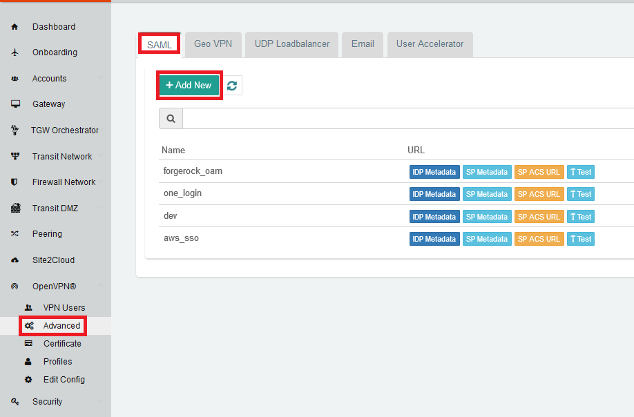

.. meta::
   :description: Aviatrix User SSL VPN Okta SAML Configuration
   :keywords: SAML, user vpn, saml, Aviatrix, OpenVPN, idp, sp

=====================================
OpenVPN® with SAML Authentication
=====================================

1.  Overview
------------

There are two methods to authenticate a VPN client against Okta: `Okta API Token <https://docs.aviatrix.com/HowTos/HowTo_Setup_Okta_for_Aviatrix.html>`_ or Aviatrix SAML client.

This document shows you how to setup VPN authentication using Aviatrix SAML client.

Aviatrix user VPN is the only OpenVPN® based remote VPN solution that provides a VPN client with SAML authentication capability.

This step-by-step guide shows you how to use Aviatrix SAML client to authenticate an IDP. When SAML client is used, Aviatrix controller acts as the service provider (SP) that redirects browser traffic from client to the IDP for authentication.

For different IDP's, there will be links to each individual IDP integration.

2. Pre-Deployment Checklist
-----------------------------
Before configuring the SAML integration between Aviatrix and your IDP, make sure the following is completed:

	#. `Aviatrix Controller <#pdc-21>`__ is setup and running
	#. Have a valid `IDP account <#pdc-22>`__ with admin access
	#. `Download and install <#pdc-23>`__ the Aviatrix SAML client

.. _PDC_21:

2.1 Aviatrix Controller
#######################

If you haven’t already deployed the Aviatrix controller, follow `these instructions <../StartUpGuides/aviatrix-cloud-controller-startup-guide.html>`__ to deploy the Aviatrix controller.

.. _PDC_22:

2.2 IDP Account
###############

An IDP refers to an identity provider for SAML. This could be any provider that supports a SAML end point like `Okta <./SAML_Integration_Okta_IDP.html>`__,
`OneLogin <./SAML_Integration_OneLogin_IDP.html>`__, `Google <./SAML_Integration_Google_IDP.html>`__,
`AWS SSO <./SAML_Integration_AWS_SSO_IDP.html>`__, and `Azure AD <./SAML_Integration_Azure_AD_IDP.html>`__.
You will require administrator access to create IDP endpoints for SAML. Check `IDP-specific SAML Integration <#idp-integration>`__ to see a list of guides for supported IDP's

.. _PDC_23:

2.3 Aviatrix VPN Client
#######################

All users must use the Aviatrix VPN client to connect to the system.  Download the client for your OS `here <http://docs.aviatrix.com/Downloads/samlclient.html>`__.

3. Configuration
----------------

The configuration consists of 8 parts:

  1. Create `temporary Aviatrix SP Endpoint <#config-31>`__ for Aviatrix
  2. Create `SAML IDP App <#config-32>`__ with specific IDP
  3. Retrieve `IDP Metadata <#config-33>`__ from IDP
  4. Update `Aviatrix SP Endpoint <#config-34>`__ with IDP metadata
  5. `Test SAML Integration <#config-35>`__`
  6. Launch `Aviatrix Gateway <#config-36>`__
  7. Create `Aviatrix VPN user(s) <#config-37>`__
  8. `Test VPN Connectivity <#config-38>`__

.. _Config_31:

3.1 Create temporary Aviatrix SP Endpoint
#########################################

.. note::

   This step is usually completed by the Aviatrix admin.
   This endpoint will be updated later on in the guide, at this step, we will be using placeholder values.
   Choose an endpoint name for your Aviatrix SAML endpoint which will be used throughout the guide.
   This guide will use ``aviatrix_saml_controller`` as an example for the endpoint name.

#. Login to the Aviatrix Controller
#. Click `Settings` in the left navigation menu
#. Select `Controller`
#. Click on the `SAML Login` tab
#. Click `+ Add New` button

   |image3-1-1|

   |image3-1-2|

   +-------------------------+-------------------------------------------------+
   | Field                   | Value                                           |
   +=========================+=================================================+
   | Endpoint Name           | Enter a unique identifier for the service provider     |
   +-------------------------+-------------------------------------------------+
   | IPD Metadata Type       | Text or URL (depending on what was              |
   |                         | provided by the SAML provider)                  |
   |                         | For now, choose URL                             |
   +-------------------------+-------------------------------------------------+
   | IDP Metadata Text/URL   | IDP metadata URL/Text copied from the SAML      |
   |                         | provider configuration                          |
   |                         | For now, put in a placeholder URL,              |
   |                         | such as "https://www.google.com"                |
   +-------------------------+-------------------------------------------------+
   | Entity ID               | Select `Hostname` for now                       |
   +-------------------------+-------------------------------------------------+
   | Access                  | Select admin or read_only access                |
   +-------------------------+-------------------------------------------------+
   | Custom SAML Request     | For now leave blank, depending on your specific |
   | Template                | IDP, you may have to check this option          |
   +-------------------------+-------------------------------------------------+

.. note::
   Each endpoint only supports one type of access. If you need admin and read-only access, create two separate SAML apps.

#. Click `OK`
#. Depending on your IDP provider, you may need to upload SP metadata. After temporary SAML endpoint is created:

- Right click **SP Metadata** button next to the SAML endpoint and save file to your local machine.
- Click **SP Metadata** button, and copy the SP metadata as text

.. _Config_32:

3.2 Create a SAML App for Aviatrix with the IDP
###############################################

.. note::

   This step is usually done by the IDP administrator.
   This sections shows only generalized process for creating a SAML application.
   Refer to the `IDP-specific SAML App Integration <#idp-integration>`_ section for links to detailed steps with each particular IDP.

Create a SAML 2.0 app with the IDP Provider. The following settings are based on the <aviatrix_sp_name>:

#. Assertion Consumer Service URL* = https://aviatrix_controller_hostname/flask/saml/sso/<aviatrix_sp_name>
#. Audience URI(Entity ID)* = https://aviatrix_controller_hostname/
#. noteta URL = https://aviatrix_controller_hostname/flask/saml/metadata/<aviatrix_sp_name>
#. SP Login URL = https://aviatrix_controller_hostname/flask/saml/login/<aviatrix_sp_name>
#. Default RelayState* = <empty>
#. Name ID format = Unspecified
#. Application username = IDP username

.. important::

   After step 3.4, these values are also available in the controller under the OpenVPN® navigation item.  Then, select `Advanced` and go to the `SAML` tab.

   RelayState is currently not used by the Aviatrix SP

The following SAML attributes are expected:

#. FirstName
#. LastName
#. Email (unique identifier for SAML)

.. note::

   These values are case sensitive

.. _Idp_Integration:

**IDP-specific SAML App Integration**

.. note::

  You will require administrator access to create IDP endpoints for SAML.

These are guides with specific IDP's that were tested to work with Aviatrix SAML integration:

#. `AWS SSO <./SAML_Integration_AWS_SSO_IDP.html>`__
#. `Azure AD <./SAML_Integration_Azure_AD_IDP.html>`__
#. `Centrify <./SAML_Integration_Centrify_IDP.html>`__
#. `Google <./SAML_Integration_Google_IDP.html>`__
#. `Okta <./SAML_Integration_Okta_IDP.html>`__
#. `OneLogin <./SAML_Integration_OneLogin_IDP.html>`__

Other tested IDP's include:
Ping Identity, VmWare VIDM, ForgeRock's OpenAM etc.

.. _Config_33:

3.3  Retrieve IDP metadata
##########################

After creating the IDP, you need to retrieve IDP Metadata either in URL or text from the IDP application created in the previous step.

#. AWS SSO  - provides IDP metadata URL, needs a custom SAML request template, and will need to provide SP metadata file from Aviatrix
#. Azure AD - provides IDP metadata URL and needs a custom SAML request template
#. Centrify - provides IDP metadata URL and will need to provide SP metadata text from Aviatrix
#. Google   - provides IDP metadata text
#. Okta     - provides IDP metadata text
#. OneLogin - provides IDP metadata URL

.. _Config_34:

3.4 Update Aviatrix SP Endpoint
###############################

.. note::

  This step is usually completed by the Aviatrix admin.
  Take note of the IDP Metadata type along with Text/URL your IDP provides, and if you need a custom SAML request template in the previous section

#. Login to the Aviatrix Controller
#. Expand `OpenVPN®` in the navigation menu and click `Advanced`
#. Stay on the `SAML` tab and click `+ Add New`

   +----------------------------+-----------------------------------------+
   | Field                      | Description                             |
   +----------------------------+-----------------------------------------+
   | Endpoint Name              | Unique name that you chose in step 3.1        |
   +----------------------------+-----------------------------------------+
   | IPD Metadata Type          | Text or URL (depending on what was      |
   |                            | provided by the SAML provider)          |
   +----------------------------+-----------------------------------------+
   | IDP Metadata Text/URL      | Paste in the IDP metadata URL/Text      |
   |                            | copied from the SAML provider           |
   |                            | configuration                           |
   +----------------------------+-----------------------------------------+
   | Entity ID                  | Select `Hostname` or `Custom`           |
   +----------------------------+-----------------------------------------+
   | Custom Entity ID           | Only visible if `Entity ID` is `Custom` |
   +----------------------------+-----------------------------------------+
   | Access                     | Select admin or read_only access        |
   +----------------------------+-----------------------------------------+
   | Custom SAML Request        | Depending on your specific IDP,         |
   | Template                   | you may have to check this option.      |
   |                            | Refer to `IDP-specific Integration <#idp-integration>`__ |
   +----------------------------+-----------------------------------------+

.. note::
  `Hostname` is the default for Entity ID, but if you have other apps using the same hostname, use a custom Entity ID.

.. _Config_35:

3.5 Test the Integration
########################

.. note::

   Have an instance of the VPN client running.  If you do not, it might throw a warning

#. Login to the Aviatrix Controller
#. Expand `OpenVPN®` in the navigation menu and click `Advanced`
#. Stay on the `SAML` tab
#. Select the row that was created in the previous step (that includes your endpoint name)
#. Click on the `Test` action
#. You should be redirected to the IDP, now you can log in and should be redirected back to the controller

.. _Config_36:

3.6 Launch Aviatrix Gateway
###########################

.. note::

  This step is usually completed by the Aviatrix admin.

#. Login to the Aviatrix controller
#. Click `Gateway` in the navigation menu
#. Click `+ New Gateway`
#. Select the appropriate values for where to provision this Gateway
#. Check `VPN Access` and then `Enable SAML`

	|image3-6|

#. Leave the default settings for everything else
#. Click `OK` to launch the gateway

.. _Config_37:

3.7 Create VPN user(s)
######################

+----------------------------+-----------------------------------------+
| Field                      | Description                             |
+----------------------------+-----------------------------------------+
| VPC ID                     | Select the VPC/VNet where the Gateway   |
|                            | was created                             |
+----------------------------+-----------------------------------------+
| LB/Gateway Name            | Select the appropriate load balancer    |
|                            | or gateway                              |
+----------------------------+-----------------------------------------+
| User Name                  | Name of the VPN user                    |
+----------------------------+-----------------------------------------+
| User Email                 | Any valid email address (this is where  |
|                            | the cert file will be sent).            |
|                            | Alternatively you can download the cert |
|                            | if you don't enter email                |
+----------------------------+-----------------------------------------+
| SAML Endpoint              | Select the SAML endpoint                |
+----------------------------+-----------------------------------------+

.. note::

   SAML  supports shared certificates.  You can share the certificate among VPN users or create more VPN users.

.. _Config_38:

3.8 Test VPN Connectivity
#########################
	Download and install the Aviatrix VPN client for your platform from `here <https://aviatrix-systems-inc-docs.readthedocs-hosted.com/Downloads/samlclient.html>`__
	Launch the Aviatrix client and load the certificate ("Load config")that you downloaded/received from email on step 3.5
	Click on "Connect". This should launch the browser instance and prompt you for authentication, if not already logged in.
	If the connection is successful, the client icon should turn green.
	You can ensure VPN connectivity by trying to ping the private IP of the gateway you launched or any other instance in the same cloud network

OpenVPN is a registered trademark of OpenVPN Inc.

.. |image3-6| image:: SSL_VPN_SAML_media/image3-6.png

.. disqus::
