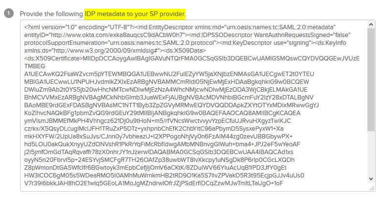

.. meta::
   :description: Aviatrix User SSL VPN Okta SAML Configuration
   :keywords: SAML, user vpn, saml, Aviatrix, OpenVPN, idp, sp

=====================================
OpenVPN® with SAML Authentication 
=====================================

1.  Overview
------------

Aviatrix user VPN is the only OpenVPN® based remote VPN solution that provides a vpn client that supports SAML authentication. 

This guide provides an example on how to use Aviatrix SAML client to authenticate Okta IDP. When SAML client is used, Aviatrix controller acts as the service provider (SP) that redirects browser traffic from client to IDP, in this case, Okta, for authentication. 

2. Pre-Deployment Checklist
-----------------------------
Before configuring the SAML integration between Aviatrix and Okta, make sure the following is completed.

Pre Installation Check List

	1.	Aviatrix Controller is setup and running.
	2.	Have a valid IDP account with admin access.
	3.	Download and install the Aviatrix SAML client These prerequisites are explained in detail below.

2.1 Aviatrix Controller
------------------------

If you haven’t already deployed the Aviatrix controller, follow the below instructions on how to deploy the Aviatrix controller.
`Instructions here.  <http://docs.aviatrix.com>`_

2.2 IDP Account
----------------

An IDP refers to an identity provider for SAML. These could be any provider that supports a SAML end point like Okta, OneLogin, Google, Ping Identity, VmWare VIDM, ForgeRock's OpenAM etc. (The listed ones were tested). You will require administrator access to the same to create IDP endpoints for SAML.

Example Okta
`Okta create account <https://www.okta.com/start-with-okta/>`_

2.3 Aviatrix VPN Client
-----------------------

All users must use the Aviatrix VPN client to connect to the system.  Download the client for your OS 
`here. <http://docs.aviatrix.com/Downloads/samlclient.html>`_

3. Configuration
----------------

The integration configuration consists of 4 parts.

	1.	Create an Okta SAML App for Aviatrix
	2.	Retrieve IDP Metadata
	3.	Launch Aviatrix Gateway
	4.	Create Aviatrix SAML SP
	5.	Create Aviatrix VPN User

Please complete the configuration in the following order.

3.1 Create a SAML App for Aviatrix at the IDP
---------------------------------------------

This step is usually done by the IDP adminstrator

Create a SAML 2.0 app with the following settings
	
		a.	App Name = Aviatrix VPN (arbitrary)
		b.	Assertion Consumer Service URL* = https://aviatrix_controller_hostname/flask/saml/sso/aviatrix_sp_name
		c.	Audience URI(Entity ID)* = https://aviatrix_controller_hostname/
		d.	SP Metadata URL = https://aviatrix_controller_hostname/flask/saml/metadata/aviatrix_sp_name
		e.	SP Login URL = https://aviatrix_controller_hostname/flask/saml/login/aviatrix_sp_name
		c.	Default RelayState* = <empty>
		d.	Name ID format = Unspecified
		e.	Application username = Okta username

		These values are also available in the controller OpenVPN®->Advanced->SAML page after step 3.4.

The following SAML attributes are expected. They are case sensitive. Email is the unique identifier for VPN
		
		i.	FirstName 
		ii.	LastName 
		iii.	Email

In addition we also support a Profile attribute(if required) discussed in this link			
	
	
3.2  Retrieve IDP metadata
--------------------------------
After creating the IDP, you need to revtrieve IDP Metadata either in URL or text for from the IDP app.

3.3	Launch Aviatrix Gateway
---------------------------------------------

This step is usually completed by the Aviatrix admin.

	1.	Login to the Aviatrix controller
	2.	Click Gateway -> Add New
	3.	Select the appropriate Account, region, vpc, subnet and gateway size
	4.	Check “VPN Access” and then “Enable SAML”

	|image6|
	
	5.	Default settings for everything else.
	
	6.	Click “OK” to launch the gateway.
	
	
3.4	Create Aviatrix SAML SP (Endpoint)
------------------------------------------

This step is usually completed by the Aviatrix admin.

1.	Login to the Aviatrix Controller
2.	Click OpenVPN® -> VPN Users -> Advanced -> SAML -> Add New
3.	Select the VPC where the above gateway was launched
4.	Name = aviatrix_sp_name (this is the same name that you choose during the IDP configuration)
5.	IPD Metadata type = Text/URL
6.	IDP Metadata Text = paste in the IDP metadata URL/Text from the Okta configuration

3.5	Test the integration
----------------------------

1.	Have an instance of the VPN client running, else it might throw a warning
2.	Click Test from OpenVPN® -> VPN Users -> Advanced -> SAML -> aviatrix_sp_name
3.	You should be redirected to the IDP, now you can log in and should be redirected back to the controller
	

3.5	Create a VPN User
-------------------------

1.	Select the VPC where the above gateway was launched
2.	Username = Name of the VPN user
3.	User Email = any valid email address (this is where the cert file will be sent). ALternatively you can download the cert if you dont enter email
4.	Load the VPN user certificate and try connecting to the VPN. Note that SAML only supports shared certificates. You can share the certificate among VPN users or create more VPN users

OpenVPN is a registered trademark of OpenVPN Inc.

.. |image0| image:: SSL_VPN_Okta_SAML_media/image0.png

.. |image1| image:: SSL_VPN_Okta_SAML_media/image1.png

.. |image2| image:: SSL_VPN_Okta_SAML_media/image2.png

.. |image3| image:: SSL_VPN_Okta_SAML_media/image3.png

.. |image4| image:: SSL_VPN_Okta_SAML_media/image4.png

.. |image5| image:: SSL_VPN_Okta_SAML_media/image5.png

.. |image7| image:: SSL_VPN_Okta_SAML_media/image7.png

.. disqus::
