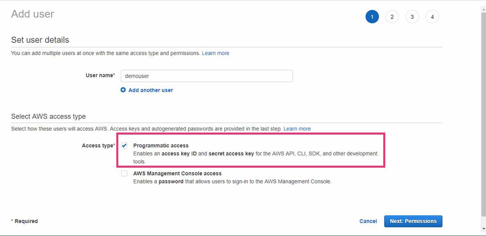
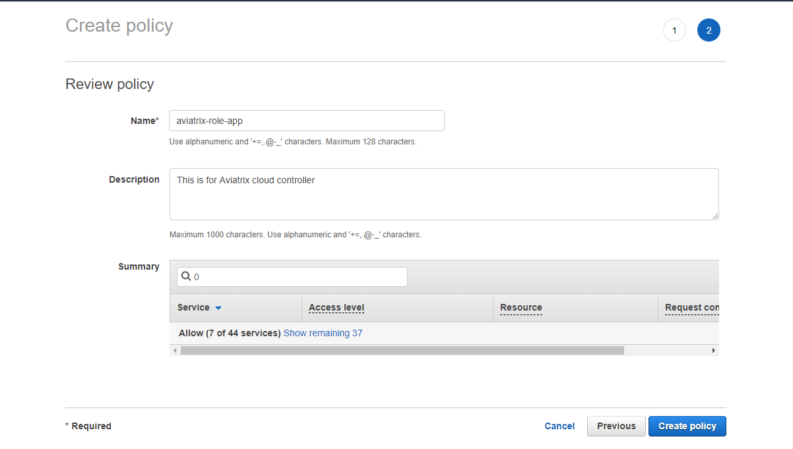
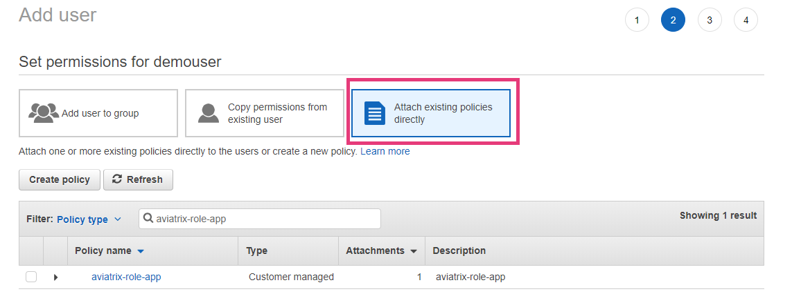
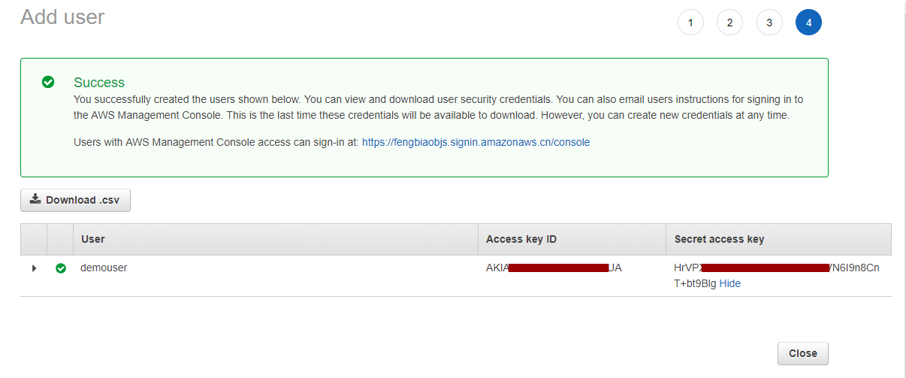

.. meta::
  :description: How to setup access key and secret key
  :keywords: account, aviatrix, AWS IAM role, Azure API credentials, Google credentials 

=====================================
Account with Access Key
=====================================

This document describes how to set up an Aviatrix access account for AWS by using an IAM user access key and secret ID, instead of IAM roles. 

This approach is applicable to AWS China as Aviatrix does not support IAM role yet. 

Creating an IAM Policy
----------------------------

1. Log in to the AWS console > IAM > Policies. Click **Create Policy**, and then click **JSON**. Delete the example JSON text. 

Copy and paste `the Aviatrix AWS policy <https://s3-us-west-2.amazonaws.com/aviatrix-download/IAM_access_policy_for_CloudN.txt>`_ to create a new IAM policy, as shown below. Give policy a name: aviatrix-role-app. 

|create-policy|

Creating an IAM User
----------------------------

1. Log in to the AWS Console > IAM > Users.
2. Click **Add user** to create a new IAM user and allow programmable access, as shown below. 

|add-iam-user|

Attaching the Policy to the User
---------------------------------------------------

Next, attach the created policy to this IAM user, as shown below. 

|attach-policy|

Setting up an Access Key and Secret Access Key
----------------------------------------------------------------

Finally, create an access key and secret key to be used by the Aviatrix access account for this IAM user.  

|accesskey|

.. disqus::
