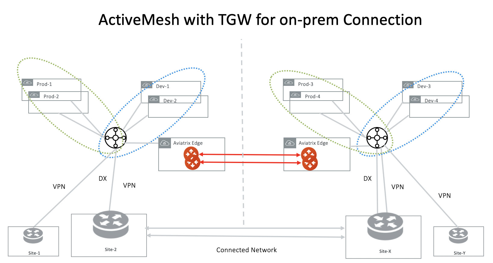

.. meta::
  :description: ActiveMesh Design Notes
  :keywords: AWS Transit Gateway, AWS TGW, TGW orchestrator, Aviatrix Transit network, Ingress, Egress, Firewall

=========================================================
ActiveMesh Design Notes
=========================================================

ActiveMesh is the default mode when launching an Aviatrix Transit Gateway. This tech note documents the supported common design patterns while deploying ActiveMesh Gateways. 

1. ActiveMesh with AWS TGW for On-Prem Connections
---------------------------------------------------------------------

While AWS Transit Gateway (TGW) does not propagate routes to Spoke VPCs, TGW Direct Connect via DXGW and TGW
VPN have full functions of failover, multi-path and ECMP in supporting connection to on-prem. This includes:

 - TGW prefers DXGW to TGW VPN when both advertising the same network. When DXGW goes down, one of the VPN routes take over. 
 - When there are multiple VPN routes, TGW routing policy selects the shortest AS_PATH length. 
 - When there are multiple VPN routes with identical AS_PATH length, TGW VPN distributes traffic with ECMP when it is enabled. 

In this case, Aviatrix Controller performs the orchestration function in managing route propagation and Aviatrix Transit Gateways are used to connect two AWS TGWs. 

Design Note: Implementing TGW with VPN backup design could lead to asymmetric routing, that is, with traffic from AWS to on-premises 
traversing the DX as intended while traffic from on-premises to AWS traversing the IPsec VPN tunnel instead.

Traffic from AWS to on-premise prefers the AWS DXGW over the VPN connection because the TGW effectively sets a higher “local
preference” (LOCAL_PREF) on the DXGW BGP sessions (refer to Route Evaluation Order as outlined in the AWS Transit Gateway
documentation).

For traffic from on-premises to AWS, the DX path should be preferred because AWS sets a Multi Exit Discriminator (MED) value
of 100 on BGP sessions over VPN links as compared to the default value of 0 over the DX path. This works well in the case DX
and VPN are used with a Virtual Private Gateway (VGW) as the same AS is announced over both connections but in case of the
TGW, the DX path uses a different ASN compared to the VPN path. 

The advertised ASN over VPN is the TGW AS while the ASN over DX is the ASN of the DXGW. Note that in case of TGW, the AS path
over the DXGW path only consists of the DXGW AS instead of AS path length of two with TGW AS + DXGW AS. This is the result of
manually setting the CIDRs to be announced by the AWS DXGW towards on-premises which effectively causes DXGW to originate the
routes resulting in a reduced path length of one over DX which is the same AS path length as over the VPN link but different
AS path.

To ensure that the on-premises routers always consider the MED value, set the “bgp always-compare-med” knob. This forces the
router to compare the MED if multiple routes to a destination have the same local preference and AS path length.

The deployment is shown in the diagram below. 

|activemesh_tgw_onprem|

1.1 Advertising Different Routes
^^^^^^^^^^^^^^^^^^^^^^^^^^^^^^^^^^^

If on-prem sites advertise non overlapping network CIDRs to TGWs, Transit Gateway peering can proceed without issues. 

1.2 Advertising Overlapping Routes
^^^^^^^^^^^^^^^^^^^^^^^^^^^^^^^^^^^^^^

If on-prem sites advertise identical network CIDRs or overlapping CIDRs to TGWs (for example, they all 
advertise 10.0.0.0/8 to their respective TGWs), you must enable `<https://docs.aviatrix.com/HowTos/transit_gateway_peering.html#excluded-network-cidrs>`_ feature on both sides of the Aviatrix Transit Gateways to 
filter out identical or overlapping CIDRs in order to connect the two regions. 

.. important::

  If you use TGW DXGW/VPN for hybrid connection to on-prem, you cannot use Aviatrix Transit Gateway as the backup router for connecting to the same on-prem network. This is because TGW propagated routes do not present themselves in the TGW route table with any BGP information and as such, it is not possible for the Controller to coordinate the dynamic route updates between TGW and Aviatrix Transit Gateway.

1.3 Overlapping Spoke VPC CIDRs
^^^^^^^^^^^^^^^^^^^^^^^^^^^^^^^^^^

If there are overlapping Spoke VPCs CIDRs attached to the TGWs in two regions and you wish to connect them via Aviatrix Transit Gateway Peering, use `Exclude Network CIDRs <https://docs.aviatrix.com/HowTos/transit_gateway_peering.html#excluded-network-cidrs>`_ on both
Aviatrix Transit Gateways to exclude these overlapping Spoke VPC CIDRs.

2. ActiveMesh with Aviatrix Transit GW for On-Prem Connection
-----------------------------------------------------------------------------------

|activemesh_avx_onprem|

2.1 Redundant Routers On-Prem 
^^^^^^^^^^^^^^^^^^^^^^^^^^^^^^^

If there are two on-prem routers advertising the same network CIDR and connect to Aviatrix Transit Gateway directly, Aviatrix Transit Gateway automatically enables ECMP for traffic from cloud to on-prem. If this is 
not desired outcome, you should connect on-prem to the Aviatrix Transit Gateway through a VGW or VPN Gateway. 

2.2 Multi-Sites
^^^^^^^^^^^^^^^^^^

If Aviatrix Transit Gateways connects to multi sites on-prem directly via BGP, these sites should advertise
non overlapping CIDRs to the Aviatrix Transit Gateway.

2.3 Route Propagation
^^^^^^^^^^^^^^^^^^^^^^^

The local Aviatrix Transit Gateway learned routes via BGP are propagated to the peered Aviatrix Transit Gateway. 
The propagated information includes network CIDRS, AS_PATH and metrics. 

If the local Aviatrix Transit Gateway learned duplicate network CIDRs (i.e., there are multiple paths to reach the same network CIDRs) via BGP, it uses the following rules to decide which route is
propagated to the remote Aviatrix Transit Gateway. 

 - The route with the shortest AS_PATH length wins.
 - If there are identical AS_PATH lengths, the lowest metric route wins. 
 - If the metrics are all the same, the smallest next hop IP address wins. 

In another words, there will always be one route advertised to the remote Aviatrix Transit Gateway when identical network CIDRs are learned by the local Aviatrix Transit Gateway.

2.4 Overlapping Spoke VPC/VNet CIDRs
^^^^^^^^^^^^^^^^^^^^^^^^^^^^^^^^^^

If there are overlapping Spoke VPCs CIDRs attached to the TGWs in two regions and you wish to connect them via Aviatrix Transit Gateway Peering, use `Exclude Network CIDRs <https://docs.aviatrix.com/HowTos/transit_gateway_peering.html#excluded-network-cidrs>`_ on both
Aviatrix Transit Gateways to exclude these overlapping Spoke VPC/VNet CIDRs.

3. NAT Functions
--------------------

SNAT function is supported on the individual connection between the Aviatrix Transit Gateway and the remote sites. 

Starting Release 5.4, SNAT and DNAT functions are supported on the Spoke Gateway tunnel interface to the Aviatrix Transit Gateway. 

4. Egress Routes Propagation Behavior
----------------------------------------

If firewalls are deployed for Internet-bound egress traffic in either FireNet or Transit FireNet deployment, the default routes are propagated 
to the remote peer by Transit Gateway peering. This allows firewalls to be shared across regions. 

If you have regional firewalls for egress traffic, make sure you apply filter to filter out the default routes. 

4. Configuration Notes
-----------------------

4.1 One On-prem Device
^^^^^^^^^^^^^^^^^^^^^^^^

In this scenario, the on-prem has one device as the diagram below.

|activemesh_one_device|

If the backup Aviatrix Transit Gateway is launched and the Transit Gateway is launched with ActiveMesh, the configuration should include the following settings:

* Enable HA - Mark the checkbox to enable HA if the remote site has two external IP addresses.
* Local Tunnel IP - Include two IP addresses in this field: the first one for the primary Aviatrix Transit Gateway, and the second for the backup Aviatrix Transit Gateway (only if it is launched).

4.2 Two On-Prem Devices
^^^^^^^^^^^^^^^^^^^^^^^^^

In this scenario, the on-prem has two devices as the diagram below.

|activemesh_two_devices|

You should check HA in the configuration and configure the second pair of inside tunnel addresses, as shown below. 

|activemesh_ha_config|

.. |activemesh_avx_onprem| image:: activemesh_design_notes_media/activemesh_avx_onprem.png
   :scale: 30%

.. |activemesh_config| image:: activemesh_design_notes_media/activemesh_config.png
   :scale: 30%

.. |activemesh_ha_config| image:: activemesh_design_notes_media/activemesh_ha_config.png
   :scale: 30%

.. |activemesh_one_device| image:: activemesh_design_notes_media/activemesh_one_device.png
   :scale: 30%

.. disqus::
