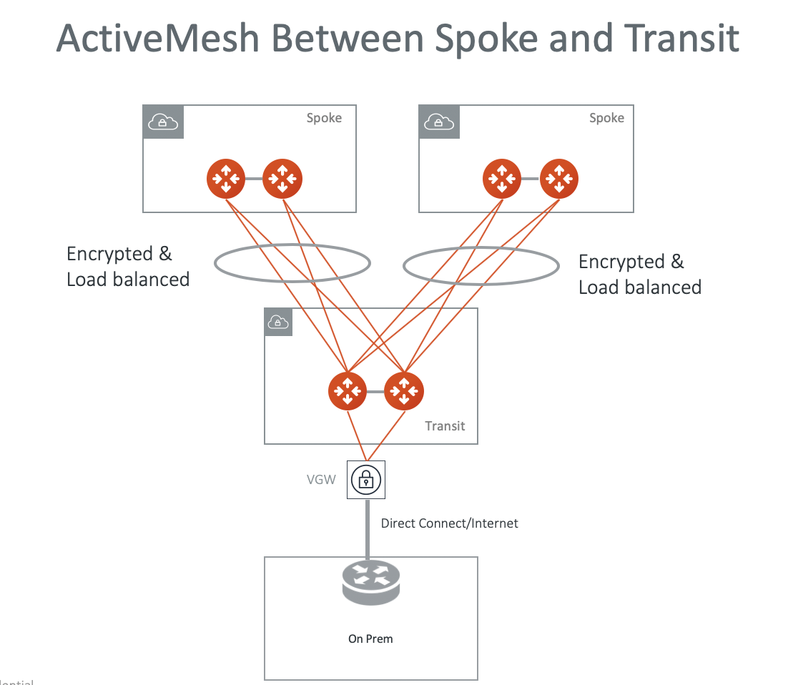
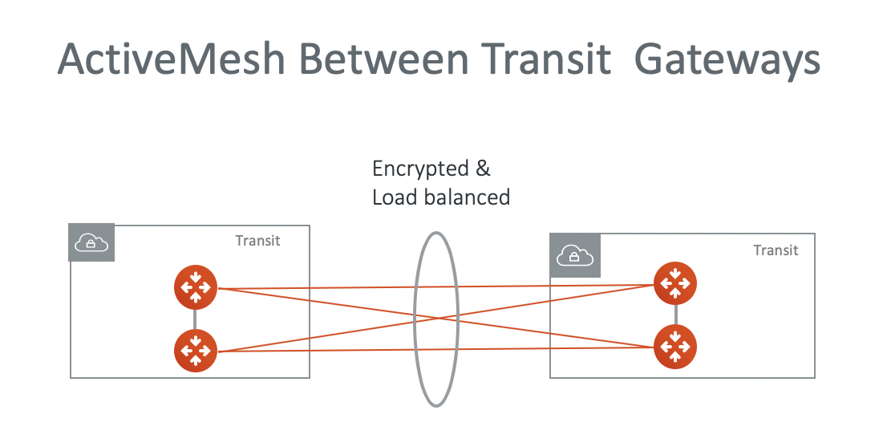
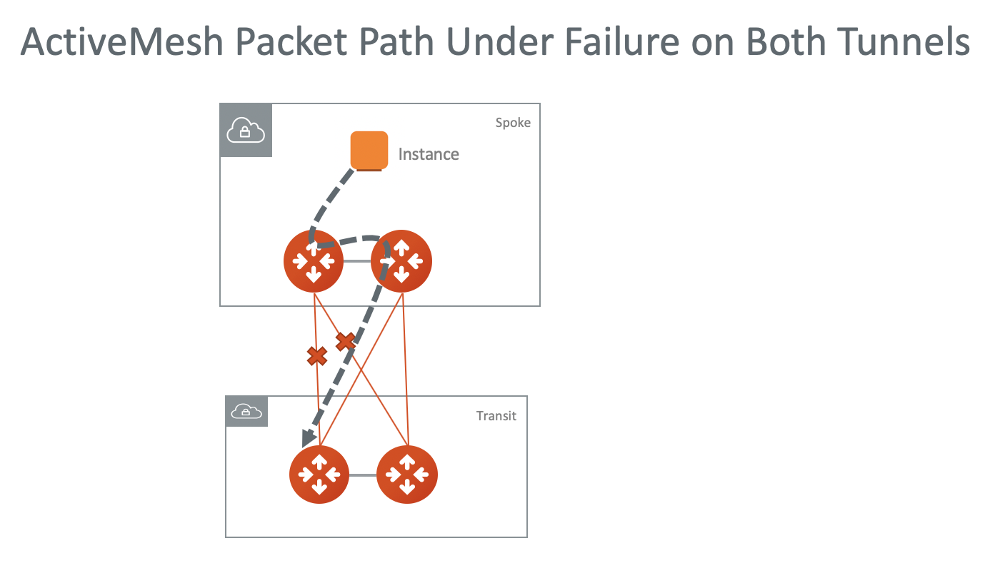

.. meta::
  :description: ActiveMesh FAQ	
  :keywords: AWS Transit Gateway, AWS TGW, TGW orchestrator, Aviatrix Transit network, Firewall, DMZ, Cloud DMZ, Firewall Network, FireNet

=========================================================
ActiveMesh FAQ
=========================================================

What is Aviatrix ActiveMesh?
----------------------------------------------

ActiveMesh is the new Aviatrix Encrypted Transit Network architecture where both primary gateways and backup gateways forward packets 
in a load balancing fashion. 

The diagram below shows an ActiveMesh deployment between Spoke and Transit where each spoke gateway in a VPC builds two IPSEC tunnels to the primary and backup transit gateways and forwards packets to both of them inside the tunnel. The load balance mechanism leverages ECMP protocol.  

|activemesh_spoke_transit|

Can ActiveMesh be applied to Transit gateway peering?
--------------------------------------------------------

Yes. ActiveMesh can be applied to connecting two Transit GWs. There are 4 tunnels established between the Transit GWs, as shown in the diagram below. 

|activemesh_transit_transit|

Can ActiveMesh be applied to connection to VGW?
------------------------------------------------

Yes. Each Transit GW connecting to the VGW in ActiveMesh mode has two VPN tunnels to the VGW.

What is the link for between the two ActiveMesh gateways?
----------------------------------------------------------

The link is used to forward packets when both tunnels are down out of one ActiveMesh gateway. 

For example, in a spoke VPC, EC2 traffic is forwarded to the ActiveMesh primary gateway which then forwards traffic to the AVX Transit GW. 
If both tunnels between the 
ActiveMesh spoke gateway and the Transit GW are down, the packet is forwarded by the ActiveMesh primary gateway to the backup ActiveMesh gateway. 

|activemesh_tunnel_failures|

How do Spoke gateways load balance traffic from EC2 instance?
----------------------------------------------------------------

In the current Release 5.0, VPC route table points to only one Spoke gateway, so there is no load balancing for traffic initiated from EC2 instances. 
But once the traffic arrives at the gateway for transmission to the Spoke VPC, the traffic is load balanced across the Activemesh peering to the Spoke VPC gateways. 

What are the advantages of ActiveMesh?
--------------------------------------------------------------------------------------

The key benefits of ActiveMesh are improved network resiliency, failover convergence time and performance.

How to enable ActiveMesh 1.0?
--------------------------------

ActiveMesh enabled by default. For Aviatrix Transit or Spoke gateway launched before ActivMesh
mode become available, follow the `Aviatrix Encrypted Transit Network workflow <https://docs.aviatrix.com/HowTos/transitvpc_workflow.html#launch-a-transit-gateway>`_ to enable ActiveMesh mode. 

How to troubleshoot ActiveMesh Transit Gateway?
-------------------------------------------------

 1. **Check IPSec Tunnel**. For BGP learned routes, check if the IPSEC tunnel is up. Go to Site2Cloud -> Setup. Find the connection and make sure it is in Up state. If it is not, go to Site2Cloud -> Diagnostics and run "Show log". Since all BGP sessions run inside IPSEC tunnel, this is the first thing you should check. 
 #. **Check BGP Session**. For BGP learned routes, check if BGP session is established. Go to (Multi-Cloud) Transit Network -> Advanced Config -> BGP. Look for the BGP session and make sure it is in Established State. If it is not, go to (Multi-Cloud) Transit Network -> Advanced Config -> Diagnostics. Select the transit gateway, run commands, such as "show ip bgp".
 #. **Check BGP Learned Routes** For BGP learned routes, check if routes are learned. Go to (Multi-Cloud) Transit Network -> Advanced Config -> Diagnostics. Select the transit gateway, run "show ip bgp" to make sure the transit gateway under inspection has learned the routes you are looking for. 
 #. **Check Route Database** For all routes, check if the Controller see all the learned routes from TGW, BGP, Transit Peering and Static. Go to Multi-Cloud Transit -> List. Select the Transit Gateway, click Show Details. Scroll down and refresh `Route Info DB Details`. This table contains learned routes from all sources. 
 #. **Check Aviatrix Transit Gateway Programmed Routes** Got (Multi-Cloud) Transit Network -> List. Select the Transit Gateway, click Actions -> Show Details. Scroll down to the Gateway Routing Table and click to open. Make sure the routes you are looking for is in the table and has a next hop with metric 100 or lower.  

If any of the above steps show failure, there is an error, contact support@aviatrix.com for more debugging assistance. 

If all above steps succeed, the connectivity issue lies somewhere else. Check Spoke VPC route table and TGW route table if applicable. 

If this is TGW based deployment, run an Audit by going to TGW Orchestrator -> Audit. Any missing routes in either VPC route table or TGW route table should be discovered. 

How to migrate from the encrypted transit network to ActiveMesh mode?
----------------------------------------------------------------------

Here are the steps:

 1. Launch a new Transit GW and enable ActiveMesh on it. 
 #. Detach a current spoke and attach it to the new Transit GW.

Can ActiveMesh be applied to Azure, GCP and OCI?
----------------------------------------------------

Yes. 

What is route based VPN and policy based VPN?
-----------------------------------------------

Most firewalls appliances support both policy based and route based VPN’s. Which one we are supposed to use in most cases doesn't really matter, but there are a couple of things to consider.

Route based VPNs are more flexible, more powerful and recommended over policy based VPNs. However, a policy based VPN is usually simpler to create.

A route based VPN creates a virtual IPSec interface, and whatever traffic hits that interface is encrypted and decrypted according to the phase 1 and phase 2 IPSec settings.

In a policy based VPN, the tunnel is specified within the policy itself with an action of "IPSec". Also, for a policy based VPN, only one policy is required. A route based VPN is created with two policies, one for inbound and another for outbound with a normal "Accept" action.

A static route is also required for a route based VPN, so anything destined to the remote network must go through the virtual IPSec interface which was created when specifying this within the Phase 1 settings.

If the VPN connection requires redundancy, a route based VPN is normally required. 

Does ActiveMesh support route based VPN or policy based VPN?
-------------------------------------------------------------

ActiveMesh enables the Aviatrix Transit GW to connect to multiple remote sites over IPSec VPN tunnels.

When you configure VPN to remote sites from Transit Network -> Setup -> Step 3 (Connect to VGW/External Device/Aviatrix CloudN) in the `Transit Network workflow Step 3 <https://docs.aviatrix.com/HowTos/transitvpc_workflow.html#connect-the-transit-gw-to-aws-vgw>`_, the VPN tunnel is built with route based VPN. 

Starting from Release 6.0, ActiveMesh Transit Gateway supports both remote route based VPN and remote policy based VPN tunnels. In this case, the 
Aviatrix Transit Gateway always operates in route based mode. 

On the other hand, when you configure VPN to remote sites from Site2Cloud page and select a Transit GW, the VPN tunnel is built with policy based VPN.  

What happens when an ActiveMesh enabled gateway is stopped?
--------------------------------------------------------------

With ActiveMesh gateway, `Gateway Single AZ HA <https://docs.aviatrix.com/HowTos/gateway.html#gateway-single-az-ha>`_ is automatically
enabled. That is, when an ActiveMesh gateway is stopped, the Controller automatically starts it again. Once the gateways comes up, 
it participates in packet forwarding again. 

To stop an ActiveMesh gateway, you should disable the Gateway Single AZ HA feature. Highlight the gateway at the Gateway page, 
click Edit. Scroll down to Gateway Single AZ HA, click Disable. 

What is ActiveMesh 2.0?
-------------------------

ActiveMesh 2.0 is a new iteration of ActiveMesh. The main advancement of ActiveMesh 2.0 is its deterministic nature of Next Hop selection.

Here is how Aviatrix Transit Gateway routing engine treats the following types of routes. 

========================================================                    ==========
**Networks**                                                                **Aviatrix Transit Gateway Route Propagation**
========================================================                    ==========
Local TGW attached VPC CIDR                                                 Local
Aviatrix Spoke gateway associated VPC/VNet CIDR                             Local
Azure Native Spoke assoociated VNet CIDR                                    Local
Local TGW VPN dynamically learned network CIDR                              Advertises TGW VPN ASN and its remote peer ASN to a remote BGP peer if it's the best route.
Local TGW DXGW learned network CIDR                                         Advertises  TGW DXGW ASN and its remote peer ASN to a remote BGP peer if it's the best route.
Remote Aviatrix Transit Gateway Peering learned routes                      Advertises remote Aviatrix peer's network CIDRs to a remote BGP peer if it's the best route.
Aviatrix Transit Gateway BGP learned from on-prem                           Advertises to its remote peers by Aviatrix Transit Gateway peering if it's the best route. 
Aviatrix Transit Gateway statically learned from on-prem                    Local
Aviatrix Transit Gateway associated VPC/VNet CIDR                           Local
Local Firewall Egress route (0.0.0.0/0)                                     Local
Aviatrix Transit Gateway SNAT IP address                                    Local
========================================================                    ==========

With this approach, there is more visibility on learned routes regarding what paths the routes are learned from. 

The next hop best path selection follows the priorities listed below. 

 1. Local 
 #. Shortest number of ASN list 
 #. For two identical length ASN routes, select the next hop with the lowest Metric Value 
 #. For two identical ASN length and Metric Value routes, if ECMP is disabled (this is the default configuration), select the current best route. If there is no current best route, the next hop IP addresses are compared, the lower integer IP address is selected. 
 #. For two identical ASN length and Metric Value routes, if ECMP is enabled, traffic is distributed to both routes using ECMP. 

How to migrate to ActiveMesh 2.0?
--------------------------------------

ActiveMesh 2.0 is automatically enabled for brand new deployment on a Controller. If you have current Transit Network, 
migrate to ActiveMesh 2.0 by going to Settings -> Migration -> ActiveMesh 2.0 Migration, click Migrate. 

.. disqus::
