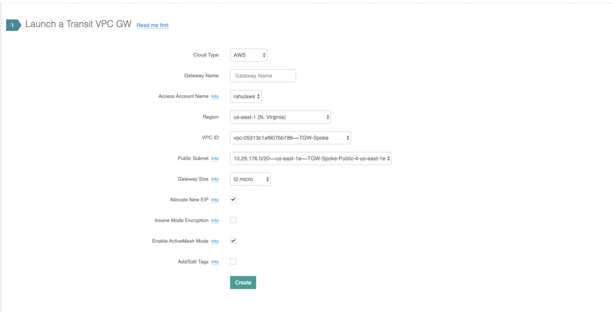
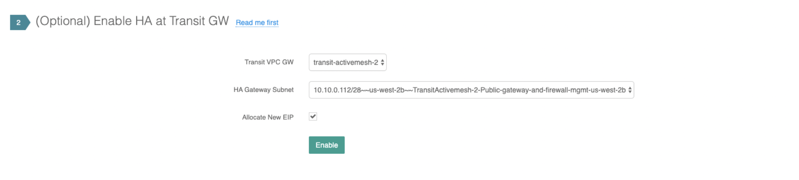
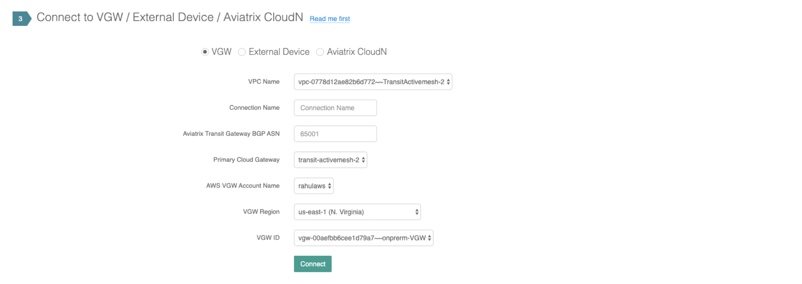
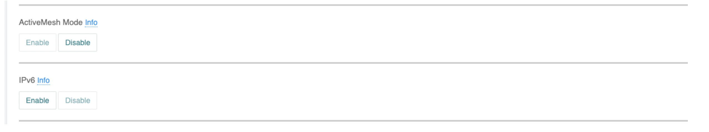

==================================================================================================
 Migrating from Classic Aviatrix Encrypted Transit Network to Aviatrix ActiveMesh Transit Network
==================================================================================================

This document describes the steps to migrate an existing non-ActiveMesh Aviatrix Encrypted Transit Network
to the new ActiveMesh Transit Network.
If your Transit Network is built prior to Aviatrix software release 5.1,
it’s very likely that the Transit Network is non-ActiveMesh deployment where the IPSec tunnels between Spoke GWs and Transit GWs
are in Active/Standby mode (i.e. only one IPSec tunnel is carrying the data traffic). You can confirm it by checking
in the Gateway page if your Transit GW is ActiveMesh Enabled=yes.

We recommend that you create a new transit and transit-ha gateway with active mesh enabled, detach the spokes from the current transit and transit-ha gateways, enable active-mesh on the spokes and then connect them to the new active-mesh enabled transit and transit-ha gateways.
The steps are documented in detail below.

1.	Go to Useful Tools -> Create a VPC page. Select or enter all the necessary information and check the Aviatrix Transit VPC box. This is the recommended approach from Aviatrix but you can always create the VPC from AWS console.

2.	Go to Transit Network -> Setup - Step 1 Launch a Transit VPC GW to create a new Active Mesh Transit Gateway. Make sure the Enable ActiveMesh Mode is checked (default) prior to clicking the Create button.

|image1|

3.	Go to Step 2 to Enable HA on the newly created Transit GW. Typically you will select another AZ (depends on your HA Gateway Subnet created in the VPC). on this created gateway by going to transit network -> setup -> step2

|image2|

4. Proceed to Step 3 to Connect this newly created Transit gateway GW to same VGW/external device that is
   already connected to the non ActiveMesh Transit Network. This allows the new ActiveMesh Transit GW to learn the same and make sure that its learning routes from the on-premises/datacenter. You can validate it by going to Transit Network -> Aadvanced -> Diagnostics page,
   select the new ActiveMesh Transit GW, Commands = “show ip bgp” and click OK to display the learned routes from the VGW/Externaldevice.

|image3|

5.	Go to Transit Network > Setup > Step 7a and detach the Spoke GW from the old non-ActiveMesh Transit gateway.
6.	Go to Gateway page and select the Spoke GW that was detached in the previous step. Click Edit and scroll down to ActiveMesh Mode section to enable the ActiveMesh on this gateway

|image4|

7.  Go to Step 6a to attach the ActiveMesh enabled Spoke GW to the ActiveMesh Transit GW.

8.  Go to Transit Network -> Advanced -> Diagnostics page, select the new ActiveMesh Transit GW, Commands = “show ip bgp” and click OK to confirm that the Spoke GW VPC CIDR is advertised to the VGW

9.  Repeat steps 5 through 8 for all spokes

10. Prior to Deleteing the old gateways please go to Multi Cloud Network >> Advanced and select the old gateway from the drop down. Make sure that the option Advertise Transit VPC CIDR is disabled. Once this is verified you can go to "Controller/Gateway" and select your old Transit and Transit-HA gateways and delete them.

11. Please check your network routes and connectivity and open a ticket if you run into any issues, by sending an email to support@aviatrix.com

