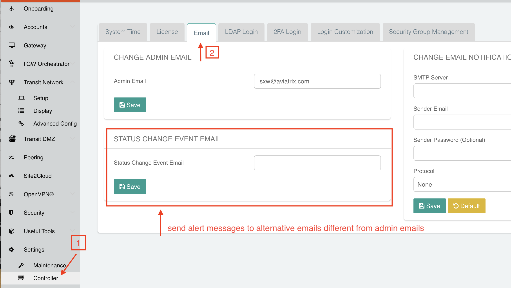
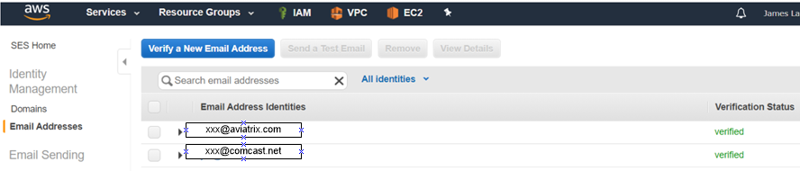
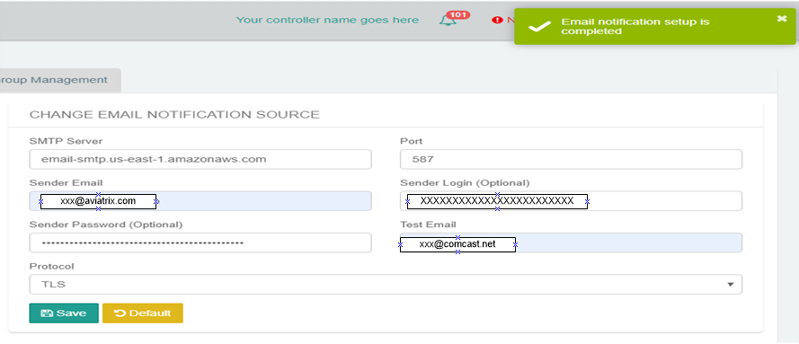
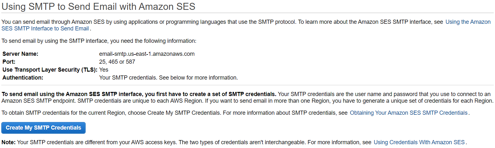
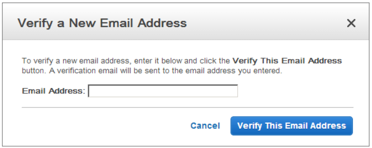
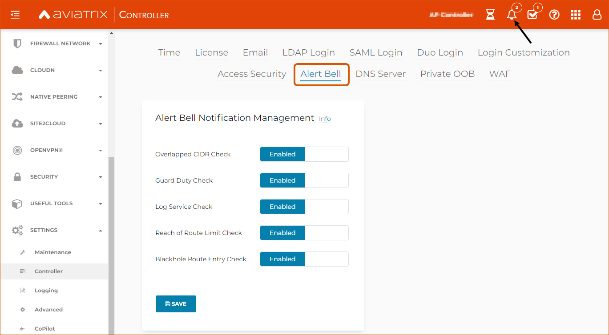

.. meta::
   :description: alert message handling
   :keywords: Emails, email source, alert message handling, Aviatrix alert

###################################
Emails and Alert Configuration 
###################################

The Aviatrix Controller sends alert emails for events such as:

 - Tunnel status change
 - Gateway status change

By default, the alert email is sent to the admin of the Controller. The email can be an individual email address or an email alias of a team. 

By default, the source email address is no-reply@aviatrix.com. 

How to change alert email configuration
----------------------------------------

If you would like the alert messages to be sent to a different email, 

::

  go to Settings -> Controller -> STATUS CHANGE EVENT EMAIL, 
  fill in a new email address and click Save. 

|change_alert_email|

How to manage Alert Bell notification?
------------------------------------------------------

The Alert Bell notification can be managed under Settings -> Controller -> Alert Bell.

By default, Alert Bell notification is enabled for the following features:
    1. **Overlapped CIDR Check** - Alert when BGP routes overlap in Site2Cloud.
    #. **Guard Duty Check** - Alert gets logged as Alert Bell notification and block malicious IP addresses when offending IPs are detected by Guard Duty. To learn more about Guard Duty integration with Aviatrix click `here <https://docs.aviatrix.com/HowTos/guardduty.html>`_.
    #. **Log Service Check** - This alarm generates a warning as a Alert Bell notification for remote syslog server down event.
    #. **Reach of Route Limit Check** - Alert when VPC and BGP route limits reach a threshold.
    #. **Blackhole Route Entry Check** - Alert when VPC route table has inactive routes. To learn more about Blackhole Routes click `here <https://docs.aviatrix.com/Support/support_center_controller.html?highlight=bell#what-are-blackholes-on-alert-bell>`_.

|alert_bell_notify|

How to Change Email Notification Source
-----------------------------------------

The following example uses Amazon Simple Email Service (SES):
Note that newly created SES accounts are placed in an "AWS SES Sandbox" and will not be able to send emails to unverified domains/addresses until they have been removed from the Sandbox: https://docs.aws.amazon.com/ses/latest/DeveloperGuide/request-production-access.html

1.	Create SMTP Credentials
    a.	Log into AWS Console
    b.	Click “SES Email Service”
    c.	Click “SMTP Settings”
    d.	Click “Create My SMTP Credentials”

|aws_ses|

    e.	Click “Download Credentials” **as the password will not be shown again**

2.	Verify an Email Address
    a.	Log into Amazon SES Console. Go to SESHome/IdentityManagement/EmailAddresses
    b.	Click “Verify a New Email Address”
    c.	In “Verify a New Email Address” dialog, enter an email address you want to send messages from. Note this *must* be a valid email address

|aws_verify_email|

    d.	You will receive a verification email from AWS SES asking you to confirm that you are the owner of the email address. Click the verification link in the message.
    
    
3.	Configure Aviatrix Controller to use AWS SMTP email server
    a.	SMTP Server: email-smtp.us-east-1.amazonaws.com <note that this value is regional and may differ based on the region of your verified address(es). You can confirm this from AWS Console > Services > SES > SMTP Settings > Server Name>
    b.	Port: 587 
    c.	Sender Email: <From Step 2: your verified email>
    d.	Sender Login: <From Step 1e: your SMTP Username>
    e.	Sender Password: <From step 1e: your SMTP Password>
    f.	Test Email: <From Step 2: your verified email>
    g.	Protocol: TLS
    h.	Click “Save”

   

   

   

   

.. disqus::
