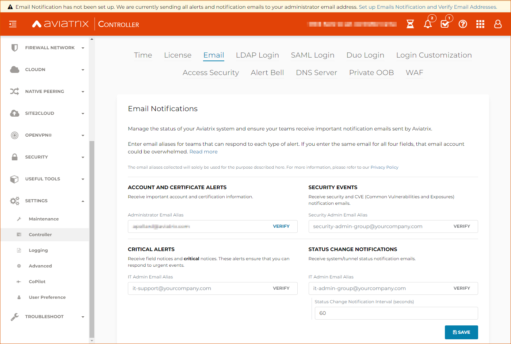
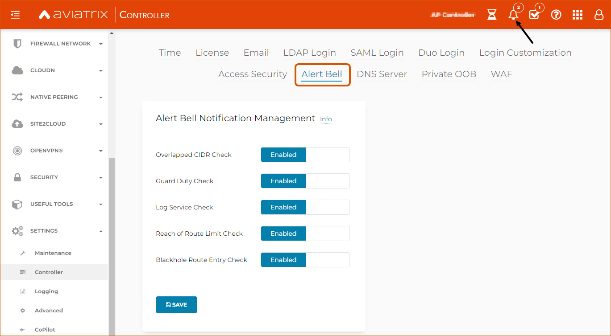

###################################
Emails and Alert Configuration 
###################################

To help you manage important events in your account, the Aviatrix Controller sends alert emails for events such as:

 - Tunnel status change
 - Gateway status change
- Account information changes
- Other critical events, such as a full disk

By default, alert emails are sent to the administrator of the Controller. Aviatrix strongly recommends that you use an email alias to notify a group of people rather then using an individual email address. If only one person receives the notifications, important alerts could be missed. To change the default email for alert notifications, see the section below.

* By default, the source email address is no-reply@aviatrix.com. 
* By default, the SMTP service is provided by a third-party, Sendgrid. Even though Aviatrix implements third-party risk monitoring, we are not responsible for Sendgrid controls. Aviatrix recommends that you configure your own SMTP service. 

Changing the Email Recipients of Alert Email Notifications
----------------------------------------------------------------------------------------

When you launch your Aviatrix Controller for the first time or log in after an upgrade, please provide the addresses for at least four new email accounts or email aliases that can receive important notification emails.

1. Go to Settings > Controller > select the **Email** tab. 
2. Use the four fields on the page to enter the **new** email addresses or aliases of team members who should receive these emails: 

    |email_notifications_page|

* Administrator email alias (named something like "aviatrix_administators@yourcompany.com")  - Set up this email account to receive important account and certification information.
* Security Admin Email Alias (named something like "aviatrix_securitynotices@yourcompany.com")  - Set up this email account receive security and CVE (Common Vulnerabilities and Exposures) notification emails.
* IT Admin Email Alias (named something like "aviatrix_criticalnotices@yourcompany.com")  - Set up this email account to receive field notices and critical notices.
* IT Admin Email Alias (named something like "aviatrix_ statuschangenotifications@yourcompany.com")  - Set up this email to receive system/tunnel status notification emails.

3. Click **Save** to save your changes.

Managing Alert Bell Notifications
------------------------------------------------------

The Alert Bell is in the top right of your Controller. This Bell provides notifications about the following features:

By default, Alert Bell notification is enabled for the following features:
    1. **Overlapped CIDR Check** - Alert when BGP routes overlap in Site2Cloud.
    #. **Guard Duty Check** - Alert gets logged as Alert Bell notification and block malicious IP addresses when offending IPs are detected by Guard Duty. To learn more about Guard Duty integration with Aviatrix click `here <https://docs.aviatrix.com/HowTos/guardduty.html>`_.
    #. **Log Service Check** - This alarm generates a warning as a Alert Bell notification for remote syslog server down event.
    #. **Reach of Route Limit Check** - Alert when VPC and BGP route limits reach a threshold.
    #. **Blackhole Route Entry Check** - Alert when VPC route table has inactive routes. To learn more about Blackhole Routes click `here <https://docs.aviatrix.com/Support/support_center_controller.html?highlight=bell#what-are-blackholes-on-alert-bell>`_.

|alert_bell_notify_|

To change these Alert Bell settings, navigate to Settings > Controller > select the **Alert Bell* tab.

Changing the Email Notification Source (AWS)
----------------------------------------------------------

The following example uses Amazon Simple Email Service (SES):
Note that newly created SES accounts are placed in an "AWS SES Sandbox" and will not be able to send emails to unverified domains/addresses until they have been removed from the Sandbox: https://docs.aws.amazon.com/ses/latest/DeveloperGuide/request-production-access.html

Create SMTP Credentials:
 
1. Log into the AWS Console.
2. Click **SES Email Service**.
3. Click **SMTP Settings**.
4. Click **Create My SMTP Credentials**.

|aws_ses|

 5. Click **Download Credentials**.

 .. important::

  Download these credentials now, as this password will not display again.

Verify an Email Address: 
1. Log into the Amazon SES Console > SESHome > IdentityManagement > EmailAddresses.
2. Click **Verify a New Email Address**.
3. In Verify a New Email Address, enter an email address you want to send messages from. Note this *must* be a valid email address.

|aws_verify_email|

4. You will receive a verification email from AWS SES asking you to confirm that you are the owner of the email address. Click the verification link in the message.
    
    
Configure the Aviatrix Controller to use AWS SMTP email server:
1. SMTP Server: email-smtp.us-east-1.amazonaws.com <note that this value is regional and may differ based on the region of your verified address(es). You can confirm this from AWS Console > Services > SES > SMTP Settings > Server Name>
2. Port: 587 
3. Sender Email: <From Step 2: your verified email>
4. Sender Login: <From Step 1e: your SMTP Username>
5. Sender Password: <From step 1e: your SMTP Password>
6. Test Email: <From Step 2: your verified email>
7. Protocol: TLS
8. Click **Save**.

Disabling Exception Notification Emails to Aviatrix
-------------------------------------------------------------

Use the **Software exception notification** option to disable exception emails send to Aviatrix. To disable these notifications, go to Settings > Controller > Email, scroll down to find the software exception field, and click **Disable**.
 

 
.. |AwsEmailVerification| image:: alert_and_email_media/AwsEmailVerification.PNG
   :scale: 30%
   
.. |ChangeEmailNotification| image:: alert_and_email_media/ChangeEmailNotification.PNG
   :scale: 30%
   
.. |aws_ses| image:: alert_and_email_media/aws_ses.png
   :scale: 30%
   
.. |aws_verify_email| image:: alert_and_email_media/aws_verify_email.png
   :scale: 30%

.. disqus::
