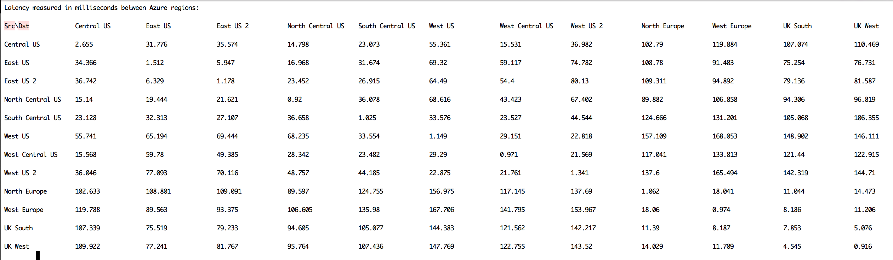

.. meta::
   :description: Azure ARM inter region latency measured in ms
   :keywords: Peering, Azure Peering, Encrypted Peering, Azure latency, inter region latency

===========================================================================================
Azure Inter Region Latency
===========================================================================================

Azure supports 24 regions for its cloud services. Understanding latency between 
the regions is important as performance starts to have noticeable degradation when the latency is
more than 150 - 200ms between a client and server or between two servers in two different regions. 

Below is our measurement of some of the Azure inter region latencies measured in milliseconds. The measurement is 
done by taking an average to multiple pings. The accuracy is +/- 1ms. 

|arm_inter_region_latency|

   

.. disqus::    
