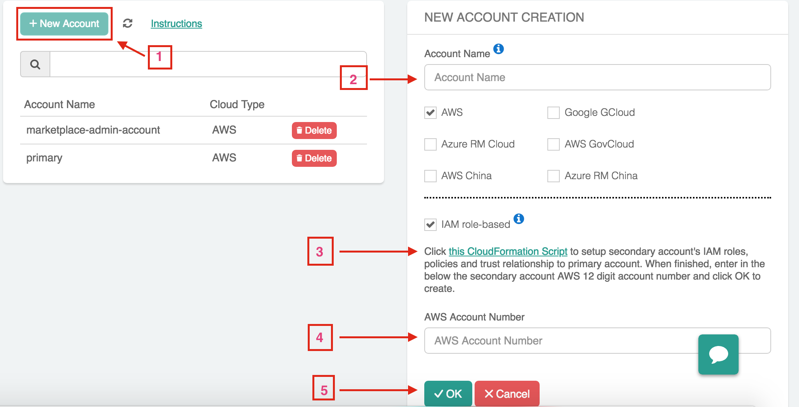
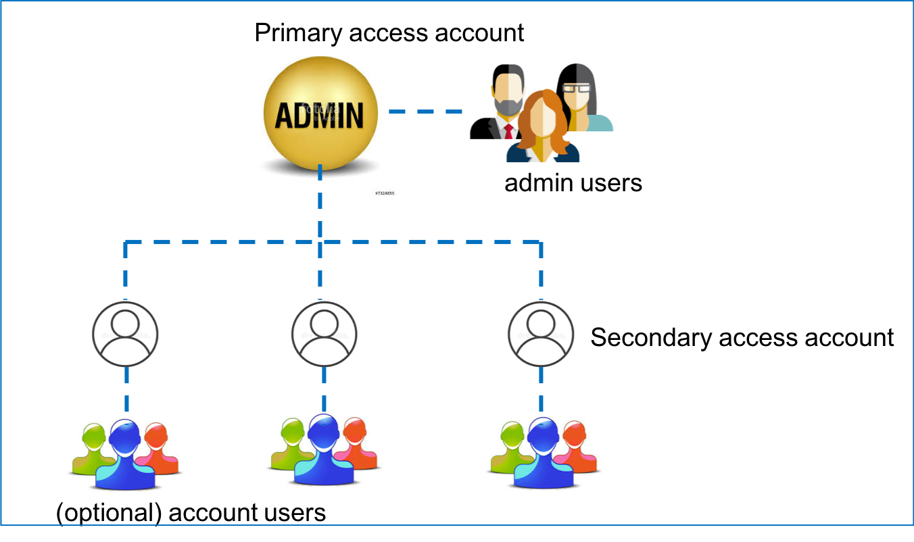
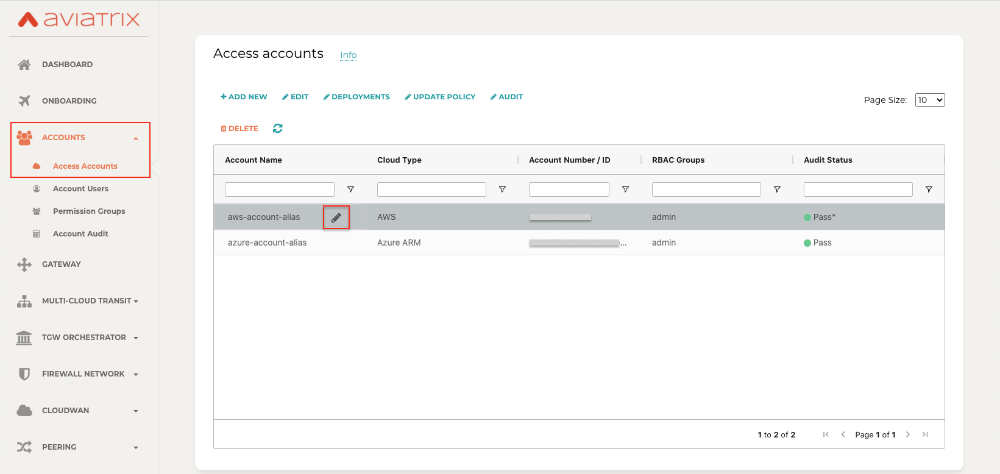

.. meta::
  :description: Explain what Aviatrix account is
  :keywords: account, aviatrix, AWS IAM role, Azure API credentials, Google credentials 

=================================
Access Account
=================================

The Aviatrix Controller is a multi cloud and multi accounts platform. The Controller uses your cloud provider API credentials to 
make API calls, for example, to launch an Aviatrix gateway instance, on behalf of your cloud accounts. 

One cloud credential is represented as an Aviatrix access account on the Controller. The Controller supports 
multiple Aviatrix accounts. One Aviatrix account may represent multiple cloud credentials, one from
each cloud. For example, an Aviatrix account name DevOps can have an IAM role for AWS, Azure ARM credentials and GCP credentials.

Starting from release 3.2, an access account for AWS only consists of the 12 digit account ID. 

For Azure, the account information consists of `Azure ARM credentials. <http://docs.aviatrix.com/HowTos/Aviatrix_Account_Azure.html>`_

For GCP (Google Cloud), the account information consists of `GCP credentials. <http://docs.aviatrix.com/HowTos/CreateGCloudAccount.html>`_

For AWS China, please refer `Account with Access Key <http://docs.aviatrix.com/HowTos/accesskey.html>`_.

The Aviatrix account structure is shown in the diagram below, where admin is the
default user for the primary access account. 

|account_structure|

To add more admin users, refer to `this doc. <http://docs.aviatrix.com/HowTos/AdminUsers_DuoAuth.html>`_

Setup primary access account for AWS cloud
----------------------------------------------------

For AWS, a `primary access account <http://docs.aviatrix.com/HowTos/onboarding_faq.html#what-is-the-aviatrix-primary-access-account>`_ is created during the onboarding process. Using this account credential, 
the Controller can launch gateways and build connectivity on VPCs that belong to this AWS account. 

Setup additional access account for AWS cloud
------------------------------------------------------

After you go through the onboarding process and create the primary access account, 
you can create additional or secondary Aviatrix access accounts on the Controller. This allows you 
to launch gateways and build connectivity across different AWS accounts.  

The configuration steps are shown below:

|access_account_35|

The above diagram is described in the following steps.

 1. Go to Aviatrix -> Accounts -> Access Accounts 
 #. +New Account, to create this new secondary account.
 #. Enter a unique account name. For example, BU-Group-3
 #. Check `AWS`.
 #. Check `IAM role-based` (enabled by default).
 #. Enter the secondary account's `AWS 12 digit account number <https://docs.aws.amazon.com/IAM/latest/UserGuide/console_account-alias.html>`_.
 #. Click **Launch CloudFormation Script** that takes you to the AWS Console and run the CloudFormation script to setup IAM roles and policies and establish a trust relationship with the primary account. When finished, return to this page and proceed to the next step. 
 #. Click `OK`.
 #. The new secondary account should be created.
 #. Now you can create connectivity between two VPCs in different AWS accounts.

Setup additional access account using Terraform
-------------------------------------------------

If you use Terraform to create more access accounts, you need to run the 
CloudFormation script on each secondary account first, then use Terraform account resource to create the account. 

::  

  Follow the above section, but only execute step 7 to run the CloudFormation script that creates IAM roles, policies and build trust relationship to the primary account (the Controller account). 

The CloudFormation is necessary to create IAM roles, policies and establish a trust relationship with the primary account (The account where the Controller is launched.)

Setup Account Name Alias
------------------------

Account Name Alias feature allows you to change the account name after it is created by providing an alias name and allowing it to be modified at any given time. The use case is customers often need to change some account names after the network has been built out to certain scale. By allowing account name alias to be modified without having to delete the account and thus reduces network downtime.

To change account name alias, go to Accounts -> Access Accounts, then hover the mouse at a specific account, click the Pen icon and start typing.

|account_name_alias|

To revert back to the original account name, go to Accounts -> Access Accounts, then hover the mouse at the specific account with alias name, click the Pen icon and apply the name with empty text.

.. |access_account_35| image:: adminusers_media/access_account_35.png
   :scale: 30%
   

.. disqus::
