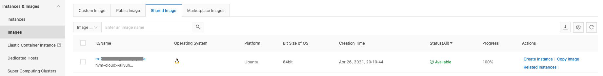

.. meta::
   :description: Aviatrix Cloud Account for Alibaba
   :keywords: Aviatrix account, Alibaba, Aviatrix Alibaba account credential, API credential

===========================================================
Alibaba Cloud Account Credential Setup
===========================================================

Creating an Alibaba Primary Access Account
=====================================================

1.	Access your Alibaba account info in the Alibaba UI. Click on the User Icon so you can access the Alibaba Cloud Account ID, Cloud Access Key ID, and Cloud Secret Key. You need the Alibaba account information to create the Alibaba Primary Access Account in the Aviatrix Controller.

  |alibaba_user_icon|

2.	In the Alibaba UI, create an AccessKey pair for authenticating the Aviatrix Controller. Click on the User Icon and navigate to AccessKey Management > Create Access Key. 

  |alibaba_accesskey|

3.	In the Aviatrix Controller, navigate to Accounts > Access Accounts and select Alibaba Cloud. Add an Account Name and enter the Alibaba Cloud Account ID, Cloud Access Key ID, and Cloud Secret Key. Optional - add any RBAC Groups that should have access to the Primary Access Account.

Deploying the Aviatrix Gateway in your Alibaba Cloud
=====================================================

You must satisfy the prerequisites in “Creating an Alibaba Primary Access Account” before Deploying the Aviatrix Gateway in your Alibaba Cloud.

1.	Access your Alibaba account info in the Alibaba UI. Click on the User Icon and record your Alibaba Account ID.

2.	Communicate your Alibaba Account ID to your Aviatrix Support representative.

3.	Your Aviatrix Support representative shares the Aviatrix gateway image with your Alibaba account.

4.	Verify your Alibaba account can access the Aviatrix gateway image. Go to Elastic Compute Service > Instances & Images > Images > Shared Image to view the image.

  |alibaba_share_image|

5.	Create an Alibaba Primary Access Account in the Aviatrix Controller.

6.	Deploy the Aviatrix Gateway in the Alibaba cloud.

Alibaba Cloud Default Limitations
=================================

- The EIP bandwidth limit is 200 Mbit/s. The Aviatrix Spoke to Transit and Transit to Spoke connections maximum bandwidth is 400 Mbit/s. You can purchase different plans to increase throughput and bandwidth.

- A maximum of 48 routes in each route table is supported by default. If you require more routes in each route table, contact Alibaba Support.

- The Alibaba API takes 1-2 seconds to add or delete one route in one VPC route table. No route update requests are accepted while a route is being added or deleted.

- Outgoing traffic to public non-RFC1918 IP address from an instance with a public IP does not look at the VPC route table. Even non-RFC1918 routes are configured on VPC route table. If you want to improve this non-RFC1918 traffic routing behavior on public instance, contact Alibaba Support.

   

   
.. disqus::
