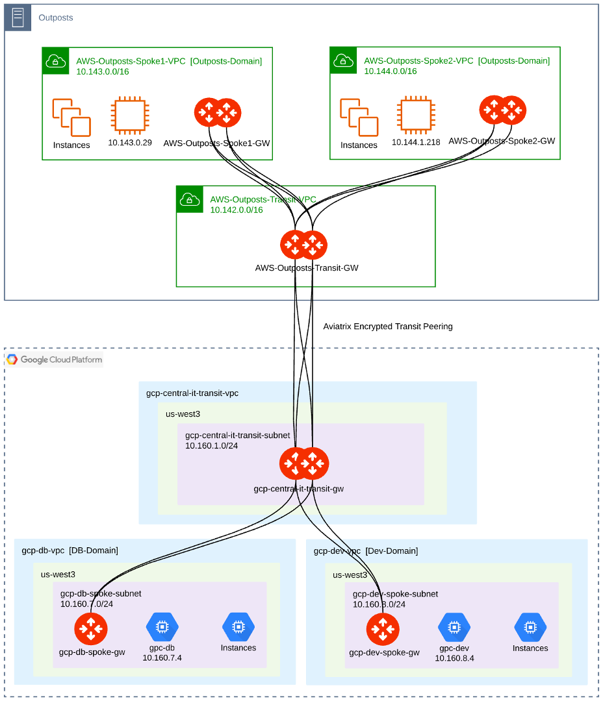

=========================================================
Aviatrix in AWS Outposts
=========================================================

AWS Outposts is a fully managed service that offers the same AWS infrastructure, AWS services, APIs, and tools to virtually any datacenter, co-location space, or on-premises facility for a truly consistent hybrid experience. AWS Outposts is ideal for workloads that require low latency access to on-premises systems, local data processing, data residency, and migration of applications with local system interdependencies.

AWS compute, storage, database, and other services run locally on Outposts, and you can access the full range of AWS services available in the Region to build, manage, and scale your on-premises applications using familiar AWS services and tools.

The Aviatrix platform runs on Outposts. This brings the repeatable multi-cloud network architecture to Outposts with the common control plane that supports native cloud APIs and advanced networking and security capabilities needed to form a common data plane with visibility and control required for an enterprise-class multi-cloud network.

1. Architecture
================

The Aviatrix controller remains in the public region of any cloud. It deploys, manages and monitors Aviatrix gateways that physically reside in Outposts. An ActiveMesh Aviatrix transit network is built using those gateways in Outposts. This allows Aviatrix to provide networking and security in the following use cases:

    - Intra-Outposts.
    - Inter-Outposts.
    - Outposts to non-Outposts on-prem data center.
    - Outposts to public AWS regions.
    - Outposts to Azure.
    - Outposts to GCP.

|architecture|

2. Intra-Outposts
===================

Using Aviatrix inside Outposts brings the following benefits:

    - Complete automation of Outposts networking.
    - Simplified network management at the application layer.
    - Higher scalability.
    - Easy-to-use segmentation domains.
    - Consistent operations, control plane, and data plane with the public cloud.

An Aviatrix controller is already deployed in a public AWS region.  Using the Aviatrix controller, an Aviatrix ActiveMesh network can be deployed in Outposts:

    - Redundant pairs of Aviatrix spoke gateways are launched in the spoke VPCs.
    - A redundant pair of Aviatrix transit gateways is launched in the transit VPC.
    - Redundant ActiveMesh peerings are established between the spoke gateways and the transit gateways.

|intra-outposts|

An Aviatrix controller is already deployed in a public AWS region.  Using the Aviatrix controller, an Aviatrix ActiveMesh network can be deployed in Outposts:
    - Redundant pairs of Aviatrix spoke gateways are launched in the spoke VPCs.
    - A redundant pair of Aviatrix transit gateways are launched in the transit VPC.
    - Redundant ActiveMesh peerings are established between the spoke gateways and the transit gateways.

The Aviatrix control plane is learning and propagating the routes to the spoke gateways accordingly per Aviatrix segmentation domains.  This enables encrypted, high-speed connectivity between workloads in Outposts-Spoke1-VPC and workloads in Outposts-Spoke2-VPC.

Currently the ActiveMesh tunnels between the Aviatrix spoke gateways and transit gateways are established over public IPs.  Support for private IP ActiveMesh tunnels in Outposts is under development.

3. Inter-Outposts
===================

The same Aviatrix ActiveMesh transit network can be deployed in multiple Outposts racks. Then, an encrypted transit peering can be established between Aviatrix transit gateways across different Outpost racks. The Aviatrix control plane propagates the VPC CIDRs across the Outposts racks, enabling inter-Outposts connectivity. Data plane traffic goes over the Outposts Local Gateways (LGWs).

|inter-outposts|

4. Outposts to non-Outposts on-prem data center
==================================================

Aviatrix provides a NAT gateway functionality for traffic going from Outposts to on-prem, which brings the following benefits:

    - No need to allocate customer-owned IPs to instances.
    - Scalability advantage.
    - Operational advantage.

The Aviatrix control plane automates the propagation of on-prem subnets to Outposts spoke VPCs.  This can optionally be controlled by Aviatrix segmentation domains.

Redundant Site2Cloud connections are established between the Aviatrix transit gateways and the on-prem router.  BGP runs on top to exchange the routes in both directions.

|outposts_to_non-outposts_dc|

5. Outposts to Public AWS regions
=======================================

Aviatrix enables Outposts connectivity to public AWS regions.  It offers the following benefits:

    - Repeatable architecture.
    - Outposts connectivity to public AWS region with extreme simplicity: 1-click peering.
    - Encrypted peering over Direct Connect or over the public Internet.
    - Same user experience and feature-set.
    - Consistent, end-to-end automated control plane.

Using the Aviatrix controller, the same Aviatrix network architecture can be deployed in any public AWS region. An Aviatrix encrypted transit peering can be established between Aviatrix transit gateways across Outposts and the public region. The Aviatrix control plane propagates the VPC CIDRs across the Outposts racks and the region, enabling end-to-end connectivity. Data plane traffic can go over Direct Connect or over the public Internet.

|outposts_to_public_aws|

6. Outposts to Azure
========================

Aviatrix enables Outposts connectivity to Azure with the following benefits:

    - Repeatable architecture
    - Outpost connectivity to Azure with extreme simplicity: 1-click peering.
    - Encrypted peering over private or public connections.
    - Same user experience and feature-set.
    - Consistent, end-to-end automated control plane.

Using the Aviatrix controller, the same Aviatrix network architecture can be deployed in any public Azure region. An Aviatrix encrypted transit peering can be established between Aviatrix transit gateways across Outposts and the public Azure region. The Aviatrix control plane propagates the VPC and VNet CIDRs across the Outposts racks and Azure, enabling Outposts multi-cloud connectivity. Data plane traffic can go the public Internet, or over private peering on AWS Direct Connect and Azure Express Route connected in a colocation facility.

|outposts_to_azure|

7. Outposts to GCP
====================

Aviatrix enables Outposts connectivity to GCP with the following benefits:

    - Repeatable architecture
    - Outpost connectivity to GCP with extreme simplicity: 1-click peering.
    - Encrypted peering over private or public connections.
    - Same user experience and feature-set.
    - Consistent, end-to-end automated control plane.

Using the Aviatrix controller, the same Aviatrix network architecture can be deployed in any public GCP region. An Aviatrix encrypted transit peering can be established between Aviatrix transit gateways across Outposts and the public GCP region. The Aviatrix control plane propagates the VPC and VNet CIDRs across the Outposts racks and GCP, enabling Outposts multi-cloud connectivity. Data plane traffic can go the public Internet, or over private peering on AWS Direct Connect and GCP Cloud Interconnect connected in a colocation facility

|outposts_to_gcp|

8. Visibility and Troubleshooting
===================================

Aviatrix provides deep visibility and troubleshooting into the Outposts network.  Aviatrix CoPilot is supported for Aviatrix networking in Outposts and offers the following functionalities for Outposts:

    - Network Health Monitor – Real-time cloud network resource inventory and status.
    - Dynamic Topology Map – Accurate, multi-cloud network topology, layout control and search.
    - FlowIQ – Detailed application traffic flow analysis, global heat map and trends.
    - CloudRoutes – Detailed searchable routing tables.
    - Notifications – Alert on resources status/utilization.

.. disqus::
