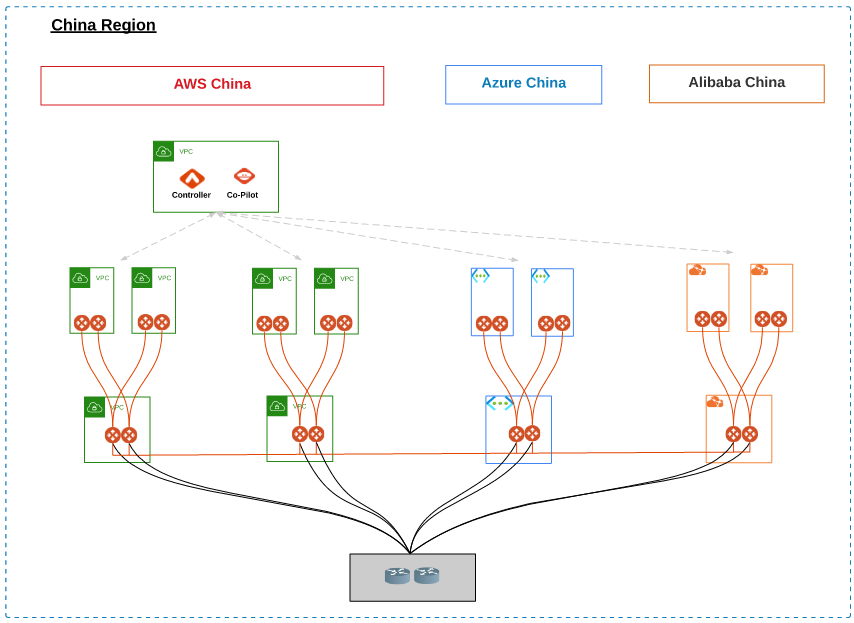
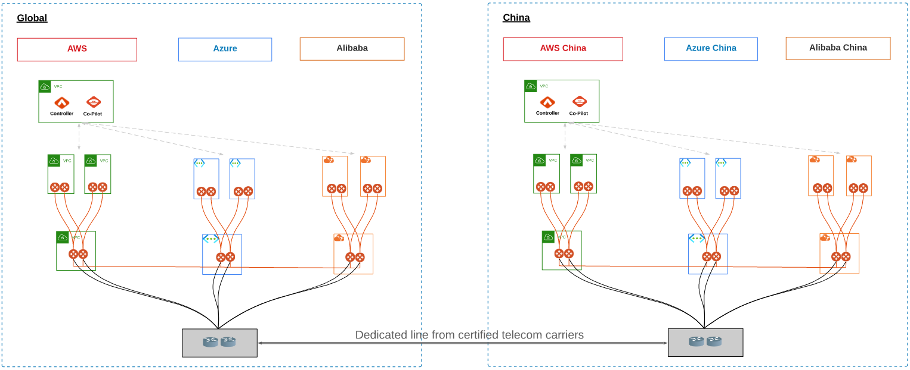

.. meta::
  :description: Aviatrix China Product Overview
  :keywords: cloud networking, aviatrix, IPsec VPN, Global Transit Network, site2cloud

=============================================
Aviatrix China Overview
=============================================

Features Supported in AWS China, Azure China, and Alibaba China Regions
===============================================================

+------------------------------------------------------------------------+---------------+-----------------+---------------------------+
| **Feature**                                                            | **AWS China** | **Azure China** | **Alibaba China Regions** |
+------------------------------------------------------------------------+---------------+-----------------+---------------------------+
| Controller Marketplace Launch                                          | Yes           | Yes             | No                        |
+------------------------------------------------------------------------+---------------+-----------------+---------------------------+
| CoPilot Marketplace Launch                                             | Yes           | No              | No                        |
+------------------------------------------------------------------------+---------------+-----------------+---------------------------+
| Transit Gateway Peering                                                | Yes           | Yes             | Yes                       |
+------------------------------------------------------------------------+---------------+-----------------+---------------------------+
| Multi Accounts                                                         | Yes           | Yes             | Yes                       |
+------------------------------------------------------------------------+---------------+-----------------+---------------------------+
| Transit Network Spoke and Transit Gateways                             | Yes           | Yes             | Yes                       |
+------------------------------------------------------------------------+---------------+-----------------+---------------------------+
| Transit to External IPsec Devices                                      | Yes           | Yes             | Yes                       |
+------------------------------------------------------------------------+---------------+-----------------+---------------------------+
| Site2Cloud VPN for All Gateways                                        | Yes           | Yes             | Yes                       |
+------------------------------------------------------------------------+---------------+-----------------+---------------------------+
| Create a VPC                                                           | Yes           | Yes             | Yes                       |
+------------------------------------------------------------------------+---------------+-----------------+---------------------------+
| Terraform                                                              | Yes           | Yes             | Yes                       |
+------------------------------------------------------------------------+---------------+-----------------+---------------------------+
| Backup and Restore                                                     | Yes           | Yes             | Yes                       |
+------------------------------------------------------------------------+---------------+-----------------+---------------------------+
| Logging Service Integration (Rsyslog, Netflow, and CloudWatch)         | Yes           | Yes             | Yes                       |
+------------------------------------------------------------------------+---------------+-----------------+---------------------------+
| Native Peering                                                         | Yes           | Yes             | No                        |
+------------------------------------------------------------------------+---------------+-----------------+---------------------------+
| FlightPath Expert Diagnostics                                          | Yes           | Yes             | Yes                       |
+------------------------------------------------------------------------+---------------+-----------------+---------------------------+
| VPC Tracker                                                            | Yes           | Yes             | Yes                       |
+------------------------------------------------------------------------+---------------+-----------------+---------------------------+
| Controller Security Group Management                                   | Yes           | No              | No                        |
+------------------------------------------------------------------------+---------------+-----------------+---------------------------+
| Launch Controller with CloudFormation                                  | Yes           | No              | No                        |
+------------------------------------------------------------------------+---------------+-----------------+---------------------------+
| Firewall Network                                                       | No            | No              | No                        |
+------------------------------------------------------------------------+---------------+-----------------+---------------------------+
| Firenet                                                                | Yes           | No              | No                        |
+------------------------------------------------------------------------+---------------+-----------------+---------------------------+
| Insane Mode Encryption                                                 | Yes           | Yes             | No                        |
+------------------------------------------------------------------------+---------------+-----------------+---------------------------+
| Managed CloudN                                                         | No            | No              | No                        |
+------------------------------------------------------------------------+---------------+-----------------+---------------------------+
| Transit to AWS VGW                                                     | No            | No              | No                        |
+------------------------------------------------------------------------+---------------+-----------------+---------------------------+
| BGP over LAN                                                           | No            | No              | No                        |
+------------------------------------------------------------------------+---------------+-----------------+---------------------------+
| BGP over GRE                                                           | No            | No              | No                        |
+------------------------------------------------------------------------+---------------+-----------------+---------------------------+
| AWS TGW                                                                | No            | No              | No                        |
+------------------------------------------------------------------------+---------------+-----------------+---------------------------+
| FQDN Egress Control                                                    | No            | No              | No                        |
+------------------------------------------------------------------------+---------------+-----------------+---------------------------+
| Stateful Firewall                                                      | No            | No              | No                        |
+------------------------------------------------------------------------+---------------+-----------------+---------------------------+
| Advanced NAT                                                           | No            | No              | No                        |
+------------------------------------------------------------------------+---------------+-----------------+---------------------------+
| Remote Access User VPN (OpenVPN)                                       | No            | No              | No                        |
+------------------------------------------------------------------------+---------------+-----------------+---------------------------+
| PrivateS3                                                              | No            | No              | No                        |
+------------------------------------------------------------------------+---------------+-----------------+---------------------------+
| IPv6                                                                   | No            | No              | No                        |
+------------------------------------------------------------------------+---------------+-----------------+---------------------------+
| Controller Migrate                                                     | No            | No              | No                        |
+------------------------------------------------------------------------+---------------+-----------------+---------------------------+
| Logging Service Integration (Splunk, Firebeat, Sumologic, and Datadog) | No            | No              | No                        |
+------------------------------------------------------------------------+---------------+-----------------+---------------------------+
| Network Segmentation                                                   | Yes           | Yes             | Yes                       |
+------------------------------------------------------------------------+---------------+-----------------+---------------------------+

Aviatrix China Design Assumptions
============================================

- The Aviatrix Controller in Global cannot deploy a China gateway.
- The Aviatrix Controller in China cannot deploy a Global gateway.

China Multi-Cloud Network Coverage
============================================

You must overcome performance limitations and satisfy government requirements to create a global multi-cloud network that includes the China region. 
Slow connection speeds and high-latency associated with the China region can be overcome by using a dedicated line to create an Aviatrix transit connection 
and deploying services close to the China region. To satisfy legal regulations in China, you must have an Internet Content Provider (ICP) license.

For more information, see the "Acquiring a China ICP License" section below.

Acquiring a China ICP License
============================

Regulations in China require you to acquire an Internet Content Provider (ICP) license from the government and register the license with your CSP 
to provide Internet services in China. In China, an ICP license is required to establish SSL connections between different regions, ISPs, CSPs, or to 
cross national borders. Aviatrix supports transit gateways using AWS China, Azure China, and Alibaba multi-cloud networks in the China region.
Obtaining and implementing an ICP is a process, and you should follow the directions of your compliance experts. 

Here are some general guidelines Aviatrix recommends to implement a multi-cloud network in the China region:
 
 - Create or use a Legal Entity in China to apply for the ICP license.
 - Apply for a Legal Domain name in the China Registration.
 - Acquire the ICP certificate from the China Ministry of Industry and Information Technology (MIIT).
 - Register the ICP certificate with your to CSP in the China region.
 - Use dedicated lines from certified telecom carries for connections between China and the rest of the world.
 - Deploy the Aviatrix Controller, CoPilot (for AWS China only), and Multi-Cloud Network in China.

.. Warning:: If your company doesn't follow China's regulations, both the Aviatrix Controller and Gateway in the China region cannot communicate to each other properly.
..

Launching a Controller in AWS China
================================

The Aviatrix Controller and CoPilot are available on the AWS China Marketplace. Use the following steps to launch a Controller in AWS China.

1. Log into the AWS China Portal.
2. Navigate to the AWS marketplace for the Ningxia and Beijing Region.
3. Search for the keyword "Aviatrix."

  |aviatrix_aws_china_marketplace|
  
.. Note:: The Aviatrix Controller is available on both the AWS China and Azure China Marketplaces. Aviatrix CoPilot is published on AWS China Marketplace only.
..

Use the following URLs to find the Controller and CoPilot on the AWS China Marketplace: 
- `Aviatrix Secure Networking Platform - BYOL <https://awsmarketplace.amazonaws.cn/marketplace/pp/prodview-tr55yz2zpuzlo>`_
- `Aviatrix CoPilot - BYOL <https://awsmarketplace.amazonaws.cn/marketplace/pp/prodview-m73cvirso7uu6>`_

Use the following URL to launch the Aviatrix Controller from the AWS CloudFormation in AWS China: 
- `aws-china-cloudformation-aviatrix-controller-and-IAM-setup-BYOL.template <https://cn-northwest-1.console.amazonaws.cn/cloudformation/home?region=cn-northwest-1#/stacks/new?stackName=AviatrixController&templateURL=https://aviatrix-public-download.s3.cn-north-1.amazonaws.com.cn/aws-china/cloudformation-templates/aviatrix-controller-and-IAM-setup-CFT/aviatrix-controller-and-IAM-setup-cft-BYOL.template>`_

Launching a Controller in Azure China
=================================

The Aviatrix Controller and CoPilot are available on the Azure China Marketplace. Use the following steps to launch a Controller in Azure China.

1. Log in to the Azure China Portal.
2. Navigate to the Azure marketplace for the China North region.
3. Search for the keyword "Aviatrix."

  |aviatrix_azure_china_marketplace|
  
.. Note:: The Aviatrix Controller is available on both the AWS China and Azure China Marketplaces. However, Aviatrix CoPilot is published on AWS China Marketplace **only**.
..

Use the following URL to find the Controller on the Azure China Marketplace. Note that you can only launch CoPilot from AWS China.
`Aviatrix Secure Networking Platform - BYOL <https://market.azure.cn/>`_

Design Recommendation for the China Region
====================================================

  |aviatrix_design_recommendation_china|

Design Recommendation to Build Connectivity between the China and Global Regions
=========================================================================================

  |aviatrix_design_recommendation_china_global|

   
.. |aviatrix_aws_china_marketplace| image:: aviatrix_china_overview_media/aviatrix_aws_china_marketplace.png
   :scale: 50%

.. |aviatrix_azure_china_marketplace| image:: aviatrix_china_overview_media/aviatrix_azure_china_marketplace.png
   :scale: 50%
   
.. disqus::
