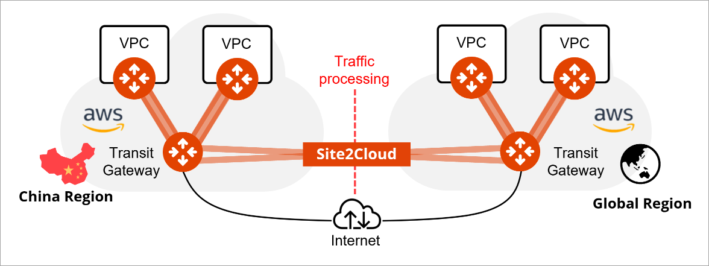
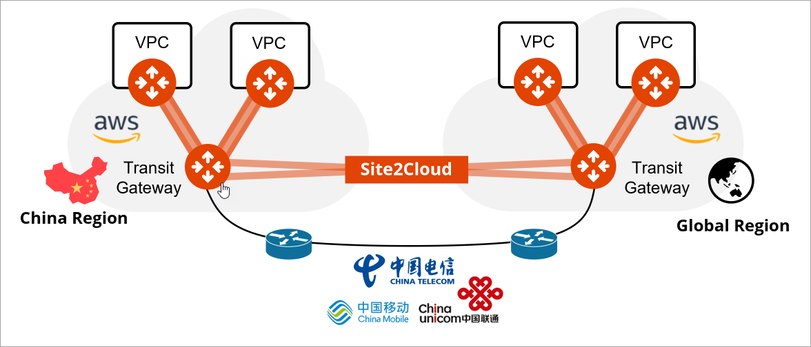
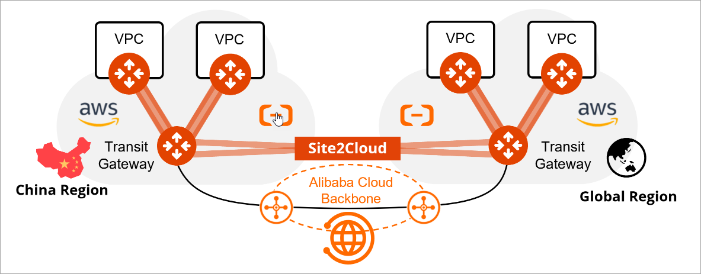

.. meta::
  :description: Aviatrix China Product Overview
  :keywords: cloud networking, aviatrix, IPsec VPN, Global Transit Network, site2cloud

===================================
Aviatrix in China Regions Overview
===================================

Features Supported in AWS China, Azure China, and Alibaba China Regions
=======================================================================

+------------------------------------------------------------------------+---------------+-----------------+---------------------------+
| **Feature**                                                            | **AWS China** | **Azure China** | **Alibaba China**         |
+------------------------------------------------------------------------+---------------+-----------------+---------------------------+
| Controller Marketplace Launch                                          | Yes           | Yes             | No                        |
+------------------------------------------------------------------------+---------------+-----------------+---------------------------+
| CoPilot Marketplace Launch                                             | Yes           | No              | No                        |
+------------------------------------------------------------------------+---------------+-----------------+---------------------------+
| Controller Security Group Management                                   | Yes           | No              | No                        |
+------------------------------------------------------------------------+---------------+-----------------+---------------------------+
| Multi Accounts                                                         | Yes           | Yes             | Yes                       |
+------------------------------------------------------------------------+---------------+-----------------+---------------------------+
| Launch Controller with CloudFormation                                  | Yes           | N/A             | N/A                       |
+------------------------------------------------------------------------+---------------+-----------------+---------------------------+
| VPC Tool                                                               | Yes           | Yes             | Yes                       |
+------------------------------------------------------------------------+---------------+-----------------+---------------------------+
| FlightPath                                                             | Yes           | Yes             | Yes                       |
+------------------------------------------------------------------------+---------------+-----------------+---------------------------+
| Transit Network Spoke and Transit Gateways                             | Yes           | Yes             | Yes                       |
+------------------------------------------------------------------------+---------------+-----------------+---------------------------+
| Aviatrix Transit Gateway Peering                                       | Yes           | Yes             | Yes                       |
+------------------------------------------------------------------------+---------------+-----------------+---------------------------+
| Transit to External IPsec Devices                                      | Yes           | Yes             | Yes                       |
+------------------------------------------------------------------------+---------------+-----------------+---------------------------+
| Site2Cloud VPN for All Gateways                                        | Yes           | Yes             | Yes                       |
+------------------------------------------------------------------------+---------------+-----------------+---------------------------+
| BGP over LAN                                                           | No            | No              | No                        |
+------------------------------------------------------------------------+---------------+-----------------+---------------------------+
| BGP over GRE                                                           | No            | No              | No                        |
+------------------------------------------------------------------------+---------------+-----------------+---------------------------+
| Native Peering                                                         | Yes           | Yes             | No                        |
+------------------------------------------------------------------------+---------------+-----------------+---------------------------+
| Network Segmentation                                                   | Yes           | Yes             | Yes                       |
+------------------------------------------------------------------------+---------------+-----------------+---------------------------+
| Firewall Network                                                       | Yes           | No              | No                        |
+------------------------------------------------------------------------+---------------+-----------------+---------------------------+
| Insane Mode Encryption                                                 | Yes           | Yes             | No                        |
+------------------------------------------------------------------------+---------------+-----------------+---------------------------+
| Managed CloudN                                                         | Private       | Private         | No                        |
|                                                                        | Preview       | Preview         |                           |
+------------------------------------------------------------------------+---------------+-----------------+---------------------------+
| Aviatrix Edge                                                          | No            | No              | No                        |
+------------------------------------------------------------------------+---------------+-----------------+---------------------------+
| FQDN Egress Control                                                    | No            | No              | No                        |
+------------------------------------------------------------------------+---------------+-----------------+---------------------------+
| Stateful Firewall                                                      | No            | No              | No                        |
+------------------------------------------------------------------------+---------------+-----------------+---------------------------+
| Advanced NAT                                                           | No            | No              | No                        |
+------------------------------------------------------------------------+---------------+-----------------+---------------------------+
| ThreatIQ and ThreatGuard                                               | No            | No              | No                        |
+------------------------------------------------------------------------+---------------+-----------------+---------------------------+
| Micro-Segmentation                                                     | No            | No              | No                        |
+------------------------------------------------------------------------+---------------+-----------------+---------------------------+
| Remote Access User VPN (OpenVPN)                                       | No            | No              | No                        |
+------------------------------------------------------------------------+---------------+-----------------+---------------------------+
| PrivateS3                                                              | No            | N/A             | N/A                       |
+------------------------------------------------------------------------+---------------+-----------------+---------------------------+
| Transit to AWS VGW                                                     | No            | N/A             | N/A                       |
+------------------------------------------------------------------------+---------------+-----------------+---------------------------+
| AWS Transit Gateway Orchestration                                      | No            | N/A             | N/A                       |
+------------------------------------------------------------------------+---------------+-----------------+---------------------------+
| Controller Migrate                                                     | No            | No              | No                        |
+------------------------------------------------------------------------+---------------+-----------------+---------------------------+
| Terraform                                                              | Yes           | Yes             | Yes                       |
+------------------------------------------------------------------------+---------------+-----------------+---------------------------+
| Backup and Restore                                                     | Yes           | Yes             | Yes                       |
+------------------------------------------------------------------------+---------------+-----------------+---------------------------+
| Logging Service Integration (Rsyslog, Netflow, and CloudWatch)         | Yes           | Yes             | Yes                       |
+------------------------------------------------------------------------+---------------+-----------------+---------------------------+

Requirements to Implement Aviatrix in China Regions
====================================================

The following are the requirements to implement Aviatrix in AWS China, Azure China, and Alibaba China regions.

- The Aviatrix Controller must be deployed in the China region, for example, AWS China Ningxia region. Currently, an Aviatrix Controller in the Global region (non-China) does not support Aviatrix Gateways deployment and management in the China region. Similarly, an Aviatrix Controller in the China region does not support Aviatrix Gateways deployment and management in the Global region. See `Unsupported Topologies <https://docs.aviatrix.com/HowTos/aviatrix_china_overview.html#unsupported-topologies>`_.

- You must have an Internet Content Provider (ICP) license. An ICP license is required for opening a CSP account in the China region. For more information, see `Acquiring a China ICP License <https://docs.aviatrix.com/HowTos/aviatrix_china_overview.html#acquiring-a-china-icp-license>`_.

Unsupported Topologies
======================

The following topologies are not supported.

An Aviatrix Controller launched in the Global region does not support Aviatrix Gateways deployment and management in the China region.

  |aviatrix_china_unsupported_global_manage_china|

An Aviatrix Controller launched in the China region does not support Aviatrix Gateways deployment and management in the Global region.

  |aviatrix_china_unsupported_china_manage_global| 

Acquiring a China ICP License
==============================

Regulations in China require you to acquire an Internet Content Provider (ICP) license from the government and register the license with your CSP 
to provide Internet services in China. In China, an ICP license is required to establish SSL connections between different regions, ISPs, CSPs, or to 
cross national borders. Aviatrix supports transit gateways using AWS China, Azure China, and Alibaba multi-cloud networks in the China region.
Obtaining and implementing an ICP is a process, and you should follow the directions of your compliance experts. 

Here are some general guidelines Aviatrix recommends to implement a multi-cloud network in the China region:
 
 - Create or use a Legal Entity in China to apply for the ICP license.
 - Apply for a Legal Domain Name in the China Registration.
 - Acquire the ICP Certificate from the China Ministry of Industry and Information Technology (MIIT).
 - Register the ICP Certificate with your CSP in the China region.
 - Use dedicated lines from certified telecom carries for connections between China and the rest of the world.

   .. Tip::      
      Slow connection speeds and high-latency associated with the China region can be overcome by using a dedicated line to create Aviatrix transit connections and deploying services close to the China region.

 - Deploy the Aviatrix Controller, CoPilot (for AWS China only).
 - Enter the certificate domain that was submitted during the ICP application in Aviatrix Controller (see `What is Certificate Domain? <https://docs.aviatrix.com/HowTos/onboarding_faq.html#what-is-certificate-domain?>`_.
 - Deploy Aviatrix Secure Multi-Cloud Network in China.

Consequences of Non-Compliance with the Chinese Government Regulations
======================================================================

The following consequences can result for non-compliance of the Chinese Government Regulations.

- The company is not permitted to open an account with a CSP in China region.

- Aviatrix Controller is unable to deploy and manage Aviatrix Gateways. 

- The connection between Aviatrix Gateways is intermittent or becomes disconnected from time to time.

Interconnecting Aviatrix in the China region and the Global region
===================================================================

Site2Cloud can be established between Aviatrix Transit Gateways in the China region and the Global region. 

The following options are available for the underlying network of Site2Cloud:

1. Public Internet

   .. Note::
      Public Internet connections maybe unstable due to additional network traffic processing by the Chinese government.

  |aviatrix_china_site2cloud_internet|

2. Private connectivity through certified telecom carriers such as China Telecom, China Unicom, and China Mobile

  |aviatrix_china_site2cloud_telecoms|

3. Alibaba Cloud Network using VPC Peering or Alibaba Cloud Enterprise Network (Alibaba CEN) https://www.alibabacloud.com/product/cen

  |aviatrix_china_site2cloud_alicloud|

To create a global multi-cloud network with low-latency connectivity between the China region and the global region, we recommend that you use private connectivity provided by certified telecom carriers or through the Alibaba Cloud network.

For description of the design patterns for these underlying networks, see `Design Patterns for China Region <https://docs.aviatrix.com/HowTos/aviatrix_china_overview.html#design-patterns-for-china-region>`_.

Launching Aviatrix Controller in AWS China
==========================================

To launch Aviatrix Controller in AWS China, do the following:

1. Log in to the AWS China Portal.
2. Navigate to the AWS Marketplace for the Ningxia and Beijing Region.
3. Search for the keyword "Aviatrix."

  |aviatrix_aws_china_marketplace|
  
.. Note:: The Aviatrix Controller is available on both the AWS China and Azure China Marketplaces. Aviatrix CoPilot is available on AWS China Marketplace only.
..

Use the following URLs to find the Controller and CoPilot on the AWS China Marketplace:

- `Aviatrix Secure Networking Platform - BYOL <https://awsmarketplace.amazonaws.cn/marketplace/pp/prodview-tr55yz2zpuzlo>`_
- `Aviatrix CoPilot - BYOL <https://awsmarketplace.amazonaws.cn/marketplace/pp/prodview-m73cvirso7uu6>`_

Use the following URL to launch the Aviatrix Controller from the AWS CloudFormation in AWS China:
 
- `AWS China Cloudformation Aviatrix Controller and IAM Setup-BYOL <https://cn-northwest-1.console.amazonaws.cn/cloudformation/home?region=cn-northwest-1#/stacks/new?stackName=AviatrixController&templateURL=https://aviatrix-public-download.s3.cn-north-1.amazonaws.com.cn/aws-china/cloudformation-templates/aviatrix-controller-and-IAM-setup-CFT/aviatrix-controller-and-IAM-setup-cft-BYOL.template>`_

Launching Aviatrix Controller in Azure China
============================================

To launch Aviatrix Controller in Azure China, do the following:

1. Log in to the Azure China Portal.
2. Navigate to the Azure Marketplace for the China North region.
3. Search for the keyword "Aviatrix."

  |aviatrix_azure_china_marketplace|
  
.. Note:: The Aviatrix Controller is available on both the AWS China and Azure China Marketplaces. Aviatrix CoPilot is available on AWS China Marketplace only. You can launch CoPilot only from AWS China.
..

Use the following URL to find the Controller on the Azure China Marketplace:

- `Aviatrix Secure Networking Platform - BYOL <https://market.azure.cn/>`_

Design Patterns for China region
================================

China region only

  |aviatrix_china_design_china_only|

Cross-border connectivity through certified telecom carriers

  |aviatrix_china_design_cross_border_telecom|

Cross-border connectivity through Alibaba Cloud Enterprise Network (Alibaba CEN)

  |aviatrix_china_design_cross_border_alicloud|

   
.. |aviatrix_aws_china_marketplace| image:: aviatrix_china_overview_media/aviatrix_aws_china_marketplace.png
   :scale: 50%

   
.. disqus::
