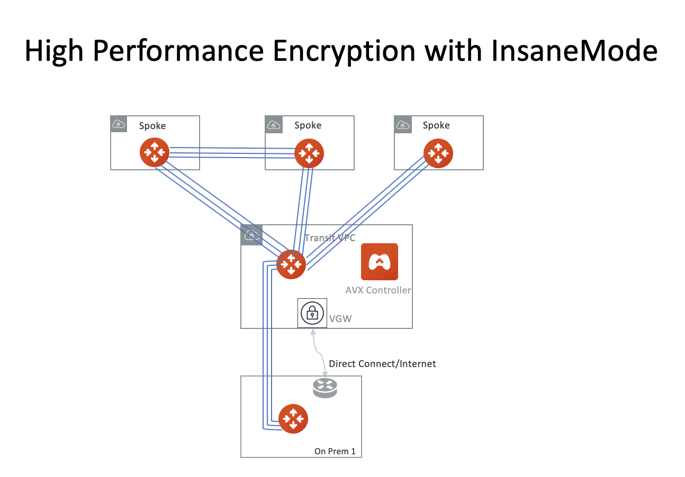

.. meta::
  :description: Global Transit Network
  :keywords: Transit Network, Transit hub, AWS Global Transit Network, Encrypted Peering, Transitive Peering, Insane mode, Transit Gateway, TGW

===============================================
High Performance Encryption with InsaneMode
===============================================

If your enterprise security policy requires encryption for data in motion, Aviatrix InsaneMode encryption provides the best and most 
efficient single instance encryption performance.

InsaneMode Benefits
--------------------------------------------------

 - **30Gbps IPSEC** Using single instance from C5 series to the latest C5n series, single instance IPSEC performance reaches up to 30Gbps.   
 - **Private Link** InsaneMode connectivity is supported over AWS Peering and AWS Direct Connect.
 - **Stateful Firewall** Aviatrix gateways support stateful firewall for additional security policies, event and packet logging.
 - **Unlimited Routes** Aviatrix gateways have no limit to how many on-prem routes or VPC routes. 
 - **Advanced NAT** Advanced NAT function for any packet transforming before and after routing function.

InsaneMode Deployment Diagram
---------------------------------

|insanemode|

.. |insane_tunnel_diagram| image:: aviatrix_insanemode__media/insane_tunnel_diagram.png
   :scale: 30%

.. disqus::
