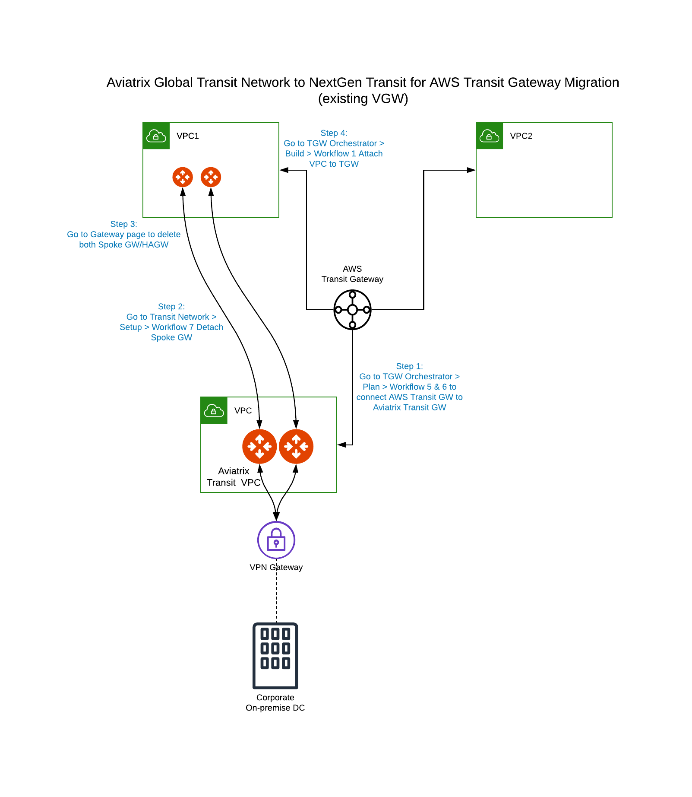

.. meta::
   :description: instructions on migrating from Aviatrix Transit Network to AWS TGW 
   :keywords: Transit Gateway, AWS Transit Gateway, TGW, Migration

========================================================================
Migrating an Aviatrix Transit Network to AWS Transit Gateway (TGW)
========================================================================

This document assumes that you have deployed an `Aviatrix Global Transit Network solution <https://docs.aviatrix.com/HowTos/transitvpc_workflow.html>`_ with Aviatrix Transit Gateway and VGW. 

The following steps provide instructions to migrate a live Aviatrix Global Transit deployment to AWS Transit Gateway using Aviatrix TGW Orchestrator.  

The objectives here are:

 - No change to any on-prem network.   
 - No change to the connectivity between AWS VGW and on-prem. (either over DX or over Internet or both)
 - Re-use AWS VGW deployed in Aviatrix Global Transit solution if possible.
 - No change to existing VPC infrastructure.
 - Minimum operation downtime.

Prior to migration, you may plan on creating the `network domains <https://docs.aviatrix.com/HowTos/tgw_plan.html#create-a-new-network-domain>`_ and their `connection policies <https://docs.aviatrix.com/HowTos/tgw_plan.html#build-your-domain-connection-policies>`_. If you do not want to create the network domains right away, you can add or modify the network domains at any time.

1. **Create AWS Transit Gateway** Follow `Step 1 <https://docs.aviatrix.com/HowTos/tgw_plan.html#create-aws-tgw>`_ in TGW Orchestrator > Plan page.

2. **Create Network Domains** If you have plans for custom network domains, follow `Step 2 <https://docs.aviatrix.com/HowTos/tgw_plan.html#optional-create-a-new-network-domain>`_ to create them. If you do not intend to build custom network domains, skip this step.

3. **Add/modify connection policies** Follow `Step 3 <https://docs.aviatrix.com/HowTos/tgw_plan.html#optional-build-your-domain-connection-policies>`_ to build connection policies.

4. **Prepare Aviatrix Transit GW for TGW Attachment** Follow `Step 5 <https://docs.aviatrix.com/HowTos/tgw_plan.html#prepare-aviatrix-transit-gw-for-tgw-attachment>`_.

5. **Attach Aviatrix Transit Gateway to TGW** `Follow Step 6. <https://docs.aviatrix.com/HowTos/tgw_plan.html#attach-aviatrix-transit-gw-to-tgw>`_ to complete the hybrid connection between your existing VGW and the TGW. At this point, VGW starts to advertise to Aviatrix Transit GW. Make sure you specify a different "AS" number for the BGP session of Aviatrix Transit GW connection to VGW. Also note that if Transit GW and VGW are in the same account and same VPC, VGW must be detached from the VPC.

6. **Detach Spoke GW** Follow `Step 7 <https://docs.aviatrix.com/HowTos/transitvpc_workflow.html#remove-a-spoke-gw-from-a-transit-gw-group>`_ to detach a Spoke GW from the existing Aviatrix Global Transit Network.

7. **Delete Spoke GW** Go to Gateway on the main navigation tab, select the Spoke gateway and click Delete. If you have HA gateway, you will need to delete it first before the primary Spoke gateway.

8. **Attach Spoke VPC to Transit Gateway** Follow `Step 1 <https://docs.aviatrix.com/HowTos/tgw_build.html#attach-vpc-to-tgw>`_ to attach a VPC to the corresponding network domain. 

9. Repeat the above step 6-8 for the remaining Spoke gateways. 

The effective operation downtime for each Spoke VPC is the time between step 6-8 above. 

A quick summary of the migration is shown in the following diagram.
|avx_tgw_migration01|

.. disqus::
